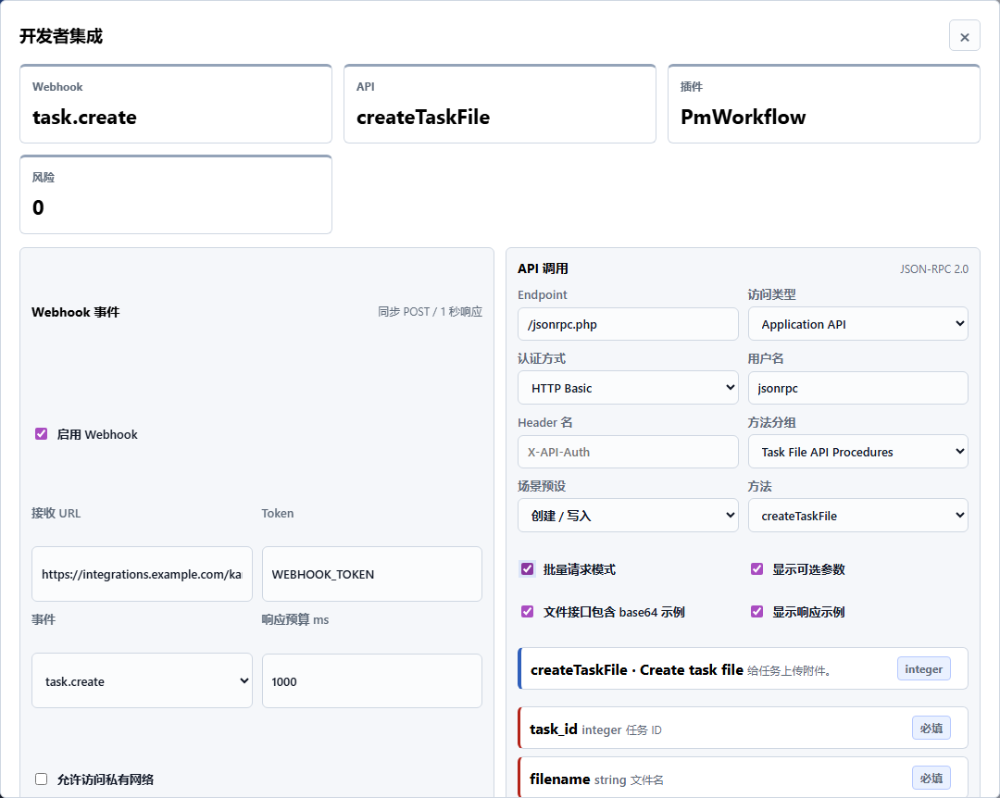

# API 方法细化补齐说明 V0.8.27

## 本轮目标

继续核对 Kanboard 官网 API Reference。本轮不再只停留在“API 分组索引”，而是把更细的 procedure 方法、参数、请求结构、响应示例和风险提示转化为静态原型中的 API Procedure Explorer。

本版本仍然是静态复现：不真实请求服务器、不保存真实凭据、不上传真实文件，只表达 Kanboard JSON-RPC API 的产品结构和使用注意事项。

## 官网核对范围

- Kanboard API Reference: https://docs.kanboard.org/v1/api/
- Task API Procedures: https://docs.kanboard.org/v1/api/task_procedures/
- Project File API Procedures: https://docs.kanboard.org/v1/api/project_file_procedures/
- Task File API Procedures: https://docs.kanboard.org/v1/api/task_file_procedures/
- Link API Procedures: https://docs.kanboard.org/v1/api/link_procedures/
- API Authentication: https://docs.kanboard.org/v1/api/authentication/

## 本轮新增

- 将 localStorage key 升级为 `kanboard-static-v0827`，项目 JSON 导出版本同步为 `kanboard-static-v0827`。
- 新增 `API_PROCEDURE_CATALOG`，覆盖：
  - Task API Procedures
  - Project File API Procedures
  - Task File API Procedures
  - Link API Procedures
  - 基础 Application API 连接检查方法
- 在“开发者”弹窗的 API 调用区新增 API Procedure Explorer：
  - 方法分组
  - 场景预设
  - 当前方法说明
  - 必填 / 可选参数 checklist
  - 官网覆盖矩阵
  - 官网核对范围说明
- JSON-RPC 请求预览升级：
  - 按当前 procedure 自动生成 params
  - 展示 `Content-Type: application/json`
  - 支持 HTTP Basic / 自定义 Header
  - 支持 batch request
  - 支持响应示例开关
  - 文件接口支持 base64 payload 示例开关
- 新增方法级风险提示：
  - User API 权限边界
  - 批量写操作不是事务
  - 文件接口 base64、大小、下载处理风险
  - Link API 中 `link_id`、`task_id`、`task_link_id` 的 ID 混淆风险
- API 模拟调用日志新增：
  - procedure group
  - result type
  - risk count

## 产品判断

- API Procedure Explorer 仍放在“开发者”弹窗中，而不是新增独立入口，因为它属于 V0.8.23 已建立的 Webhook / API / Plugin.php 开发者集成能力。
- 本轮优先选择 Task、File、Link 三类 procedure，是因为它们能直接映射当前原型已有的任务、附件、项目文件和内部任务链接能力。
- Project、Board、User、Group 等 procedure 暂不在本轮展开，避免 API Reference 细化变成无边界的全量文档搬运。
- 文件上传下载只展示 base64 请求与响应示例，不模拟真实文件传输。
- 批量请求需要明确风险：JSON-RPC batch 不等同事务，写操作失败可能造成后续请求语义错误。

## 已覆盖的核心方法

### Task

- `createTask`
- `getTask`
- `updateTask`
- `removeTask`
- `closeTask`
- `openTask`
- `getAllTasks`
- `moveTaskPosition`
- `duplicateTaskToProject`
- `duplicateTaskToAnotherProject`
- `searchTasks`

### Project File

- `createProjectFile`
- `getProjectFile`
- `getAllProjectFiles`
- `downloadProjectFile`
- `removeProjectFile`

### Task File

- `createTaskFile`
- `getTaskFile`
- `getAllTaskFiles`
- `downloadTaskFile`
- `removeTaskFile`

### Link

- `getAllLinks`
- `getOppositeLinkId`
- `createLink`
- `updateLink`
- `removeLink`
- `createTaskLink`
- `updateTaskLink`
- `removeTaskLink`
- `getAllTaskLinks`

## 截图



## 尚未覆盖

- Project / Board / User / Group API procedure 的完整参数细化。
- Admin/Settings 更深层的信息架构核对。
- 数据库配置、安全配置和配置文件细项的最终收尾。
- 真实后端 JSON-RPC 调用、认证和权限鉴权。
- V0.9 Figma 高保真原型。

## 验收方式

```powershell
node --check app.js
node --check tests/static-feature-audit-v08.js
node tests/static-feature-audit-v08.js
```

验收重点：

- 开发者弹窗可以打开。
- API Procedure Explorer 展示方法分组、方法详情、参数 checklist 和覆盖矩阵。
- Task、Project File、Task File、Link 分组可以切换。
- 请求预览包含 JSON-RPC 2.0、`Content-Type: application/json` 和对应 params。
- batch request、file base64 payload、User API 权限和 Link API 风险提示可见。
- 模拟调用后日志写入 group、result type 和 risk count。
