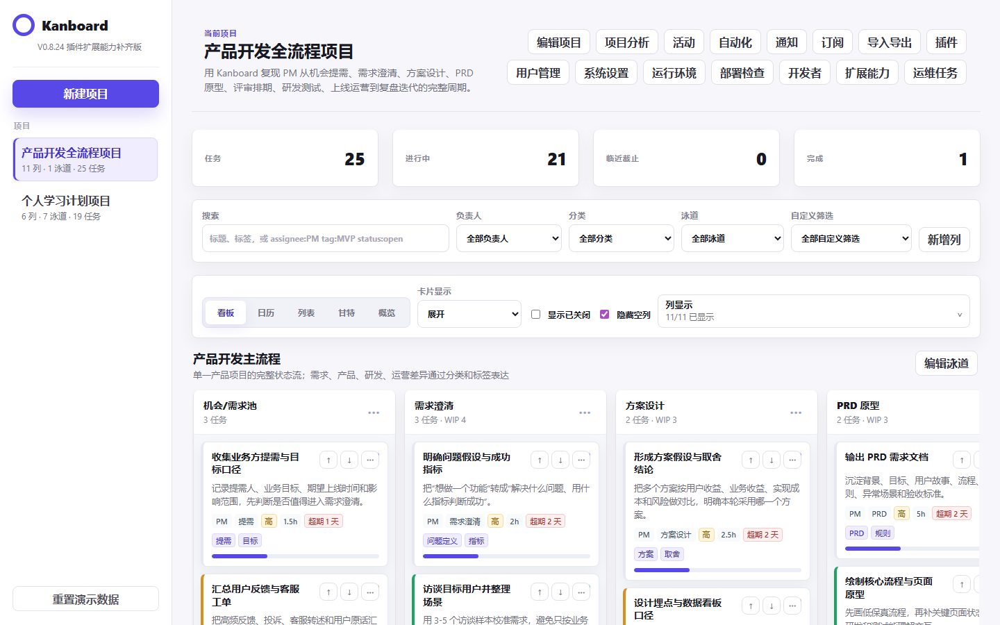

# 🔨 项目1：传统产品功能优化

> 状态：进行中 | 启动日期：2026-05-31 | 当前实现版本：V0.8.29 Clarity 第二轮页面级精修与 CSS 技术债务清理

> 产品设计生命周期状态：假设版低保真、公开真实案例研究、D02 静态高保真实现、Figma 轻量交付、浏览器设计 QA 与作品集叙事已补齐；2026-06-25 已确认 Figma 账号可用，并已在同一账号下补齐 F01-F47 全功能高保真 Frame；新手破冰激活体验（PD-018A-G）已完成并验证；首次核心操作轻引导（PD-019A-E）已全部完成并通过 Codex 复验，PD-019B 已实际导入线上 Figma 页面并归档 12 张正式导出图，项目内同时保留 SVG/PNG 源图、导入包与插件；全量 449 项自动化集成审计及 12 张回归截图均已通过验收。作品集对外展示包（PD-020）、正式导出版式与讲稿排练包（PD-022）、打印就绪导出源与自检（PD-023）、浏览器预览与截图验收（PD-024）及最终收尾索引（PD-025）均已完成。项目决定不安排招募式真人测试，以官方文档、GitHub issue 和 Hacker News 中的公开真实案例作为二手研究证据基线；真实物理设备未接入，移动端检查以 Chromium 390px 视口替代。真实进度以 `docs/00-project-governance/产品生命周期真实进度基线.md` 为准。

> 仓库边界：本目录是独立实战项目目录，Git/GitHub 只管理本目录内容，不包含学习日志、课程笔记、知识库、学习计划等学习资料。

## 项目目标
选择一个经典传统产品的核心功能，进行深入分析并提出优化方案。当前选题先从 GitHub 经典开源产品中选择，训练用户分析、需求分析、竞品分析、PRD 与原型表达能力。

## 当前选题

| 项目 | 内容 |
|---|---|
| 产品 | Kanboard |
| GitHub | https://github.com/kanboard/kanboard |
| 产品类型 | 开源看板式项目管理工具 |
| 优化方向 | 新手项目创建与任务拆解体验优化 |
| 目标用户 | 初次使用看板管理个人/小团队任务的学生、个人开发者、轻量团队负责人 |
| 核心问题假设 | 新用户知道“我要管理任务”，但不知道如何从空白项目拆成可执行看板 |

## 候选产品
- Kanboard：新手项目创建与任务拆解体验优化
- WeKan：看板协作与通知体验优化
- Actual Budget：新手预算设置与迁移引导优化
- Firefly III：记账导入与预算理解体验优化
- 抖音：搜索功能优化
- 微信读书：阅读体验优化
- 小红书：推荐算法体验改进
- 美团：下单流程优化
- B站：评论区互动改进

## 产出物
- [x] 项目选题说明 V0.1
- [x] 竞品分析报告 V0.2
- [x] 用户研究与需求池 V0.2
- [x] Kanboard MVP 复现 V0.3
- [x] Kanboard 静态页面增强复现 V0.4
- [x] 新手创建向导优化 V0.5
- [x] Kanboard 完整复现补齐 V0.6
- [x] 项目配置与协作补齐 V0.7
- [x] 分析时间与自动化补齐 V0.8
- [x] 静态功能验收 V0.8
- [x] 静态界面视觉优化 V0.8.1
- [x] Open-source Command Desk 界面重设计 V0.8.2
- [x] PM 工作流看板补齐 V0.8.3
- [x] 多项目示例补齐 V0.8.4
- [x] 产品经理学习路线补齐 V0.8.5
- [x] 固定侧栏与右侧滚动修复 V0.8.6
- [x] 泳道空列精简与流程状态升级 V0.8.7
- [x] 项目周期时间系统 V0.8.8
- [x] 列显示面板优化 V0.8.9
- [x] 弹窗关闭逻辑修复 V0.8.10
- [x] 泳道建模逻辑修正 V0.8.11
- [x] Calendar / Gantt / 菜单补齐 V0.8.12
- [x] 活动 / 附件 / 快捷键补齐 V0.8.13
- [x] 项目文件 / 访问范围 / 用户组权限补齐 V0.8.14
- [x] 公共访问 / iCalendar / RSS 订阅补齐 V0.8.15
- [x] 任务 CSV / 子任务 CSV / 项目 JSON 导入导出补齐 V0.8.16
- [x] 插件安装器 / 插件目录 / 安装更新卸载补齐 V0.8.17
- [x] 全局用户 / 用户组 / 组成员关系补齐 V0.8.18
- [x] API / LDAP / 反向代理认证 / 安全配置补齐 V0.8.19
- [x] 管理员 CLI / Cronjob / Worker / 邮件测试补齐 V0.8.20
- [x] 运行环境 / 数据库配置 / 升级检查补齐 V0.8.21
- [x] 安装部署 / Docker / URL Rewrite / 反向代理访问安全补齐 V0.8.22
- [x] Webhook / JSON-RPC API / 插件开发骨架补齐 V0.8.23
- [x] 认证提供者 / 自动动作 / 通知类型插件扩展补齐 V0.8.24
- [x] 授权架构 / 自定义路由 / Provider / Schema / Helper / Override 插件进阶扩展补齐 V0.8.25
- [x] Debian / Ubuntu / RHEL / Windows 平台安装与 Custom Forms 补齐 V0.8.26
- [x] API Procedure Explorer / Task、File、Link API 方法细化补齐 V0.8.27
- [x] Clarity 风格前端视觉对齐首轮 V0.8.28
- [x] 功能优化 PRD 骨架（PD-003，假设版）
- [ ] 研究验证后的功能优化 PRD
- [x] 低保真线框与关键状态（PD-010，假设版）
- [x] Figma 高保真轻量交付稿（PD-011D）
- [x] Figma 完整 F01~F08 高保真 Frame 集（PD-011E）
- [x] Figma 扩展 F09~F24 高保真覆盖（PD-011F）
- [x] Figma 全功能 F25~F47 高保真覆盖（PD-011G）
- [x] PD-019B 首次核心操作轻引导 Figma 物理交付与归档（12 个 Frame 已写入线上页面；项目内保留 SVG/PNG、manifest、contact sheet、本地 Figma Development Plugin 与 12 张正式导出图）
- [x] D02 静态原型设计 QA 与浏览器检查（PD-011D）
- [x] 作品集叙事（PD-013）
- [x] 新手激活体验优化（PD-018A-G，从 PRD、设计、开发到回归截图通过复验）
- [x] 首次核心操作轻引导（PD-019A-E，从 PRD、设计、开发到回归截图通过复验）
- [x] 作品集对外展示包增量升级（PD-020，10 页展示结构 + 3/8 分钟面试脚本，已通过 Codex 复验）
- [x] 作品集正式导出版式与讲稿排练包（PD-022，10 页版式规格 + 12 个 Q&A + 20 条导出前自检，已通过 Codex 复验）
- [x] 作品集打印就绪导出源与版面自检（PD-023，Markdown & HTML 导出源 + 10 页版面自检，已通过 Codex 复验）
- [x] 作品集打印版浏览器预览与截图验收（PD-024，无头浏览器仿真 + 7 张回归截图，已通过 Codex 复验）
- [x] 项目最终收尾索引与归档（PD-025，最终入口汇总 + 核心交付归档，已通过 Codex 终验）

## 文档中心

详细文档索引见 `docs/README.md`。根目录只保留项目总览、可运行静态原型、测试入口和设计图入口。

| 分类 | 位置 | 说明 |
|---|---|---|
| 项目治理 | `docs/00-project-governance/` | 启动说明、路线图、真实进度基线、双智能体协作方案、版本记录 |
| 研究与发现 | `docs/01-research-discovery/` | 竞品分析、用户假设、产品机会、用户研究计划 |
| 需求与验收 | `docs/02-requirements/` | PRD 骨架、用户故事、验收标准、新手激活与轻引导增量 PRD |
| UX 设计 | `docs/03-ux-design/` | 流程图、信息架构、交互状态、设计原则与非目标、激活与轻引导高保真设计 |
| 实现迭代 | `docs/04-implementation-log/` | V0.3~V0.8.29 静态原型、功能复现、视觉对齐、第二轮页面级精修与 CSS 技术债务清理说明 |
| 验收资料 | `docs/05-validation/` | 静态功能验收、研究证据、设计 QA、浏览器检查与回归测试报告 |
| 作品集说明 | `docs/06-portfolio/` | 作品集版叙事、优化前后对比、最终交付包索引 |
| 自动化测试 | `tests/static-feature-audit-v08.js` | Playwright 静态功能验收脚本 |
| 设计图资产 | `设计图/` | 页面截图、新手激活截图（PD-018D）、首次操作轻引导截图（PD-019D） |

## 版本与产品设计节奏
| V0.8.21 | 运行环境、数据库配置、性能提示和升级检查补齐 | 已完成 |
| V0.8.22 | 安装部署、Docker、URL Rewrite、反向代理访问安全补齐 | 已完成 |
| V0.8.23 | Webhook、JSON-RPC API、插件开发骨架与集成风险补齐 | 已完成 |
| V0.8.24 | 认证提供者、自动动作、通知类型插件扩展能力补齐 | 已完成 |
| V0.8.25 | 授权架构、Avatar、Custom Routes、外部链接/任务 Provider、Schema、Helper、Events、Overrides 插件进阶扩展补齐 | 已完成 |
| V0.8.26 | Debian、Ubuntu、RHEL、Windows 平台安装与 Custom Forms 补齐 | 已完成 |
| V0.8.27 | API Procedure Explorer：Task / Project File / Task File / Link API 方法细化补齐 | 已完成 |
| V0.8.28 | Clarity 风格前端视觉对齐首轮 | 已完成；系统级功能扩张主线仍暂停 |
| V0.8.29 | Clarity 第二轮页面级精修与 CSS 技术债务清理 | 已完成；403 checks passed，!important 清零 |
| PD-001~PD-009 | 问题定义、研究计划、PRD、用户故事、流程、状态、原则、页面 Brief、设计系统 | 假设版已完成 |
| PD-010 | 低保真线框与关键状态 | 修订后通过；11 张图已导出 PNG/SVG |
| PD-010A | 低保真形成性评审与结构决策 | 修订后通过；Gate 规则与真人测试执行包已建立 |
| PD-010B | 创建向导核心整改与可访问性补齐 | 修订后通过；370 项完整审计通过 |
| PD-010C | V03~V06 低保真对照测试资产 | 修订后通过；10 组 PNG/SVG 与反平衡执行包已就绪 |
| PD-010D-R | 公开真实案例证据研究与模拟走查 | 已完成；作为本项目二手研究证据基线，不计真人样本 |
| PD-010D | 真人形成性测试 | 已取消；项目不安排招募式真人测试 |
| PD-011A | 高保真前 3 个视觉方向探索 | 修订后通过；已选择 D02 Structured Guide |
| PD-011B | D02 高保真视觉规格与出图准备 | 修订后通过；F01~F08 与 8 条出图 prompt 已就绪 |
| PD-011C | D02 Structured Guide 静态原型高保真实现 | 修订后通过；397 项静态审计通过 |
| PD-011D | D02 Figma 轻量交付与浏览器设计 QA | 已完成；Figma 文件、桌面/390px 截图与 QA 报告已补齐 |
| PD-011E | Figma 完整 F01~F08 高保真补图 | 已完成；`PD-011E Full High Fidelity` 页当前 8 个 Frame |
| PD-011F | Figma 扩展 F09~F24 高保真覆盖 | 已完成；`PD-011F Extended High Fidelity Coverage` 页当前 16 个 Frame |
| PD-011G | Figma 全功能覆盖审计与 F25~F47 补图清单 | 已完成；`PD-011G Full Feature Coverage` 页当前 23 个 Frame |
| PD-011 | 实际高保真 / Figma 视觉稿 | 已补齐；D02 静态原型高保真与 Figma F01-F47 全功能高保真均已完成 |
| PD-012 | 正式招募式可用性测试 | 已移出范围；改由设计 QA、浏览器检查和完整审计验收；真实物理设备未接入 |
| PD-011H | Clarity 页面级精修审计 | 已完成 |
| PD-011I | 移动端首屏与弹窗回归修复 | 已完成 |
| PD-011J | 看板核心操作视觉精修 | 已完成 |
| PD-011K | 多视图与系统弹窗视觉统一 | 已完成 |
| PD-011L | 最终设计一致性与 P2 审计 | 已完成 |
| PD-011M | CSS 技术债务清理 | 已完成 |
| PD-013 | 作品集版文档与原型说明 | 已完成；作品集叙事与边界说明已补齐 |
| PD-014 | 最终作品集展示包与材料整理 | 已完成；8~10 页核心讲稿大纲已建立 |
| PD-015 | 最终交付包索引与归档入口整理 | 已完成；中心化查找入口已就绪 |
| PD-016 | V0.8.29 截图资产刷新 | 已完成；Playwright 最新证据已捕获 |

## 下一步

按 `product-design-workflow` 继续产品设计主线，不再默认推进系统级功能扩张：
- 聊天窗口切换时先读取 `docs/00-project-governance/聊天窗口切换交接-2026-06-22.md`。
- 当前验证口径见 `docs/00-project-governance/验证证据范围决策-2026-06-22.md`。
- PD-010B 核心整改和 PD-010C 对照资产均已修订后通过。
- PD-010D-R 已用官方文档、GitHub issue 和 Hacker News 中的公开真实案例建立二手研究证据基线；项目不再安排 PD-010D 真人测试。
- PD-011A 已产出并通过 Codex 修订验收，项目负责人已选择 D02 Structured Guide；PD-011B 高保真视觉规格已修订后通过；PD-011C 静态原型高保真实现已修订后通过，397 项静态审计通过；PD-011D 已补齐 Figma 轻量交付、桌面/390px 浏览器设计 QA 与截图证据；PD-011E/PD-011F 已重建完成，PD-011G 已新增完成，F01-F47 已写入并复查；PD-013 已补齐作品集叙事。
- V0.8.28 已完成 Clarity 风格前端视觉对齐首轮，主要调整侧栏、顶栏、统计卡、筛选区、看板列、任务卡、弹窗和移动端命令条；原系统级功能扩张主线仍暂停。
- 第二轮页面级精修已完成；最终作品集展示包 (PD-014) 与最终交付包索引 (PD-015) 已完成；后续可考虑可选真实设备检查或可选真人测试计划。
- 对外不得宣称完成真人测试；结构判断须标注为公开真实案例与专家分析驱动。
- 对外不得宣称完成真实物理设备检查；本次移动端验证为 Chromium 390px 视口替代。
- 高保真阶段使用 `impeccable craft`，交付前执行 `critique` 和 `audit`。

## 本地打开

直接用浏览器打开 `index.html` 即可运行复现版。数据保存在浏览器 localStorage 中。

## 当前截图

*(附带的 390px [移动端最新视口](设计图/PD-016/kanboard-v0.8.29-clarity-mobile-390.png) 可前往目录查看)*
