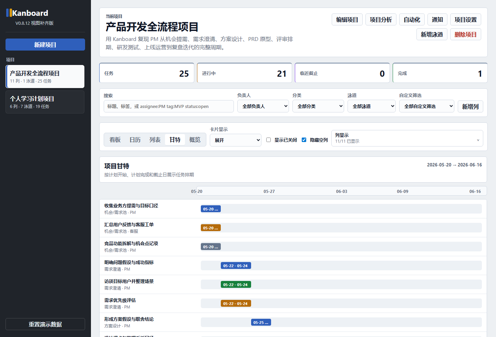

# 🔨 项目1：传统产品功能优化

> 状态：进行中 | 启动日期：2026-05-31 | 当前版本：V0.8.12 视图与菜单补齐

> 仓库边界：本目录是独立实战项目目录，Git/GitHub 只管理本目录内容，不包含学习日志、课程笔记、知识库、学习计划等学习资料。

## 项目目标
选择一个经典传统产品的核心功能，进行深入分析并提出优化方案。当前选题先从 GitHub 经典开源产品中选择，训练用户分析、需求分析、竞品分析、PRD 与原型表达能力。

## 当前选题

| 项目 | 内容 |
|---|---|
| 产品 | Kanboard |
| GitHub | https://github.com/kanboard/kanboard |
| 产品类型 | 开源看板式项目管理工具 |
| 优化方向 | 新手项目创建与任务拆解体验优化 |
| 目标用户 | 初次使用看板管理个人/小团队任务的学生、个人开发者、轻量团队负责人 |
| 核心问题假设 | 新用户知道“我要管理任务”，但不知道如何从空白项目拆成可执行看板 |

## 候选产品
- Kanboard：新手项目创建与任务拆解体验优化
- WeKan：看板协作与通知体验优化
- Actual Budget：新手预算设置与迁移引导优化
- Firefly III：记账导入与预算理解体验优化
- 抖音：搜索功能优化
- 微信读书：阅读体验优化
- 小红书：推荐算法体验改进
- 美团：下单流程优化
- B站：评论区互动改进

## 产出物
- [x] 项目选题说明 V0.1
- [x] 竞品分析报告 V0.2
- [x] 用户研究与需求池 V0.2
- [x] Kanboard MVP 复现 V0.3
- [x] Kanboard 静态页面增强复现 V0.4
- [x] 新手创建向导优化 V0.5
- [x] Kanboard 完整复现补齐 V0.6
- [x] 项目配置与协作补齐 V0.7
- [x] 分析时间与自动化补齐 V0.8
- [x] 静态功能验收 V0.8
- [x] 静态界面视觉优化 V0.8.1
- [x] Open-source Command Desk 界面重设计 V0.8.2
- [x] PM 工作流看板补齐 V0.8.3
- [x] 多项目示例补齐 V0.8.4
- [x] 产品经理学习路线补齐 V0.8.5
- [x] 固定侧栏与右侧滚动修复 V0.8.6
- [x] 泳道空列精简与流程状态升级 V0.8.7
- [x] 项目周期时间系统 V0.8.8
- [x] 列显示面板优化 V0.8.9
- [x] 弹窗关闭逻辑修复 V0.8.10
- [x] 泳道建模逻辑修正 V0.8.11
- [x] Calendar / Gantt / 菜单补齐 V0.8.12
- [ ] 功能优化 PRD
- [ ] Figma 高保真原型图

## 项目文档

| 文档 | 说明 |
|---|---|
| `项目实战路线图.md` | 从 V0.1 到 V1.0 的实战推进节奏 |
| `Kanboard新手项目创建与任务拆解优化-启动说明.md` | 选题、问题定义和版本计划 |
| `竞品分析报告-V0.2.md` | Kanboard / WeKan / Trello / Notion 对比 |
| `用户研究与需求池-V0.2.md` | 用户画像、痛点、需求池和 P0 范围 |
| `复现范围说明-V0.3.md` | Kanboard MVP 复现边界和功能分层 |
| `静态页面完成说明-V0.4.md` | 静态页面增强复现范围和后续 Figma 计划 |
| `新手创建向导说明-V0.5.md` | 模板创建向导的产品判断、功能范围和验证记录 |
| `Kanboard完整复现差距清单-V0.6.md` | 完整复现前的功能差距、分期范围和暂不复现边界 |
| `项目配置与协作补齐说明-V0.7.md` | 项目设置、成员角色、分类标签、自定义筛选和泳道配置说明 |
| `分析时间与自动化补齐说明-V0.8.md` | 项目分析、时间跟踪、循环任务、自动化和通知中心说明 |
| `静态功能验收报告-V0.8.md` | V0.3-V0.8 已承诺静态功能的自动化验收结论、边界和下一步判断 |
| `tests/static-feature-audit-v08.js` | Playwright 静态功能验收脚本，覆盖 112 个核心检查项 |
| `界面视觉优化说明-V0.8.1.md` | 进入 Figma 前的静态界面视觉优化说明，记录去 AI 味的设计判断 |
| `界面重设计说明-V0.8.2.md` | 使用前端设计类 Skill 重塑界面视觉系统的说明、DFII 评分和验收结果 |
| `PM工作流看板说明-V0.8.3.md` | 用 Kanboard 复现完整产品开发流程的列、泳道、卡片和产品判断 |
| `多项目示例说明-V0.8.4.md` | 在默认看板中补齐第二个轻量项目，说明多项目场景与产品判断 |
| `个人产品经理学习路线说明-V0.8.5.md` | 将个人学习项目改造成“从 0 成为优秀产品经理”的成长路线 |
| `固定侧栏滚动修复说明-V0.8.6.md` | 修复桌面端整页滚动问题，让左侧导航固定、右侧工作区独立滚动 |
| `泳道空列精简与流程状态升级说明-V0.8.7.md` | 增加隐藏空列显示优化，并升级 PM 工作流和学习项目流程状态 |
| `项目周期时间系统说明-V0.8.8.md` | 增加项目级周期、卡片计划实际日期、阶段周期分析和风险提示 |
| `列显示面板优化说明-V0.8.9.md` | 将一排隐藏列按钮收敛为可展开的列显示选择面板 |
| `弹窗关闭逻辑修复说明-V0.8.10.md` | 修复必填表单弹窗点击关闭或取消时被 required 校验拦截的问题 |
| `泳道建模逻辑修正说明-V0.8.11.md` | 根据 Kanboard 官方泳道模型修正主 PM 项目默认泳道设计 |
| `视图与菜单补齐说明-V0.8.12.md` | 根据 Kanboard 官方项目视图补齐 Calendar、Gantt 和 Board 菜单 |
| `index.html` | 可运行的 Kanboard MVP 静态原型 |
| `styles.css` / `app.js` | 页面样式与看板交互逻辑 |
| `设计图/kanboard-mvp-v0.3.png` | V0.3 页面截图 |
| `设计图/kanboard-static-v0.4.png` | V0.4 页面截图 |
| `设计图/kanboard-template-v0.5.png` | V0.5 新手创建向导截图 |
| `设计图/kanboard-v0.6-fuller-reproduction.png` | V0.6 多视图和概览截图 |
| `设计图/kanboard-v0.7-project-settings.png` | V0.7 项目设置截图 |
| `设计图/kanboard-v0.8-analytics-automation.png` | V0.8 项目分析截图 |
| `设计图/kanboard-v0.8.1-visual-polish.png` | V0.8.1 静态界面视觉优化截图 |
| `设计图/kanboard-v0.8.2-command-desk-redesign.png` | V0.8.2 Open-source Command Desk 界面重设计截图 |
| `设计图/kanboard-v0.8.3-pm-workflow.png` | V0.8.3 PM 工作流看板截图 |
| `设计图/kanboard-v0.8.4-multi-project-demo.png` | V0.8.4 多项目示例截图 |
| `设计图/kanboard-v0.8.5-pm-learning-roadmap.png` | V0.8.5 产品经理学习路线截图 |
| `设计图/kanboard-v0.8.6-fixed-sidebar-scroll.png` | V0.8.6 固定侧栏与右侧滚动截图 |
| `设计图/kanboard-v0.8.7-lane-compact-workflow.png` | V0.8.7 泳道空列精简与流程状态升级截图 |
| `设计图/kanboard-v0.8.8-project-cycle-system.png` | V0.8.8 项目周期时间系统截图 |
| `设计图/kanboard-v0.8.9-column-picker.png` | V0.8.9 列显示面板优化截图 |
| `设计图/kanboard-v0.8.10-dialog-close-fix.png` | V0.8.10 弹窗关闭逻辑修复截图 |
| `设计图/kanboard-v0.8.11-swimlane-model-fix.png` | V0.8.11 泳道建模逻辑修正截图 |
| `设计图/kanboard-v0.8.12-calendar-view.png` | V0.8.12 Calendar 日历视图截图 |
| `设计图/kanboard-v0.8.12-gantt-view.png` | V0.8.12 Gantt 甘特视图截图 |
| `版本记录.md` | 每一轮迭代的变更、判断和下一步 |

## 版本节奏

| 版本 | 目标 | 状态 |
|---|---|---|
| V0.1 | 选题、产品选择、问题定义、智能体分工 | 已完成 |
| V0.2 | 竞品分析、用户痛点、机会点 | 已完成 |
| V0.3 | Kanboard MVP 复现：项目、任务卡片、卡片流转 | 已完成 |
| V0.4 | 静态页面增强复现：泳道、子任务、评论、活动记录 | 已完成 |
| V0.5 | 新手创建向导优化：模板、示例卡、创建前预览 | 已完成 |
| V0.6 | Kanboard 完整复现补齐：视图、任务动作、高级搜索 | 已完成 |
| V0.7 | 项目配置与协作能力补齐 | 已完成 |
| V0.8 | 分析、时间跟踪和自动化补齐 | 已完成 |
| V0.8.1 | 静态界面视觉优化 | 已完成 |
| V0.8.2 | Open-source Command Desk 界面重设计 | 已完成 |
| V0.8.3 | PM 工作流看板补齐 | 已完成 |
| V0.8.4 | 多项目示例补齐 | 已完成 |
| V0.8.5 | 产品经理学习路线补齐 | 已完成 |
| V0.8.6 | 固定侧栏与右侧滚动修复 | 已完成 |
| V0.8.7 | 泳道空列精简与流程状态升级 | 已完成 |
| V0.8.8 | 项目周期时间系统 | 已完成 |
| V0.8.9 | 列显示面板优化 | 已完成 |
| V0.8.10 | 弹窗关闭逻辑修复 | 已完成 |
| V0.8.11 | 泳道建模逻辑修正 | 已完成 |
| V0.8.12 | Calendar / Gantt / 菜单补齐 | 已完成 |
| V0.9 | Figma 高保真原型 | 下一步 |
| V1.0 | 作品集版文档与原型说明 | 未开始 |

## 下一步

进入 V0.9 Figma 高保真原型：
- 绘制 Kanboard 原始新建项目路径。
- 绘制优化后的模板创建向导路径。
- 绘制看板首页、项目分析、项目周期、项目设置等关键高保真页面。
- 输出优化前后对比图和作品集展示稿。

Figma 高保真原型推迟到完整复现补齐之后。

## 本地打开

直接用浏览器打开 `index.html` 即可运行复现版。数据保存在浏览器 localStorage 中。

## 当前截图

