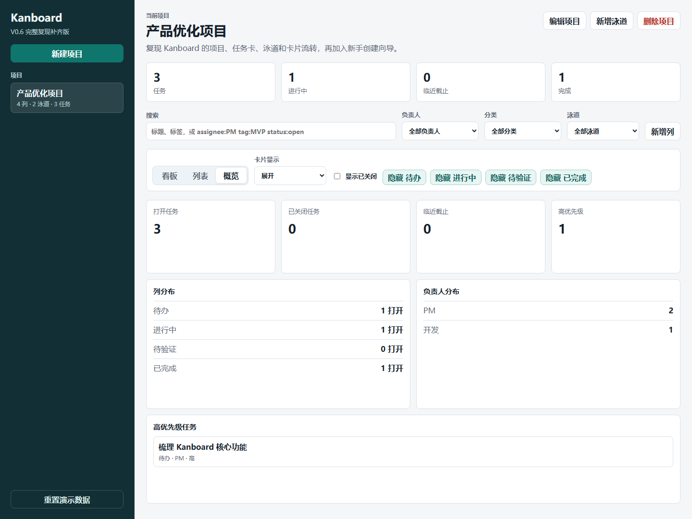

# 🔨 项目1：传统产品功能优化

> 状态：进行中 | 启动日期：2026-05-31 | 当前版本：V0.6 Kanboard 完整复现补齐

> 仓库边界：本目录是独立实战项目目录，Git/GitHub 只管理本目录内容，不包含学习日志、课程笔记、知识库、学习计划等学习资料。

## 项目目标
选择一个经典传统产品的核心功能，进行深入分析并提出优化方案。当前选题先从 GitHub 经典开源产品中选择，训练用户分析、需求分析、竞品分析、PRD 与原型表达能力。

## 当前选题

| 项目 | 内容 |
|---|---|
| 产品 | Kanboard |
| GitHub | https://github.com/kanboard/kanboard |
| 产品类型 | 开源看板式项目管理工具 |
| 优化方向 | 新手项目创建与任务拆解体验优化 |
| 目标用户 | 初次使用看板管理个人/小团队任务的学生、个人开发者、轻量团队负责人 |
| 核心问题假设 | 新用户知道“我要管理任务”，但不知道如何从空白项目拆成可执行看板 |

## 候选产品
- Kanboard：新手项目创建与任务拆解体验优化
- WeKan：看板协作与通知体验优化
- Actual Budget：新手预算设置与迁移引导优化
- Firefly III：记账导入与预算理解体验优化
- 抖音：搜索功能优化
- 微信读书：阅读体验优化
- 小红书：推荐算法体验改进
- 美团：下单流程优化
- B站：评论区互动改进

## 产出物
- [x] 项目选题说明 V0.1
- [x] 竞品分析报告 V0.2
- [x] 用户研究与需求池 V0.2
- [x] Kanboard MVP 复现 V0.3
- [x] Kanboard 静态页面增强复现 V0.4
- [x] 新手创建向导优化 V0.5
- [x] Kanboard 完整复现补齐 V0.6
- [ ] 功能优化 PRD
- [ ] Figma 高保真原型图

## 项目文档

| 文档 | 说明 |
|---|---|
| `项目实战路线图.md` | 从 V0.1 到 V1.0 的实战推进节奏 |
| `Kanboard新手项目创建与任务拆解优化-启动说明.md` | 选题、问题定义和版本计划 |
| `竞品分析报告-V0.2.md` | Kanboard / WeKan / Trello / Notion 对比 |
| `用户研究与需求池-V0.2.md` | 用户画像、痛点、需求池和 P0 范围 |
| `复现范围说明-V0.3.md` | Kanboard MVP 复现边界和功能分层 |
| `静态页面完成说明-V0.4.md` | 静态页面增强复现范围和后续 Figma 计划 |
| `新手创建向导说明-V0.5.md` | 模板创建向导的产品判断、功能范围和验证记录 |
| `Kanboard完整复现差距清单-V0.6.md` | 完整复现前的功能差距、分期范围和暂不复现边界 |
| `index.html` | 可运行的 Kanboard MVP 静态原型 |
| `styles.css` / `app.js` | 页面样式与看板交互逻辑 |
| `设计图/kanboard-mvp-v0.3.png` | V0.3 页面截图 |
| `设计图/kanboard-static-v0.4.png` | V0.4 页面截图 |
| `设计图/kanboard-template-v0.5.png` | V0.5 新手创建向导截图 |
| `设计图/kanboard-v0.6-fuller-reproduction.png` | V0.6 多视图和概览截图 |
| `版本记录.md` | 每一轮迭代的变更、判断和下一步 |

## 版本节奏

| 版本 | 目标 | 状态 |
|---|---|---|
| V0.1 | 选题、产品选择、问题定义、智能体分工 | 已完成 |
| V0.2 | 竞品分析、用户痛点、机会点 | 已完成 |
| V0.3 | Kanboard MVP 复现：项目、任务卡片、卡片流转 | 已完成 |
| V0.4 | 静态页面增强复现：泳道、子任务、评论、活动记录 | 已完成 |
| V0.5 | 新手创建向导优化：模板、示例卡、创建前预览 | 已完成 |
| V0.6 | Kanboard 完整复现补齐：视图、任务动作、高级搜索 | 已完成 |
| V0.7 | 项目配置与协作能力补齐 | 下一步 |
| V0.8 | 分析、时间跟踪和自动化补齐 | 未开始 |
| V0.9 | Figma 高保真原型 | 未开始 |
| V1.0 | 作品集版文档与原型说明 | 未开始 |

## 下一步

进入 V0.7 项目配置与协作能力补齐：
- 增加项目设置页。
- 增加成员、角色、权限的静态配置。
- 增加分类、标签、自定义筛选管理。
- 增加泳道排序、禁用和默认泳道设置。

Figma 高保真原型推迟到完整复现补齐之后。

## 本地打开

直接用浏览器打开 `index.html` 即可运行复现版。数据保存在浏览器 localStorage 中。

## 当前截图

