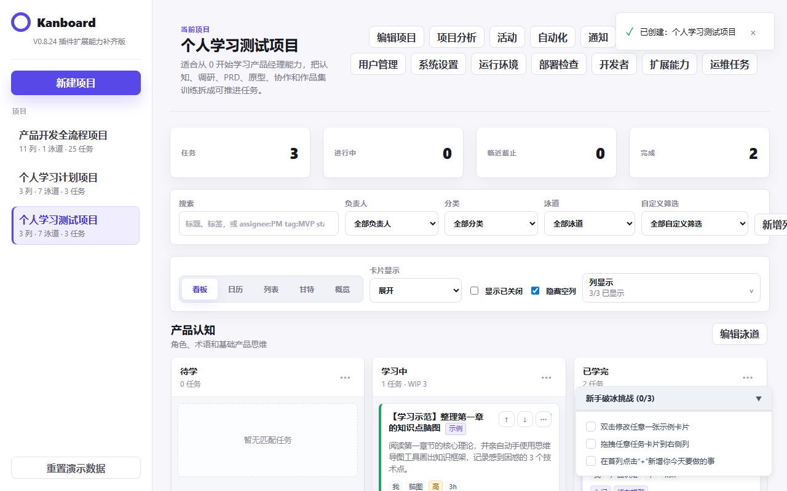
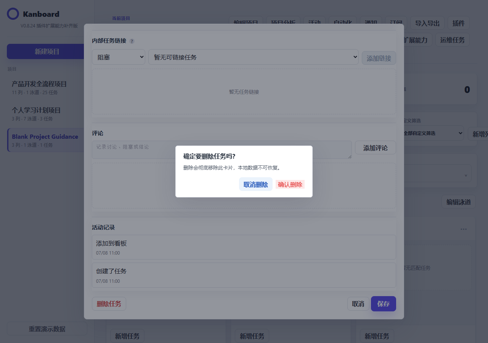

# Kanboard 新手项目创建与任务拆解体验优化

这是一个围绕开源项目管理工具 [Kanboard](https://github.com/kanboard/kanboard) 展开的完整产品设计案例。项目聚焦一个具体问题：新用户知道自己想管理任务，却不知道怎样从空白项目开始、如何组织看板，也不确定第一步该做什么。

本项目从公开案例研究、问题定义和 PRD 出发，完成了低保真与 Figma 高保真设计、可运行静态原型、自动化回归验证和作品集交付。核心方案不是增加更多功能，而是帮助新手更快建立第一张可用看板，同时保持熟练用户原有的操作效率。

| 项目状态 | 交付形态 | 核心验证 | 在线入口 |
| --- | --- | --- | --- |
| 已完成、归档并上线静态演示 | 产品文档、Figma、营销站、可交互原型、测试与作品集材料 | 449 项自动化检查通过，74 张 Figma 导出归档 | [营销首页](https://tangtongqing.github.io/kanboard-onboarding-optimization/) · [产品体验](https://tangtongqing.github.io/kanboard-onboarding-optimization/app.html) |



## 项目背景

Kanboard 功能完整、结构清晰，但新手第一次创建项目时容易遇到三类障碍：

- 面对空白看板，不知道应该建立哪些列、泳道和任务。
- 不理解 WIP、泳道等项目管理概念，配置时缺少上下文帮助。
- 创建项目后没有清晰的首次行动路径，容易停留在“看到了看板，但不会开始”的状态。

目标用户包括第一次用看板管理课程、作品集、求职或个人项目的学生与产品学习者，以及希望用轻量工具管理个人开发或小团队任务的用户。

项目目标是让新手完成三个连续结果：创建一张可用看板、理解基本结构、把示例内容改成自己的真实任务。空白创建路径和已有项目路径则保持低干扰，不强制进入教学流程。

## 解决方案

方案把新手激活拆成四层渐进式帮助：

1. **场景模板与结构预览**：创建前展示将生成的列、泳道和示例任务，帮助用户理解结果后再做选择。
2. **新手激活 Checklist**：创建后以 0/3 任务引导用户编辑卡片、拖动卡片和新建真实任务，在实际操作中理解看板。
3. **字段 Tooltip**：对 WIP、泳道等概念提供就地解释，避免用户离开当前流程查文档。
4. **首次核心操作轻引导**：为首次拖动、编辑、任务菜单和删除提供一次性提示；Dialog、Tooltip 或 Checklist 打开时自动避让，完成或关闭后不再打扰。

移动端使用 390px 单列布局、进度气泡、Bottom Drawer、inline 提示条和删除 Bottom Sheet，避免把桌面浮层简单压缩到小屏幕。


## 关键设计取舍

- **在做中教**：通过可编辑示例卡和真实操作解释看板，不增加独立教程。
- **帮助必须可退出**：Checklist 可收起或永久关闭，一次性提示完成后不重复出现。
- **高级用户零干扰**：空白项目、老项目和已完成引导的项目不挂载新手提示。
- **高层浮窗互斥**：Dialog、Drawer、Tooltip 与 Checklist 激活时，轻引导进入 suppressed 状态，避免组件叠加。
- **不继续堆系统能力**：完整复现用于建立产品理解，最终优化范围收敛到“创建第一张可用看板并完成首次操作”。

## 可运行原型

项目已经通过 GitHub Pages 对外发布。营销首页负责介绍产品价值，产品体验页提供可操作的 Kanboard 静态原型；体验数据保存在访问者当前浏览器的 `localStorage` 中，不会上传到服务器。

| 页面 | 用途 |
| --- | --- |
| [营销首页](https://tangtongqing.github.io/kanboard-onboarding-optimization/) | 面向用户说明产品价值、使用场景与核心能力 |
| [产品体验](https://tangtongqing.github.io/kanboard-onboarding-optimization/app.html) | 创建项目、操作看板并体验新手引导 |
| [价格计划](https://tangtongqing.github.io/kanboard-onboarding-optimization/pricing.html) | 展示免费版、Pro 与团队版方案 |
| [联系我们](https://tangtongqing.github.io/kanboard-onboarding-optimization/contact.html) | 承接产品咨询与团队部署意向 |
| [设计案例](https://tangtongqing.github.io/kanboard-onboarding-optimization/landing.html) | 面向面试官呈现项目设计过程与证据 |

本地仍可直接运行，无需安装依赖：

1. 直接用浏览器打开 [`index.html`](index.html)。
2. 选择“个人学习项目”模板创建项目。
3. 按 Checklist 编辑示例卡、拖动任务并新增一张真实任务卡。
4. 继续体验首次操作提示、删除保护、移动端适配以及列表、日历、甘特图等补充视图。

主要源码：

- [`index.html`](index.html)：页面结构与各类 Dialog、Drawer。
- [`styles.css`](styles.css)：Clarity 风格视觉系统与桌面/移动端布局。
- [`app.js`](app.js)：项目数据、交互状态、localStorage、Checklist、Tooltip 与轻引导状态机。
- [`product.html`](product.html)：营销首页源文件；`pricing.html`、`contact.html` 与 `landing.html` 分别承载价格、联系和设计案例内容。
- [`scripts/build-pages.mjs`](scripts/build-pages.mjs)：生成 GitHub Pages 发布包，并把产品原型映射为线上 `app.html`。
- [`.github/workflows/deploy-pages.yml`](.github/workflows/deploy-pages.yml)：在 `main` 更新后自动构建并发布网站。

## 产品设计过程

| 阶段 | 核心产物 |
| --- | --- |
| 问题与研究 | [正式 MRD](docs/01-research-discovery/MRD-Kanboard新手项目创建与任务拆解优化.md)、[用户研究计划](docs/01-research-discovery/用户研究计划与访谈脚本-PD-002.md)、公开案例证据研究 |
| 需求定义 | [正式 PRD](docs/02-requirements/PRD-Kanboard新手项目创建与任务拆解优化.md) |
| UX 结构 | [流程与信息架构](docs/03-ux-design/流程图与信息架构-PD-005.md)、[交互状态规格](docs/03-ux-design/交互状态规格-PD-006.md)、[设计原则与非目标](docs/03-ux-design/设计原则与非目标-PD-007.md) |
| 原型与视觉 | [低保真线框](docs/03-ux-design/低保真线框与关键状态-PD-010.md)、[高保真视觉规格](docs/03-ux-design/高保真视觉规格-PD-011B.md)、[首次操作高保真设计](docs/03-ux-design/首次核心操作轻引导高保真设计-PD-019B.md) |
| 实现与验证 | 可运行静态原型、[激活体验回归报告](docs/05-testing/新手激活体验回归测试-PD-018D.md)、[轻引导回归报告](docs/05-testing/首次核心操作轻引导回归测试-PD-019D.md) |
| 作品集交付 | [作品集叙事](docs/06-portfolio/作品集叙事-PD-013.md)、[最终作品集展示包](docs/06-portfolio/最终作品集展示包-PD-014.md)、[打印就绪导出源](docs/06-portfolio/作品集打印版导出源-PD-023.html) |

完整文档导航见 [docs/README.md](docs/README.md)。MRD 是市场与用户判断的主入口，PRD 是产品需求的唯一事实源。

## Figma 与设计资产

Figma 已覆盖 D02 创建流程、F01-F47 全功能高保真、新手激活体验和首次核心操作轻引导。PD-019B 的 12 个 Frame 已写入线上页面并完成导出。

- [Figma 设计文件](https://www.figma.com/design/Uye3u4Uva5cwVt4eQnvxvz)
- [74 张最终 Figma PNG 导出](设计图/Figma线上归档/2026-07-10/README.md)
- [PD-019B 可复现 SVG/PNG 与导入包](设计图/PD-019B/README.md)
- [新手激活回归截图](设计图/PD-018D/README.md)
- [首次操作轻引导回归截图](设计图/PD-019D/README.md)



## 验证结果

运行完整自动化审计：

```powershell
node tests/static-feature-audit-v08.js
```

当前结果为 `449 checks passed`，覆盖：

- 模板创建、空白创建、表单错误、加载和成功反馈。
- 项目、列、泳道、任务及多视图的主要操作。
- Checklist 的 0/3、1/3、2/3、3/3、关闭、刷新和项目隔离。
- Tooltip 的桌面 Hover、移动端 Tap 与边缘避让。
- 首次拖动、编辑、菜单、删除保护和 suppressed 互斥状态。
- 390px 视口下的布局、防溢出和移动端交互替代方案。

这些检查证明原型功能和状态可达，不代表已经证明真实用户体验有效。

## 项目结构

```text
.
├── index.html                  # 可运行原型入口
├── styles.css                 # 视觉系统与响应式布局
├── app.js                     # 交互、数据与状态机
├── product.html               # 营销首页源文件
├── pricing.html               # 价格计划
├── contact.html               # 联系页面
├── landing.html               # 面试作品集设计案例页
├── scripts/build-pages.mjs    # GitHub Pages 构建脚本
├── .github/workflows/         # 自动发布工作流
├── PRODUCT.md                 # 产品定位与设计原则
├── docs/                      # MRD、PRD、设计、验证与作品集文档
├── tests/                     # 自动化静态功能审计
└── 设计图/                    # 线框、高保真、回归截图与 Figma 导出
```

详细版本演进不在 README 展开，可查看 [版本记录](docs/00-project-governance/版本记录.md)；全部文档入口统一收录在 [文档中心](docs/README.md)。

## 证据边界

本项目是一项产品设计与静态原型练习，结论保持以下边界：

- 用户问题主要来自官方文档、GitHub issue、Hacker News 等公开案例与专家走查，未执行招募式真人测试。
- 移动端验证基于 Chromium 390px 视口，没有覆盖真实 iOS 或 Android 设备。
- `449 checks` 证明功能实现和状态路径可达，不代表真实转化率、留存率或满意度提升。
- Figma 交付是页面级高保真设计与 PNG 归档，不是正式组件库。

项目当前已完成既定范围并进入归档状态。真实用户研究、物理设备验证和生产环境指标观测属于后续可选工作，不作为本次交付完成的前提。
