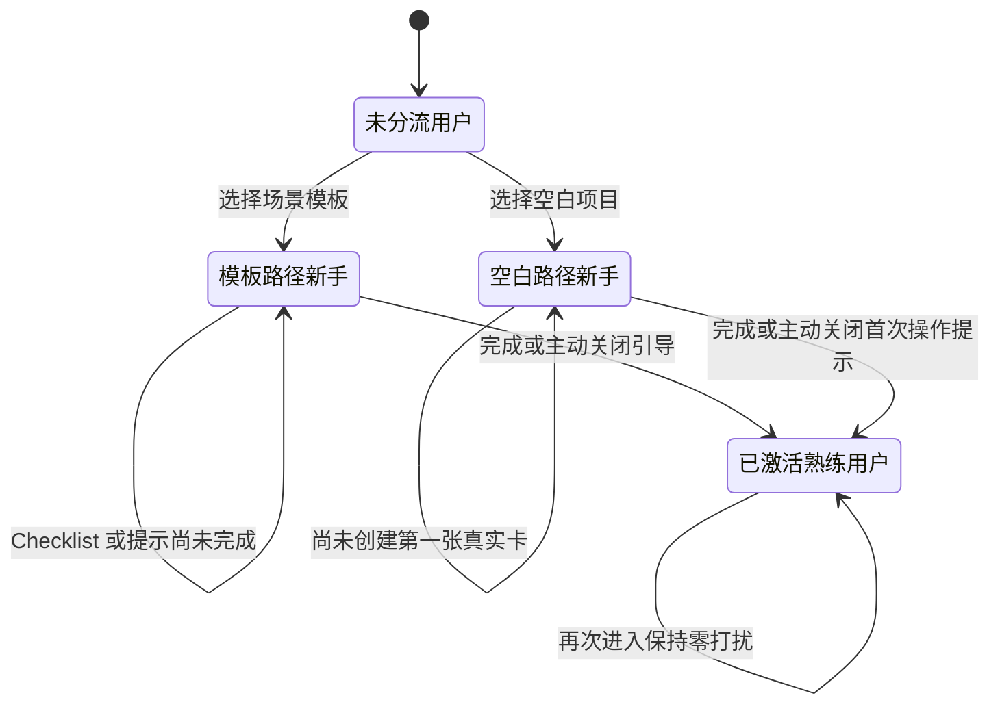
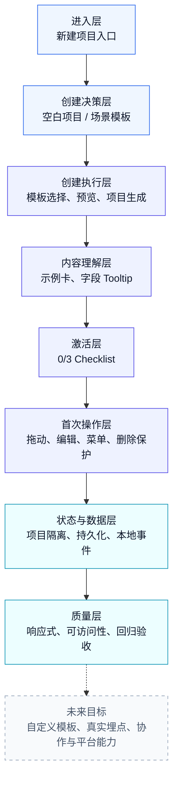
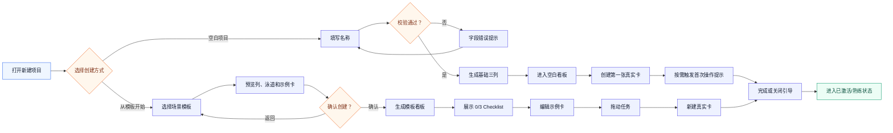
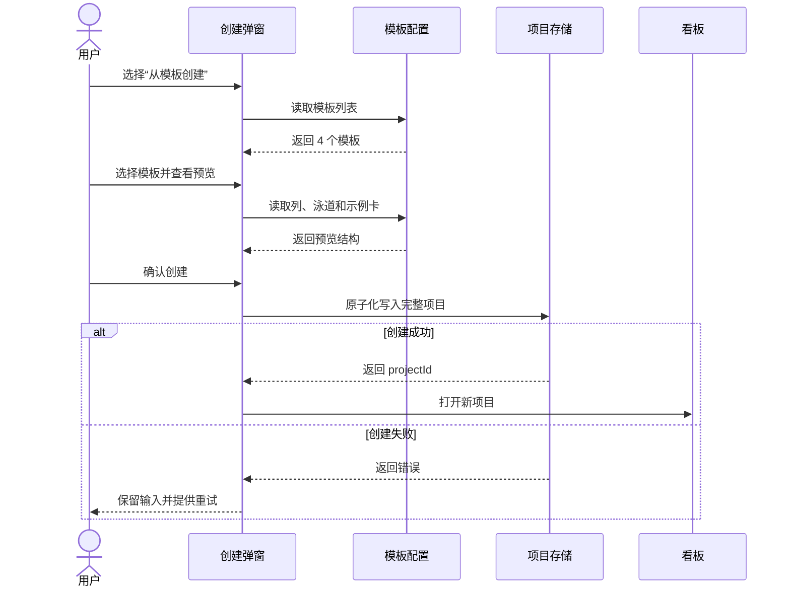
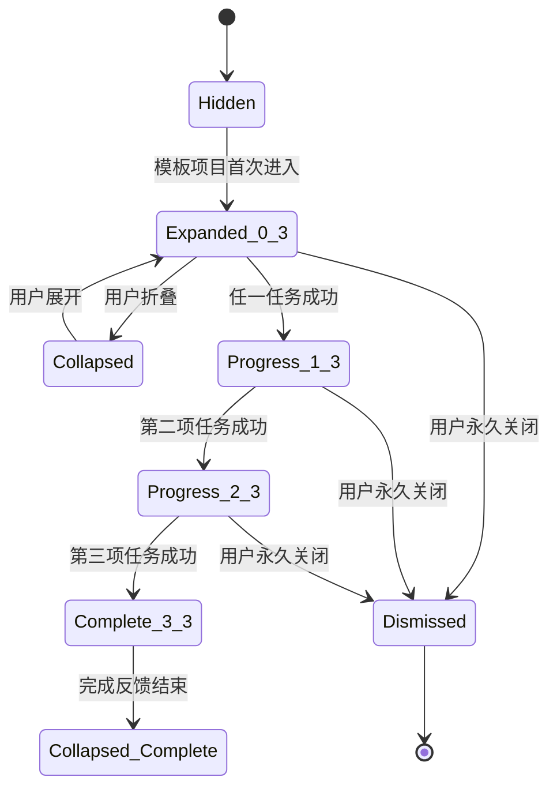
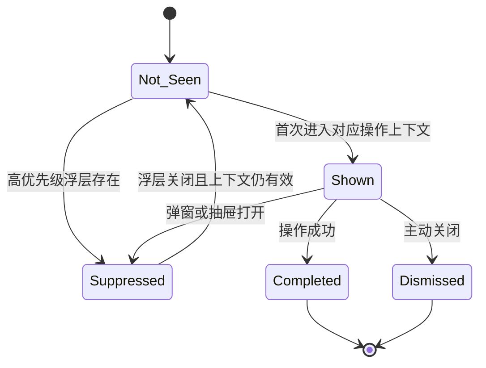
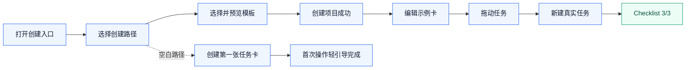
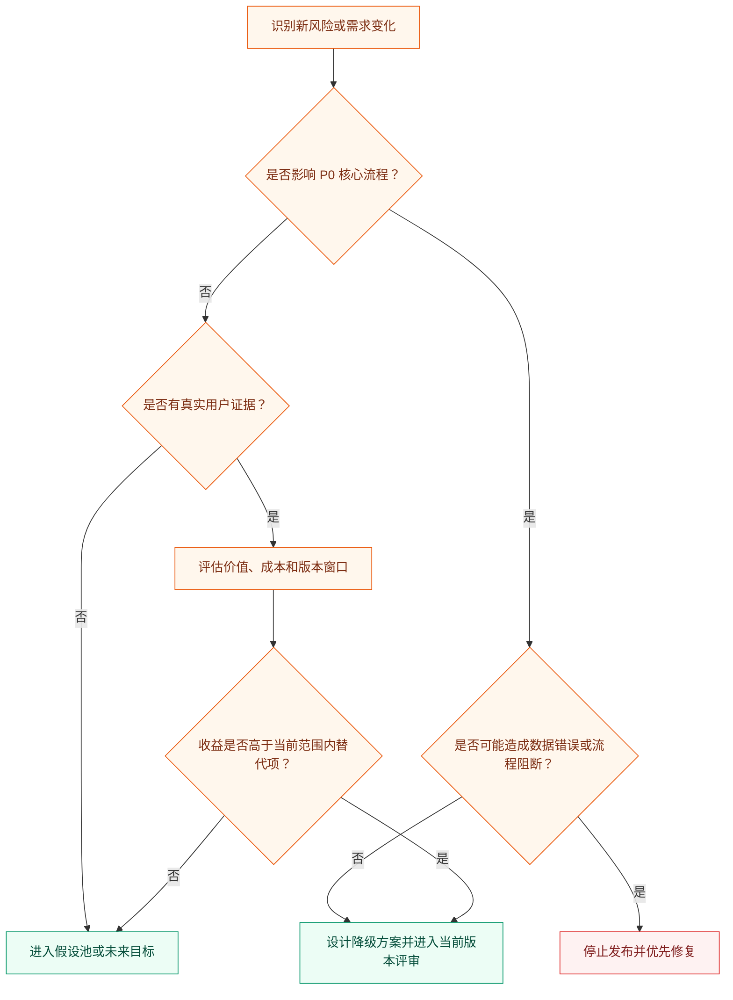

# PRD：Kanboard 新手项目创建与任务拆解优化

| 项目 | 内容 |
|---|---|
| 文档类型 | Product Requirements Document |
| 版本 | V2.0 |
| 更新日期 | 2026-07-30 |
| 文档状态 | 目标态需求基线；用于产品、设计、开发和测试协作 |
| 产品负责人 | 独立产品经理（姓名待填写） |
| 协作角色 | UX/视觉设计、原型开发、质量验证 |
| 对应 MRD | [MRD：Kanboard 新手项目创建与任务拆解优化](../01-research-discovery/MRD-Kanboard新手项目创建与任务拆解优化.md) |

> 本文是当前产品需求的唯一事实源。正文描述“需要实现什么”，不把现有实现结果当作需求本身；当前原型、自动化检查和交付状态统一记录在第 8 章附件。

## 一、产品简介

### 1.1 文档目的

本文定义 Kanboard“新手项目创建与任务拆解优化”的产品目标、用户角色、功能结构、功能规则、关键页面、高保真原型、非功能需求、验收标准和未来目标。

本文面向：

- 产品负责人：确认问题、范围、优先级和成功标准。
- UX/视觉设计：确认流程、页面、状态、响应式和组件互斥规则。
- 开发人员：确认业务规则、状态存储、事件和异常处理。
- 测试人员：将需求 ID 与验收标准转成测试用例。
- 项目评审者：追溯 MRD、PRD、设计、实现和验证之间的关系。

### 1.2 产品背景

Kanboard 的轻量、自托管和规则清晰构成了产品优势，但第一次使用看板的用户仍要独立完成三次判断：

1. 当前项目应该建立哪些列和泳道。
2. 一个模糊目标应该拆成多细的任务。
3. 创建完成后，第一步应该编辑、拖动还是新建什么。

这使“创建了项目”不一定等于“获得了可以开始推进的看板”。本项目通过场景模板、结构预览、可编辑示例卡、激活 Checklist、术语解释和一次性操作引导，帮助用户完成从创建到首次真实行动的过渡，同时保留熟练用户的快速空白创建路径。

### 1.3 产品范围

#### 1.3.1 本期范围

| 范围 ID | 能力 | 说明 |
|---|---|---|
| S-01 | 双创建路径 | 同时提供空白项目和场景模板 |
| S-02 | 场景模板 | 个人学习、求职准备、小团队迭代、Bug 跟踪 |
| S-03 | 模板预览与项目生成 | 创建前预览列、泳道和示例卡，确认后生成看板 |
| S-04 | 高质量示例卡 | 提供描述、完成标准、避坑提醒和修改建议 |
| S-05 | 新手激活 Checklist | 引导用户编辑、拖动和新建任务 |
| S-06 | 字段 Tooltip | 就地解释泳道、WIP 等 10 个术语 |
| S-07 | 首次操作轻引导 | 拖动、编辑、任务菜单的一次性局部提示 |
| S-08 | 删除保护 | 首次删除使用明确的确认说明 |
| S-09 | 零打扰策略 | 空白项目、已完成或已关闭引导的用户不被重复打扰 |
| S-10 | 本地状态与事件 | 按项目保存状态，记录本地模拟事件 |
| S-11 | 桌面与移动适配 | 覆盖桌面和 390px 移动视口 |

#### 1.3.2 未来目标

其他 Kanboard 能力不进入本期验收，但作为产品未来目标保留。

| 阶段 | 未来能力 | 进入条件 |
|---|---|---|
| P1 近期开拓 | 根据真人研究调整模板、默认路径和引导强度 | 完成 5–8 人研究并回写结论 |
| P1 近期开拓 | 自定义模板、保存当前项目为模板、模板管理 | 内置模板价值获得验证 |
| P1 近期开拓 | 真实事件平台和激活漏斗 | 接入账号、会话和服务端事件 |
| P1 近期开拓 | 真实 iOS/Android 设备适配 | 形成设备矩阵与发布门槛 |
| P2 中期扩展 | 日历、列表、甘特等多视图 | 新手核心路径稳定后 |
| P2 中期扩展 | 团队成员、用户组与权限 | 进入真实多人协作产品阶段 |
| P2 中期扩展 | 自动化、通知、订阅与公开访问 | 形成协作和运营需求后 |
| P3 长期平台化 | API、Webhook、插件与开发者能力 | 产品形成稳定扩展生态后 |
| P3 长期平台化 | 部署、运维、运行环境与安全配置 | 进入生产级自托管交付后 |


#### 1.3.3 本期不做

- 不建设模板市场和第三方模板生态。
- 不接入真实 LLM 或服务器端 AI 拆解。
- 不建设生产级账号、支付、后端存储和跨设备同步。
- 不重构 Kanboard 原生权限、插件和部署体系。
- 不以静态自动化检查数量代替真实用户效果指标。

### 1.4 名词术语

| 名词 | 定义 |
|---|---|
| 空白项目 | 只生成基础列、不生成示例任务的项目 |
| 场景模板 | 预先定义列、泳道、示例卡和字段内容的项目起点 |
| 示例卡 | 随模板生成、可编辑、可移动、可删除的示例任务 |
| 可用看板 | 至少有合理列结构、具体任务，且用户能说明下一步如何推进的看板 |
| 激活 | 用户创建项目后完成至少一次真实编辑、拖动或新增操作 |
| Checklist | 创建后展示的 0/3 新手行动清单 |
| Tooltip | 对字段或术语提供的就地白话解释 |
| Popover | 锚定在卡片或菜单附近的局部提示气泡 |
| Drawer | 移动端从底部展开的半高任务面板 |
| WIP 限制 | 一个阶段允许同时处理的最大任务数量 |
| 泳道 | 横向区分任务类别、团队或工作流的区域 |
| `suppressed` | 引导因 Dialog、Drawer、Tooltip 等更高层组件而暂时不显示 |
| 本地模拟埋点 | 只写入浏览器 `localStorage` 的演示事件，不是真实线上埋点 |

### 1.5 证据边界

| 结论类型 | 当前证据 | 可以怎样表述 |
|---|---|---|
| 需求与方案 | 桌面研究、公开案例、专家走查 | 可以说“提出并形成可验证假设” |
| 页面与交互 | 高保真、静态原型、浏览器回归 | 可以说“方案与状态可运行” |
| 用户效果 | 尚未执行招募式真人测试 | 不能说“已经提升转化或满意度” |
| 移动适配 | Chromium 390px 视口 | 不能说“已完成真实手机兼容测试” |
| 数据效果 | 本地事件样例 | 不能说“已有真实激活漏斗” |

## 二、用户角色描述

### 2.1 角色划分原则

本产品当前没有账号、权限和组织角色体系，因此 PRD 不按“管理员/成员”划分角色，也不把学生、开发者、小团队负责人等市场人群直接当成功能角色。

本 PRD 按两个会直接改变产品行为的因素划分角色：

1. 用户选择的创建路径：模板路径或空白路径。
2. 用户的新手引导状态：未激活、已完成或已主动关闭。

### 2.2 用户角色及描述

| 角色 ID | 用户角色 | 进入条件 | 核心目标 | 产品策略 | 退出条件 |
|---|---|---|---|---|---|
| UR-01 | 模板路径新手 | 首次或当前项目通过场景模板创建 | 快速获得可用结构并完成第一次行动 | 展示示例卡、Checklist、Tooltip 和按需轻引导 | 完成或关闭对应引导 |
| UR-02 | 空白路径新手 | 选择空白项目，且尚未形成熟练状态 | 自己搭建项目，同时在第一次真实操作时获得最低限度帮助 | 不展示 Checklist；创建首张真实卡后允许触发一次性操作引导 | 完成或关闭对应引导 |
| UR-03 | 已激活/熟练用户 | 已完成、关闭引导，或已有明确操作习惯 | 快速工作，不受教学干扰 | 不挂载新手红点、Popover 和 Checklist；字段帮助仍可按需打开 | 默认保持该状态 |

### 2.3 角色与市场人群的关系

| MRD 市场人群 | 可能进入的产品角色 | 说明 |
|---|---|---|
| 学生与产品学习者 | UR-01 或 UR-02 | 取决于是否选择模板，而不是职业 |
| 个人开发者 | UR-01、UR-02 或 UR-03 | 可能使用 Bug 模板，也可能直接空白创建 |
| 小团队负责人 | UR-01 或 UR-03 | 可能先用团队模板，也可能已有固定流程 |

### 2.4 用户角色状态迁移



### 2.5 角色体验矩阵

| 产品行为 | UR-01 模板路径新手 | UR-02 空白路径新手 | UR-03 已激活/熟练用户 |
|---|---:|---:|---:|
| 创建方式选择 | 展示 | 展示 | 展示 |
| 模板预览 | 展示 | 可切换查看 | 按需 |
| 示例卡 | 自动生成 | 不生成 | 取决于项目历史 |
| 0/3 Checklist | 自动展示 | 不展示 | 不展示 |
| 字段 Tooltip | 按需 | 按需 | 按需 |
| 首次拖动/编辑/菜单提示 | 展示一次 | 创建真实卡后展示一次 | 不挂载 |
| 首次删除说明 | 浏览器内展示一次 | 浏览器内展示一次 | 已完成后不展示 |
| 状态持久化 | 按项目 | 按项目 | 持久保留 |

## 三、产品概述

### 3.1 产品目标

让新用户从“我有一个目标”走到“我有一张可用看板，并完成了一次真实操作”，同时让熟练用户的空白创建路径保持直接。

### 3.2 成功指标

以下是未来真实产品试验目标，不是当前已经取得的结果。

| 指标 ID | 指标 | 定义 | 目标方向 |
|---|---|---|---|
| M-01 | 首次项目创建完成率 | 创建成功人数 / 打开创建入口人数 | 提升 |
| M-02 | 首次创建耗时 | 打开创建入口到进入可用看板的时长 | 下降 |
| M-03 | 3 分钟首次行动率 | 创建后 3 分钟内完成编辑、拖动或新增的用户比例 | 提升 |
| M-04 | 示例卡转化率 | 被修改为真实任务的示例卡 / 被查看示例卡 | 提升 |
| M-05 | Checklist 完成率 | 完成 3/3 的模板项目 / 展示 Checklist 的项目 | 提升 |
| M-06 | 空白路径护栏 | 熟练用户完成空白创建的步骤数和耗时 | 不劣化 |
| M-07 | 引导关闭率 | 主动关闭引导的用户 / 看到引导的用户 | 观察并定位干扰 |

首轮研究门槛：

- 招募 5–8 名目标用户。
- 对比空白路径和模板路径。
- 统一使用“可用看板”判定标准。
- 记录完成率、耗时、卡住点和真实操作。
- 小样本只用于发现明显问题，不用于统计显著性结论。

### 3.3 产品功能结构



### 3.4 总体流程



### 3.5 功能摘要

| 模块 ID | 功能模块 | 主要角色 | 优先级 | 核心结果 |
|---|---|---|---|---|
| FM-01 | 双创建路径 | 全部角色 | P0 | 新手有帮助，熟练用户有快捷路径 |
| FM-02 | 模板选择、预览与项目生成 | UR-01 | P0 | 创建前理解结果，创建后获得完整看板 |
| FM-03 | 示例卡与任务质量 | UR-01 | P0 | 用户看懂任务粒度并可直接修改 |
| FM-04 | 新手激活 Checklist | UR-01 | P0 | 完成编辑、拖动和新增三项行动 |
| FM-05 | 字段 Tooltip | 全部角色 | P1 | 在当前上下文理解术语 |
| FM-06 | 首次操作轻引导 | UR-01、UR-02 | P1 | 降低“不敢动”的操作焦虑 |
| FM-07 | 首次删除保护 | UR-01、UR-02 | P1 | 明确删除后果并防止误操作 |
| FM-08 | 本地状态与模拟事件 | 产品验证者 | P1 | 验证项目隔离、状态恢复和事件结构 |

### 3.6 功能优先级矩阵

| 价值 / 实施复杂度 | 低复杂度 | 中复杂度 | 高复杂度 |
|---|---|---|---|
| 高用户价值 | 双创建路径、字段 Tooltip | 模板预览、示例卡、Checklist | 真实埋点、自定义模板 |
| 中用户价值 | 首次操作提示、删除说明 | 移动端 Drawer、项目隔离 | 多人协作与权限 |
| 低或待验证价值 | 更多提示文案 | 更多内置模板 | 模板市场、AI 自动拆解 |

决策原则：

- 本期先完成高价值、可验证、不会改变 Kanboard 轻量定位的能力。
- 高成本能力只有在核心假设被真人研究支持后才进入版本。
- “功能已经能在静态原型展示”不等于“必须进入本期产品范围”。

## 四、功能需求说明

本章是产品目标态与研发交付口径。每个模块统一描述目标、适用角色、前置条件、业务规则、界面状态、数据事件和验收标准；页面图是需求的一部分，视觉稿与文字冲突时，以本 PRD 的业务规则和验收标准为准，并由产品经理发起设计稿修订。

### 4.1 FM-01 双创建路径

#### 4.1.1 目标与适用角色

- **目标**：在同一入口同时提供“从模板创建”和“空白创建”，让新手获得结构帮助，让有明确方法的用户保持操作效率。
- **主要角色**：UR-01 模板路径新手、UR-02 空白路径新手、UR-03 已激活/熟练用户。
- **前置条件**：用户进入项目列表，拥有创建项目的能力；本期不设计组织级权限申请流程。

#### 4.1.2 功能规则

| 需求 ID | 规则 | 优先级 |
|---|---|---|
| FR-01 | 点击“新建项目”后，在同一弹窗中展示“从模板创建”和“空白创建”两个清晰可见的入口 | P0 |
| FR-02 | 切换创建方式时保留已填写的项目名称，避免重复输入；与当前模式不兼容的字段不参与提交 | P0 |
| FR-03 | 空白创建仅强制填写项目名称；描述可选；创建后默认生成“待办 / 进行中 / 已完成”三列，不生成示例任务 | P0 |
| FR-04 | 模板创建进入模板选择页；默认创建方式是否预选，须在可用性测试后定稿，当前原型以模板路径作为展示默认态 | P1 |
| FR-05 | 关闭弹窗后再次打开，未提交内容默认不保留；若后续研究证明误关闭频繁，再增加草稿恢复 | P1 |

#### 4.1.3 页面与状态


| 状态 | 触发 | 界面要求 |
|---|---|---|
| 默认态 | 打开新建项目弹窗 | 两条路径同时可见，主次关系明确，焦点落在弹窗标题或第一个可操作元素 |
| 空白表单态 | 选择空白创建 | 展示名称、描述和默认列说明；隐藏模板内容 |
| 校验失败 | 名称为空或只含空格 | 在字段附近提示，保留输入，不关闭弹窗 |
| 提交中 | 点击创建且校验通过 | 禁止重复提交，按钮显示加载状态 |
| 创建成功 | 项目持久化成功 | 进入新项目看板；不再停留在弹窗 |
| 创建失败 | 持久化异常 | 保留表单并提供重试；不得生成半成品项目 |

#### 4.1.4 事件与验收标准

建议事件：`create_entry_open`、`create_mode_select`、`blank_create_submit`、`project_create_success`、`project_create_fail`。

- **AC-01**：桌面端和 390px 移动端均能在不返回上一页的情况下切换两条创建路径。
- **AC-02**：路径切换后项目名称不丢失；名称为空时不能创建。
- **AC-03**：快速连续点击创建只生成一个项目。
- **AC-04**：空白项目只包含三列和零张示例卡。
- **AC-05**：键盘用户可完成打开、切换、填写、提交和关闭弹窗的完整流程。

依赖：项目创建能力、本地数据存储、响应式弹窗/抽屉组件。

### 4.2 FM-02 模板选择、预览与项目生成

#### 4.2.1 目标与模板范围

- **目标**：让用户在创建前理解模板适用场景和生成结果，在创建后获得可直接操作的完整看板。
- **主要角色**：UR-01 模板路径新手。
- **本期模板**：软件研发、市场活动、个人事务、通用任务管理，共 4 个；增加模板属于配置扩展，不应改动创建主流程。

#### 4.2.2 功能规则

| 需求 ID | 规则 | 优先级 |
|---|---|---|
| FR-06 | 模板卡展示模板名称、适用场景、核心列和简短价值说明 | P0 |
| FR-07 | 用户选择模板后才能继续预览；选中态须同时使用边框/底色与文字标识，不能只依赖颜色 | P0 |
| FR-08 | 预览页展示列结构、泳道（如适用）、示例卡数量和代表性示例卡 | P0 |
| FR-09 | 用户可返回模板列表重新选择，项目名称与描述不丢失 | P0 |
| FR-10 | 创建操作必须原子化生成项目、列、泳道和示例卡；任一步失败均回滚并允许重试 | P0 |
| FR-11 | 模板生成的数据均可按 Kanboard 常规规则编辑、拖动、新建和删除，不形成只读教学层 | P0 |

#### 4.2.3 页面与结构




#### 4.2.4 验收标准

- **AC-06**：4 个模板均有名称、场景、结构和示例摘要，且均可完成预览。
- **AC-07**：从预览返回列表后，项目名称、描述与已选模板状态正确恢复。
- **AC-08**：创建结果与预览中的列、泳道和示例卡结构一致。
- **AC-09**：模板创建失败时不出现重复项目、残缺列或孤立示例卡。
- **AC-10**：桌面端预览无需横向滚动；移动端以纵向结构完整展示关键信息。

建议事件：`template_list_view`、`template_select`、`template_preview_view`、`template_back`、`template_create_submit`、`template_create_success`。

### 4.3 FM-03 示例卡与任务质量

#### 4.3.1 目标与内容模型

- **目标**：用可直接操作的真实示例，示范“标题可执行、描述有上下文、验收标准可检查”的任务拆解方式。
- **主要角色**：UR-01 模板路径新手。
- **前置条件**：用户通过模板成功创建项目。

| 字段 | 内容要求 | 示例 |
|---|---|---|
| 标题 | 动词开头，描述单一结果，避免“处理一下”等模糊表达 | “完成登录失败提示文案与异常态” |
| 描述 | 说明背景、边界和必要输入，不重复标题 | “覆盖密码错误、账号锁定和网络异常” |
| 验收标准 | 使用可观察、可复现的结果表达 | “连续输错 5 次后展示锁定时间” |
| 常见误区 | 指出新手容易出现的粒度或顺序问题 | “不要把设计、开发、测试塞进一张卡” |
| 下一步建议 | 给出可立即执行的动作 | “先补充异常状态，再拆分前后端任务” |
| 示例标记 | 数据层使用 `isExample=true`，界面可展示轻量标识 | “示例任务” |

#### 4.3.2 功能规则

| 需求 ID | 规则 | 优先级 |
|---|---|---|
| FR-12 | 每个模板至少包含一张能代表该场景的完整示例卡 | P0 |
| FR-13 | 示例卡不是只读内容，可被编辑、拖动、复制和删除 | P0 |
| FR-14 | 示例卡详情至少包含标题、描述和验收标准；误区与建议按模板需要配置 | P0 |
| FR-15 | 用户第一次成功编辑示例卡后，推进 Checklist 的“编辑示例卡”进度 | P0 |
| FR-16 | 删除示例卡不会破坏模板生成项目的其他数据，也不会自动重新生成 | P1 |


#### 4.3.3 验收标准

- **AC-11**：4 个模板的代表性示例卡均满足标题、描述和验收标准的内容规范。
- **AC-12**：编辑示例卡并保存后刷新页面，修改内容仍然存在。
- **AC-13**：只有保存成功才推进 Checklist；打开、取消或保存失败均不推进。
- **AC-14**：删除示例卡后刷新不会复活；项目其他列和任务不受影响。

建议事件：`example_card_open`、`example_card_edit_submit`、`example_card_edit_success`、`example_card_delete`。

### 4.4 FM-04 新手激活 Checklist

#### 4.4.1 目标与任务定义

- **目标**：通过三个真实操作帮助模板路径新手完成首次激活，而不是让用户阅读一段产品介绍。
- **出现条件**：模板项目首次创建成功，且当前项目的 Checklist 未完成、未永久关闭。
- **任务顺序**：允许自由完成，不强制串行。

| 任务 ID | Checklist 项 | 完成判定 |
|---|---|---|
| CK-01 | 编辑一张示例卡 | 示例卡修改成功并持久化 |
| CK-02 | 拖动一张任务卡 | 卡片跨列或同列排序成功并持久化 |
| CK-03 | 新建一张真实任务卡 | 新卡创建成功，且不是模板预置卡 |

#### 4.4.2 功能规则

| 需求 ID | 规则 | 优先级 |
|---|---|---|
| FR-17 | Checklist 显示 0/3、1/3、2/3、3/3 的真实进度，不以点击入口代替完成 | P0 |
| FR-18 | 每一项只计数一次；失败、撤销或取消操作不计数 | P0 |
| FR-19 | 进度按 `projectId` 隔离并刷新可恢复；不同项目不得串进度 | P0 |
| FR-20 | 3/3 后展示完成反馈并自动收起；用户仍可查看已完成状态 | P0 |
| FR-21 | 桌面端支持展开/折叠；移动端以进度气泡和底部抽屉承载 | P1 |
| FR-22 | 用户主动永久关闭后不再自动出现；主动折叠只改变展示状态，不删除进度 | P1 |
| FR-23 | 空白项目与已激活用户默认不展示 Checklist | P0 |



#### 4.4.3 高保真状态


#### 4.4.4 验收标准

- **AC-15**：三个任务按任意顺序均能从 0/3 正确推进到 3/3。
- **AC-16**：保存失败、拖动失败、取消新建、重复操作均不会错误增加进度。
- **AC-17**：项目 A 的进度不影响项目 B；刷新和重新进入后进度一致。
- **AC-18**：Checklist 关闭、折叠、完成三种状态彼此区分并正确恢复。
- **AC-19**：390px 下气泡不遮挡关键操作，抽屉可关闭且支持键盘/读屏焦点管理。

建议事件：`checklist_show`、`checklist_expand`、`checklist_collapse`、`checklist_item_complete`、`checklist_complete`、`checklist_dismiss`。

### 4.5 FM-05 字段 Tooltip

#### 4.5.1 目标与术语范围

- **目标**：让用户在当前页面理解 Kanboard 字段，不需要跳出工作流查帮助文档。
- **主要角色**：全部角色，优先服务新手。
- **本期术语**：列、泳道、WIP 限制、负责人、分类、优先级、截止日期、标签、子任务、任务链接。

| 术语 | 解释口径 | 示例/行动 |
|---|---|---|
| 列 | 表示任务所处的流程阶段 | 将“完成登录页”从待办拖到进行中 |
| 泳道 | 在同一流程中按工作类型或团队横向分组 | 将紧急缺陷放入“线上问题”泳道 |
| WIP 限制 | 限制某列同时进行的任务数量，避免工作堆积 | 进行中上限为 3，先完成再开始 |
| 负责人 | 当前推动任务完成的人 | 一张卡保持一个明确负责人 |
| 分类 | 项目内较稳定的业务分组 | 前端、后端、运营 |
| 优先级 | 表示处理先后，不等同于紧急程度 | P0 阻塞发布，P2 可排期 |
| 截止日期 | 期望完成日期 | 超期后需要重新确认计划 |
| 标签 | 可跨分类组合的轻量标记 | 客诉、移动端、需评审 |
| 子任务 | 为完成当前卡片所需的更小步骤 | 设计异常态、补测试用例 |
| 任务链接 | 表示任务之间的依赖或关联 | B 被 A 阻塞 |

#### 4.5.2 交互规则

| 需求 ID | 规则 | 优先级 |
|---|---|---|
| FR-24 | 桌面端支持鼠标悬停与键盘聚焦打开 Tooltip；移开、失焦或按 Esc 关闭 | P1 |
| FR-25 | 触屏端通过点击信息图标打开，再次点击、点外部或按关闭按钮关闭 | P1 |
| FR-26 | Tooltip 包含“是什么 + 为什么有用 + 一个示例/行动”，避免仅复述字段名 | P1 |
| FR-27 | Tooltip 必须自动避让视口边缘，不遮挡触发元素和主要提交按钮 | P1 |
| FR-28 | 同一时间最多展示一个 Tooltip；打开高优先级弹窗/抽屉时 Tooltip 关闭或抑制 | P0 |


#### 4.5.3 验收标准

- **AC-20**：10 个术语均可在其真实出现位置获得解释，且文案符合统一口径。
- **AC-21**：鼠标、键盘和触屏三种方式均能打开与关闭，Esc 行为一致。
- **AC-22**：1280px 桌面端与 390px 移动端四个视口边缘均无内容溢出。
- **AC-23**：弹窗、抽屉或另一个 Tooltip 出现时，不存在多个浮层互相遮挡。

建议事件：`term_tooltip_open`、`term_tooltip_close`，参数包含 `termId`、`inputType` 和 `projectId`。

### 4.6 FM-06 首次操作轻引导与零打扰

#### 4.6.1 目标与触发范围

- **目标**：在用户第一次真正需要某个动作时提供一步式提示，完成后永久退出；不把界面变成常驻教学面板。
- **适用角色**：UR-01、UR-02；UR-03 默认零打扰。
- **本期动作**：首次拖动任务、首次编辑任务、首次打开任务菜单；空白项目在创建第一张卡后才进入引导候选状态。

| 需求 ID | 规则 | 优先级 |
|---|---|---|
| FR-29 | 引导必须由上下文动作触发，不在页面加载时连续弹出多个提示 | P1 |
| FR-30 | 每个动作按项目记录 `not_seen / shown / suppressed / completed / dismissed` 状态 | P1 |
| FR-31 | 操作成功即记为 `completed`，以后不再出现；用户关闭记为 `dismissed`，本期同样不再自动出现 | P1 |
| FR-32 | 高优先级浮层存在时，引导进入 `suppressed`；浮层关闭后仅在上下文仍有效时重新评估 | P0 |
| FR-33 | 空白项目完成首次建卡后，只展示与下一步最相关的一条引导 | P1 |
| FR-34 | 已激活/熟练用户、已完成动作的用户以及恢复的老项目默认不展示 | P0 |



#### 4.6.2 浮层优先级矩阵

| 当前界面 | 删除弹窗/移动抽屉 | 字段 Tooltip | Checklist 展开态 | 首次操作 Popover | Toast |
|---|---:|---:|---:|---:|---:|
| 删除弹窗/移动抽屉 | 保留当前 | 关闭 | 收起或避让 | 抑制 | 可延后 |
| 字段 Tooltip | 让位 | 仅保留一个 | 可共存但不得重叠 | 抑制 | 可共存 |
| Checklist 展开态 | 让位 | 避让 | 保留当前 | 空间不足则抑制 | 可共存 |
| 首次操作 Popover | 让位 | 让位 | 避让 | 仅保留一个 | 可共存 |

优先级从高到低为：模态弹窗/底部抽屉 ＞ 字段 Tooltip ＞ Checklist ＞ 首次操作 Popover；Toast 不抢焦点，但不得覆盖主要按钮。

#### 4.6.3 高保真状态


#### 4.6.4 验收标准

- **AC-24**：三个首次动作各自最多自动展示一次，状态刷新后可恢复。
- **AC-25**：引导被抑制时不计为已展示或已完成；上下文失效后不延迟弹出。
- **AC-26**：同一时刻不出现两个首次操作引导，也不与模态弹窗争夺焦点。
- **AC-27**：UR-03 和已完成对应动作的用户进入看板时无引导干扰。
- **AC-28**：移动端引导不覆盖被说明的控件，点击目标面积不小于 44×44px。

建议事件：`first_guidance_eligible`、`first_guidance_show`、`first_guidance_suppress`、`first_guidance_complete`、`first_guidance_dismiss`。

### 4.7 FM-07 首次删除保护

#### 4.7.1 目标与规则

- **目标**：在首次执行不可恢复的删除时，明确后果并提供安全退出；后续保持 Kanboard 的轻量操作效率。
- **状态范围**：按当前浏览器记录一次全局首次删除说明，不按项目重复打扰；真正产品化时若账号体系可用，应迁移到账号级状态。

| 需求 ID | 规则 | 优先级 |
|---|---|---|
| FR-35 | 首次点击删除任务时展示确认层，明确任务标题、“删除后不可恢复”和影响范围 | P1 |
| FR-36 | 桌面端使用模态弹窗；390px 移动端使用底部抽屉；危险按钮与取消按钮不得位置含混 | P1 |
| FR-37 | 取消或确认后均视为用户已理解，首次说明状态结束；但取消绝不能删除数据 | P1 |
| FR-38 | 确认删除成功后关闭浮层并给出轻量反馈；失败时保留任务并显示可重试错误 | P0 |
| FR-39 | 删除确认层出现时，关闭 Tooltip、抑制 Checklist 和首次操作引导 | P0 |


#### 4.7.2 验收标准

- **AC-29**：首次删除前用户能看到对象名称、不可恢复说明和取消入口。
- **AC-30**：取消、Esc、点击遮罩的行为符合统一弹窗规则，且均不删除任务。
- **AC-31**：删除失败时任务仍存在；删除成功后刷新页面任务不再出现。
- **AC-32**：完成首次说明后，后续删除使用常规确认样式，不重复展示教学文案。
- **AC-33**：危险操作按钮具备文字标签，不只用红色传达风险。

建议事件：`first_delete_guard_show`、`first_delete_guard_cancel`、`task_delete_confirm`、`task_delete_success`、`task_delete_fail`。

### 4.8 FM-08 本地状态与模拟事件

#### 4.8.1 目标与数据边界

- **目标**：让静态原型可验证项目隔离、刷新恢复、引导退出和事件结构，为后续真实埋点设计提供依据。
- **边界**：本期数据只保存在浏览器本地，不代表服务端分析平台已经接入，也不能用于跨设备归因。

| 数据对象 | 建议键名/标识 | 隔离范围 | 上限与异常处理 |
|---|---|---|---|
| 项目与任务 | 现有项目数据键 | 浏览器 | 解析失败回退到空状态，并提示用户 |
| Checklist | `kanboard:onboarding-checklist:{projectId}` | 项目 | 保存 3 项进度、折叠、关闭和完成状态 |
| 首次操作引导 | `kanboard:first-action-guidance:{projectId}` | 项目 | 保存各动作状态与更新时间 |
| 首次删除说明 | `kanboard:first-delete-guard` | 浏览器 | 布尔/时间戳；账号化后迁移 |
| 模拟事件 | `kanboard:activation-events` | 浏览器 | 最多 100 条；超限时移除最早 10 条后再写入 |

#### 4.8.2 事件结构

```json
{
  "eventId": "evt_uuid",
  "eventName": "checklist_item_complete",
  "occurredAt": "2026-07-30T10:00:00.000Z",
  "projectId": "project_uuid",
  "templateId": "software-development",
  "roleState": "template_novice",
  "properties": {
    "itemId": "edit_example_card",
    "progress": 1,
    "total": 3
  },
  "schemaVersion": "1.0"
}
```

事件不得包含任务正文、用户输入的描述或其他可能的敏感内容。真实埋点接入前，需补充用户标识策略、同意机制、数据保留期限和删除机制。




#### 4.8.3 验收标准

- **AC-34**：刷新后项目数据、Checklist 和引导状态均能正确恢复。
- **AC-35**：同一浏览器内不同 `projectId` 的 Checklist 与引导状态严格隔离。
- **AC-36**：模拟事件字段结构稳定，事件不包含任务正文等敏感内容。
- **AC-37**：事件写入超过 100 条时，按规则清理最早 10 条，写入后保留 91 条。
- **AC-38**：本地数据损坏或不可解析时页面不崩溃，用户可恢复到空状态或执行重置。
- **AC-39**：产品验证者可在不修改代码的情况下查看、导出或清空模拟事件。

## 五、其他产品需求

### 5.1 性能与响应目标

以下为目标值，需要在真实集成环境与目标设备上复测，不将静态原型成绩直接视为生产结果。

| 指标 | 目标 | 验证方法 |
|---|---:|---|
| 看板首屏可操作时间 | 常规桌面环境 ≤ 2 秒 | 目标浏览器冷启动/热启动各 5 次 |
| 点击、聚焦等即时反馈 | ≤ 100ms | Performance 面板与人工感知检查 |
| 弹窗、抽屉、Popover 动效 | 150–250ms | 设计标注与录屏逐帧检查 |
| 本地创建/编辑/拖动持久化 | 常规数据量下 ≤ 300ms | 100 个任务规模的操作测试 |
| 重复提交 | 0 个重复项目/任务 | 自动化连续点击与慢速环境测试 |

### 5.2 监控与分析需求

- 真实产品至少应覆盖“入口打开 → 路径选择 → 模板预览 → 创建成功 → 三项核心操作 → 激活完成”的漏斗。
- 关键失败事件包括：项目创建失败、保存失败、拖动回滚、删除失败、本地状态解析失败。
- 每个事件需带版本、项目类型和模板标识；不得记录任务正文。
- 静态原型仅验证事件名称、触发时机和字段结构；分析平台、告警阈值与看板属于未来目标。

### 5.3 兼容性矩阵

| 环境 | 本期目标 | 验收说明 |
|---|---|---|
| Chrome / Edge | 最新 2 个稳定大版本 | 完整功能与视觉回归 |
| Firefox | 最新 2 个稳定大版本 | 完整功能与基础视觉回归 |
| Safari | 最新稳定大版本 | 核心流程与触屏行为；需真机补测 |
| 桌面宽度 | 1280px、1440px | 无关键信息截断，弹窗完整可用 |
| 移动宽度 | 390px–480px | 创建、Checklist、Tooltip、删除流程完整 |
| 小于 390px | 非本期主验收范围 | 保证无页面崩溃，允许次要内容折行 |

### 5.4 无障碍要求

- 目标遵循 WCAG 2.1 AA：正文和关键控件达到相应对比度，状态不只依靠颜色表达。
- 所有弹窗、抽屉、Tooltip 和 Popover 均可通过键盘到达与关闭，并具有明确焦点样式。
- 模态层打开后焦点进入容器，关闭后返回触发元素；背景内容不可被误操作。
- 移动端主要触控目标不小于 44×44px；信息图标需有可读标签。
- 支持 `prefers-reduced-motion`，减少非必要位移与闪烁。
- 进度变化和错误信息应提供读屏可感知的文本反馈。

### 5.5 数据、安全与隐私

- 本期不采集账号、联系方式或任务正文；模拟事件只记录行为类型和非敏感标识。
- 本地数据必须提供清空/重置方式，并明确清空后不可恢复。
- 不将 `localStorage` 视为安全存储；未来接入服务端时必须重新进行权限、越权、审计和数据保留设计。
- 所有用户输入按不可信数据处理；渲染时避免脚本注入，模板配置需经过结构校验。
- 删除、创建等高影响操作发生异常时，优先保证数据一致性并允许重试。

### 5.6 内容与国际化

- 本期产品语言为简体中文，字段术语与 Kanboard 中文界面保持一致。
- 文案避免内部术语；必须出现的术语通过 Tooltip 解释。
- 版式需为未来国际化保留伸缩空间，不以固定中文字符数裁切按钮。
- 日期、时间和数字格式通过统一格式化层输出，不在文案中硬编码。

### 5.7 降级与恢复

| 异常 | 降级要求 |
|---|---|
| 模板配置读取失败 | 保留空白创建入口，提示模板暂不可用 |
| 本地存储不可用/配额不足 | 明确提示当前数据可能无法保留，阻止无提示的假成功 |
| 单个引导状态损坏 | 只重置该项目的引导状态，不删除项目任务 |
| 模拟事件写入失败 | 不阻断用户主流程，记录可诊断错误 |
| 动效不支持或用户要求减少动效 | 直接切换状态，保留全部功能和反馈 |

## 六、风险分析

### 6.1 概率—影响矩阵

| 风险 ID | 风险 | 概率 | 影响 | 等级 | 预防措施 | 发生后的应对 |
|---|---|---:|---:|---|---|---|
| R-01 | 核心问题主要来自假设，缺少真实用户证据 | 高 | 高 | 极高 | 先完成 5–8 名目标用户访谈和任务测试 | 暂缓扩展开发，以研究结果重排范围 |
| R-02 | 4 个模板不匹配真实工作方式 | 中 | 高 | 高 | 测试模板识别度、预览理解度与选择原因 | 合并或替换低选择模板，开放空白路径 |
| R-03 | Checklist/引导过多，造成新手压力和熟练用户反感 | 中 | 高 | 高 | 限制为三项行动，建立浮层优先级与零打扰规则 | 降低触发频率，缩短文案，扩大退出机制 |
| R-04 | 多类浮层状态冲突、遮挡关键操作 | 中 | 高 | 高 | 统一状态机和浮层调度器 | 关闭低优先级浮层，保留主任务上下文 |
| R-05 | 本地存储损坏、配额不足或跨项目串状态 | 中 | 中 | 中 | 数据校验、项目隔离、异常回退和上限清理 | 重置单模块状态，保留项目主体数据 |
| R-06 | 移动端仅有设计稿，真机触控和浏览器差异未验证 | 高 | 中 | 高 | 至少覆盖 iOS Safari、Android Chrome 真机测试 | 调整抽屉高度、触控面积和安全区 |
| R-07 | 将 Kanboard 其他能力不断加入本期导致范围膨胀 | 高 | 高 | 极高 | 以本 PRD 范围和未来目标表为变更基线 | 新增需求进入下一版本评审，不直接插入开发 |
| R-08 | 将静态原型误认为生产级能力或真实数据结论 | 中 | 高 | 高 | 正文写目标态，附录单列实现结果与证据边界 | 对外演示增加原型标识，结论改为待验证 |

### 6.2 风险处置决策图



变更门槛：任何新增 P0/P1 需求必须说明用户证据、被替换的原范围、依赖、验收标准和风险；否则只能进入未来目标。

## 七、相关文档

| 类型 | 文档 | 用途 |
|---|---|---|
| 市场需求 | [MRD-Kanboard新手项目创建与任务拆解优化](<../01-research-discovery/MRD-Kanboard新手项目创建与任务拆解优化.md>) | 市场、用户、问题和机会依据 |
| 研究计划 | [用户研究计划与访谈脚本-PD-002](<../01-research-discovery/用户研究计划与访谈脚本-PD-002.md>) | 验证角色、模板选择和激活假设 |
| 流程与架构 | [流程图与信息架构-PD-005](<../03-ux-design/流程图与信息架构-PD-005.md>) | 页面流、信息架构与异常分支 |
| 交互规格 | [交互状态规格-PD-006](<../03-ux-design/交互状态规格-PD-006.md>) | 控件、状态与响应式交互 |
| 高保真范围 | [高保真原型页面清单与设计Brief-PD-008](<../03-ux-design/高保真原型页面清单与设计Brief-PD-008.md>) | 页面清单和视觉任务 |
| 视觉规范 | [高保真视觉规格-PD-011B](<../03-ux-design/高保真视觉规格-PD-011B.md>) | 色彩、排版、组件和响应式规范 |
| 激活体验 | [新手激活体验高保真增量设计-PD-018B](<../03-ux-design/新手激活体验高保真增量设计-PD-018B.md>) | Checklist 与 Tooltip 详细设计 |
| 首次引导 | [首次核心操作轻引导高保真设计-PD-019B](<../03-ux-design/首次核心操作轻引导高保真设计-PD-019B.md>) | 首次动作、删除保护和零打扰 |
| 测试策略 | [网站产品可用性修复与发布验收](<../05-testing/网站产品可用性修复与发布验收-2026-07-27.md>) | 质量验证、缺陷与发布门槛 |
| 版本记录 | [版本记录](<../00-project-governance/版本记录.md>) | 需求与交付变更追踪 |

## 八、附件

### 8.1 原型与演示入口

| 资产 | 入口 | 说明 |
|---|---|---|
| 本地静态演示 | [index.html](<../../index.html>) | 用于交互验证，不代表生产部署 |
| Figma 线上归档 | [Figma线上归档目录](<../../设计图/Figma线上归档/2026-07-10/>) | 设计源文件归档、交付图和映射清单 |
| 设计图总目录 | [设计图](<../../设计图/>) | 线框、高保真、差异检查与截图 |

### 8.2 高保真资产索引

| 设计包 | 数量 | 覆盖范围 | 正文位置 |
|---|---:|---|---|
| PD-011E Full High Fidelity | 8 | 双创建路径、模板列表/预览、空白创建、创建后看板、移动端 | 4.1–4.2 |
| PD-018B Activation Experience | 12 | Checklist 全状态、示例卡、Tooltip、移动端气泡/抽屉 | 4.3–4.5 |
| PD-019B First Core Action Guidance | 12 | 首次编辑/拖动/菜单/删除、抑制、零打扰、事件与状态矩阵 | 4.6–4.8 |
| **合计** | **32** | 本 PRD 当前高保真目标态 | 已全部嵌入对应功能需求 |

### 8.3 当前实现结果与验证记录

本节是截至 2026-07-30 的原型实现快照，只用于说明“现在有什么”，不替代第 4、5 章的目标要求。

| 项目 | 当前结果 |
|---|---|
| 技术形态 | 静态 HTML/CSS/JavaScript 原型 |
| 数据形态 | 浏览器本地存储；无服务端账号、权限和真实分析平台 |
| 已可演示 | 双创建路径、模板选择与生成、示例卡、Checklist、Tooltip、首次操作引导、删除保护、移动端关键状态 |
| 自动检查 | 静态功能审计 449 项通过（以仓库当前测试结果为准） |
| 部署形态 | 可用于 GitHub Pages/本地静态访问；生产部署、监控和 SLA 未建立 |
| 证据限制 | 尚未完成目标样本量的真人访谈、可用性测试和目标真机矩阵 |

### 8.4 待确认问题与决策记录

| 决策 ID | 问题 | 当前处理 | 决策时点 |
|---|---|---|---|
| TBD-01 | 新建项目弹窗默认选中模板还是不预选 | 原型展示模板默认态，正式规则待测试 | 首轮可用性测试后 |
| TBD-02 | 4 个模板是否足以覆盖目标新手 | 作为可验证起点，不提前扩充 | 完成 5–8 名访谈后 |
| TBD-03 | “模板项目创建率 ≥70%”是否合理 | 作为研究阈值，不作为既有事实 | 取得基线数据后 |
| TBD-04 | 首次删除说明应按浏览器、账号还是工作区记录 | 原型按浏览器；账号化后再迁移 | 账号/权限方案确定时 |
| TBD-05 | Checklist 永久关闭后是否提供重新开启入口 | 当前不自动恢复，可从帮助入口纳入后续设计 | 可用性测试观察后 |
| TBD-06 | 移动端最低支持设备与 Safari 版本 | 先按 390px 设计，真机范围待补 | 发布计划确定前 |
| TBD-07 | 产品、设计、研发、测试负责人和里程碑日期 | 文档暂不虚构姓名与日期 | 项目正式排期时 |

### 8.5 修订记录

| 版本 | 日期 | 说明 |
|---|---|---|
| V1.0 | 2026-07-10 | 初版需求与设计交付形成 |
| V2.0 | 2026-07-30 | 按标准 PRD 八章结构重构；重划用户角色；补充未来目标、功能级高保真、流程/状态图、优先级与风险矩阵；将实现结果移入附件 |
