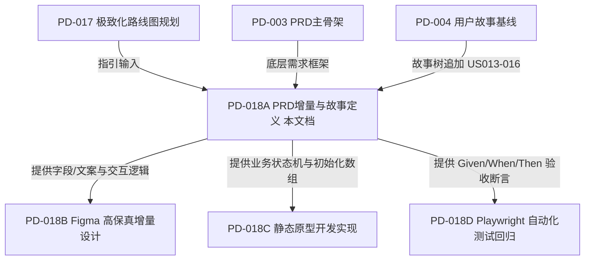

# 新手激活体验优化 PRD 增量与故事定义 (PD-018A)

> **版本性质：增量需求（假设版 / 待验证版）**  
> **更新日期**：2026-06-29  
> **状态说明**：已完成需求定义，等待进入 PD-018B (Figma) 与 PD-018C (前端开发)  

---

## 1. 文档定位

1. **需求互补**：本文档为产品需求文档（PRD）增量，专注于提升新手的 Onboarding（新手引导与激活）体验。本增量并不替代或改写原有需求架构 [`功能优化PRD骨架-PD-003.md`](功能优化PRD骨架-PD-003.md) 及 [`用户故事与验收标准-PD-004.md`](用户故事与验收标准-PD-004.md)，而是在其基础上进行“新手激活体验”的纵向极致化补强。
2. **验证状态**：当前定义的交互逻辑与微文案依然属于**产品经理基于桌面研究所提出的设计假设**，尚未在真实物理设备或招募的真人用户上进行过量化测试。
3. **流程输入**：本文档所输出的“示例卡具体文案”、“Checklist 互动判定逻辑”及“10 个核心术语帮助文案”，将作为下一步 Figma 设计阶段（`PD-018B`）、静态原型开发阶段（`PD-018C`）与 Playwright 回归测试阶段（`PD-018D`）的唯一输入源。

---

## 2. 目标与成功指标

- **核心目标**：降低新手用户由于面对空白看板或看板学术黑话所产生的认知阻碍与挫败感，通过激活任务驱使用户实现快速破冰。
- **北极星指标 (North Star Metric)**：首次可用看板激活率（设计口径 / 待真实埋点验证）。
- **当前核心 OMTM (One Metric That Matters)**：创建看板后 3 分钟内完成至少 1 个真实动作（拖拽/修改卡片/添加卡片）的比例（设计口径 / 待真实埋点验证）。
- **辅助支撑指标 (Supporting Metrics)**（设计口径 / 待真实埋点验证）：
  - 示例卡单卡双击打开率。
  - 示例卡内容修改保存率（反映模板转化为个人任务的比例）。
  - 新手热身 Checklist 的完整通关率。
  - 字段帮助图标（问号）的 Hover / Touch 触发率。
  - 看板列卡片的首次拖拽率。

---

## 3. 本轮范围与非范围

### 3.1 包含在内 (In Scope)
- **EX-04 示例卡质量升级**：为已存在的 4 大预设模板编写高品质的示例任务卡文案。
- **EX-03 首次成功 Checklist**：设计桌面端与移动端的 Onboarding 热身清单挑战器。
- **EX-06 字段微文案与填写帮助**：归类 10 个核心术语的悬浮白话释义。
- **EX-11 埋点事件定义草案**：规范激活漏斗的核心监测事件。

### 3.2 排除在外 (Out of Scope)
- **设计与代码输出**：不在此任务中更新 Figma 原型设计，不改动静态原型代码。
- **服务端与 AI 支撑**：不调用任何大语言模型（LLM）API，智能拆解仅限在后续开发中使用本地关键词匹配的 Mock 逻辑；不接入后端服务器。
- **膨胀性功能**：不增加任何新场景模板、模板市场商店、插件平台扩展以及多账号鉴权系统。

---

## 4. EX-04 示例卡质量升级具体文案

为了实现“在做中教”的设计原则，我们将既有 4 大模板的预设占位卡片升级为具体的、富有实战参考价值的高质量示例卡：

### 4.1 个人学习项目
- **列结构**：`待学`、`学习中`、`已学完`
- **示例卡产物**：

#### 卡片 1：【学习示范】制定个人月度学习计划
- **所属列**：待学
- **预估耗时**：2 小时
- **标签**：计划, 目标定义
- **简短描述**：根据当前最急迫的提升目标，明确本月要啃完的书或看完的视频课，拒绝无目标地漫游式看资料。
- **完成标准**：在卡片备注中列出至少 2 本参考书目名称或视频课程的完整大纲链接。
- **避坑提醒**：易错：不要制定太大的计划（如“学完C++”）。本月只聚焦 1 个具体的技术专题（如“掌握 Flexbox 布局”）。
- **可修改建议**：【改成你的任务】：双击此卡片标题，将它修改为你本月真实的某项学习目标（如“【学习】完成 React 基础视频”），并在描述中替换为你的真实书单。

#### 卡片 2：【学习示范】整理第一章的知识点脑图
- **所属列**：学习中
- **预估耗时**：3 小时
- **标签**：脑图, 难点攻关
- **简短描述**：阅读第一章节的核心理论，并亲自动手使用思维导图工具画出知识框架，记录感到困惑的 3 个技术点。
- **完成标准**：输出第一章思维导图图片或保存文件，并写出 3 个不懂的点及网上搜寻的解答。
- **避坑提醒**：避坑：光看书不画图非常容易产生“我以为我懂了”的幻觉，务必通过画脑图强迫自己梳理逻辑。
- **可修改建议**：【改成你的任务】：双击标题修改为你的具体章节名字，在描述中记录你自己的技术难点。

#### 卡片 3：【学习示范】编写第一章课后实战小练习
- **所属列**：已学完
- **预估耗时**：4 小时
- **标签**：实战练习, 编程
- **简短描述**：独立在本地编辑器中运行编写第一章结尾留下的实战练习题目代码，保证本地能编译运行无报错。
- **完成标准**：代码无 Runtime 报错，且核心交互逻辑与答案预期的渲染一致。
- **避坑提醒**：易错：不要一报错就去看参考答案。尝试自己阅读 Debug 日志，实在卡壳 30 分钟以上再对比代码。
- **可修改建议**：【改成你的任务】：将标题改为你正在写的具体练习题目名。

---

### 4.2 求职准备项目
- **列结构**：`需求调研`、`方案设计`、`原型制作`、`复盘迭代`
- **示例卡产物**：

#### 卡片 1：【求职示范】收集 5 家目标岗位的 JD 要求
- **所属列**：需求调研
- **预估耗时**：3 小时
- **标签**：JD分析, 市场调研
- **简短描述**：去招聘网站收集 5 个与你定位相符的目标岗位要求（JD），整理出核心重叠的高频技术栈和软实力要求。
- **完成标准**：梳理出高频技术名词（如 React / Webpack），并在简历中评估是否已包含。
- **避坑提醒**：易错：不要用一份简历海投所有公司。必须针对目标 JD 的关键词进行简历的微调。
- **可修改建议**：【改成你的任务】：双击标题改为“【求职】分析 [期望岗位] 的岗位 JD 规范”，并在描述中列出你筛选的 5 个岗位要求。

#### 卡片 2：【求职示范】按照 STAR 原则重构简历中的项目描述
- **所属列**：方案设计
- **预估耗时**：4 小时
- **标签**：简历重构, STAR原则
- **简短描述**：将简历上的“负责了后台开发”等流水账式描述，重构为 STAR 结构（情境、任务、行动、结果），突出个人在其中解决的难题。
- **完成标准**：描述中包含具体的“量化数字”（如：加载速度提升 40%、排查了 20+ 历史遗留 Bug）。
- **避坑提醒**：避坑：千万不要光写“参与了某某系统的开发”，面试官想看的是“你如何通过特定技术，解决了什么困难，取得了什么可量化的收益”。
- **可修改建议**：【改成你的任务】：双击标题，将它改为你正在优化的特定项目简历段落。

#### 卡片 3：【求职示范】搭建在线个人静态作品集网站
- **所属列**：原型制作
- **预估耗时**：8 小时
- **标签**：作品集, 原型开发
- **简短描述**：用纯 HTML/CSS 快速拼装一个个人作品展示页，列出你的核心得意项目，附带在线演示链接与简历下载按钮。
- **完成标准**：网站页面能本地双击正常渲染且自适应手机视口，无死链接。
- **避坑提醒**：易错：作品集最关键的是信息排版清晰度，不要花费过多时间在复杂的炫酷 3D 动效上，导致反客为主。
- **可修改建议**：【改成你的任务】：将标题改为你作品集的具体存放位置（如“【作品集】部署到 GitHub Pages”）。

#### 卡片 4：【求职示范】对着镜子进行自我介绍录音练习
- **所属列**：复盘迭代
- **预估耗时**：2 小时
- **标签**：模拟面试, 复盘反思
- **简短描述**：录下 3 分钟的口头自我介绍，反复播放，检查是否有语气词过多、逻辑混乱或描述不连贯的卡顿点。
- **完成标准**：确保录音中自我介绍重点突出，无大段卡壳，废话字数占比小于 10%。
- **避坑提醒**：避坑：自我介绍不要重复念简历，而是要用 3 句话总结：“我是谁”、“我最擅长什么核心技术”、“我能为你的公司带来什么独特价值”。
- **可修改建议**：【改成你的任务】：将标题改为“【面试准备】录制 [某公司名] 自我介绍”。

---

### 4.3 小团队迭代
- **列结构**：`待办`、`进行中`、`待评审`、`已完成`
- **示例卡产物**：

#### 卡片 1：【迭代示范】Sprint 01 开发排期与工时测算
- **所属列**：待办
- **预估耗时**：2 小时
- **标签**：迭代规划, 会议沟通
- **简短描述**：召集开发与测试，对本次迭代的需求卡片进行排期估算，并确定本次 Sprint 的最终冻结上线日期。
- **完成标准**：所有的看板卡片均已填入了具体的“预估工时”，并指派了明确的负责人。
- **避坑提醒**：避坑：估工时要克制乐观主义，请务必预留出至少 20% 的时间缓冲区以应对后期冒出来的回归缺陷。
- **可修改建议**：【改成你的任务】：修改标题为“【迭代】规划 [项目名字] 开发排期”。

#### 卡片 2：【迭代示范】开发登录页面表单的前端实时校验
- **所属列**：进行中
- **预估耗时**：4 小时
- **标签**：功能开发, JS前端
- **简短描述**：实现用户输入邮箱、手机号时的前端实时格式校验与非空检查，校验未通过前禁用“登录”提交按钮。
- **完成标准**：输入非法邮箱时输入框边框变红并提示红字，控制台无报错。
- **避坑提醒**：避坑：不要随意创造非标样式，应当直接复用设计系统里的 Input 组件标准状态，保持视觉统一。
- **可修改建议**：【改成你的任务】：修改标题为你要写的具体前端模块。

#### 卡片 3：【迭代示范】产品经理与设计师视觉还原度验收
- **所属列**：待评审
- **预估耗时**：1.5 小时
- **标签**：设计验收, 视觉QA
- **简短描述**：对照 Figma 像素设计原图检查已经实现的前端页面，微调间距与字体细节，找出并修复布局跑偏。
- **完成标准**：页面视觉还原度高度契合设计稿，且在 390px 视口下回归，无任何卡片重叠。
- **避坑提醒**：易错：还原度验收不要只在你的大显示器上点点，请必须开启浏览器开发者工具，检查移动端下的真实折行状态。
- **可修改建议**：【改成你的任务】：将标题修改为你要进行还原度验收的具体组件名。

---

### 4.4 Bug 跟踪
- **列结构**：`待确认`、`修复中`、`待验证`、`已关闭`
- **示例卡产物**：

#### 卡片 1：【Bug示范】用户点击登录按钮控制台抛出未捕获异常
- **所属列**：待确认
- **预估耗时**：1 小时
- **标签**：Bug复现, 登录问题
- **简短描述**：有用户上报在 Chrome 102 浏览器下输入正确账号密码点击登录无反应。需要去本地复现此情况并抓取日志。
- **完成标准**：定位出具体的异常触发链路（如变量名拼写错误），写出稳定的复现步骤。
- **避坑提醒**：易错：在没有找到稳定复现路径前，不要急于去修改源码，防止把偶发性 Bug 掩盖成更难解的悬案。
- **可修改建议**：【改成你的任务】：将标题改为你收到的真实用户缺陷反馈（如“【Bug】修改头像报错”）。

#### 卡片 2：【Bug示范】修正 app.js 中的空指针调用缺陷
- **所属列**：修复中
- **预估耗时**：2 小时
- **标签**：代码修复, 异常处理
- **简短描述**：修复由于未登录状态下访问 `user.profile` 导致的空指针崩溃。需要在访问变量前加入防御性的 Null 校验。
- **完成标准**：修复代码合入主分支，本地在未登录状态下点击相同位置，页面不再白屏且控制台无报错。
- **避坑提醒**：避坑：全局修改变量名或重构公共方法时，务必全局搜索引用，防止引发其他地方的回归缺陷。
- **可修改建议**：【改成你的任务】：双击标题改为你当前要改写的具体修复代码段。

#### 卡片 3：【Bug示范】在 390px 下回归测试登录流状态
- **所属列**：待验证
- **预估耗时**：1 小时
- **标签**：回归测试, 验收通过
- **简短描述**：对已解决的登录 Bug 在移动端模拟视口下进行多路回归测验，确保修复了空指针后没有引发移动端样式溢出。
- **完成标准**：多次测试下登录表单输入与弹窗流转正常，且 390px 下看板自适应排版无横向滚动条。
- **避坑提醒**：易错：回归时不能光测“成功”的用例，还要故意输入错误密码等“异常流”，检查错误校验依然有效。
- **可修改建议**：【改成你的任务】：将标题改为你将要进行回归测试验证的功能模块名。

---

## 5. EX-03 创建后的首次成功 Checklist 规则

### 5.1 展示时机
1. **触发源**：当且仅当用户通过创建弹窗，选择“使用场景模板”（即非空白创建路径）成功建立项目并初次加载进入看板工作区时，右下角 Checklist 卡片方以淡入动效出现。
2. **空白路径避让**：若用户选择的是“空白看板模板”，为了保留老用户效率（DP04），Checklist 绝不默认加载或弹出。
3. **独立性与持久化**：
   - 浮窗状态与当前活跃项目的 `projectId` 绑定，存储在 `localStorage.checklistState_[projectId]` 中。
   - 用户主动完成全部任务，或手动点击浮窗右上角“X”关闭后，状态置为 `completed` 或 `dismissed`，此项目内不再弹出。

### 5.2 Checklist 清单内容

- **任务 1：修改一张示例卡**
  - *用户界面文案*：`双击修改任意一张示例卡片`
  - *引导目标*：鼓励用户修改数据，消除面对精美预设数据的畏惧感，将工具转化为个人私有。
  - *判定条件*：系统捕获到针对预设示例卡片（匹配 `【学习示范】` 或 `【Bug示范】` 等前缀标题卡）的编辑表单提交并成功修改标题的事件。
  - *反馈文案*：`✨ 极好！这就是你自己的真实任务了！`

- **任务 2：拖动卡片到下一列**
  - *用户界面文案*：`拖拽任意任务卡片到右侧列`
  - *引导目标*：帮助用户体验 Kanban 核心的拉动式流转（Pull System）和任务状态变化。
  - *判定条件*：捕获到看板中任意卡片的 drag & drop 成功落入新列的 `change-column` 状态变更。
  - *反馈文案*：`🎉 动作利落！任务开始流转起来了！`

- **任务 3：新建一个自定义卡片**
  - *用户界面文案*：`在首列点击“+”新增你今天要做的事`
  - *引导目标*：破冰冷启动，写下第一个完全属于用户自己的卡片。
  - *判定条件*：检测到用户向看板中成功增加了一张卡片，且标题不包含默认的“示范”或“占位”文字。
  - *反馈文案*：`🚀 太棒了！你的第一个真实卡片已就位！`

### 5.3 交互规则
- **初始态**：默认呈展开的完整卡片面板形态挂在右下角，附带明显的引导渐变底色，并在折叠头部显示当前进度进度条（如 `新手破冰任务 (0/3)`）。
- **折叠与展开**：用户可点击浮窗标题旁的折叠箭头。折叠时浮窗缩回只露出一行标题栏与当前的百分比进度条，点击重新滑出展开。
- **达成态**：当 3 项任务全部打上绿勾（100% 进度），浮窗区域展示 1.5 秒的简易彩带效果，提示“新手热身通关！加油开启你的看板之旅！”，之后浮窗折叠并提供“永久隐藏”按钮。
- **移动端 (390px) 遮挡适配**：
  - 在移动端下，该浮窗默认仅呈现为一个右下角悬浮的圆形问号或百分比气泡（WIP Onboarding Indicator），避免遮挡窄屏中的卡片文字。
  - 轻触此气泡向上滑动或点击展开半高 overlay 显示任务清单，点击遮罩或向下滑动即可重新收回，保障不打扰移动端操作。
- **重置机制**：当用户在设置中点击“重置看板演示数据”时，`checklistState` 将从 `localStorage` 中被清除，重新创建模板项目时可以再次唤醒热身 Checklist 演示。

### 5.4 失败与边界状态
1. **示例卡缺失边界**：如果用户进入页面后，未做任何修改就直接删除了全部预设卡片，导致“修改一张示例卡”无法执行。此时 Checklist 需检测当前项目卡片数组，若示例卡片为 0，该任务自动自适应变更为 `在看板任意列双击创建一张新卡片`，防止流程锁死。
2. **拖动受限边界**：若用户拖动卡片时因为触发了 WIP 限制而导致拖动失败卡片弹回，Checklist 的拖拽任务不予判定完成，需成功落入新列才算达成。
3. **刷新状态持久化**：用户每完成一项，浏览器通过 JS 修改 `localStorage` 对应的 JSON 状态，即使用户在进行到一半时刷新网页，Checklist 的勾选进度依然能正确读取并恢复，无需重来。

---

## 6. EX-06 字段微文案与填写帮助

为切实减轻新手的专业概念认知抗拒，我们梳理出以下 10 个高频看板术语，并为其配备通俗的大白话悬浮气泡解释（Tooltip）：

| 编号 | 看板字段 / 术语 | 出现场景（表单项/列头） | 潜在的认知卡点 | 白话悬浮提示文案 (Tooltip) | 桌面端交互 | 移动端交互 | 需进入 PD-018B 状态图 |
| :--- | :--- | :--- | :--- | :--- | :--- | :--- | :---: |
| **01** | **泳道 (Swimlane)** | 新建/编辑卡片，或泳道设置 | 不懂什么是泳道，不知道有什么用。 | “用于横向划分任务的分类通道（如‘个人’与‘团队’），像泳池的泳道一样，让不同类别的任务互不干扰。” | Hover 显示，移开消失 | 轻触图标显示，再次轻触任意处关闭 | **是** |
| **02** | **WIP 限制 (WIP Limit)** | 列设置，或看板列头部 | 缩写缩写 WIP 含义不明，限制数量令人困惑。 | “本阶段允许同时处理的最大卡片数。限制它是为了强迫自己专注推进，防止贪多嚼不烂导致什么都没做完。” | Hover 显示，移开消失 | 轻触图标显示，再次轻触任意处关闭 | **是** |
| **03** | **负责人 (Assignee)** | 新建/编辑卡片 | 如果是个人看板，是否需要选自己？ | “具体去执行和跟进该任务的成员。个人项目可默认指派给自己，建议一件事只有一个明确负责人，防止责任不清。” | Hover 显示，移开消失 | 轻触图标显示，再次轻触任意处关闭 | 否 |
| **04** | **优先级 (Priority)** | 新建/编辑卡片 | 0, 1, 2 等数字不知道哪个最急。 | “决定卡片处理的紧急先后顺序。当多件事堆在手头时，优先去处理高优先级的任务。” | Hover 显示，移开消失 | 轻触图标显示，再次轻触任意处关闭 | 否 |
| **05** | **截止日期 (Due Date)** | 新建/编辑卡片 | 逾期了看板会怎样？ | “期望该任务做完的最晚期限。过期未完成的卡片在看板上会有醒目的延误警示。” | Hover 显示，移开消失 | 轻触图标显示，再次轻触任意处关闭 | **是** |
| **06** | **分类 (Category)** | 新建/编辑卡片 | 容易和标签弄混。 | “纵向的核心专业分类（一张卡只能选一个分类），如‘前端开发’或‘界面设计’，用于卡片的主要职能分组。” | Hover 显示，移开消失 | 轻触图标显示，再次轻触任意处关闭 | 否 |
| **07** | **标签 (Tags)** | 新建/编辑卡片，或主页筛选 | 容易和分类弄混。 | “跨层级的扁平标记，一张卡可以贴多个标签（如‘急件’、‘Sprint1’），用于看板卡片极其灵活的组合过滤。” | Hover 显示，移开消失 | 轻触图标显示，再次轻触任意处关闭 | 否 |
| **08** | **预估工时 (Estimated)** | 新建/编辑卡片 | 单位是什么？要估多细？ | “完成该任务预计需要的工时（小时）。建议将任务控制在 2-8 小时之间，太大的任务请拆细后再放入。” | Hover 显示，移开消失 | 轻触图标显示，再次轻触任意处关闭 | 否 |
| **09** | **实际工时 (Spent)** | 编辑卡片 / 任务详情页 | 什么时候填？ | “实际在任务上已经花掉的小时数。在任务挪入‘已完成’时填入，可以用来跟原预估工时做对比复盘。” | Hover 显示，移开消失 | 轻触图标显示，再次轻触任意处关闭 | 否 |
| **10** | **阻塞 / 风险 (Blocker)** | 任务卡片状态 / 标识 | 怎么标记为受阻？ | “表示该任务由于外部原因（如等别人给设计图）暂时卡死无法推进。标记后卡片将变红，警示有延误风险。” | Hover 显示，移开消失 | 轻触图标显示，再次轻触任意处关闭 | **是** |

---

## 7. 增量用户故事定义

为了指引下一步 Figma 高保真和前端交互的精确验收，以下在原有故事库后增补 4 个全新用户故事：

### 7.1 US013：新手查看高质量示例卡并理解任务颗粒度
- **作为**：初次使用看板管理个人项目的学生或新手用户
- **我想要**：在通过模板新建的看板上，看到附带合理工时预估、明确完成边界与避坑提醒的示例卡片
- **以便**：我能通过活教材掌握合理的卡片拆解粒度，并迅速上手将它们改写为我自己的实际任务
- **前置条件**：用户选择“个人学习项目”等模板完成项目创建，看板加载初始化卡片。
- **主流程**：
  1. 用户在看板上双击一个名为“【学习示范】整理第一章的知识点脑图”的卡片。
  2. 系统弹窗展示任务详情，用户能一眼读到清晰的“简短描述”、“预估耗时：3小时”、“完成标准：输出第一章思维导图图片”以及“避坑提醒”。
  3. 用户点击卡片下方的修改建议说明，理解如何把示例卡改成自己的。
  4. 用户直接改写标题为“【学习】完成 React 生命周期脑图”，点击保存。
  5. 看板上的卡片名字同步更新，没有多余的前后端重同步报错。
- **异常/边界情况**：用户在编辑示例卡时清空了标题并点击保存，系统应该触发非空提示“任务标题不能为空”，不予保存，防止示例卡退化为无意义卡片。
- **验收标准 (Given/When/Then)**：
  - *Given*：用户成功从模板初始化了“Bug 跟踪”项目。
  - *When*：用户双击打开默认卡片，将其标题由“【Bug示范】修复由于变量未定义导致的未捕获异常”改写为“【修复】修正 user.js 中的越界”并保存。
  - *Then*：弹窗关闭，看板对应的卡片标题立即渲染为新名字，无样式重叠或溢出。
- **待验证点**：示例卡中的专业提醒（如 STAR 原则）是否对于零管理基础的纯新手依然能读懂，需要后续通过专家走查和用户走查进行验证。

### 7.2 US014：新手完成首次成功 Checklist 破冰
- **作为**：刚建好模板项目的看板小白
- **我想要**：在右下角看到一个伴有进度指示、可折叠的“新手热身挑战”Checklist 浮窗
- **以便**：我能在清单三个任务的指引下，快速完成首次卡片操作，看到反馈，克服操作心理敬畏
- **前置条件**：用户初次载入含有模板数据的项目，且 `localStorage` 中无此项目的关闭或完成标记。
- **主流程**：
  1. 页面渲染完毕，右下角平滑滑出一个 Checklist 面板，进度显示为 `0%`（0/3），3 个挑战选项灰色未勾选。
  2. 用户根据挑战一的指引，修改了首张卡片名称，Checklist 中的“双击修改任意一张示例卡片”自动亮起绿色对勾，进度更新为 `33%`。
  3. 用户尝试拖拽第二张卡片到右侧列，当卡片落下的瞬间，挑战二“拖拽任意任务卡片到右侧列”亮起对勾，进度更新为 `66%`，弹出微型反馈提示。
  4. 用户点击添加任务，填入标题创建，挑战三“在首列点击‘+’新增你今天要做的事”被点亮，进度达成 `100%`。
  5. 浮窗区域触发 1.5 秒简易彩色洒花动画，提示已全部达成并提供“永久隐藏”按钮。
- **异常/边界情况**：
  - 边界：用户在尚未完成任何挑战时，点击了浮窗顶部的“X”按钮。系统隐藏浮窗并在 localStorage 记录 `dismissed` 状态，此后在此项目中绝不再次出现，不打扰熟练用户。
  - 极端：用户进来直接手动把所有卡片删光了。Checklist 自动将挑战一文本更替为“在看板任意列双击新建一张新卡片”进行保底兼容。
- **验收标准 (Given/When/Then)**：
  - *Given*：新加载的“个人学习项目”看板主页，右下角新手 Checklist 正确渲染并展开。
  - *When*：用户首次将任意一张卡片拖入右侧列。
  - *Then*：Checklist 上的对应拖拽项复选框自动点亮绿勾，进度数值由 `0%`（或当前进度）累加提升，且伴有短暂的滑出反馈提示。
- **待验证点**：Checklist 的全部判定和勾选反馈是否能在纯前端的 localstorage 状态机中被 100% 记录和跨会话保持。

### 7.3 US015：新手通过字段微文案轻松理解看板术语
- **作为**：在看板填写表单、配置列或限制时面临专业术语的看板新手
- **我想要**：在复杂的专有词汇 Label 旁边看到一个醒目的灰色小问号图标，并且在 Hover/轻触时看到通俗的大白话解释
- **以便**：我不必离开当前页面翻阅冗长的看板理论教程，就能立刻理解字段用途并完成创建配置
- **前置条件**：用户打开包含专业术语的表单弹窗（如卡片新建页、列 WIP 配置页等）。
- **主流程**：
  1. 页面表单渲染出字段 Label，Label 右侧带有一个淡灰色的“?”帮助图标。
  2. 用户将鼠标指针 Hover 在“WIP限制”旁边的帮助图标上。
  3. 页面无延迟地在图标上/下方弹出一个半透明的轻量气泡浮框，内容为大白话文案：“本阶段允许同时处理的最大卡片数...”。
  4. 用户移开鼠标，气泡浮框迅速退场淡出。
- **异常/边界情况**：气泡浮窗在靠近浏览器窗口边界时可能因为空间不够被裁切。系统需实现智能防溢出，自动将展示朝向调整为左侧或下方，确保文案 100% 可读。
- **验收标准 (Given/When/Then)**：
  - *Given*：列配置弹窗已渲染，显示“WIP Limit”字段。
  - *When*：用户将鼠标移动至该字段 Label 右侧的灰色“?”问号上。
  - *Then*：在问号旁瞬间弹出包含大白话释义的半透明气泡，移开鼠标后 0.1 秒内气泡消失，无 DOM 残留。
- **待验证点**：移动端触控时，如何精确判断点击行为是打开还是关闭气泡（防误触）。

### 7.4 US016：新手在 390px 移动端窄屏流畅使用激活特性
- **作为**：使用手机浏览器体验优化版看板的新手用户
- **我想要**：在 390px 窄视口下，Checklist 与微文案提示拥有专门为触屏优化的展示与轻折叠遮挡避让机制
- **以便**：我不会因为屏幕窄而被巨大的新手引导弹窗挡住去路，能像在电脑上一样正常点选和操作卡片
- **前置条件**：系统检测到当前渲染视口宽度为 390px，或者检测到处于触摸屏手势环境。
- **主流程**：
  1. 看板加载，Checklist 没有以大面板遮挡屏幕，而是自动收缩为右下角一个圆圈状的百分比气泡（WIP Onboarding Indicator）。
  2. 用户轻触该气泡，Checklist 清单以半高底部滑出面板（Bottom Drawer）的方式展开，背景卡片轻微变暗，显示三个挑战。
  3. 用户轻触表单里的术语小问号，大白话释义气泡弹出。用户在空白处轻轻一划或轻触气泡外任意区域，气泡和抽屉立即关闭，不影响在输入框里继续打字。
- **异常/边界情况**：用户在打开字段释义气泡的同时，又去点击了其他字段输入框。系统应自动关闭当前已经弹出的任何释义气泡，将焦点让给输入框。
- **验收标准 (Given/When/Then)**：
  - *Given*：页面运行在 390px 移动端模拟视口，且大白话气泡释义已弹出。
  - *When*：用户点击页面背景或点击另一个问号图标。
  - *Then*：先前打开的释义气泡必须立刻关闭，同时新点击的气泡正常显示，屏幕上至多同时存在一个气泡。
- **待验证点**：触控问号时的误触率是否在接受范围内，问号的热区点击面积是否符合至少 `24x24` 物理像素的触控要求。

---

## 8. 埋点事件定义草案 (设计口径 / 待真实埋点验证)

为了在未来的商业阶段衡量激活方案的量化转化效果，我们草拟以下 12 个漏斗埋点事件定义。静态原型中目前只需用 `console.log` 模拟输出并同步写入 `localStorage` 累加计数：

| 事件名称 | 触发时机 | 收集的参数 | 用途 | 影响 OMTM | 本地原型模拟记录 |
| :--- | :--- | :--- | :--- | :---: | :--- |
| `activation_checklist_shown` | Checklist 浮窗初次成功在页面渲染。 | `projectId`, `templateName` | 统计有多少模板项目触发了热身清单。 | 否 | `console.log` 输出，累加计数写入 localStorage。 |
| `activation_checklist_expand` | 用户点击 Checklist 的折叠/展开操作。 | `projectId`, `targetState` (expand/fold) | 衡量用户对该破冰指引的兴趣度和打扰感。 | 否 | `console.log` 输出。 |
| `activation_checklist_item_complete` | 清单中的某项（任务 1/2/3）打上绿勾。 | `projectId`, `itemId` (1, 2, 3), `timeSpentSec` (创建到勾选秒数) | 统计哪项挑战对新手最容易，哪项最被卡住。 | **是** | `console.log` 并实时更新 localStorage 中的 checklist JSON 状态。 |
| `activation_checklist_all_complete` | 三个挑战全部点亮通关。 | `projectId`, `totalTimeSec` (创建到全通关秒数) | 衡量新手用户的“完全激活率（通关率）”。 | **是** | `console.log` 触发，在本地开启 Confetti 彩带效果。 |
| `activation_checklist_dismiss` | 用户点击“X”或“不再提示”永久关闭。 | `projectId`, `completedCount` (已完成几项：0/1/2) | 衡量用户在哪个阶段放弃了指引，监控流失。 | 否 | `console.log` 并在 localStorage 写入 permanent dismiss。 |
| `example_card_open` | 用户双击打开了预设的示例任务卡片。 | `projectId`, `cardId`, `templateName` | 测量新手对“活教材”示例卡文案的阅读意愿。 | 否 | `console.log` 输出。 |
| `example_card_edit_save` | 用户完成对示例卡标题的修改并成功保存。 | `projectId`, `cardId`, `originalTitle`, `newTitle` | 测量新手将公共模板卡转换为个人任务的比例。 | **是** | `console.log` 并触发 US014 中的挑战 1 成功逻辑。 |
| `example_card_delete` | 用户删除了某张预设的示例卡片。 | `projectId`, `cardId` | 衡量新手的清理习惯，监控空模版边界条件。 | **是** | `console.log` 输出，必要时触发 Checklist 的保底适配。 |
| `field_help_open` | 灰色问号帮助气泡被 Hover 或 Touch 唤起。 | `fieldName` (swimlane, wip, etc.), `triggerType` (hover/tap) | 监控哪些专业词汇对新手最难懂（问号点击最高）。 | 否 | `console.log` 输出。 |
| `field_help_close` | 释义气泡被移开或点击空白处关闭。 | `fieldName` | 监控气泡的阅读与展示时长。 | 否 | `console.log` 输出。 |
| `first_card_drag` | 看板中首次发生卡片列间拖拽落位事件。 | `projectId`, `cardId`, `fromCol`, `toCol` | 监控用户学习流转动作的执行情况。 | **是** | `console.log` 触发并完成 Checklist 挑战 2。 |
| `first_real_card_create` | 首次点击“+”或“新增卡片”并录入成功。 | `projectId`, `cardTitle` | 监控新手的第一个实质性目标录入。 | **是** | `console.log` 触发并完成 Checklist 挑战 3。 |

---

## 9. 与现有文档的补强与阶段流向关系

1. **与 PD-003 的补强关系**：[`功能优化PRD骨架-PD-003.md`](功能优化PRD骨架-PD-003.md) 规定了项目创建的结构和主路径。本增量文档在其基础上，为预设场景下的卡片新增了具体的字段描述文案，不影响原 PRD 的结构。
2. **与 PD-004 的补充关系**：本增量新增的故事（`US013` 到 `US016`）直接作为 [`用户故事与验收标准-PD-004.md`](用户故事与验收标准-PD-004.md) 后续迭代的故事子集，所有 WWA 格式与验收口径均与前序保持一致。
3. **后续流向划定**：
   - 本文档中定义的问号 Tooltip 布局以及右下角 Checklist 卡片的各种收纳、勾选效果图将交由 `PD-018B` 任务，在 Figma 原稿中绘制对应的交互设计关键帧。
   - 本文档定义的文案、`localStorage` 状态字以及 Checklist 事件处理器将交由 `PD-018C` 任务进行純前端 CSS/JS 实现。
   - 本文档中定义的 Given/When/Then 验收标准将交由 `PD-018D` 任务，编写为 Playwright 测试用例，确保在 V0.8.30 原型中验收通过。

---

## 10. 验收标准汇总

Codex 或人工验收时，必须对照以下标准检查本增量 PRD 文档：

1. **文案完整性**：4 个模板场景（个人学习项目、求职准备项目、小团队迭代、Bug 跟踪）的示例卡必须包含至少 3 张，且字段（描述、预估工时、完成标准、避坑提醒、标签、可修改建议）必须填写完整，无“任务1”等空泛字符。
2. **术语帮助覆盖**：字段释义必须覆盖“泳道、WIP 限制”在内的 10 个专业词汇，文案精简大白话，提供桌面 Hover 与移动端 Touch 触控判断。
3. **Checklist 状态机定义**：Checklist 的初始化展现、隐藏、收纳、移动端遮挡适配、数据清零重置等规则定义明确，有清晰的 Given / When / Then 行为流向。
4. **埋点定义草案**：12 个统计事件对应的触发点和本地记录口径阐述清晰。
5. **后续输入质量**：本需求文档包含足够精确的文案和状态逻辑，能完全作为后续 Figma 设计和前端纯代码开发的输入。
