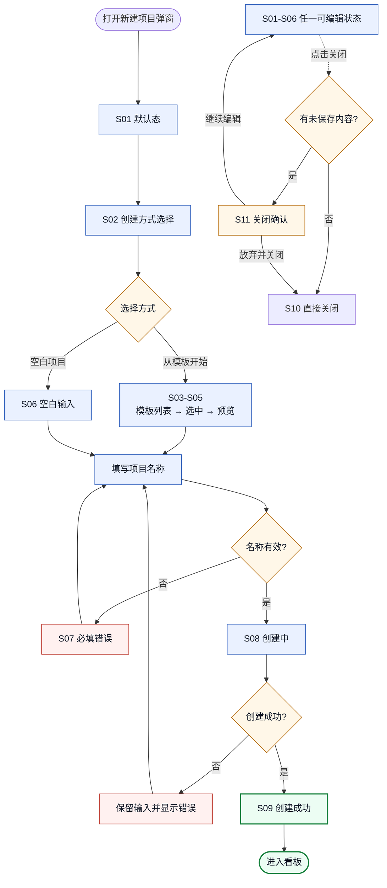
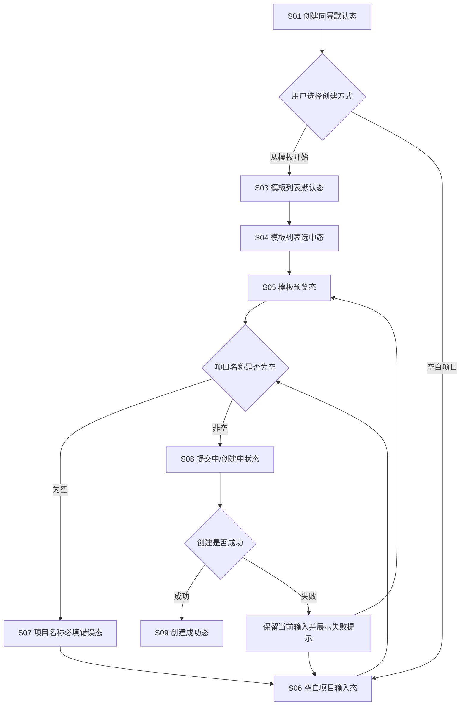
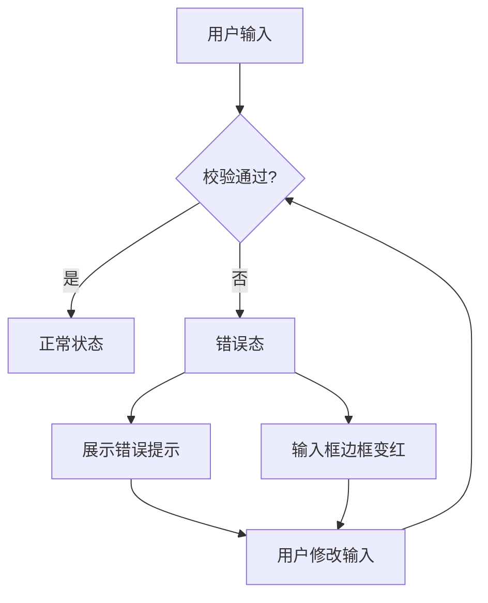
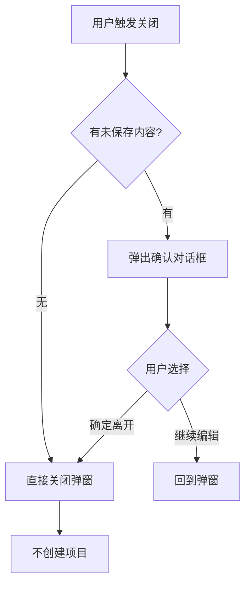
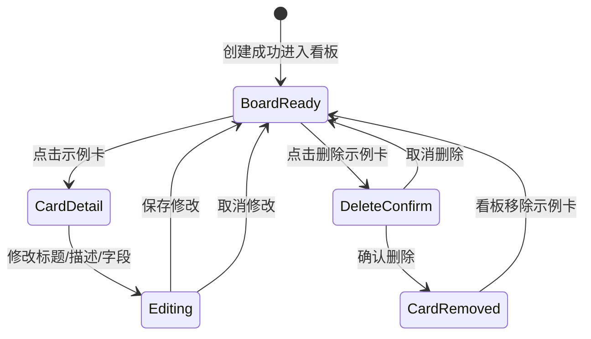

# 交互状态规格 PD-006

> **版本性质：假设版 / 待研究验证版**

| 项目 | 内容 |
|---|---|
| 日期 | 2026-06-15 |
| 状态 | 交互状态规格（假设版） |
| 聚焦范围 | 新手项目创建与任务拆解体验优化 |
| 上游依据 | [流程图与信息架构](流程图与信息架构-PD-005.md)、[正式 PRD](../02-requirements/PRD-Kanboard新手项目创建与任务拆解优化.md) |

> **声明**：原 PD-003/PD-004 需求已合并到正式 PRD。本文是正式 PRD 与 PD-005 的交互状态规格，不是基于真实用户研究的最终版本。标注 `[待验证]` 的内容需要在 PD-002 研究执行后更新。

## 1. 文档目的

1. 将正式 PRD 与 PD-005 中的状态描述整理为可评审、可设计、可测试的交互状态规格。
2. 明确每个状态的触发条件、界面表现、可用操作、不可用操作、状态转换、文案、校验规则、响应式规则和验收标准。
3. 为后续低保真线框、高保真设计和前端实现提供依据。

## 2. 状态范围与边界

### 范围

- 新建项目弹窗的完整交互状态
- 模板选择、预览、创建的状态转换
- 空白创建的状态
- 表单校验与错误状态
- 弹窗关闭与未保存内容处理
- 移动端响应式状态
- 示例卡编辑/删除状态

### 边界

- 不涉及 Kanboard 系统级功能（API、部署、插件等）
- 不涉及看板页的拖拽、排序等交互
- 不涉及任务管理、协作、分析等能力

## 3. 状态总览

| 编号 | 状态名称 | 触发条件 | 简要说明 |
|---|---|---|---|
| S01 | 创建向导弹窗默认态 | 用户点击新建项目 | 弹窗打开，展示创建方式选择 `[待验证：默认选中]` |
| S02 | 创建方式选择态 | 用户切换创建方式 | 切换空白/模板创建 |
| S03 | 模板列表默认态 | 选择从模板开始 | 展示 4 个模板卡片 |
| S04 | 模板列表选中态 | 用户点击模板卡片 | 卡片高亮，展示预览按钮 |
| S05 | 模板预览态 | 用户点击预览并创建 | 展示列结构和示例卡 |
| S06 | 空白项目输入态 | 选择空白项目 | 展示名称和描述输入 |
| S07 | 项目名称必填错误态 | 名称为空时提交 | 展示错误提示 |
| S08 | 提交中/创建中状态 | 用户点击创建 | 创建中，按钮禁用 |
| S09 | 创建成功态 | 创建成功 | 弹窗关闭，跳转看板 |
| S10 | 取消创建/关闭弹窗态 | 用户点击关闭 | 弹窗关闭，不创建 |
| S11 | 未保存内容关闭确认态 | 有内容时关闭 | 确认是否离开 |
| S12 | 移动端模板列表态 | 移动端查看模板 | 模板卡片单列 |
| S13 | 移动端模板预览滚动态 | 移动端查看预览 | 可纵向滚动 |
| S14 | 示例卡编辑态 | 点击示例卡 | 打开任务详情弹窗 |
| S15 | 示例卡删除确认态 | 点击删除示例卡 | 确认删除对话框 |

## 4. 创建向导状态机

## 5. 状态规格明细

### S01：创建向导弹窗默认态

| 项目 | 内容 |
|---|---|
| 状态编号 | S01 |
| 状态名称 | 创建向导弹窗默认态 |
| 来源依据 | PD-003 §9.1, PD-004 US001, PD-005 D01 |
| 触发条件 | 用户在项目列表页点击"新建项目"按钮 |
| 界面表现 | 弹出宽版创建向导弹窗，展示"空白项目"和"从模板开始"两种创建方式切换 `[待验证：默认选中]` |
| 主要操作 | 选择创建方式（空白/模板） |
| 次要操作 | 关闭弹窗（ESC 或点击遮罩） |
| 禁用/不可用操作 | 未选择创建方式时“创建项目”不可用；名称为空时按钮保持可提交，以便触发必填校验 |
| 状态退出条件 | 选择创建方式，或关闭弹窗 |
| 下一个可能状态 | S02（切换方式）、S03（选择模板）、S06（选择空白）、S10（关闭） |
| 文案与错误提示 | 弹窗标题："新建项目"；创建方式："空白项目"、"从模板开始" |
| 移动端规则 | 弹窗占满屏幕宽度，创建方式切换收为全宽按钮 |
| 验收标准 | Given 用户在项目列表页, When 点击新建项目, Then 弹出创建向导弹窗 |
| 待验证点 | 默认应该选中"从模板开始"还是"空白项目" `[待验证：PD-002]` |

### S02：创建方式选择态

| 项目 | 内容 |
|---|---|
| 状态编号 | S02 |
| 状态名称 | 创建方式选择态 |
| 来源依据 | PD-003 §9.1, PD-004 US001/US006 |
| 触发条件 | 用户在 S01 中切换创建方式 |
| 界面表现 | 高亮选中的创建方式，展示对应的内容区域 |
| 主要操作 | 选择空白项目或从模板开始 |
| 次要操作 | 关闭弹窗 |
| 禁用/不可用操作 | 无 |
| 状态退出条件 | 选择具体方式，或关闭弹窗 |
| 下一个可能状态 | S03（模板）、S06（空白）、S10（关闭） |
| 文案与错误提示 | 无 |
| 移动端规则 | 创建方式切换收为全宽按钮，上下排列 |
| 验收标准 | Given 创建向导弹窗已打开, When 切换创建方式, Then 高亮选中方式，展示对应内容 |
| 待验证点 | 无 |

### S03：模板列表默认态

| 项目 | 内容 |
|---|---|
| 状态编号 | S03 |
| 状态名称 | 模板列表默认态 |
| 来源依据 | PD-003 §9.2, PD-004 US001, PD-005 D04 |
| 触发条件 | 用户选择"从模板开始"，或从 S05 返回 |
| 界面表现 | 展示 4 个模板卡片：个人学习项目、求职准备项目、小团队迭代、Bug 跟踪 |
| 主要操作 | 点击模板卡片选中 |
| 次要操作 | 切换到空白项目、关闭弹窗 |
| 禁用/不可用操作 | 无 |
| 状态退出条件 | 点击模板卡片，或切换方式，或关闭弹窗 |
| 下一个可能状态 | S04（选中模板）、S02（切换方式）、S10（关闭） |
| 文案与错误提示 | 每个模板卡片：名称 + 场景描述 + 列结构预览 |
| 移动端规则 | 模板卡片收为单列，可纵向滚动 |
| 验收标准 | Given 选择从模板开始, When 展示模板列表, Then 显示 4 个模板卡片 |
| 待验证点 | 4 个模板是否覆盖核心场景 `[待验证：PD-002]` |

### S04：模板列表选中态

| 项目 | 内容 |
|---|---|
| 状态编号 | S04 |
| 状态名称 | 模板列表选中态 |
| 来源依据 | PD-003 §9.2, PD-004 US001, PD-005 D04 |
| 触发条件 | 用户在 S03 中点击模板卡片 |
| 界面表现 | 选中模板卡片高亮，底部展示"预览并创建"按钮 |
| 主要操作 | 点击"预览并创建"进入预览 |
| 次要操作 | 点击其他模板切换选择、切换到空白项目、关闭弹窗 |
| 禁用/不可用操作 | 无 |
| 状态退出条件 | 点击预览并创建，或切换选择，或关闭弹窗 |
| 下一个可能状态 | S05（预览）、S03（切换模板）、S02（切换方式）、S10（关闭） |
| 文案与错误提示 | 按钮文案："预览并创建" |
| 移动端规则 | 选中卡片高亮，按钮固定在底部 |
| 验收标准 | Given 模板列表已展示, When 点击模板卡片, Then 卡片高亮，展示预览按钮 |
| 待验证点 | 无 |

### S05：模板预览态

| 项目 | 内容 |
|---|---|
| 状态编号 | S05 |
| 状态名称 | 模板预览态 |
| 来源依据 | PD-003 §9.3, PD-004 US002, PD-005 D05 |
| 触发条件 | 用户在 S04 中点击"预览并创建" |
| 界面表现 | 展示模板的列名、列顺序和每列的示例任务卡 |
| 主要操作 | 输入项目名称、点击创建项目 |
| 次要操作 | 点击返回选择、切换到空白项目、关闭弹窗 |
| 禁用/不可用操作 | 名称为空时仍可提交；提交后进入 S07 并展示必填错误 |
| 状态退出条件 | 点击创建、返回选择、切换方式、关闭弹窗 |
| 下一个可能状态 | S08（提交）、S04（返回）、S06（切换空白）、S11（有内容关闭）、S10（无内容关闭） |
| 文案与错误提示 | 项目名称输入框占位符："请输入项目名称" |
| 移动端规则 | 预览区可纵向滚动，底部按钮固定 |
| 验收标准 | Given 已选择模板, When 进入预览, Then 展示列结构和示例卡 |
| 待验证点 | 预览内容是否足够帮助判断 `[待验证：PD-002]` |

### S06：空白项目输入态

| 项目 | 内容 |
|---|---|
| 状态编号 | S06 |
| 状态名称 | 空白项目输入态 |
| 来源依据 | PD-003 §9.6, PD-004 US006, PD-005 D03 |
| 触发条件 | 用户选择"空白项目" |
| 界面表现 | 展示项目名称和描述输入，不展示模板内容 |
| 主要操作 | 输入项目名称、点击创建项目 |
| 次要操作 | 切换到从模板开始、关闭弹窗 |
| 禁用/不可用操作 | 名称为空时仍可提交；提交后进入 S07 并展示必填错误 |
| 状态退出条件 | 点击创建、切换方式、关闭弹窗 |
| 下一个可能状态 | S08（提交）、S07（必填错误）、S02（切换方式）、S11（有内容关闭）、S10（无内容关闭） |
| 文案与错误提示 | 项目名称输入框占位符："请输入项目名称" |
| 移动端规则 | 输入区域占满屏幕宽度 |
| 验收标准 | Given 选择空白项目, When 展示输入, Then 显示名称和描述输入 |
| 待验证点 | 无 |

### S07：项目名称必填错误态

| 项目 | 内容 |
|---|---|
| 状态编号 | S07 |
| 状态名称 | 项目名称必填错误态 |
| 来源依据 | PD-003 §10.6, PD-004 US007, PD-005 D07 |
| 触发条件 | 用户在 S05 或 S06 中名称为空时点击创建 |
| 界面表现 | 输入框下方展示错误提示，输入框边框变红 |
| 主要操作 | 输入项目名称 |
| 次要操作 | 关闭弹窗 |
| 禁用/不可用操作 | 无；重复提交保持当前错误态，输入有效名称后可继续 |
| 状态退出条件 | 输入项目名称，或关闭弹窗 |
| 下一个可能状态 | S05/S06（输入后恢复）、S10（关闭） |
| 文案与错误提示 | 错误提示："请输入项目名称"；输入框边框颜色：红色 |
| 移动端规则 | 错误提示在输入框下方，无横向溢出 |
| 验收标准 | Given 名称为空提交, When 展示错误, Then 输入框下方提示"请输入项目名称" |
| 待验证点 | 无 |

### S08：提交中/创建中状态

| 项目 | 内容 |
|---|---|
| 状态编号 | S08 |
| 状态名称 | 提交中/创建中状态 |
| 来源依据 | PD-003 §9.7, PD-004 US003 |
| 触发条件 | 用户在 S05 或 S06 中输入名称并点击创建 |
| 界面表现 | "创建项目"按钮显示 loading 状态，按钮禁用 |
| 主要操作 | 无（等待创建完成） |
| 次要操作 | 无 |
| 禁用/不可用操作 | 所有操作禁用，弹窗不可关闭 |
| 状态退出条件 | 创建成功或失败 |
| 下一个可能状态 | S09（成功）、S06（失败） |
| 文案与错误提示 | 按钮文案："创建中..." |
| 移动端规则 | 按钮 loading 状态在移动端正常展示 |
| 验收标准 | Given 点击创建, When 创建中, Then 按钮显示 loading 且禁用 |
| 待验证点 | 无 |

### S09：创建成功态

| 项目 | 内容 |
|---|---|
| 状态编号 | S09 |
| 状态名称 | 创建成功态 |
| 来源依据 | PD-003 §9.7, PD-004 US003, PD-005 D06 |
| 触发条件 | S08 创建成功 |
| 界面表现 | 弹窗关闭，自动切换到新项目，看板展示模板列和示例卡 |
| 主要操作 | 查看看板 |
| 次要操作 | 无（弹窗已关闭） |
| 禁用/不可用操作 | 无 |
| 状态退出条件 | 弹窗关闭后，用户在看板页操作 |
| 下一个可能状态 | 看板页操作 |
| 文案与错误提示 | 无 |
| 移动端规则 | 弹窗关闭，看板正常展示 |
| 验收标准 | Given 创建成功, When 弹窗关闭, Then 自动切换到新项目 |
| 待验证点 | 无 |

### S10：取消创建/关闭弹窗态

| 项目 | 内容 |
|---|---|
| 状态编号 | S10 |
| 状态名称 | 取消创建/关闭弹窗态 |
| 来源依据 | PD-004 US006, PD-005 D08 |
| 触发条件 | 用户在 S01-S06 中点击关闭按钮或按 ESC |
| 界面表现 | 弹窗关闭，不创建任何项目 |
| 主要操作 | 无（弹窗已关闭） |
| 次要操作 | 无 |
| 禁用/不可用操作 | 无 |
| 状态退出条件 | 弹窗关闭后 |
| 下一个可能状态 | 回到原页面 |
| 文案与错误提示 | 无 |
| 移动端规则 | 弹窗关闭，回到原页面 |
| 验收标准 | Given 创建向导已打开, When 点击关闭, Then 弹窗关闭不创建 |
| 待验证点 | 无 |

### S11：未保存内容关闭确认态

| 项目 | 内容 |
|---|---|
| 状态编号 | S11 |
| 状态名称 | 未保存内容关闭确认态 |
| 来源依据 | PD-004 边界情况, PD-005 异常路径 |
| 触发条件 | 用户在 S05 或 S06 中有内容时点击关闭 |
| 界面表现 | 弹出确认对话框："确定离开吗？未保存的内容将丢失" |
| 主要操作 | 确认离开或继续编辑 |
| 次要操作 | 无 |
| 禁用/不可用操作 | 无 |
| 状态退出条件 | 用户确认离开或继续编辑 |
| 下一个可能状态 | S10（确认离开）、S05/S06（继续编辑） |
| 文案与错误提示 | 对话框文案："确定离开吗？未保存的内容将丢失"；按钮："确定离开"、"继续编辑" |
| 移动端规则 | 对话框居中展示，按钮全宽 |
| 验收标准 | Given 有内容时关闭, When 弹出确认, Then 展示"确定离开吗？" |
| 待验证点 | 无 |

### S12：移动端模板列表态

| 项目 | 内容 |
|---|---|
| 状态编号 | S12 |
| 状态名称 | 移动端模板列表态 |
| 来源依据 | PD-004 US008, PD-005 移动端异常 |
| 触发条件 | 移动端（390px）查看模板列表 |
| 界面表现 | 模板卡片收为单列，可纵向滚动 |
| 主要操作 | 点击模板卡片选中 |
| 次要操作 | 滚动查看更多模板 |
| 禁用/不可用操作 | 无 |
| 状态退出条件 | 点击模板卡片 |
| 下一个可能状态 | S04（选中模板） |
| 文案与错误提示 | 无 |
| 移动端规则 | 卡片单列，无横向溢出 |
| 验收标准 | Given 移动端查看模板, When 展示列表, Then 卡片单列无溢出 |
| 待验证点 | 无 |

### S13：移动端模板预览滚动态

| 项目 | 内容 |
|---|---|
| 状态编号 | S13 |
| 状态名称 | 移动端模板预览滚动态 |
| 来源依据 | PD-004 US008, PD-005 移动端异常 |
| 触发条件 | 移动端（390px）查看模板预览 |
| 界面表现 | 预览内容超出屏幕时可纵向滚动，底部按钮固定 |
| 主要操作 | 滚动查看预览内容 |
| 次要操作 | 点击创建项目 |
| 禁用/不可用操作 | 无 |
| 状态退出条件 | 点击创建或返回 |
| 下一个可能状态 | S08（提交）、S04（返回） |
| 文案与错误提示 | 无 |
| 移动端规则 | 预览区可滚动，按钮固定底部 |
| 验收标准 | Given 移动端预览, When 内容超长, Then 可滚动查看 |
| 待验证点 | 无 |

### S14：示例卡编辑态

| 项目 | 内容 |
|---|---|
| 状态编号 | S14 |
| 状态名称 | 示例卡编辑态 |
| 来源依据 | PD-004 US004, PD-005 B02 |
| 触发条件 | 用户在看板中点击示例任务卡 |
| 界面表现 | 打开任务详情弹窗，展示示例卡内容 |
| 主要操作 | 修改任务标题、描述、负责人、优先级、截止时间 |
| 次要操作 | 保存修改、取消修改 |
| 禁用/不可用操作 | 无 |
| 状态退出条件 | 保存或取消 |
| 下一个可能状态 | 看板页（保存后卡片更新） |
| 文案与错误提示 | 无 |
| 移动端规则 | 任务详情弹窗占满屏幕宽度 |
| 验收标准 | Given 看板中有示例卡, When 点击示例卡, Then 打开详情弹窗 |
| 待验证点 | 无 |

### S15：示例卡删除确认态

| 项目 | 内容 |
|---|---|
| 状态编号 | S15 |
| 状态名称 | 示例卡删除确认态 |
| 来源依据 | PD-004 US005, PD-005 B03 |
| 触发条件 | 用户在 S14 中点击删除按钮 |
| 界面表现 | 弹出确认删除对话框 |
| 主要操作 | 确认删除或取消 |
| 次要操作 | 无 |
| 禁用/不可用操作 | 无 |
| 状态退出条件 | 确认删除或取消 |
| 下一个可能状态 | 看板页（确认删除后卡片移除）、S14（取消） |
| 文案与错误提示 | 对话框文案："确定删除此任务吗？删除后不可恢复"；按钮："确定删除"、"取消" |
| 移动端规则 | 对话框居中，按钮全宽 |
| 验收标准 | Given 点击删除, When 弹出确认, Then 展示"确定删除吗？" |
| 待验证点 | 无 |

## 6. 表单校验与错误状态

### 校验规则

| 字段 | 校验规则 | 错误提示 | 触发时机 |
|---|---|---|---|
| 项目名称 | 必填，非空 | "请输入项目名称" | 提交时 |
| 项目名称 | 最大长度 255 字符 | "项目名称不能超过 255 个字符" | 输入时 |
| 项目描述 | 非必填 | 无 | - |

### 创建方式切换与提交校验状态转换

### 错误状态交互

## 7. 按钮与控件状态

### 按钮状态矩阵

| 按钮 | 默认态 | Hover | Active | Disabled | Loading |
|---|---|---|---|---|---|
| 新建项目 | 可用 | 背景色加深 | 背景色更深 | - | - |
| 预览并创建 | 可用 | 背景色加深 | 背景色更深 | 未选择模板时 | - |
| 创建项目 | 可用，提交时校验名称 | 背景色加深 | 背景色更深 | 未选择创建方式或正在提交时 | 创建中 |
| 返回选择 | 可用 | 背景色加深 | 背景色更深 | - | - |
| 关闭 | 可用 | 背景色加深 | 背景色更深 | - | - |
| 确认删除 | 可用 | 背景色加深 | 背景色更深 | - | - |
| 取消 | 可用 | 背景色加深 | 背景色更深 | - | - |

### 输入框状态

| 输入框 | 默认态 | Focus | Error | Disabled |
|---|---|---|---|---|
| 项目名称 | 灰色边框 | 蓝色边框 | 红色边框 | - |
| 项目描述 | 灰色边框 | 蓝色边框 | - | - |

### 模板卡片状态

| 卡片 | 默认态 | Hover | Selected |
|---|---|---|---|
| 模板卡片 | 白色背景 | 浅灰背景 | 蓝色边框 + 浅蓝背景 |

## 8. 弹窗关闭与未保存内容处理

### 关闭触发条件

| 触发方式 | 说明 |
|---|---|
| 点击关闭按钮（×） | 弹窗右上角关闭按钮 |
| 按 ESC 键 | 键盘快捷键 |
| 点击遮罩层 | 弹窗外部灰色遮罩 |

### 未保存内容判断

| 内容类型 | 判断条件 |
|---|---|
| 项目名称 | 输入框有内容 |
| 项目描述 | 输入框有内容 |
| 模板选择 | 已选择模板 |

### 关闭确认流程

## 9. 移动端与响应式状态

### 断点定义

| 断点 | 宽度范围 | 说明 |
|---|---|---|
| 移动端 | < 768px | 手机、小平板 |
| 平板 | 768px - 1024px | 平板设备 |
| 桌面端 | > 1024px | 电脑、大屏 |

### 移动端适配规则

| 元素 | 桌面端 | 移动端（390px） |
|---|---|---|
| 创建向导弹窗 | 居中弹窗，最大宽度 600px | 占满屏幕宽度 |
| 创建方式切换 | 水平排列 | 垂直排列，全宽按钮 |
| 模板卡片 | 2 列网格 | 单列，可滚动 |
| 模板预览 | 可滚动区域 | 全屏可滚动，按钮固定底部 |
| 确认对话框 | 居中弹窗 | 居中弹窗，按钮全宽 |

## 10. 示例卡编辑/删除状态

### 编辑流程

1. 用户在看板中点击示例卡
2. 打开任务详情弹窗
3. 用户修改字段
4. 用户点击保存或取消
5. 保存后示例卡更新为修改内容

### 删除流程

1. 用户在看板中点击示例卡删除按钮
2. 弹出确认删除对话框
3. 用户确认删除
4. 示例卡从看板中移除

### 示例卡编辑 / 删除状态图

### 示例卡与普通任务的区别

| 属性 | 示例卡 | 普通任务 |
|---|---|---|
| isExample | true | false |
| 可编辑 | 是 | 是 |
| 可删除 | 是（需确认） | 是（需确认） |
| 删除后恢复 | 不可恢复 | 不可恢复 |

## 11. 创建成功与进入看板状态

### 创建成功流程

1. S08 创建成功
2. 弹窗关闭（S09）
3. 项目列表新增项目
4. 自动切换到新项目
5. 看板展示模板列和示例卡（或空白列）

### 创建后状态

| 内容 | 模板创建 | 空白创建 |
|---|---|---|
| 看板列 | 模板定义的列 | 待办、进行中、已完成 |
| 任务卡 | 模板示例卡 | 无 |
| 泳道 | 模板定义的泳道 | 默认泳道 |

## 12. 状态覆盖矩阵

| 状态 | 桌面端 | 移动端 390px | 键盘操作 | 错误处理 | 关闭/取消 | 研究待验证 |
|---|---|---|---|---|---|---|
| S01 默认态 | ✅ | ✅ | ✅ ESC 关闭 | - | ✅ | ✅ 默认选中 |
| S02 方式选择 | ✅ | ✅ | ✅ Tab 切换 | - | ✅ | - |
| S03 模板列表 | ✅ | ✅ | ✅ 方向键选择 | - | ✅ | ✅ 模板覆盖 |
| S04 模板选中 | ✅ | ✅ | ✅ Enter 确认 | - | ✅ | - |
| S05 模板预览 | ✅ | ✅ | ✅ Tab 导航 | - | ✅ | ✅ 预览足够 |
| S06 空白输入 | ✅ | ✅ | ✅ Tab 导航 | ✅ 必填校验 | ✅ | - |
| S07 必填错误 | ✅ | ✅ | ✅ | ✅ | ✅ | - |
| S08 提交中 | ✅ | ✅ | - | ✅ 创建失败 | - | - |
| S09 创建成功 | ✅ | ✅ | - | - | - | - |
| S10 关闭弹窗 | ✅ | ✅ | ✅ ESC | - | - | - |
| S11 关闭确认 | ✅ | ✅ | ✅ Tab 切换 | - | ✅ | - |
| S12 移动端列表 | - | ✅ | - | - | ✅ | - |
| S13 移动端预览 | - | ✅ | - | - | ✅ | - |
| S14 示例卡编辑 | ✅ | ✅ | ✅ Tab 导航 | ✅ | ✅ | - |
| S15 删除确认 | ✅ | ✅ | ✅ Tab 切换 | - | ✅ | - |

## 13. 待研究验证的交互决策

| 编号 | 待验证内容 | 验证方式 | 依赖 |
|---|---|---|---|
| V01 | 创建向导弹窗默认选中"从模板开始"还是"空白项目" | PD-002 可用性测试 | PD-002 执行 |
| V02 | 是否需要创建后轻提示 | PD-002 可用性测试 | PD-002 执行 |
| V03 | 轻提示自动消失时长是否合理（假设 5 秒） | PD-002 可用性测试 | PD-002 执行 |
| V04 | 预览内容是否足够帮助用户判断模板 | PD-002 可用性测试 | PD-002 执行 |
| V05 | 老用户是否会被模板入口干扰 | PD-002 路径 C | PD-002 执行 |
| V06 | 移动端创建向导是否足够可用 | PD-002 移动端测试 | PD-002 执行 |

## 14. 后续进入 PD-007 / PD-008 的输入

### 从本规格可提取的设计输入

| 输入 | 来源 | 用途 |
|---|---|---|
| 15 个状态的完整规格 | S01-S15 | PD-007 设计系统、PD-008 高保真原型 |
| 按钮与控件状态矩阵 | §7 | PD-007 设计系统 |
| 输入框状态 | §7 | PD-007 设计系统 |
| 模板卡片状态 | §7 | PD-007 设计系统 |
| 错误提示文案 | §6 | PD-007 设计系统 |
| 移动端适配规则 | §9 | PD-008 高保真原型 |
| 状态覆盖矩阵 | §12 | PD-008 高保真原型验收 |

### 需要 PD-002 研究后补充的内容

| 内容 | 补充方式 |
|---|---|
| 验证后的状态转换 | 根据研究结论调整状态机 |
| 验证后的交互细节 | 根据研究结论调整状态规格 |
| 验证后的移动端适配 | 根据研究结论调整响应式规则 |

## 15. 已导出的设计图

> 2026-06-17 已由 Codex 重构创建向导总状态机，并按统一设计图规范重新导出 5 张 PNG 和 5 张 SVG。PNG 用于快速预览，SVG 用于放大查看和后续编辑。

| 编号 | 图名 | PNG | SVG |
|---|---|---|---|
| M01 | 创建向导总状态机 | `设计图/PD-006/pd-006-create-wizard-state-machine.png` | `设计图/PD-006/pd-006-create-wizard-state-machine.svg` |
| M02 | 创建方式切换与提交校验状态转换 | `设计图/PD-006/pd-006-create-mode-submit-validation.png` | `设计图/PD-006/pd-006-create-mode-submit-validation.svg` |
| M03 | 表单校验与错误状态交互 | `设计图/PD-006/pd-006-form-validation-error-flow.png` | `设计图/PD-006/pd-006-form-validation-error-flow.svg` |
| M04 | 弹窗关闭与未保存内容确认 | `设计图/PD-006/pd-006-unsaved-close-confirmation-flow.png` | `设计图/PD-006/pd-006-unsaved-close-confirmation-flow.svg` |
| M05 | 示例卡编辑 / 删除状态图 | `设计图/PD-006/pd-006-example-card-edit-delete-state.png` | `设计图/PD-006/pd-006-example-card-edit-delete-state.svg` |
