# 低保真线框与关键状态 PD-010

> **版本性质：假设版 / 待研究验证版 / impeccable shape 低保真输出**

| 项目 | 内容 |
|---|---|
| 日期 | 2026-06-22 |
| 状态 | 低保真线框（impeccable shape），未进入高保真 / Figma / 代码 |
| 聚焦范围 | 新建项目到创建成功看板首屏的核心流程 |
| Product Design 路由 | 总工作流 `product-design-workflow`；register `product`；impeccable 阶段 `shape`；fidelity 低保真 sketch |
| 上游依据 | PD-003~PD-009、`index.html`、`styles.css`、`app.js`、`设计图/PD-005~PD-009/` |

> **边界声明**：本文是把 PD-008 页面 Brief、PD-006 状态规格和 PD-009 组件规范转成可评审的低保真结构，不是高保真视觉稿、Figma 文件或代码实现。所有颜色仅用灰阶和极少语义色表达结构和状态，不做视觉定稿。标注 `[待验证]` 的内容必须在 PD-002 真实研究或可用性测试后更新。

## 1. 文档目的

1. 把 PD-008/009 的页面 Brief、组件层级和状态规范，转成可评审的桌面端与 390px 低保真线框。
2. 用结构、阅读顺序、滚动/固定区域、焦点顺序和主次操作说明，回答“新手能否清楚、安静、可预期地把模糊目标变成第一张可用看板”。
3. 把 V03~V06 四个待验证假设转成线框内可比较的备选方案，不提前定稿。
4. 为后续形成性测试、PD-011 高保真 / Figma 和 `impeccable craft` 提供确认后的结构输入。

## 2. Shape 设计简报

| 项 | 内容 |
|---|---|
| Feature Summary | 在现有新建项目弹窗内提供“空白项目 / 从模板开始”两种创建方式、4 个场景模板的列表与预览、项目名称/描述输入、创建中反馈和创建成功后的看板首屏，覆盖桌面端和 390px。 |
| Primary User Action | 第一次使用看板的用户选一个场景模板，预览列与示例任务，把示例任务理解成自己的任务，命名后生成第一张可用看板。 |
| Design Direction | Restrained 工作型界面：浅灰画布、白色面板、紧凑间距、灰阶结构 + 极少语义色；不使用渐变、玻璃效果、大阴影、重复卡片网格或营销装饰。 |
| Scope | 从 P001 新建项目入口到 P009 创建成功看板首屏的完整核心流程；P010/P011 示例卡编辑删除只作为看板首屏内的延伸，不展开完整任务详情。 |
| Out of Scope | 拖拽/排序、多视图、API/部署/插件/认证/数据库、系统级页面、高保真颜色/字体/阴影、Figma 文件、代码实现。 |
| Layout Strategy | 桌面端单弹窗内“头部 → 名称/描述 → 创建方式 → 模板列表+预览 → 底部操作”纵向分区；模板列表与预览左右并列、预览过长时预览区滚动而底部操作固定；390px 收为单列纵向，底部操作固定。 |
| Key States | default、selected、loading、error、success、confirmation 六类，必须同屏或成组可见。 |
| Interaction Model | 弹窗为模态；Tab/方向键/Enter/Space 键盘可达；ESC 与遮罩关闭；有未保存内容时进入 confirmation；提交中阻止重复提交并禁用关闭；错误保留输入并把焦点移到错误摘要。 |
| Content Requirements | 4 个真实模板（个人学习、求职准备、小团队迭代、Bug 跟踪）及其真实列结构、泳道、3~4 张示例任务；按钮、错误、确认和成功文案使用真实中文。 |
| Recommended References | 现有 Kanboard 静态原型的产品身份（克制工作工具）；Linear 的克制表单层级与状态反馈；Notion 模板预览的信息组织，但不得照搬卡片市场结构。 |
| Visual Direction Probe | 跳过。本任务为 sketch 级低保真规划，按 `impeccable shape` 不需要图像方向探针。 |

## 3. 上游输入与约束

| 上游 | 提取内容 | 对线框的约束 |
|---|---|---|
| PD-003 PRD 骨架 | 新建向导、模板、预览、空白创建、必填校验、创建反馈 | 线框必须表现创建方式、模板、预览、名称必填与创建中 |
| PD-004 用户故事 | US001~US008 验收条件与边界 | 覆盖首次选方式、选模板、空白创建、示例卡编辑删除、移动端 |
| PD-005 流程与 IA | 优化前后主路径、老用户快捷路径、6 条异常/边界路径 | W01 核心屏幕与状态地图必须与该流程一致 |
| PD-006 状态规格 | S01~S15、状态机、校验、控件状态、响应式状态 | W09 关键状态板必须覆盖 default/selected/loading/error/success/confirmation |
| PD-007 原则与非目标 | DP01~DP07、17 项非目标、取舍规则 | 保留熟练用户效率、可改可删、不做模板市场/系统级能力 |
| PD-008 页面 Brief | P001~P014、6 个核心页面 Brief、响应式与键盘要求 | 桌面 P002/P004/P005/P006/P009 + 390px P013 必画 |
| PD-009 设计系统 | token、组件、状态矩阵、6 页映射、视觉图规范 | 沿用现有间距/圆角/层级，不在低保真另起视觉风格 |
| `index.html` `#projectDialog` | 弹窗实际顺序：头部 → 名称 → 描述 → 创建方式 → 模板区 → 底部操作 | 线框以现有结构为事实基线，记录与 PD-008 顺序差异，作为 V05 待验证依据 |
| `app.js` `PROJECT_TEMPLATES` | 4 模板真实列、泳道、示例任务 | 模板预览与 P009 看板首屏使用真实内容，不用 Lorem Ipsum |

### 3.1 关键结构事实（来自现有代码，必须尊重）

1. **弹窗宽度**：`#projectDialog.modal.wide` 现为宽版弹窗（PD-009 记录约 840px），不是 PD-008 Brief 中提到的 600px。线框以现有宽版为基线。
2. **输入顺序**：现有代码中项目名称、描述输入在创建方式切换**之上**；PD-006 S05/S06 描述输入在预览/空白区**之内**。该顺序差异是真实存在的待验证点，归入 V05，线框以现有代码顺序绘制并标注。
3. **模板区结构**：`.template-area` 内为 `.template-list`（左）+ `.template-preview`（右）左右并列，模板卡片显示“名称 + 列数·泳道数·示例卡数”摘要。
4. **示例任务真实内容**：4 个模板已含完整列、泳道和示例任务（见 §6 模板清单），可直接作为线框占位。
5. **默认创建方式**：现有代码 `从模板开始` 默认 `checked`。是否保持默认归入 V05 `[待验证]`。
6. **移动端**：现有 `<=640px` 弹窗宽度为 `100vw - 32px`，两侧保留 16px；是否改全屏归入 V06 `[待验证]`。

## 4. 线框范围与屏幕清单

| 编号 | 屏幕 | 视口 | 覆盖状态 | Mermaid |
|---|---|---|---|---|
| P001 | 项目列表入口（新建项目按钮） | 桌面 + 390px | default | W01 |
| P002 | 新建项目弹窗默认态 | 桌面 | default | W02 |
| P004 | 模板列表与模板选中态 | 桌面 | default / selected | W03 |
| P005 | 模板预览态 | 桌面 | default（含名称输入、过长滚动） | W04 |
| P006 | 空白创建表单 | 桌面 | default / error | W05 |
| P009 | 创建成功后的看板首屏 | 桌面 + 390px | success（含示例卡延伸编辑/删除入口） | W06 |
| P013 | 移动端 390px 创建向导 | 390px | default / selected | W07 + W08 |
| 状态板 | loading / error / success / confirmation | 桌面 + 390px | 六类关键状态同屏 | W09 |

不画：P003（已并入 P002 创建方式区）、P007（并入 P006/P005 error）、P008（并入 W09 loading）、P010/P011（并入 P009 成功态延伸）、P012（并入 W09 confirmation）、P014（并入 P006 空白路径）。

## 5. 桌面端低保真线框

> 约定：所有线框使用灰阶 + 极少语义色（错误 `#fff1f0`/`#b42318`、成功 `#ecfdf3`/`#16803c`、确认 `#fff7e8`/`#b56b0b`、选中 primary 描边）。节点文字直接表达区域、内容与状态，颜色不作为唯一信息来源。所有按钮、输入框、卡片沿用 PD-009 现有间距/圆角/层级，不在低保真另起视觉风格。

### 5.1 W01 核心屏幕与状态地图

W01 把 PD-005 主路径与 PD-006 状态机合并为一张可评审的屏幕/状态地图，作为后续 W02~W09 的索引。

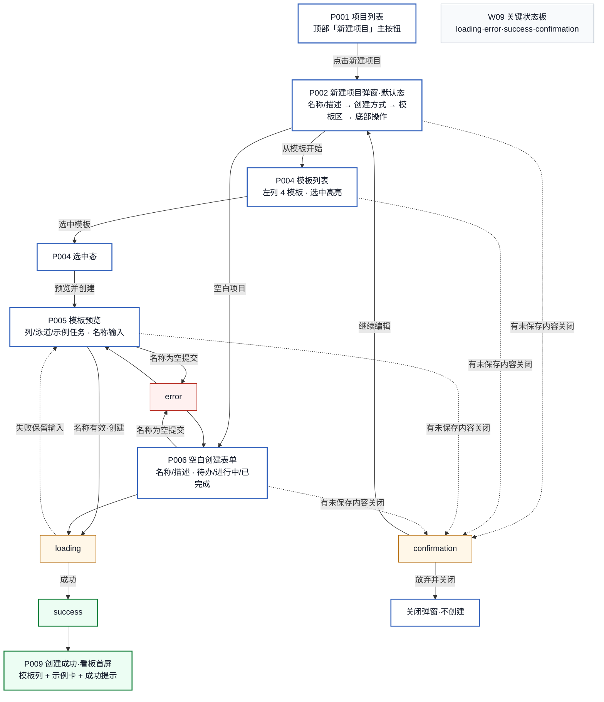

无障碍说明：实线为主流程，虚线为关闭/失败等非主路径；成功与错误均有文字标签，颜色仅加强语义。

### 5.2 W02 桌面 P002 新建项目弹窗默认态

W02 以现有 `#projectDialog` 结构为事实基线，表现弹窗打开后的默认分区、阅读顺序与主次操作。

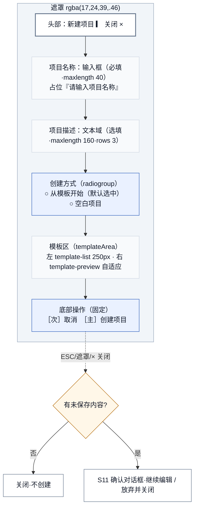

| 项 | 内容 |
|---|---|
| 视口 | 桌面 >1024px，弹窗宽版（现有 `.modal.wide`，PD-009 记录约 840px），居中，遮罩半透明 |
| 用户目标 | 打开创建向导，知道有“空白/模板”两种方式，能继续选模板或直接空白创建 |
| 区域层级与阅读顺序 | 头部 → 项目名称 → 项目描述 → 创建方式 → 模板区（列表+预览）→ 底部操作 |
| 主操作 | 选择创建方式并继续（模板则进 P004，空白则进 P006） |
| 次操作 | 取消、关闭（× / ESC / 遮罩） |
| 退出操作 | 有未保存内容时进 S11 确认；否则直接关闭 |
| 内容最小值 | 4 个模板在左侧单列纵向排列；名称/描述全空 |
| 内容典型值 | 4 模板左右并列；名称已输入“我的学习计划” |
| 内容极端值 | 名称 40 字符上限、描述 160 字符上限；模板区预览内容过长 |
| 可滚动区域 | 模板预览区（见 W04）；弹窗主体本身不滚动 |
| 固定区域 | 头部、底部操作固定；名称/描述/创建方式始终可见 |
| 键盘焦点顺序 | 打开聚焦名称输入 → Tab 描述 → 创建方式 radio → 模板列表 → 预览 → 取消 → 保存 |
| 对应上游 | US001/US006、S01/S02、DP01 低干扰、DP04 保留熟练效率 |
| 待验证点 | 默认应选中“从模板开始”还是“空白项目” `[待验证·V05]`；名称/描述在创建方式之上是否合理 `[待验证·V05]` |

### 5.3 W03 桌面 P004 模板列表与模板选中态

W03 同屏表现列表默认态与选中态，模板卡片承载真实场景信息（见 §6），不做重复同尺寸卡片网格装饰。

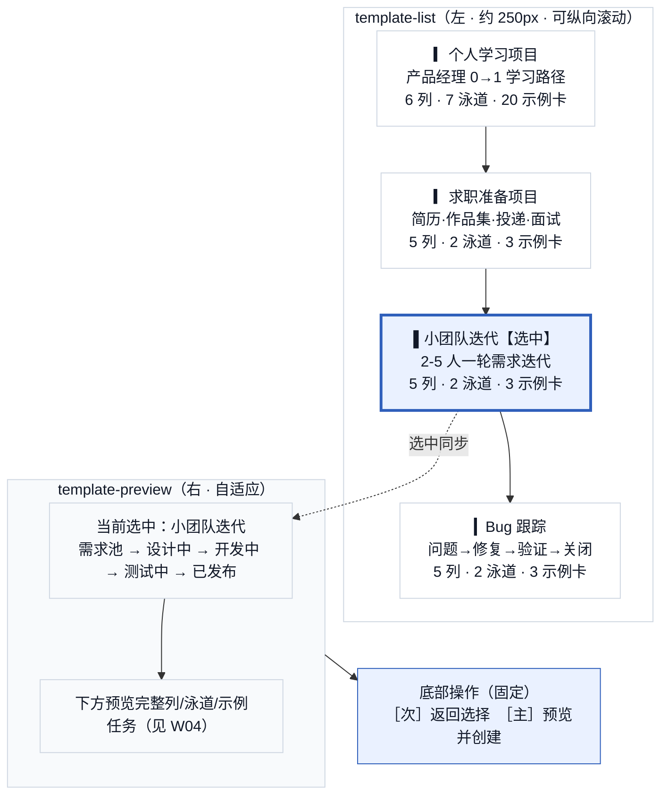

| 项 | 内容 |
|---|---|
| 视口 | 桌面，弹窗内左 250px 列表 + 右自适应预览 |
| 用户目标 | 比较 4 个场景模板，选一个与目标最接近的 |
| 区域层级与阅读顺序 | 左列表自上而下 4 卡 → 选中卡高亮 → 右预览同步 → 底部“预览并创建” |
| 主操作 | 选中模板（点击/键盘 Enter/Space/方向键）→ 预览并创建 |
| 次操作 | 切换到空白项目、关闭 |
| 退出操作 | 有选中或名称输入时关闭进 S11 |
| 内容最小值 | 4 模板均显示标题 + 一句场景 + 列/泳道/示例卡数摘要 |
| 内容典型值 | “小团队迭代”选中，预览显示 5 列流程摘要 |
| 内容极端值 | “个人学习项目”20 张示例卡，摘要需控制密度（V03） |
| 可滚动区域 | 模板列表纵向（4 卡不溢出则不滚） |
| 固定区域 | 底部操作固定；创建方式与名称/描述在上方可见 |
| 键盘焦点顺序 | 进入模板列表 → 方向键在 4 卡间移动 → Enter/Space 选中 → Tab 到预览 → Tab 到“预览并创建” |
| 对应上游 | US001、S03/S04、DP03 场景驱动 |
| 待验证点 | 模板卡片信息密度是否足够帮助选择 `[待验证·V03]`；4 模板是否覆盖核心场景 `[待验证]` |

### 5.4 W04 桌面 P005 模板预览态

W04 表现选中模板后的完整预览：列结构、泳道、示例任务摘要，以及名称输入、过长滚动与底部固定操作。

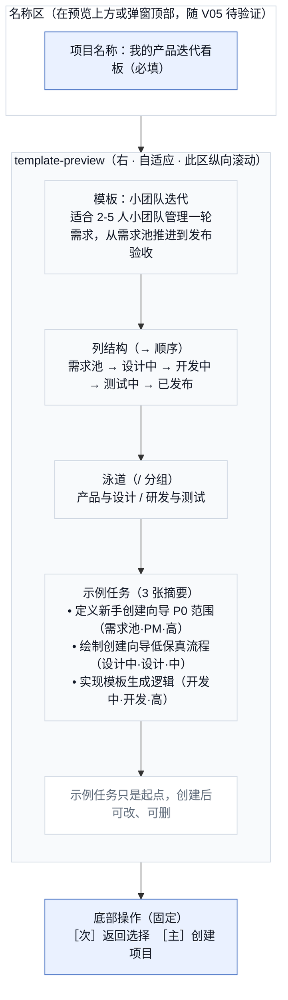

| 项 | 内容 |
|---|---|
| 视口 | 桌面，预览区在模板列表右侧，自适应宽度 |
| 用户目标 | 确认模板列结构和示例任务是否合用，再命名创建 |
| 区域层级与阅读顺序 | 模板名/描述 → 列结构 → 泳道 → 示例任务摘要 → “示例可改可删”提示 → 名称输入 → 底部创建 |
| 主操作 | 输入名称并“创建项目” |
| 次操作 | 返回选择、切换空白、关闭 |
| 退出操作 | 有名称或模板选择时关闭进 S11 |
| 内容最小值 | 模板名 + 列名链 + 示例任务标题（无描述） |
| 内容典型值 | 3~5 列、2~3 示例任务、名称“我的产品迭代看板” |
| 内容极端值 | “个人学习项目”6 列 7 泳道 20 示例卡 → 预览需控制密度并支持滚动（V04） |
| 可滚动区域 | 预览区纵向滚动；列结构/泳道/示例任务在滚动区内 |
| 固定区域 | 底部操作固定；名称输入区位置随 V05 待验证 |
| 键盘焦点顺序 | 名称输入 → 预览区（Tab 顺序读屏）→ 返回选择 → 创建项目 |
| 对应上游 | US002、S05、DP02 在做中教、DP05 可改可删 |
| 待验证点 | 预览是否需要更强视觉层级 `[待验证·V04]`；预览单层摘要 vs 强层级分区 `[待验证·V04]`；名称输入位置 `[待验证·V05]` |

### 5.5 W05 桌面 P006 空白创建表单（含必填错误态）

W05 表现老用户/熟练用户的空白创建路径，同屏表现 default 与必填 error 两态。

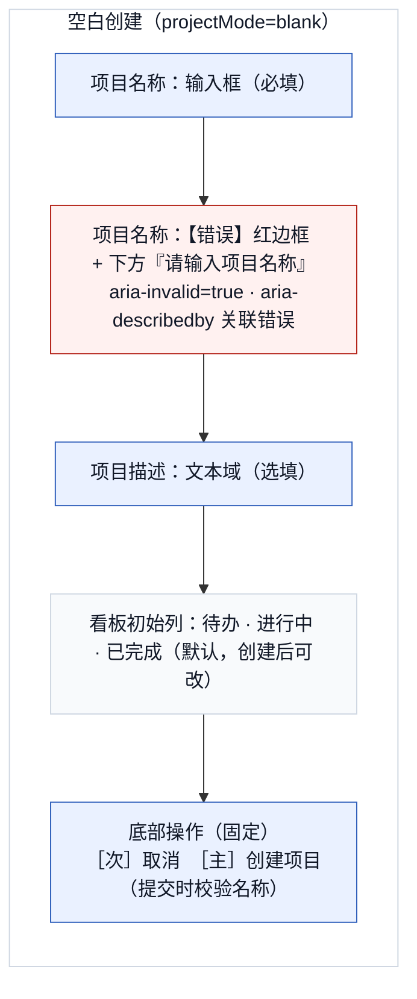

| 项 | 内容 |
|---|---|
| 视口 | 桌面，弹窗内单列（无模板区） |
| 用户目标 | 快速命名并创建一个空白看板，不被模板流程拖慢 |
| 区域层级与阅读顺序 | 名称 → 描述 → 初始列说明 → 底部创建 |
| 主操作 | 输入名称并“创建项目” |
| 次操作 | 切换到从模板开始、取消 |
| 退出操作 | 有名称/描述输入时关闭进 S11 |
| 内容最小值 | 名称空、描述空 |
| 内容典型值 | 名称“我的看板”、描述空 |
| 内容极端值 | 名称 40 字符、描述 160 字符；名称为空触发 error |
| 可滚动区域 | 无（内容短，不滚动）；描述文本域内部滚动 |
| 固定区域 | 底部操作固定 |
| 键盘焦点顺序 | 名称 → 描述 → 创建项目；名称为空时提交触发 error，焦点移回名称，错误文本通过关联属性被读出 |
| 错误处理 | 名称红边框 + 下方文字“请输入项目名称”；`aria-invalid` + `aria-describedby`；不只靠颜色 |
| 对应上游 | US006、S06/S07、DP04 保留熟练效率 |
| 待验证点 | 老用户是否被模板入口干扰 `[待验证·PD-002 路径 C]` |

### 5.6 W06 桌面 P009 创建成功后的看板首屏

W06 表现创建成功后弹窗关闭、自动切到新项目、看板展示模板列与示例任务，并保留示例卡编辑/删除入口（P010/P011 延伸）。

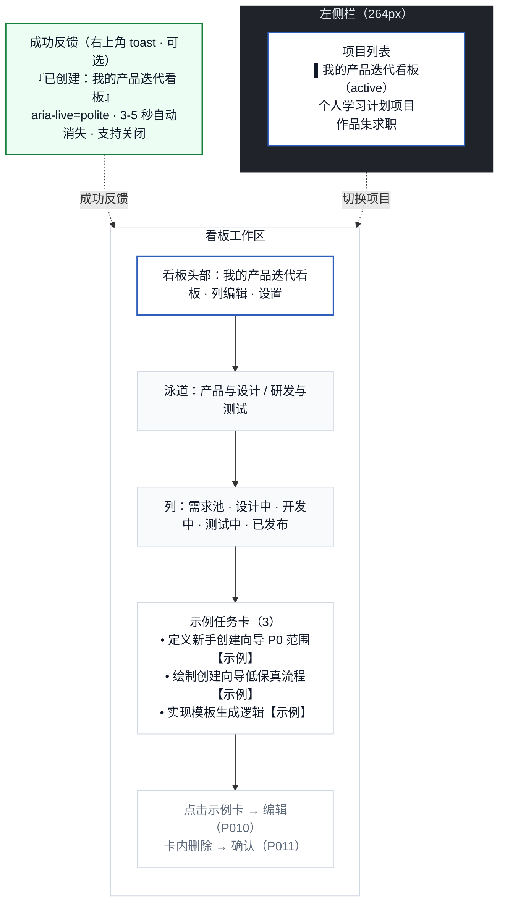

| 项 | 内容 |
|---|---|
| 视口 | 桌面，左侧栏 264px + 看板工作区 |
| 用户目标 | 立即看到已生成的可用看板，把示例任务理解成自己的任务 |
| 区域层级与阅读顺序 | 成功 toast（可选）→ 项目列表高亮新项目 → 看板头部 → 泳道 → 列 → 示例任务卡 |
| 主操作 | 查看和使用看板（读屏即可） |
| 次操作 | 编辑示例卡、删除示例卡、列编辑、项目设置 |
| 退出操作 | 不适用（已进入主应用） |
| 内容最小值 | 3 列默认（空白创建）或模板列；无示例卡（空白创建） |
| 内容典型值 | 模板创建：5 列 2 泳道 3 示例卡；项目列表含 2~3 个项目 |
| 内容极端值 | “个人学习项目”6 列 7 泳道 20 示例卡 → 看板横向滚动 + 泳道纵向滚动 |
| 可滚动区域 | 看板列横向、泳道纵向；项目列表纵向 |
| 固定区域 | 看板头部、左侧栏 |
| 键盘焦点顺序 | 创建成功后焦点回到看板工作区首个可交互元素（DP：关闭弹窗后回到触发器原则的延伸） |
| 示例卡标识 | 示例卡必须有“示例”徽标，与普通任务区分 `[规范补齐]` |
| 对应上游 | US003/US004/US005、S09/S14/S15、DP05 可改可删 |
| 待验证点 | 创建后轻提示是否必要 `[待验证]`；示例卡是否帮助理解任务拆解粒度 `[待验证·V07]` |

## 6. 390px 移动端低保真线框

> 移动端基线：宽度 390px，工作区两侧 16px（现有 `<=640px` 规则）。创建方式收为全宽纵向按钮，模板卡片单列，预览单列可纵向滚动，底部操作全宽固定。所有触摸目标建议 ≥44px `[规范补齐]`。容器是否改全屏归入 V06 `[待验证]`。

### 6.1 W07 390px P002/P004 创建方式与模板列表

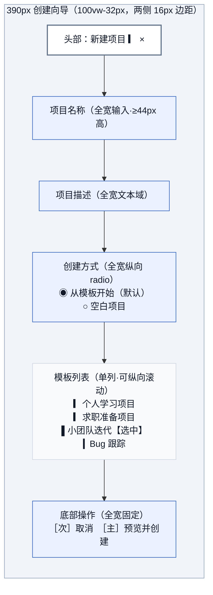

| 项 | 内容 |
|---|---|
| 视口 | 390px，弹窗宽 `100vw - 32px`，两侧 16px 边距（现有规则） |
| 用户目标 | 在手机上选择创建方式并选模板，单手可达主操作 |
| 区域层级与阅读顺序 | 头部 → 名称 → 描述 → 创建方式（纵向）→ 模板列表（单列）→ 底部全宽操作 |
| 主操作 | 选模板 → 预览并创建（全宽） |
| 次操作 | 切换空白、取消 |
| 退出操作 | 有输入或选中时关闭进 S11 |
| 内容最小值 | 4 模板单列标题 + 场景一句 |
| 内容典型值 | “小团队迭代”选中 |
| 内容极端值 | 4 模板 + 长描述 → 列表纵向滚动 |
| 可滚动区域 | 模板列表纵向 |
| 固定区域 | 头部、底部全宽操作固定 |
| 键盘/焦点顺序 | 名称 → 描述 → 创建方式 → 模板（方向键/Tab）→ 预览并创建 |
| 移动端重排规则 | 创建方式水平 → 纵向全宽；模板 2 列 → 单列；按钮 → 全宽 |
| 对应上游 | US008、S12、DP01 低干扰 |
| 待验证点 | 是否改全屏容器而非保留边距对话框 `[待验证·V06]` |

### 6.2 W08 390px P005/P006 预览与空白表单

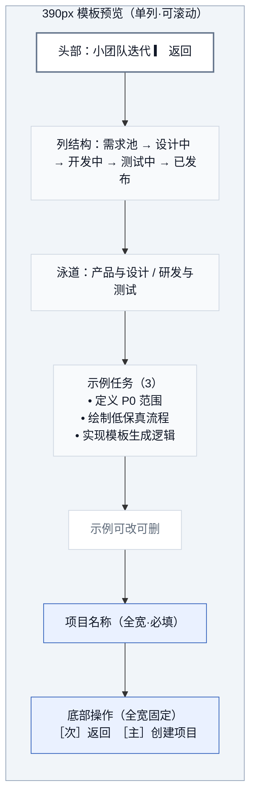

| 项 | 内容 |
|---|---|
| 视口 | 390px，预览单列全宽 |
| 用户目标 | 在手机上查看模板预览并命名创建 |
| 区域层级与阅读顺序 | 头部（模板名+返回）→ 列 → 泳道 → 示例任务 → 提示 → 名称 → 底部创建 |
| 主操作 | 输入名称并创建（全宽） |
| 次操作 | 返回选择、关闭 |
| 退出操作 | 有名称/模板时关闭进 S11 |
| 内容最小值 | 列名链 + 示例任务标题 |
| 内容典型值 | 5 列 2 泳道 3 示例任务 |
| 内容极端值 | “个人学习项目”20 示例卡 → 预览长滚动，底部操作仍固定 |
| 可滚动区域 | 预览内容纵向滚动（P013 S13） |
| 固定区域 | 头部、底部全宽操作固定 |
| 键盘/焦点顺序 | 预览读屏 → 名称 → 创建项目 |
| 空白表单 | 同结构，但无列/泳道/示例任务区，名称+描述+初始列说明+创建 |
| 对应上游 | US008、S13、DP02 在做中教 |
| 待验证点 | 预览过长时信息优先级 `[待验证·V04]`；触摸目标 ≥44px `[规范补齐]` |

## 7. 关键状态线框

### 7.1 W09 loading / error / success / confirmation 状态板

W09 把六类关键状态（default/selected/loading/error/success/confirmation）同屏成组，便于评审状态一致性与可访问性。default/selected 已在 W02~W08 表现，本图聚焦后四类。

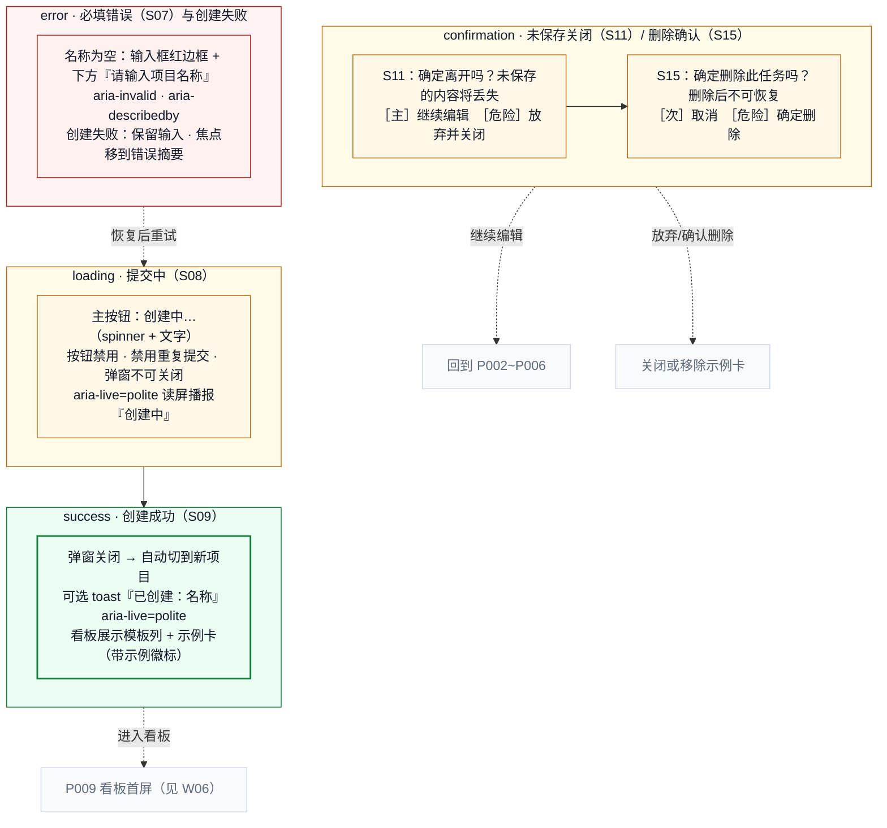

| 状态 | 触发 | 界面表现 | 主/次操作 | 可访问性 | 恢复路径 |
|---|---|---|---|---|---|
| default | 打开弹窗 | 创建方式 + 模板区（W02） | 选方式/模板 | 焦点进名称 | — |
| selected | 点模板卡 | 卡片高亮 + 预览同步（W03） | 预览并创建 | Enter/Space 选中 | — |
| loading | 点创建项目 | 主按钮 spinner + 文字“创建中…”，禁用重复提交与关闭 | 无（等待） | `aria-live` 播报 | 成功→success；失败→error |
| error | 名称为空提交/创建失败 | 名称红边框 + 错误文字（W05）；失败时保留输入、焦点移错误摘要 | 修正名称 | `aria-invalid`+`aria-describedby`，不只靠颜色 | 输入后恢复 default，可重试 |
| success | 创建成功 | 弹窗关闭 → 切新项目；可选 toast（W06） | 查看看板 | `aria-live` 播报 | 进入 P009 |
| confirmation | 有内容关闭（S11）/删示例卡（S15） | 居中确认对话框，按钮全宽（移动端） | 主：继续编辑/取消；危险：放弃/删除 | 焦点进对话框，ESC=继续编辑 | 继续编辑→回到表单；放弃→关闭 |

结构关系约定（线框层）：

1. **桌面端模板列表/预览/名称/底部操作共存**：头部→名称/描述→创建方式→（左列表 250px + 右预览自适应）→底部固定操作。名称位置随 V05 待验证。
2. **预览过长滚动**：预览区纵向滚动；底部操作与名称/创建方式始终固定可见。
3. **移动端单列顺序与返回**：头部→名称→描述→创建方式→模板单列→底部全宽；预览态头部带“返回”，底部固定。
4. **未保存关闭进 confirmation**：名称/描述有内容或已选模板时，关闭触发 S11。
5. **loading 阻止重复提交**：提交中主按钮禁用、弹窗不可关闭、读屏播报。
6. **error 保留输入恢复**：错误态不丢名称/描述/选择，修正后可重试。

## 8. 滚动、固定与焦点顺序

### 8.1 滚动与固定关系图

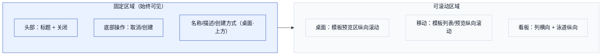

| 区域 | 桌面 | 390px |
|---|---|---|
| 头部（标题+关闭） | 固定 | 固定 |
| 项目名称/描述 | 固定（上方） | 跟随滚动或固定（待测） |
| 创建方式 | 固定 | 跟随滚动 |
| 模板列表 | 250px 列，4 卡不溢出 | 单列纵向滚动 |
| 模板预览 | 右侧自适应纵向滚动 | 单列纵向滚动 |
| 底部操作 | 固定 | 全宽固定 |

### 8.2 键盘焦点顺序

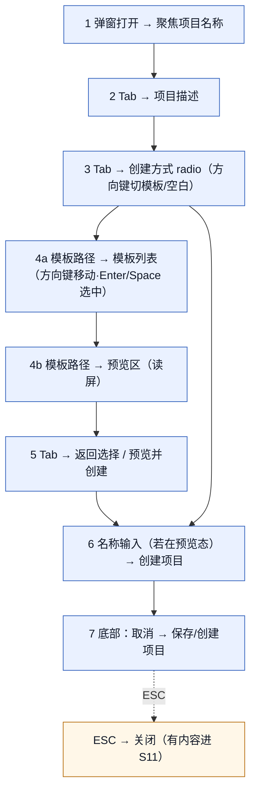

焦点约定：弹窗打开聚焦名称；错误后焦点移到错误摘要/名称；关闭后焦点回到“新建项目”触发按钮；移动端不依赖方向键导航模板列表，但保留 Tab 顺序。

## 9. V03~V06 备选方案对比

> 备选方案只在线框层提供可比较结构，不定稿。验证方式见 §10 形成性测试，最终结论归 PD-002 真实研究。

### 9.1 V03 模板卡片：精简摘要 vs 扩展摘要

| 维度 | V03a 精简摘要 | V03b 扩展摘要 |
|---|---|---|
| 卡片内容 | 名称 + 一句场景 + “5 列·2 泳道·3 示例卡” | 名称 + 场景 + 列名链 + 前 2 张示例任务标题 |
| 信息密度 | 低，选择快 | 高，减少进入预览次数 |
| 适用 | 用户目标明确、快速比较 | 用户不确定、需更多判断依据 |
| 风险 | 信息不足，仍要点预览 | 卡片过高，4 卡挤压预览区 |
| 状态 | `[待验证]` 选择任务犹豫时长 | `[待验证]` 信息回忆准确率 |

### 9.2 V04 预览：单层摘要 vs 强层级分区

| 维度 | V04a 单层摘要 | V04b 强层级分区 |
|---|---|---|
| 预览结构 | 列/泳道/示例任务三组平铺文本 | 用分区标题 + 缩进 + 弱背景区分三组 |
| 阅读成本 | 低，扫描快 | 中，层级清楚但占空间 |
| 适用 | 模板列数少（≤5） | 模板复杂（6 列 7 泳道，如个人学习） |
| 风险 | 复杂模板信息糊在一起 | 简单模板显得过度设计 |
| 状态 | `[待验证]` 信息回忆 | `[待验证]` 复杂模板理解准确率 |

### 9.3 V05 默认路径：默认模板 vs 默认空白 + 名称输入位置

| 维度 | V05a 默认“从模板开始” + 名称在顶部 | V05b 默认“空白项目” + 名称在创建方式内 |
|---|---|---|
| 默认方式 | 现有代码默认模板 | 老用户友好，新手需主动切模板 |
| 名称位置 | 现有代码：创建方式之上 | PD-006 S05/S06：预览/空白区内 |
| 新手影响 | 引导强，但可能干扰只想快速建项的老用户 | 老用户快，新手可能错过模板 |
| 现有代码事实 | 默认模板 + 名称在顶部（checked + index.html 顺序） | — |
| 状态 | `[待验证]` 首选路径观察 | `[待验证]` 老用户是否被模板入口干扰（PD-002 路径 C） |

> 说明：V05 直接源于现有代码结构与 PD-006 描述的差异（见 §3.1），线框以现有代码顺序绘制，V05b 作为待验证对照。

### 9.4 V06 移动端容器：全屏容器 vs 保留边距对话框

| 维度 | V06a 全屏容器/抽屉 | V06b 保留 16px 边距对话框（现有） |
|---|---|---|
| 容器 | 占满 390px，无两侧边距 | `100vw - 32px`，两侧 16px |
| 优势 | 内容最大化，减少横向溢出风险 | 视觉轻，保留“弹窗”语义 |
| 风险 | 失去对话框上下文，更像独立页 | 窄屏预览/按钮易挤压 |
| 状态 | `[待验证]` 移动端任务完成率、误触 | `[待验证]` 现有方案可用性 |

## 10. 形成性测试任务与观察点

> 复用 PD-002 研究计划与模板，本节为线框评审/可用性测试提供任务脚本输入，不是研究结论。

| 任务 | 场景与口径 | 观察点 | 通过口径 |
|---|---|---|---|
| FT1 首次选择创建方式 | “你现在想开始一个产品经理学习计划，请创建一个新项目。” | 是否发现两种方式、默认方式是否影响选择、是否犹豫 | 选中任一方式并继续，无需提示 |
| FT2 选择并理解模板 | “选一个最接近你目标的模板，确认它是否合适。” | 是否比较模板、是否理解列结构、是否进入预览、预览信息是否够 | 选中模板并进入预览，能说出列结构 |
| FT3 从空白快速创建 | “你已经熟悉看板，只想快速建一个空项目。” | 是否切到空白、是否被模板入口干扰、完成时长 | 切空白→命名→创建，时长合理且无提示 |
| FT4 移动端完成创建 | “在手机上用模板创建一个项目。” | 单手可达主操作、滚动是否影响底部操作、触摸目标 | 完成 390px 创建，无横向溢出，主操作可达 |
| FT5（延伸）示例卡理解 | “创建后，示例任务对你有用吗？” | 是否识别示例卡、是否尝试编辑/删除、是否理解粒度 | 能识别示例卡并说明可改可删 |
| FT6（延伸）错误与确认恢复 | “不填名称试着创建；填了名称再试着关闭。” | 是否触发错误、错误是否清楚、关闭是否进确认 | 错误可恢复，关闭确认语义清楚 |

观察记录：任务完成率、犹豫时长、首次点击、误操作、口头表达、是否回退。每项标注 `[待验证·PD-002]`。

## 11. 可访问性检查清单

| 检查项 | 线框层要求 | 状态 |
|---|---|---|
| 语义顺序 | 区域 DOM 顺序与阅读顺序一致（头部→名称→描述→方式→模板→操作） | 线框已表达 |
| 键盘顺序 | Tab/方向键/Enter/Space/ESC 全可达，焦点可见 | 线框已表达（§8.2） |
| 可见焦点 | 所有交互控件有 `:focus-visible` | 沿用 PD-009 `[现有实现]` |
| 错误关联 | 名称错误用 `aria-invalid` + `aria-describedby` 关联错误文本 | `[规范补齐]` |
| 状态播报 | loading/success/error 用 `aria-live`；不只靠 spinner/颜色 | `[规范补齐]` |
| 非颜色语义 | 选中/错误/成功/确认除颜色外有文字或图标 | 线框已表达 |
| 390px 无横向溢出 | 单列、全宽操作、预览滚动，不出现横向滚动条 | 线框已表达 `[待验证]` |
| 触摸目标 ≥44px | 移动端按钮/卡片/输入高度建议 ≥44px | `[规范补齐]` |
| 对比度 | 文字 ≥4.5:1，大文字 ≥3:1 | 视觉稿阶段实测 |
| 动效 | loading/toast 支持缩放/位移，支持 `prefers-reduced-motion` | `[规范补齐]` |

## 12. 非目标与后续 PD-011 输入

### 12.1 非目标

| 非目标 | 说明 |
|---|---|
| 不做高保真颜色/字体/阴影 | 低保真只用灰阶 + 极少语义色表达结构 |
| 不做 Figma 文件 | 本任务只交付 Markdown + Mermaid 源码 |
| 不做代码实现 | 不修改 index.html/styles.css/app.js |
| 不扩展系统级能力 | 不涉及 API/部署/插件/认证/数据库 |
| 不提前定稿待验证假设 | V03~V06 与默认方式等保留 `[待验证]` |
| 不把线框画成重复卡片网格装饰 | 模板卡片是真实选择控件，不是装饰 |
| 不宣称研究/可用性验证完成 | 形成性测试是脚本输入，不是结论 |

### 12.2 给 PD-011 高保真 / Figma 的输入

PD-011 只能在以下条件满足后进入：

1. 本任务低保真结构（W01~W09）通过 Codex 验收并导出 PNG/SVG。
2. V03~V06 至少完成一轮形成性测试或专家评审，确认默认方式、模板卡片密度、预览层级、移动端容器模式。
3. PD-009 设计 token 在视觉稿阶段完成对比度/触摸目标实测。

PD-011 输入清单：

- W02~W09 的区域层级、滚动/固定关系、焦点顺序，作为 Figma 页面/Frame 结构。
- §6 真实模板内容（4 模板列/泳道/示例任务）作为 Figma 组件数据。
- W09 状态板作为 Figma 组件变体（default/selected/loading/error/success/confirmation）。
- V03~V06 确认后的方案作为高保真唯一基线，未确认项仍保留 `[待验证]`。
- PD-009 token（颜色/字体/间距/圆角/阴影/层级）转为 Figma Variables。

> **明确声明**：本任务不等于高保真完成。PD-011（实际高保真 / Figma 视觉稿）必须在本任务结构确认和必要的形成性测试结论后才可进入。

## 13. Mermaid 图清单

| 编号 | 图名 | PNG | SVG |
|---|---|---|---|
| W01 | 核心屏幕与状态地图 | `设计图/PD-010/pd-010-core-screen-state-map.png` | `设计图/PD-010/pd-010-core-screen-state-map.svg` |
| W02 | 桌面 P002 新建项目弹窗默认态 | `设计图/PD-010/pd-010-desktop-p002-default.png` | `设计图/PD-010/pd-010-desktop-p002-default.svg` |
| W03 | 桌面 P004 模板列表与选中态 | `设计图/PD-010/pd-010-desktop-p004-template-selection.png` | `设计图/PD-010/pd-010-desktop-p004-template-selection.svg` |
| W04 | 桌面 P005 模板预览态 | `设计图/PD-010/pd-010-desktop-p005-template-preview.png` | `设计图/PD-010/pd-010-desktop-p005-template-preview.svg` |
| W05 | 桌面 P006 空白创建表单（含错误态） | `设计图/PD-010/pd-010-desktop-p006-blank-form.png` | `设计图/PD-010/pd-010-desktop-p006-blank-form.svg` |
| W06 | 桌面 P009 创建成功看板首屏 | `设计图/PD-010/pd-010-p009-success-board.png` | `设计图/PD-010/pd-010-p009-success-board.svg` |
| W07 | 390px P002/P004 创建方式与模板列表 | `设计图/PD-010/pd-010-mobile-p002-p004-selection.png` | `设计图/PD-010/pd-010-mobile-p002-p004-selection.svg` |
| W08 | 390px P005/P006 预览与空白表单 | `设计图/PD-010/pd-010-mobile-p005-p006-preview-form.png` | `设计图/PD-010/pd-010-mobile-p005-p006-preview-form.svg` |
| W09 | loading/error/success/confirmation 状态板 | `设计图/PD-010/pd-010-key-state-board.png` | `设计图/PD-010/pd-010-key-state-board.svg` |
| W10 | 滚动与固定关系图（补充） | `设计图/PD-010/pd-010-scroll-fixed-relationship.png` | `设计图/PD-010/pd-010-scroll-fixed-relationship.svg` |
| W11 | 键盘焦点顺序图（补充） | `设计图/PD-010/pd-010-focus-order.png` | `设计图/PD-010/pd-010-focus-order.svg` |

共 11 张 Mermaid 源码（任务要求 ≥9 张，含 2 张补充），已由 Codex 在验收阶段导出 11 PNG + 11 SVG 至 `设计图/PD-010/`。

## 14. 待验证假设索引

| 编号 | 假设 | 来源 | 验证方式 |
|---|---|---|---|
| V03 | 模板卡片信息密度（精简 vs 扩展） | PD-009 V03 | FT2 犹豫时长 + 信息回忆 |
| V04 | 预览层级（单层 vs 强分区） | PD-009 V04 | FT2 复杂模板理解准确率 |
| V05 | 默认创建方式 + 名称输入位置 | 现有代码 vs PD-006 | FT1/FT3 首选路径观察 |
| V06 | 移动端容器（全屏 vs 边距对话框） | PD-009 V06 | FT4 任务完成率 + 误触 |
| V07 | 示例卡是否帮助理解任务粒度 | PD-009 V07 | FT5 创建后理解访谈 |
| V08 | 错误/确认文案语气 | PD-009 V08 | FT6 错误恢复 + 文案复述 |
