# 流程图与信息架构 PD-005

> **版本性质：假设版 / 待研究验证版**

| 项目 | 内容 |
|---|---|
| 日期 | 2026-06-15 |
| 状态 | 流程图与信息架构（假设版） |
| 聚焦范围 | 新手项目创建与任务拆解体验优化 |
| 上游依据 | [正式 PRD](../02-requirements/PRD-Kanboard新手项目创建与任务拆解优化.md) |

> **声明**：本文档的需求来源已合并到正式 PRD；它不是基于真实用户研究的最终版本。标注 `[待验证]` 的内容需要在 PD-002 研究执行后更新。

## 1. 文档目的

1. 将正式 PRD 中的用户故事与验收标准转成流程图、信息架构和页面/状态清单。
2. 从用户故事和 PRD 中提取优化前路径、优化后路径、异常路径和老用户快捷路径。
3. 明确新手创建向导涉及哪些页面、弹窗、状态、对象和导航关系。
4. 为后续 PD-006 交互状态规格提供输入。

## 2. 流程范围

### 流程边界

| 边界 | 说明 |
|---|---|
| 起点 | 用户在项目列表页或看板页，点击"新建项目"按钮 |
| 终点 | 创建成功后进入已生成的可用看板 |
| 不涉及 | 项目创建后的任务管理、协作、分析等能力 |

### 流程层级

```
层级1：用户行为路径
[进入产品] → [点击新建] → [选择方式] → [选择模板/输入名称] → [预览] → [创建] → [进入看板]

层级2：创建向导弹窗内部
[打开弹窗] → [方式切换] → [模板列表/空白输入] → [预览] → [提交创建]

层级3：异常与边界
[必填错误] → [返回修改] → [重新提交]
[取消创建] → [关闭弹窗]
[切换方式] → [清空选择] → [重新开始]
```

## 3. 用户故事地图 Story Map

本图把正式 PRD 的需求按用户行为层、P0 首次可用范围、P1 增强范围和 P2 后续范围组织，作为后续流程图与交互状态规格的总览。

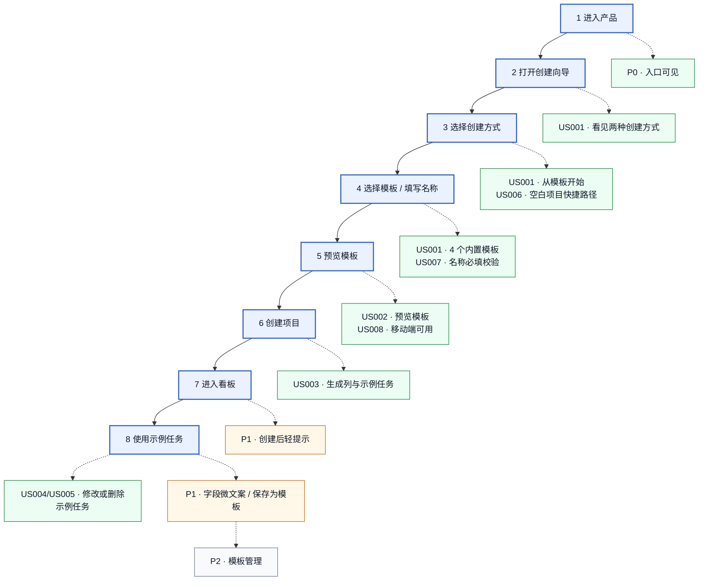

## 4. 优化前路径

优化前是 Kanboard 原始的空白创建路径：用户点击新建项目 → 输入名称 → 创建空项目 → 面对空白看板。

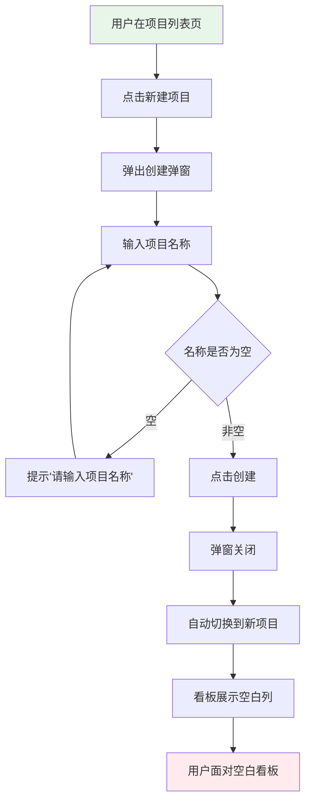

**痛点**：
- 用户面对空白看板，不知道应该有哪些列
- 用户不知道如何拆解任务
- 用户不知道字段怎么填
- 首次创建完成率低，耗时长

## 5. 优化后主路径

优化后是模板创建路径：用户点击新建项目 → 选择从模板开始 → 选择模板 → 预览 → 创建 → 进入已有列和示例卡的看板。

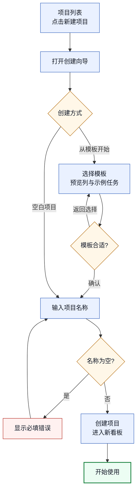

**优势**：
- 用户直接获得符合场景的列结构
- 示例卡帮助理解任务粒度
- 创建后即可使用，无需从零配置

## 6. 老用户空白创建路径

老用户保持原有空白创建习惯，不被模板推荐干扰。

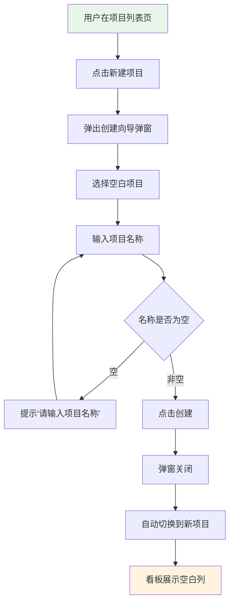

**关键**：
- 空白创建路径不展示任何模板推荐
- 创建步骤和速度与原有 Kanboard 一致
- 老用户操作习惯不受影响

## 7. 异常与边界路径

### 7.1 项目名称为空

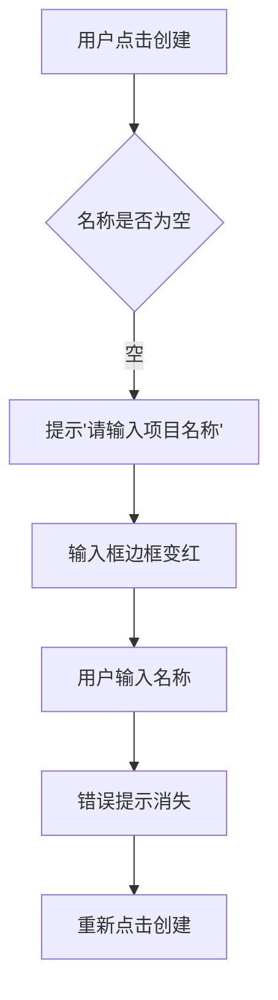

### 7.2 用户返回模板选择

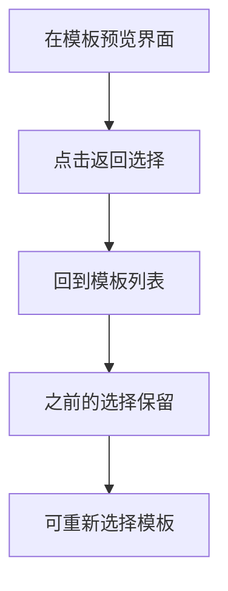

### 7.3 用户切换创建方式

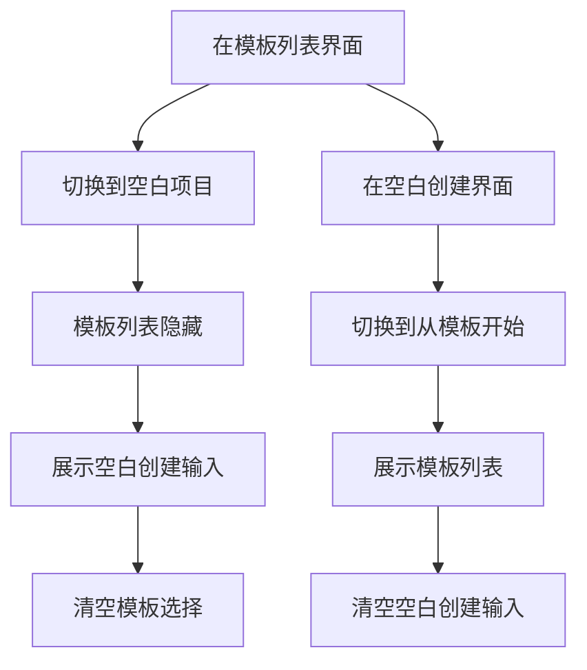

### 7.4 用户取消创建

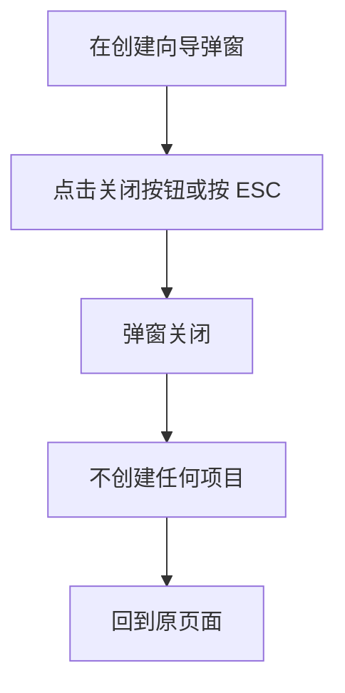

### 7.5 移动端预览内容过长

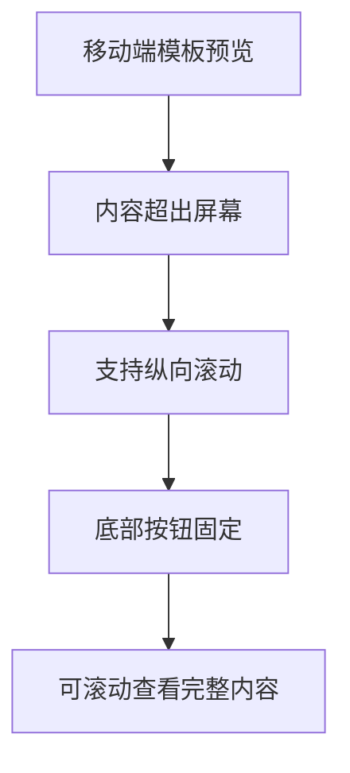

### 7.6 未保存内容关闭弹窗

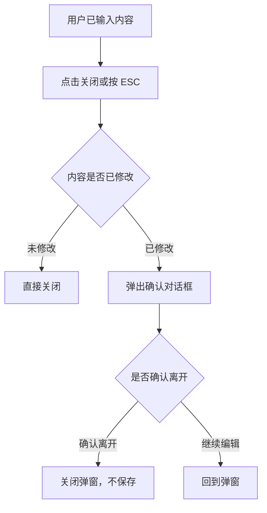

## 8. 信息架构 IA

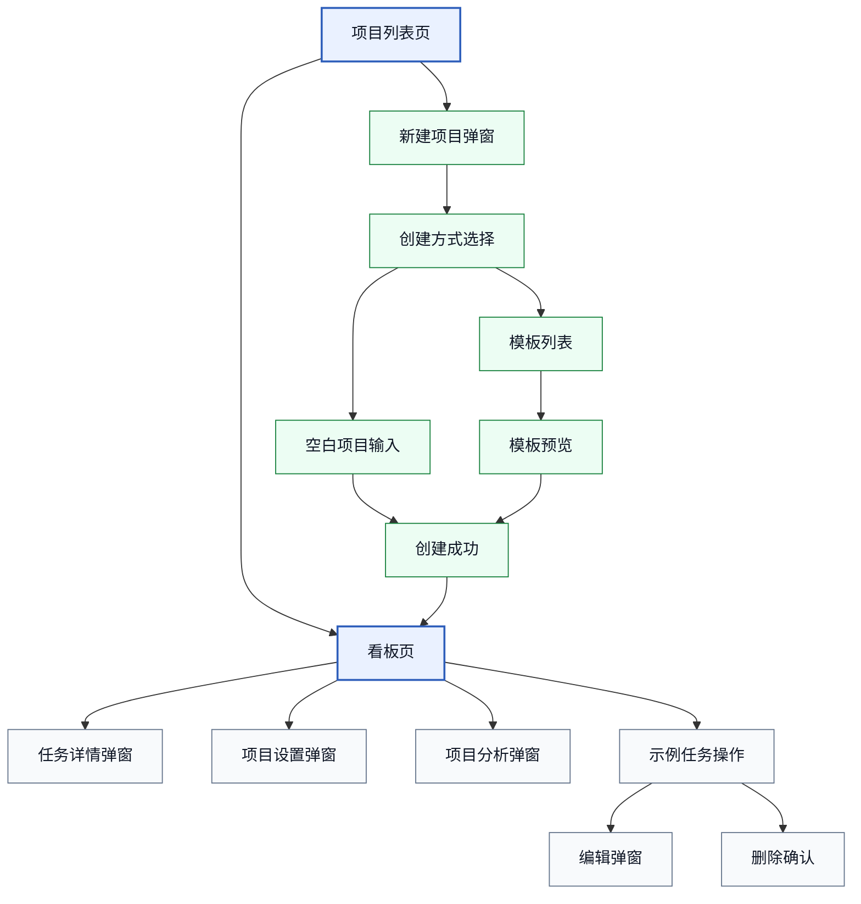

## 9. 页面 / 弹窗 / 状态清单

### 页面清单

| 编号 | 页面/弹窗 | 层级 | 说明 |
|---|---|---|---|
| P01 | 项目列表页 | 一级页面 | 展示用户的所有项目，包含新建项目入口 |
| P02 | 看板页 | 一级页面 | 展示项目的列、泳道、任务卡片 |
| P03 | 任务详情弹窗 | 二级弹窗 | 展示任务的完整字段，支持编辑 |

### 创建向导弹窗清单

| 编号 | 状态/弹窗 | 说明 | 优先级 |
|---|---|---|---|
| D01 | 创建向导弹窗（默认） | 弹窗打开，展示创建方式选择 | P0 |
| D02 | 创建方式选择 | "空白项目"和"从模板开始"切换 `[待验证：默认选中]` | P0 |
| D03 | 空白项目输入 | 展示项目名称和描述输入 | P0 |
| D04 | 模板列表 | 展示 4 个模板卡片 | P0 |
| D05 | 模板预览 | 展示选中模板的列结构和示例卡 | P0 |
| D06 | 创建成功 | 弹窗关闭，自动跳转 | P0 |
| D07 | 必填错误态 | 项目名称为空时展示错误提示 | P0 |
| D08 | 确认关闭对话框 | 未保存内容时确认是否离开 | P1 |

### 看板页交互清单

| 编号 | 状态/弹窗 | 说明 | 优先级 |
|---|---|---|---|
| B01 | 创建后轻提示 | 第一次通过模板创建后展示提示 `[待验证]` | P1 |
| B02 | 示例卡编辑弹窗 | 点击示例卡打开编辑界面 | P0 |
| B03 | 示例卡删除确认 | 删除示例卡时确认 | P0 |

## 10. 对象关系与数据对象

### 对象关系图

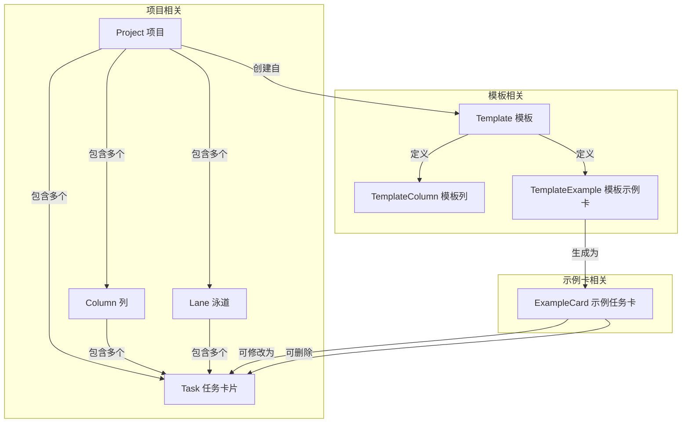

### 数据对象说明

#### Project（项目）

| 字段 | 说明 | 必填 |
|---|---|---|
| id | 项目唯一标识 | 是（自动生成） |
| name | 项目名称 | 是（用户输入） |
| description | 项目描述 | 否 |
| templateId | 创建自哪个模板（可为空） | 否 |
| createdAt | 创建时间 | 是（自动生成） |

#### Template（模板）

| 字段 | 说明 | 必填 |
|---|---|---|
| id | 模板唯一标识 | 是 |
| name | 模板名称（如"个人学习项目"） | 是 |
| description | 模板场景描述 | 是 |
| columns | 模板定义的列列表 | 是 |
| examples | 模板定义的示例卡列表 | 是 |

#### TemplateColumn（模板列）

| 字段 | 说明 | 必填 |
|---|---|---|
| name | 列名（如"待学"、"学习中"） | 是 |
| order | 列顺序 | 是 |

#### TemplateExample（模板示例卡）

| 字段 | 说明 | 必填 |
|---|---|---|
| title | 示例卡标题 | 是 |
| description | 示例卡描述 | 否 |
| column | 所属列名 | 是 |
| priority | 优先级 | 否 |
| assignee | 负责人 | 否 |
| dueDate | 截止时间 | 否 |

#### Column（项目列）

| 字段 | 说明 | 必填 |
|---|---|---|
| id | 列唯一标识 | 是（自动生成） |
| name | 列名 | 是 |
| order | 列顺序 | 是 |
| projectId | 所属项目 | 是 |

#### Task（任务卡片）

| 字段 | 说明 | 必填 |
|---|---|---|
| id | 任务唯一标识 | 是（自动生成） |
| title | 任务标题 | 是 |
| description | 任务描述 | 否 |
| columnId | 所属列 | 是 |
|泳道Id | 所属泳道 | 否 |
| priority | 优先级 | 否 |
| assignee | 负责人 | 否 |
| dueDate | 截止时间 | 否 |
| isExample | 是否为示例卡（可修改/删除） | 否 |

### 对象生命周期

```
模板创建路径：
Template → TemplateColumn + TemplateExample → 创建 Project → 生成 Column + ExampleCard → 用户修改 ExampleCard → ExampleCard 变为普通 Task

空白创建路径：
用户输入 → 创建 Project → 生成 Column → 无 Task
```

## 11. 待研究验证的流程节点

| 编号 | 待验证内容 | 验证方式 | 依赖 |
|---|---|---|---|
| V01 | 创建向导弹窗默认选中"从模板开始"是否合适 | PD-002 可用性测试 | PD-002 执行 |
| V02 | 4 个模板是否覆盖目标用户的核心场景 | PD-002 访谈确认 | PD-002 执行 |
| V03 | 模板预览是否足够帮助用户判断模板是否合适 | PD-002 可用性测试 | PD-002 执行 |
| V04 | 创建后轻提示是否必要 | PD-002 可用性测试 | PD-002 执行 |
| V05 | 老用户空白创建路径是否被打扰 | PD-002 路径 C | PD-002 执行 |
| V06 | 模板切换方式是否流畅 | PD-002 可用性测试 | PD-002 执行 |
| V07 | 预览区内容是否足够 | PD-002 可用性测试 | PD-002 执行 |
| V08 | 示例卡修改/删除操作是否直观 | PD-002 可用性测试 | PD-002 执行 |

## 12. 后续进入 PD-006 交互状态规格的输入

### 从本流程图可提取的状态节点

| 状态节点 | 来源 | 说明 |
|---|---|---|
| 创建向导弹窗默认态 | D01 | 弹窗打开，展示创建方式选择 |
| 模板列表默认态 | D04 | 展示 4 个模板卡片 |
| 模板列表选中态 | D04 | 模板卡片高亮，展示预览按钮 |
| 模板预览态 | D05 | 展示列结构和示例卡 |
| 空白创建输入态 | D03 | 展示名称和描述输入 |
| 必填错误态 | D07 | 名称为空时展示错误提示 |
| 确认关闭态 | D08 | 未保存内容时确认 |
| 创建成功态 | D06 | 弹窗关闭，跳转看板 |
| 示例卡编辑态 | B02 | 打开任务详情弹窗 |
| 示例卡删除确认态 | B03 | 确认删除对话框 |

### 需要 PD-002 研究后补充的内容

| 内容 | 补充方式 |
|---|---|
| 验证后的流程节点 | 根据研究结论更新流程图 |
| 验证后的卡住点 | 在流程图中标注高风险节点 |
| 验证后的信息架构 | 根据研究结论调整页面/弹窗关系 |
| 验证后的对象关系 | 根据研究结论调整数据对象 |

## 13. 已导出的设计图

> 2026-06-17 已由 Codex 完成结构重排，并按统一设计图规范重新导出 12 张 PNG 和 12 张 SVG。PNG 用于快速预览，SVG 用于放大查看和后续编辑。

| 编号 | 图名 | PNG | SVG |
|---|---|---|---|
| M01 | 用户故事地图 Story Map | `设计图/PD-005/pd-005-story-map.png` | `设计图/PD-005/pd-005-story-map.svg` |
| M02 | 优化前空白创建路径 | `设计图/PD-005/pd-005-before-blank-flow.png` | `设计图/PD-005/pd-005-before-blank-flow.svg` |
| M03 | 优化后模板创建主路径 | `设计图/PD-005/pd-005-template-main-flow.png` | `设计图/PD-005/pd-005-template-main-flow.svg` |
| M04 | 老用户空白创建快捷路径 | `设计图/PD-005/pd-005-returning-user-blank-flow.png` | `设计图/PD-005/pd-005-returning-user-blank-flow.svg` |
| M05 | 项目名称为空 | `设计图/PD-005/pd-005-error-empty-name-flow.png` | `设计图/PD-005/pd-005-error-empty-name-flow.svg` |
| M06 | 返回模板选择 | `设计图/PD-005/pd-005-return-template-selection-flow.png` | `设计图/PD-005/pd-005-return-template-selection-flow.svg` |
| M07 | 切换创建方式 | `设计图/PD-005/pd-005-switch-create-mode-flow.png` | `设计图/PD-005/pd-005-switch-create-mode-flow.svg` |
| M08 | 取消创建 | `设计图/PD-005/pd-005-cancel-create-flow.png` | `设计图/PD-005/pd-005-cancel-create-flow.svg` |
| M09 | 移动端预览内容过长 | `设计图/PD-005/pd-005-mobile-preview-overflow-flow.png` | `设计图/PD-005/pd-005-mobile-preview-overflow-flow.svg` |
| M10 | 未保存内容关闭弹窗 | `设计图/PD-005/pd-005-unsaved-close-flow.png` | `设计图/PD-005/pd-005-unsaved-close-flow.svg` |
| M11 | 信息架构 IA | `设计图/PD-005/pd-005-information-architecture.png` | `设计图/PD-005/pd-005-information-architecture.svg` |
| M12 | 对象关系图 | `设计图/PD-005/pd-005-object-relationship.png` | `设计图/PD-005/pd-005-object-relationship.svg` |
