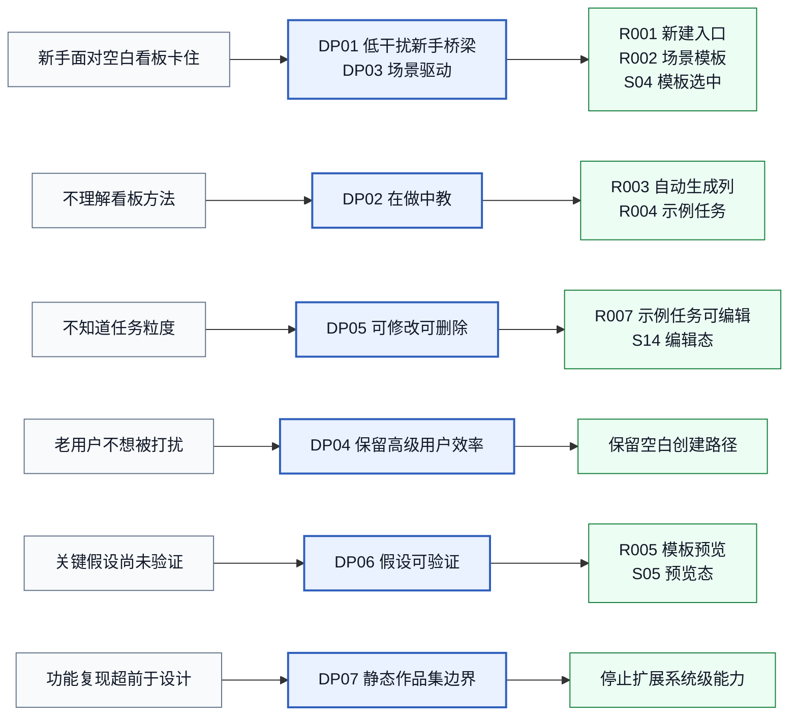
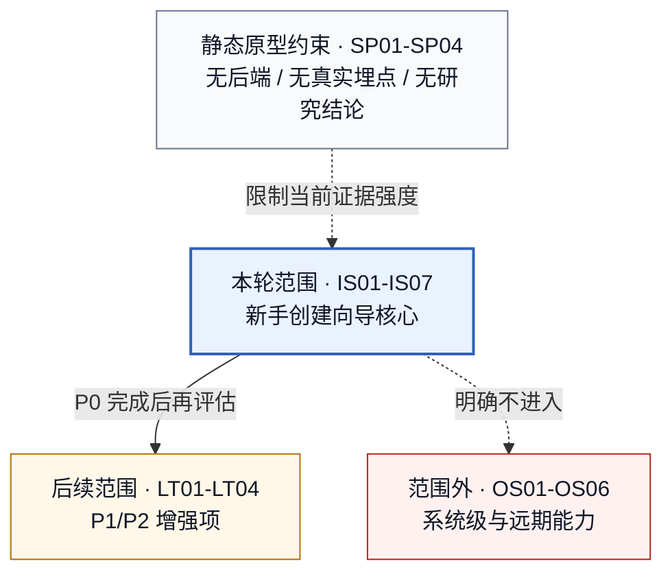
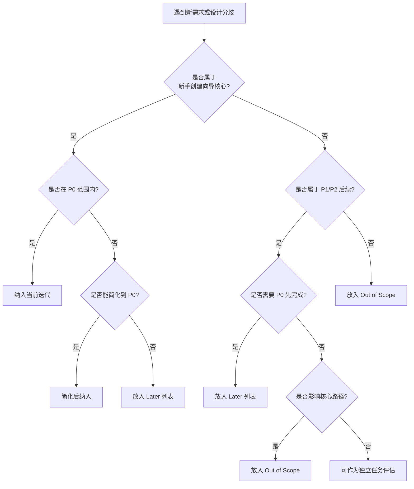

# 设计原则与非目标 PD-007

> **版本性质：假设版 / 待研究验证版**

| 项目 | 内容 |
|---|---|
| 日期 | 2026-06-15 |
| 状态 | 设计原则与非目标（假设版） |
| 聚焦范围 | 新手项目创建与任务拆解体验优化 |
| 上游依据 | PD-001~PD-006、竞品分析报告 V0.2、用户研究与需求池 V0.2、新手创建向导说明 V0.5 |

> **声明**：本文档是基于 PD-001~PD-006 的设计原则与非目标，不是基于真实用户研究的最终版本。标注 `[待验证]` 的内容需要在 PD-002 研究执行后更新。

## 1. 文档目的

1. 将 PD-001~PD-006 中分散出现的设计原则、范围边界、非目标、不做项、待验证决策和取舍逻辑统一沉淀。
2. 明确后续低保真、高保真、设计系统、可用性测试和作品集叙事应该遵守的产品设计判断。
3. 用 Mermaid 绘制原则追踪图、范围边界图和决策取舍树，为后续评审和作品集表达提供结构。
4. 把"继续堆系统级功能不是当前主线"写成明确原则或边界，并解释原因。

## 2. 设计问题回顾

### 核心问题

初次使用看板工具管理个人项目或小团队任务的用户，在第一次创建项目时面对空白看板，不知道如何从模糊目标拆成可执行的任务列表。

### 问题影响

- 新用户首次项目创建完成率低 `[待验证]`
- 看板结构不符合 Kanban 最佳实践 `[待验证]`
- 字段含义缺少场景解释 `[待验证]`
- 用户把工具当普通清单使用 `[待验证]`

### 设计目标

在保持 Kanboard 轻量定位的前提下，为新手提供一次"从目标到看板"的辅助创建过程，同时不打扰老用户的使用效率。

## 3. 设计原则总览

| 编号 | 原则名称 | 一句话定义 |
|---|---|---|
| DP01 | 低干扰新手桥梁 | 在保持轻量定位的前提下，为新手提供辅助创建过程 |
| DP02 | 在做中教，而不是先教再做 | 通过模板和示例卡让用户在操作中理解看板方法 |
| DP03 | 场景驱动，而非功能驱动 | 按用户真实使用场景组织模板，而不是按功能模块 |
| DP04 | 保留高级用户效率 | 空白创建路径保持原有快捷性，不增加老用户步骤 |
| DP05 | 可删除、可修改、可放弃 | 示例卡和模板结构都应该是可调整的，用户不被绑定 |
| DP06 | 假设可验证，而非直接定论 | 所有设计决策基于假设，需要通过研究验证后更新 |
| DP07 | 静态作品集边界优先，避免继续功能膨胀 | 聚焦核心优化路径，不继续扩大系统级功能复现 |

## 4. 设计原则详解

### DP01：低干扰新手桥梁

| 项目 | 内容 |
|---|---|
| 原则编号 | DP01 |
| 原则名称 | 低干扰新手桥梁 |
| 一句话定义 | 在保持 Kanboard 轻量定位的前提下，为新手提供一次"从目标到看板"的辅助创建过程 |
| 来源依据 | PD-001 §9, 竞品分析报告 V0.2 §7 |
| 解决的问题 | 新手面对空白看板不知道如何开始，老用户不想被新功能干扰 |
| 设计含义 | 新功能应该像一座"桥梁"，连接新手和可用看板，而不是像一堵"墙"阻挡老用户 |
| 应该做 | 嵌入原有创建入口，不新增独立页面；保留空白创建路径 |
| 不应该做 | 把创建向导做成独立的多步流程；强制所有用户走模板路径 |
| 适用场景 | 新建项目弹窗、模板选择、空白创建 |
| 对后续影响 | 低保真线框必须嵌入原弹窗；高保真必须保持创建路径简洁 |
| 待验证点 | 老用户是否会被模板入口干扰 `[待验证：PD-002 路径 C]` |

### DP02：在做中教，而不是先教再做

| 项目 | 内容 |
|---|---|
| 原则编号 | DP02 |
| 原则名称 | 在做中教，而不是先教再做 |
| 一句话定义 | 通过模板和示例卡让用户在操作中理解看板方法，而不是先阅读文档再开始使用 |
| 来源依据 | PD-001 §9, 竞品分析报告 V0.2 §5 |
| 解决的问题 | 新手不理解看板方法，不知道列结构和任务粒度 |
| 设计含义 | 模板和示例卡本身就是教学工具，用户通过选择场景、查看列结构、修改示例卡来理解任务拆解方式 |
| 应该做 | 示例卡用具体可执行的任务标题；列结构符合 Kanban 最佳实践 |
| 不应该做 | 添加单独的"使用教程"页面；用大段文字解释看板概念 |
| 适用场景 | 模板设计、示例卡设计、创建后轻提示 |
| 对后续影响 | 示例卡内容必须具体、可执行；轻提示必须简洁 |
| 待验证点 | 示例卡是否能帮助理解任务粒度 `[待验证：PD-002]`；轻提示是否必要 `[待验证：PD-002]` |

### DP03：场景驱动，而非功能驱动

| 项目 | 内容 |
|---|---|
| 原则编号 | DP03 |
| 原则名称 | 场景驱动，而非功能驱动 |
| 一句话定义 | 按用户真实使用场景组织模板，而不是按 Kanboard 的功能模块组织 |
| 来源依据 | PD-001 §9, 用户研究与需求池 V0.2 §3 |
| 解决的问题 | 用户选择的是"我要做什么"，而不是"我要用哪些功能" |
| 设计含义 | 模板名称和描述应该用用户的语言，而不是产品的术语 |
| 应该做 | 模板按场景命名（"个人学习项目"）；描述用用户语言 |
| 不应该做 | 模板按功能命名（"多列看板模板"）；描述用产品术语 |
| 适用场景 | 模板列表、模板描述、模板选择 |
| 对后续影响 | 模板命名和描述必须用用户语言 |
| 待验证点 | 4 个模板是否覆盖核心场景 `[待验证：PD-002]` |

### DP04：保留高级用户效率

| 项目 | 内容 |
|---|---|
| 原则编号 | DP04 |
| 原则名称 | 保留高级用户效率 |
| 一句话定义 | 空白创建路径保持原有快捷性，不增加老用户的操作步骤 |
| 来源依据 | PD-001 §9, PD-003 §6, 竞品分析报告 V0.2 §5 |
| 解决的问题 | 老用户不想因为新手功能而增加操作负担 |
| 设计含义 | 新手功能和老用户功能应该共存，而不是互相干扰 |
| 应该做 | 空白创建路径步骤和速度与原有 Kanboard 一致；模板推荐不强制 |
| 不应该做 | 空白创建需要先看模板推荐；创建向导增加额外步骤 |
| 适用场景 | 创建方式选择、空白创建路径 |
| 对后续影响 | 空白创建路径必须保持原有简洁性 |
| 待验证点 | 老用户空白创建是否被打扰 `[待验证：PD-002 路径 C]` |

### DP05：可删除、可修改、可放弃

| 项目 | 内容 |
|---|---|
| 原则编号 | DP05 |
| 原则名称 | 可删除、可修改、可放弃 |
| 一句话定义 | 示例卡、模板结构和列配置都应该是可调整的，用户不被模板绑定 |
| 来源依据 | PD-004 US004/US005, 用户研究与需求池 V0.2 §7 |
| 解决的问题 | 用户不想被模板限制，需要根据自己的需求调整 |
| 设计含义 | 模板是起点，不是终点；示例卡是参考，不是必须保留的内容 |
| 应该做 | 示例卡可修改、可删除；创建后可编辑列结构 |
| 不应该做 | 示例卡不可修改；模板生成的列不可调整 |
| 适用场景 | 示例卡编辑、示例卡删除、看板后续使用 |
| 对后续影响 | 示例卡必须支持编辑和删除操作 |
| 待验证点 | 用户是否会修改示例卡 `[待验证：PD-002]`；是否会删除示例卡 `[待验证：PD-002]` |

### DP06：假设可验证，而非直接定论

| 项目 | 内容 |
|---|---|
| 原则编号 | DP06 |
| 原则名称 | 假设可验证，而非直接定论 |
| 一句话定义 | 所有设计决策基于假设，需要通过研究验证后更新，不能把假设当结论 |
| 来源依据 | PD-001 §6, PD-002, PD-003 声明 |
| 解决的问题 | 设计决策可能偏离真实用户需求 |
| 设计含义 | 每个设计决策都应该标注假设来源和验证状态 |
| 应该做 | PRD/用户故事中标注 `[待验证]`；研究执行后更新文档 |
| 不应该做 | 把桌面研究假设当已验证结论；跳过验证直接定论 |
| 适用场景 | 所有设计决策、PRD、用户故事、交互规格 |
| 对后续影响 | 设计文档必须标注验证状态；研究回来后必须更新 |
| 待验证点 | 所有 `[待验证]` 内容都需要 PD-002 研究验证 |

### DP07：静态作品集边界优先，避免继续功能膨胀

| 项目 | 内容 |
|---|---|
| 原则编号 | DP07 |
| 原则名称 | 静态作品集边界优先，避免继续功能膨胀 |
| 一句话定义 | 聚焦核心优化路径，不继续扩大系统级功能复现，因为作品集需要的是设计决策的完整链路，而不是功能数量 |
| 来源依据 | MC-002 复核结果, 产品生命周期真实进度基线 |
| 解决的问题 | 项目已形成"每个版本补齐一批 Kanboard 功能"的工作惯性，继续堆功能的边际价值低于补齐设计产物 |
| 设计含义 | 后续工作应该聚焦 PRD、用户故事、流程图、交互规格、设计系统、高保真原型，而不是继续补齐 Admin/Settings/API 等系统级能力 |
| 应该做 | 暂停 V0.8.28 功能复现；主线切换为 P0-P2 产品设计补齐 |
| 不应该做 | 继续补齐 Admin/Settings、数据库配置、安全配置、剩余 API procedures |
| 适用场景 | 版本规划、任务优先级、设计决策 |
| 对后续影响 | 明确停止功能复现；聚焦设计产物补齐 |
| 待验证点 | 无（这是项目边界判断，不是用户假设） |

## 5. 原则到需求/状态的追踪

## 6. 范围边界

### In Scope（本轮 P0 范围）

| 编号 | 范围内容 | 说明 |
|---|---|---|
| IS01 | 新建项目入口升级 | 支持"空白项目"和"从模板开始"两种方式 |
| IS02 | 4 个内置场景模板 | 个人学习、求职准备、小团队迭代、Bug 跟踪 |
| IS03 | 模板预览 | 创建前可预览列结构和示例卡 |
| IS04 | 自动生成列结构 | 根据模板生成看板列 |
| IS05 | 自动生成示例任务卡 | 每个模板生成 3-5 张可修改/删除的示例卡 |
| IS06 | 空白项目创建 | 保持原有空白创建路径 |
| IS07 | 创建后进入看板 | 创建成功后自动切换到新项目 |

### Later（P1/P2 后续可能做）

| 编号 | 范围内容 | 说明 |
|---|---|---|
| LT01 | 字段微文案 | 负责人、优先级、截止时间的短说明 |
| LT02 | 创建后轻提示 | 第一次进入模板看板时的提示 `[待验证]` |
| LT03 | 保存为自定义模板 | 用户把当前项目保存为模板 |
| LT04 | 模板管理页 | 管理自定义模板 |

### Out of Scope（明确不做）

| 编号 | 范围内容 | 说明 |
|---|---|---|
| OS01 | 完整模板市场 | P2 远期 |
| OS02 | 多视图系统 | 偏产品增强，不属于新手创建核心 |
| OS03 | 复杂自动化配置 | 属于进阶能力 |
| OS04 | 团队权限体系重构 | 属于系统级能力 |
| OS05 | 登录注册和真实鉴权 | 静态原型项目 |
| OS06 | API、Webhook、插件系统 | 属于开发者/运维能力 |

### Static Prototype Constraint（静态原型限制）

| 编号 | 限制内容 | 说明 |
|---|---|---|
| SP01 | 无真实后端 | 数据存储在 localStorage |
| SP02 | 无真实埋点 | 埋点定义为假设版 |
| SP03 | 无真实用户研究 | 需要 PD-002 研究执行后更新 |
| SP04 | 无 Figma 高保真 | 当前是静态 HTML/CSS/JS 原型 |

## 7. 非目标 Non-Goals

### P0 不做

| 编号 | 不做内容 | 所属层级 | 不做原因 | 如果误做会带来的风险 | 未来是否可能重新评估 | 依据来源 |
|---|---|---|---|---|---|---|
| NG01 | 完整模板市场/模板商店 | P0 不做 | 当前阶段只需要 4 个内置模板 | 范围膨胀，偏离核心优化 | P2 可能重新评估 | PD-001 §10 |
| NG02 | 多视图系统（日历、甘特、列表） | P0 不做 | 偏产品增强，不属于新手创建核心 | 增加创建向导复杂度 | P2 可能重新评估 | PD-001 §10 |
| NG03 | 复杂自动化配置 | P0 不做 | 属于进阶能力 | 新手功能变重 | P2 可能重新评估 | PD-001 §10 |
| NG04 | 团队权限体系重构 | P0 不做 | 属于系统级能力 | 远离核心优化主题 | 不太可能重新评估 | PD-001 §10 |

### P1/P2 可能做但当前不做

| 编号 | 不做内容 | 所属层级 | 不做原因 | 如果误做会带来的风险 | 未来是否可能重新评估 | 依据来源 |
|---|---|---|---|---|---|---|
| NG05 | 字段微文案系统 | P1 可能做 | 需要设计系统支撑 | 增加设计复杂度 | P1 可能重新评估 | PD-003 §6 |
| NG06 | 创建后轻提示 | P1 可能做 | 需要验证是否必要 | 可能打扰老用户 | P1 可能重新评估 `[待验证]` | PD-004 US010 |
| NG07 | 保存为自定义模板 | P1 可能做 | 需要数据结构支撑 | 增加创建复杂度 | P1 可能重新评估 | PD-004 US011 |

### 明确不属于本项目主线

| 编号 | 不做内容 | 所属层级 | 不做原因 | 如果误做会带来的风险 | 未来是否可能重新评估 | 依据来源 |
|---|---|---|---|---|---|---|
| NG08 | 登录注册和真实鉴权 | 不属于主线 | 静态原型项目 | 偏离静态原型定位 | 不太可能重新评估 | PD-003 §6 |
| NG09 | API、Webhook、插件系统 | 不属于主线 | 属于开发者/运维能力 | 远离新手创建优化 | 不太可能重新评估 | PD-003 §6 |
| NG10 | 数据库、后台任务、Docker 部署 | 不属于主线 | 属于实例级运维能力 | 远离新手创建优化 | 不太可能重新评估 | PD-003 §6 |
| NG11 | 真实文件上传和服务端存储 | 不属于主线 | 静态原型 | 偏离静态原型定位 | 不太可能重新评估 | PD-003 §6 |
| NG12 | 真多用户实时协作 | 不属于主线 | 静态原型 | 偏离静态原型定位 | 不太可能重新评估 | PD-003 §6 |

### 静态原型限制导致不做

| 编号 | 不做内容 | 所属层级 | 不做原因 | 如果误做会带来的风险 | 未来是否可能重新评估 | 依据来源 |
|---|---|---|---|---|---|---|
| NG13 | 真实埋点系统 | 静态限制 | 无法实现真实后端 | 假装有数据但实际没有 | 真实产品开发时重新评估 | PD-003 §11 |
| NG14 | 真实 A/B 测试 | 静态限制 | 需要大量用户样本 | 无法验证假设 | 真实产品上线后重新评估 | PD-002 §4 |

### 已有抢跑实现但不继续扩展

| 编号 | 不做内容 | 所属层级 | 不做原因 | 如果误做会带来的风险 | 未来是否可能重新评估 | 依据来源 |
|---|---|---|---|---|---|---|
| NG15 | Admin/Settings 系统级页面 | 不继续扩展 | V0.8.19-V0.8.27 已有大量实现，但与新手创建无关 | 功能膨胀，远离核心优化 | 不太可能重新评估 | MC-002 §7 |
| NG16 | API Procedure Explorer | 不继续扩展 | V0.8.27 已实现，但属于开发者能力 | 远离新手创建优化 | 不太可能重新评估 | MC-002 §7 |
| NG17 | 插件管理/扩展能力 | 不继续扩展 | V0.8.17-V0.8.25 已实现，但属于系统级能力 | 远离新手创建优化 | 不太可能重新评估 | MC-002 §7 |

## 8. 决策取舍规则

### 决策取舍树

### 具体取舍规则

#### 新手引导 vs 老用户效率

| 取舍场景 | 判断标准 | 当前决策 |
|---|---|---|
| 创建向导弹窗默认选中哪个 | 新手需要引导，老用户需要效率 `[待验证]` | 默认选中"从模板开始" `[待验证]` |
| 是否强制所有用户走模板路径 | 会干扰老用户 | 不强制，保留空白创建路径 |
| 模板推荐是否可关闭 | 会打扰老用户 | 不强制展示，用户主动选择 |

#### 模板丰富度 vs 创建流程轻量

| 取舍场景 | 判断标准 | 当前决策 |
|---|---|---|
| 提供多少个模板 | 太多会让新手选择困难 | 4 个内置模板 |
| 模板是否支持自定义 | 会增加创建复杂度 | P1 后续，当前不做 |
| 模板是否支持预览 | 能帮助用户判断 | 支持预览 |

#### 教学说明 vs 操作负担

| 取舍场景 | 判断标准 | 当前决策 |
|---|---|---|
| 是否添加使用教程页面 | 会增加操作步骤 | 不添加，在操作中教学 |
| 示例卡是否包含详细说明 | 会增加信息密度 | 示例卡用具体任务标题，不用抽象描述 |
| 创建后是否显示轻提示 | 可能打扰用户 `[待验证]` | 轻提示可关闭，不重复打扰 `[待验证]` |

#### 静态作品集表达 vs 真实产品完整性

| 取舍场景 | 判断标准 | 当前决策 |
|---|---|---|
| 是否继续补齐系统级功能 | 作品集需要设计决策链路，不是功能数量 | 暂停功能复现，聚焦设计产物 |
| 是否需要 Figma 高保真 | 作品集需要视觉表达 | P2 进入高保真 |
| 是否需要真实用户研究 | 作品集需要验证证据 | PD-002 已规划研究计划 |

#### 当前验证范围 vs 后续功能扩展

| 取舍场景 | 判断标准 | 当前决策 |
|---|---|---|
| 是否继续 V0.8.28 | 与核心优化主题关联度低 | 暂停 |
| 是否扩展更多模板 | 需要先验证 4 个模板是否足够 | 等 PD-002 研究后再决定 |
| 是否添加模板编辑器 | 范围太大 | P2 远期 |

#### 已实现能力 vs 当前 PRD 范围

| 取舍场景 | 判断标准 | 当前决策 |
|---|---|---|
| V0.5 新手创建向导是否已满足 PRD | PRD 定义理想方案，评估实现差距 | PRD 是设计决策记录，不是实现文档化 |
| 已有截图是否可用于作品集 | 可以作为现有资产引用 | 可以，但需要补充设计决策说明 |
| 已有 Playwright 测试是否可用于验证 | 可以作为静态功能验收证据 | 可以，但不能替代真实用户测试 |

## 9. 待研究验证的原则与边界

| 编号 | 待验证内容 | 验证方式 | 依赖 |
|---|---|---|---|
| V01 | 默认选中"从模板开始"是否合适 | PD-002 可用性测试 | PD-002 执行 |
| V02 | 4 个模板是否覆盖目标用户核心场景 | PD-002 访谈确认 | PD-002 执行 |
| V03 | 模板预览是否足够帮助判断 | PD-002 可用性测试 | PD-002 执行 |
| V04 | 创建后轻提示是否必要 | PD-002 可用性测试 | PD-002 执行 |
| V05 | 老用户是否被模板入口干扰 | PD-002 路径 C | PD-002 执行 |
| V06 | 移动端创建向导是否足够可用 | PD-002 移动端测试 | PD-002 执行 |
| V07 | 示例卡是否能帮助理解任务粒度 | PD-002 可用性测试 | PD-002 执行 |

## 10. 后续进入 PD-008 / PD-009 / PD-010 的输入

### 从本原则可提取的设计约束

| 约束 | 来源原则 | 用途 |
|---|---|---|
| 创建向导必须嵌入原弹窗 | DP01 低干扰 | PD-008 高保真原型 |
| 示例卡内容必须具体可执行 | DP02 在做中教 | PD-008 高保真原型 |
| 模板命名必须用用户语言 | DP03 场景驱动 | PD-009 设计系统 |
| 空白创建路径必须保持简洁 | DP04 保留效率 | PD-008 高保真原型 |
| 示例卡必须支持编辑和删除 | DP05 可删除可修改 | PD-008 高保真原型 |
| 设计文档必须标注验证状态 | DP06 假设可验证 | PD-010 作品集叙事 |
| 后续工作聚焦设计产物，不继续功能膨胀 | DP07 静态作品集边界 | PD-008/PD-009/PD-010 |

### 需要 PD-002 研究后补充的内容

| 内容 | 补充方式 |
|---|---|
| 验证后的设计原则 | 根据研究结论调整原则优先级 |
| 验证后的范围边界 | 根据研究结论调整 In Scope/Later/Out of Scope |
| 验证后的非目标 | 根据研究结论调整不做项 |
| 验证后的决策取舍 | 根据研究结论调整取舍规则 |

## 11. 已导出的设计图

| 编号 | 图名 | PNG | SVG |
|---|---|---|---|
| M01 | 设计原则追踪图 | `设计图/PD-007/pd-007-design-principle-trace.png` | `设计图/PD-007/pd-007-design-principle-trace.svg` |
| M02 | 范围边界图 | `设计图/PD-007/pd-007-scope-boundary-map.png` | `设计图/PD-007/pd-007-scope-boundary-map.svg` |
| M03 | 决策取舍树 | `设计图/PD-007/pd-007-decision-tradeoff-tree.png` | `设计图/PD-007/pd-007-decision-tradeoff-tree.svg` |

> 导出说明：2026-06-17 已由 Codex 重排原则追踪图与范围边界图，并按统一设计图规范重新导出，作为 PD-007 评审和后续 PD-008 / PD-009 / PD-010 输入材料使用。
