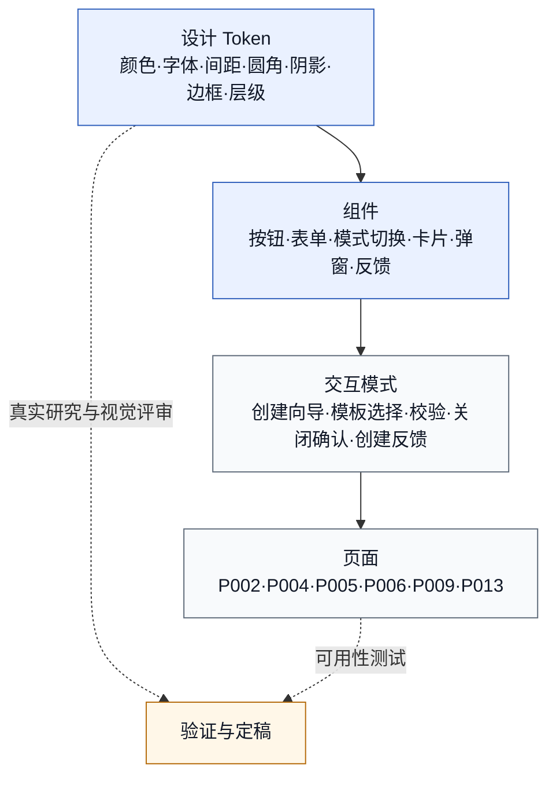
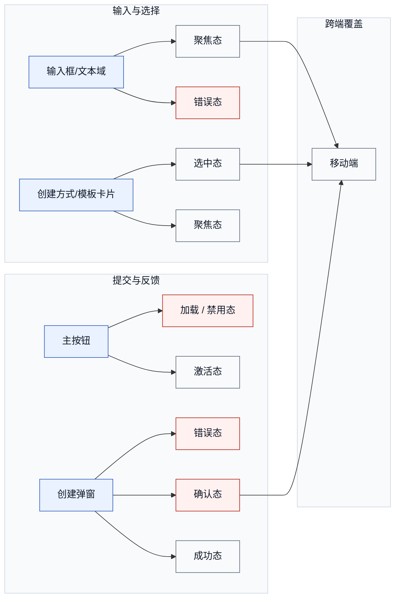
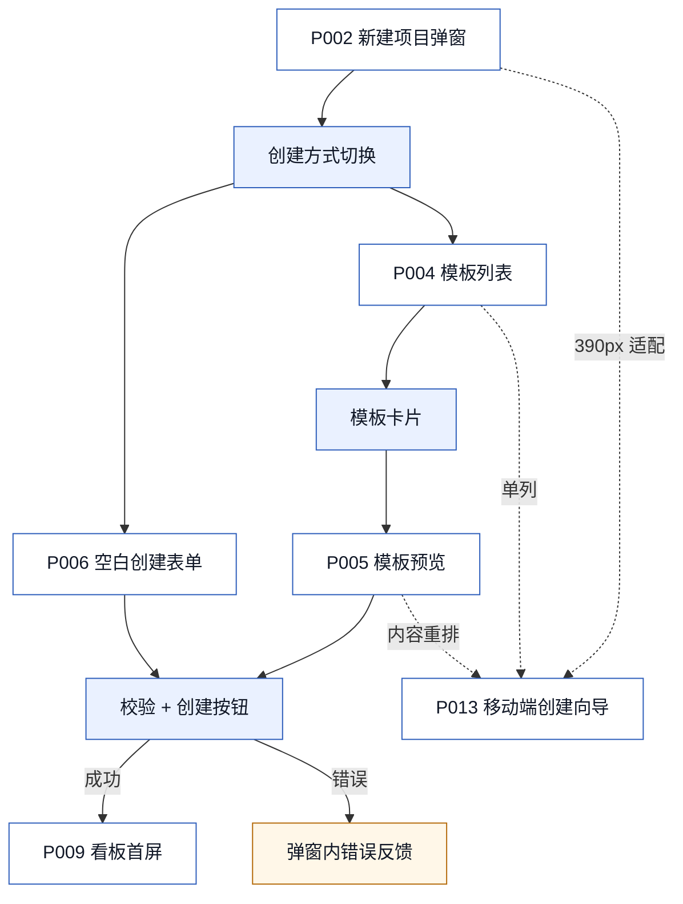
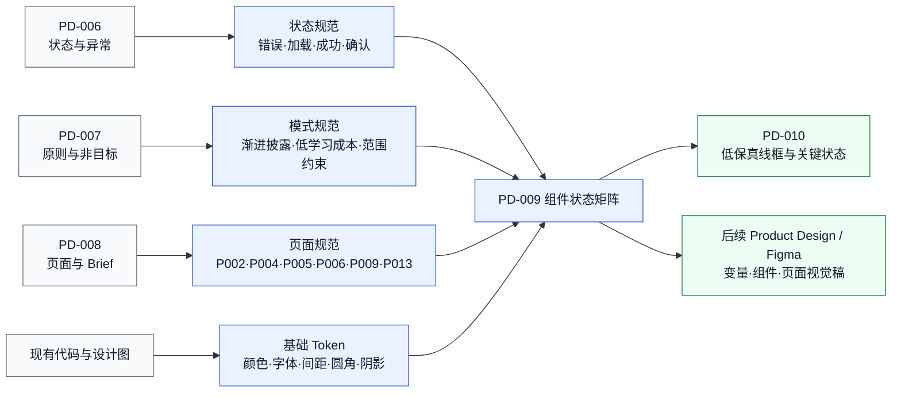

# 设计系统整理 PD-009

> **版本性质：假设版 / 待研究验证版 / 高保真前置设计输入**

| 项目 | 内容 |
|---|---|
| 日期 | 2026-06-17 |
| 状态 | Codex 验收修订版，待真实用户研究与视觉评审 |
| 聚焦范围 | Kanboard 新手项目创建与任务拆解体验优化 |
| 上游依据 | PD-006 交互状态规格、PD-007 设计原则与非目标、PD-008 页面清单与设计 Brief、现有 HTML/CSS/JS 与导出设计图 |

> **边界声明**：PD-009 是设计系统整理草案，不是最终视觉系统、正式 Figma Library 或工程组件实现。本文把当前代码事实与后续规范补齐项分开记录，避免把设计意图误写成已实现能力。

## 1. 文档目的

1. 盘点当前项目已经存在的视觉语言、界面结构、交互状态与设计图资产。
2. 将颜色、字体、间距、圆角、边框、阴影、层级和核心组件整理为可追溯的假设版设计系统。
3. 明确 PD-008 关键页面如何复用 token、组件和交互模式。
4. 为 PD-010 低保真线框、后续 Product Design / Figma 视觉设计和可用性测试提供一致输入。

### 1.1 状态标记

| 标记 | 含义 |
|---|---|
| `[现有实现]` | 可在当前 `styles.css`、`index.html` 或 `app.js` 中找到对应实现 |
| `[规范补齐]` | 上游状态规格要求存在，但当前代码尚未完整实现；仅作为后续设计输入 |
| `[待验证]` | 需要真实用户研究、可用性测试、视觉评审或可访问性实测后定稿 |

## 2. 上游输入来源

| 来源 | 本文提取内容 | 使用边界 |
|---|---|---|
| `styles.css` | 17 个颜色变量、阴影变量、字体栈、表单、按钮、卡片、弹窗、模板区域和 960px/640px 响应式规则 | 作为当前实现事实，不把缺失状态写成已实现 |
| `index.html` | `#projectDialog`、项目名称、项目描述、创建方式、模板列表、模板预览和底部操作区 | 作为现有组件层级依据 |
| `app.js` | 模板/空白模式切换、模板选择与预览、表单提交、项目生成和进入看板 | 当前创建为同步流程，尚无真实 loading、toast 或服务端错误恢复 |
| `docs/03-ux-design/交互状态规格-PD-006.md` | S01-S15、空值错误、创建失败、未保存关闭确认和示例任务编辑/删除状态 | 作为待补齐状态范围 |
| `docs/03-ux-design/设计原则与非目标-PD-007.md` | 决策原则、范围边界和取舍规则 | 约束组件密度与渐进披露 |
| `docs/03-ux-design/高保真原型页面清单与设计Brief-PD-008.md` | P001-P014 页面/弹窗/状态，以及 P002/P004/P005/P006/P009/P013 的页面级要求 | 作为页面映射基线，不代表高保真已完成 |
| `设计图/PD-006/` | 创建向导状态机、校验错误、关闭确认、示例任务状态图 | 作为状态覆盖证据 |
| `设计图/PD-007/` | 原则追踪、范围边界和决策取舍图 | 作为设计决策证据 |
| `设计图/PD-008/` | 页面结构、原型流程、状态覆盖和桌面弹窗结构示意图 | 作为线框与页面层级参考 |

## 3. 现有视觉系统盘点

### 3.1 视觉基调

当前界面是低装饰、信息密集的工作型看板：浅灰页面背景、白色面板、深色侧栏、蓝色主操作、青色强调和紧凑 4-22px 间距。弹窗、卡片和输入框统一使用 4-6px 小圆角，符合 Kanboard 管理工具的克制风格。

### 3.2 颜色与表面 `[现有实现]`

| CSS 变量 | 色值 | 当前用途 |
|---|---|---|
| `--bg` | `#edf0f3` | 页面背景 |
| `--panel` | `#ffffff` | 面板与卡片背景 |
| `--panel-soft` | `#f8fafc` | 次级面板背景 |
| `--column-bg` | `#f4f6f8` | 看板列背景 |
| `--nav` / `--nav-soft` | `#20242a` / `#2b3139` | 侧栏主、次背景 |
| `--border` / `--border-soft` | `#cfd7e2` / `#e3e8ee` | 默认与弱边框 |
| `--text` / `--muted` | `#111827` / `#5f6b7a` | 主文字与辅助文字 |
| `--primary` / `--primary-dark` / `--primary-soft` | `#2f5fbb` / `#244c99` / `#eaf1ff` | 主操作、hover、选中背景 |
| `--accent` | `#0f766e` | 强调信息 |
| `--success` / `--warning` / `--danger` | `#16803c` / `#b56b0b` / `#b42318` | 成功、警告和危险语义 |

### 3.3 字体、密度与形状 `[现有实现]`

| 类别 | 当前规则 | 证据示例 |
|---|---|---|
| 字体族 | `Aptos, "Segoe UI", "PingFang SC", "Microsoft YaHei", sans-serif` | `body` |
| 字号 | 11 / 12 / 13 / 14 / 15 / 18 / 23 / 25 / 30px | 标签、说明、正文、卡片、标题、指标 |
| 字重 | 400、620-650、680-780 | 正文、按钮/label、标题/数字 |
| 常用间距 | 4、5、8、9、10、12、14、16、20、22、24px | label、卡片、列、表单、弹窗和页面 |
| 圆角 | 4、5、6px | 标签、按钮、输入框、卡片、弹窗 |
| 表单高度 | 最小 36px | input/select/textarea |
| 图标按钮 | 34px 正方形 | `.icon-button` |

### 3.4 阴影、边框与层级

| 项目 | 当前规则 | 状态 |
|---|---|---|
| 卡片默认阴影 | `0 1px 0 rgba(15,23,42,.06)` | `[现有实现]` |
| 卡片 hover 阴影 | `0 8px 18px rgba(15,23,42,.10)` | `[现有实现]` |
| 弹窗阴影 | `0 18px 44px rgba(15,23,42,.18)` | `[现有实现]` |
| 弹窗遮罩 | `rgba(17,24,39,.46)` | `[现有实现]` |
| 默认边框 | `1px solid var(--border)` | `[现有实现]` |
| focus | 主色边框 + 3px 光晕；`:focus-visible` 另有 2px outline | `[现有实现]` |
| error | danger 边框、错误文本和字段关联 | `[规范补齐]` |
| selected | primary 边框 + primary-soft 或 3px 光晕 | `[现有实现]` |
| 下拉/菜单层级 | `z-index: 30/40` | `[现有实现]` |
| toast 层级 | 高于 dialog 的反馈层，建议 token 化 | `[规范补齐]` |

## 4. 设计 Token 草案

### 4.1 设计系统层级图

无障碍说明：该图自上而下表达 token 到页面的继承关系，虚线表示验证回路，不用颜色单独传递含义。

### 4.2 颜色 Token

| Token | 值 | 用途 | 来源/状态 |
|---|---|---|---|
| `color.bg.canvas` | `#edf0f3` | 页面背景 | `--bg` `[现有实现]` |
| `color.bg.panel` | `#ffffff` | 面板、卡片、弹窗 | `--panel` `[现有实现]` |
| `color.bg.subtle` | `#f8fafc` | 弱背景 | `--panel-soft` `[现有实现]` |
| `color.text.primary` | `#111827` | 主文字 | `--text` `[现有实现]` |
| `color.text.muted` | `#5f6b7a` | 辅助文字 | `--muted` `[现有实现]` |
| `color.action.primary` | `#2f5fbb` | 主按钮、焦点、选中 | `--primary` `[现有实现]` `[待验证]` |
| `color.action.primary-hover` | `#244c99` | 主按钮 hover | `--primary-dark` `[现有实现]` |
| `color.selection.bg` | `#eaf1ff` | 选中背景 | `--primary-soft` `[现有实现]` |
| `color.accent` | `#0f766e` | 强调 | `--accent` `[现有实现]` `[待验证]` |
| `color.feedback.success` | `#16803c` | 成功 | `--success` `[现有实现]` |
| `color.feedback.warning` | `#b56b0b` | 警告 | `--warning` `[现有实现]` |
| `color.feedback.error` | `#b42318` | 错误/危险 | `--danger` `[现有实现]` |
| `color.border.default` | `#cfd7e2` | 默认边框 | `--border` `[现有实现]` |
| `color.border.subtle` | `#e3e8ee` | 弱边框 | `--border-soft` `[现有实现]` |
| `color.state.disabled-text` | `#94a3b8` | 禁用文字 | 按钮禁用样式 `[现有实现]` |
| `color.state.disabled-bg` | `#eef2f6` | 禁用背景 | 按钮禁用样式 `[现有实现]` |

### 4.3 字体 Token

| Token | 值 | 建议用途 | 状态 |
|---|---|---|---|
| `font.family.ui` | Aptos / Segoe UI / PingFang SC / Microsoft YaHei / sans-serif | 全局 UI | `[现有实现]` |
| `font.size.xs/sm/base/md/lg/xl/2xl/3xl` | 11/12/13/14/15/18/23/30px | 标签到页面标题 | `[现有实现]` |
| `font.weight.regular/medium/semibold/bold` | 400/620/650/760 | 正文、label、按钮、标题 | `[现有实现]` |
| `font.line.compact/base/relaxed` | 1.2/1.45/1.5 | 标签、卡片说明、正文 | `[现有实现]`，命名为 `[规范补齐]` |

### 4.4 间距、圆角与尺寸 Token

| Token | 值 | 用途 | 状态 |
|---|---|---|---|
| `space.1/2/3/4/5/6/7` | 4/8/10/12/14/16/20px | 组件内外间距 | `[现有实现]`，语义分组为 `[规范补齐]` |
| `space.page.desktop` | 22px 24px 24px | 桌面工作区 | `[现有实现]` |
| `space.page.mobile` | 16px | 640px 以下工作区 | `[现有实现]` |
| `space.modal.inset` | 20px | 弹窗表单内边距 | `[现有实现]` |
| `radius.label/button/surface` | 4/5/6px | 标签、按钮、输入/卡片/弹窗 | `[现有实现]` |
| `size.control.min` | 36px | 表单控件最小高度 | `[现有实现]` |
| `size.icon-button` | 34px | 图标按钮 | `[现有实现]` |

### 4.5 阴影、边框与层级 Token

| Token | 值 | 用途 | 状态 |
|---|---|---|---|
| `shadow.card` | `0 1px 0 rgba(15,23,42,.06)` | 卡片默认 | `[现有实现]` |
| `shadow.card-hover` | `0 8px 18px rgba(15,23,42,.10)` | 卡片 hover | `[现有实现]` |
| `shadow.dialog` | `0 18px 44px rgba(15,23,42,.18)` | 弹窗 | `[现有实现]` |
| `border.default/hover/focus/error/selected` | 默认灰/深灰/主色/危险色/主色 | 交互状态 | error 为 `[规范补齐]`，其余 `[现有实现]` |
| `layer.page/dropdown/menu/dialog/toast` | 0/30/40/原生 top layer/待定 | 页面到反馈层 | toast 为 `[规范补齐]` |

## 5. 组件规范

### 5.1 按钮

| 组件 | 外观与行为 | 必要状态 | 状态 |
|---|---|---|---|
| 主按钮 | 蓝底白字，5px 圆角；创建项目等单一主操作 | default/hover/focus/active/disabled/loading | loading `[规范补齐]`，其余 `[现有实现]` |
| 次按钮 | 白底灰边；返回、取消 | default/hover/focus/active/disabled | `[现有实现]` |
| 危险按钮 | 次按钮结构 + danger 文字/边框；删除或不可逆确认 | default/hover/focus/confirmation | `[现有实现]` |
| 文本按钮 | 无容器底色，用于低优先级返回/帮助；不得替代主要操作 | default/hover/focus/disabled | `[规范补齐]` |
| 图标按钮 | 34px 正方形；必须有可访问名称和 tooltip | default/hover/focus/active/disabled | disabled/tooltip `[规范补齐]` |

### 5.2 输入框、文本域与错误

| 组件 | 规范 | 状态 |
|---|---|---|
| 单行输入 | 36px 最小高度，10px 水平内边距，6px 圆角 | default/focus/disabled `[现有实现]` |
| 文本域 | 与输入框同视觉语言，允许纵向 resize | `[现有实现]` |
| 必填错误 | danger 边框 + 字段下错误文本；用 `aria-invalid` 与 `aria-describedby` 关联，不只依赖颜色 | `[规范补齐]` |
| 字数限制 | 描述字段 160 字上限；临近上限显示计数 | maxlength `[现有实现]`，可见计数 `[规范补齐]` |

### 5.3 创建方式、模板与预览

| 组件 | 规范 | 状态 |
|---|---|---|
| 创建方式切换 | 两列 radio card，选中时主色边框和光晕；960px 以下单列 | default/hover/focus/selected/mobile |
| 模板卡片 | 标题 + 列/泳道/示例任务摘要；选中态使用主色边框和浅色背景 | default/hover/focus/active/selected |
| 模板预览区域 | 模板名、描述、看板列、泳道、示例任务三组摘要 | default/loading/error/mobile；后两项 `[规范补齐]` |
| 示例任务卡 | 沿用任务卡 3px 左边色条、标题、标签/辅助信息；示例身份必须清楚 | default/hover/selected/editing/deleted `[规范补齐]` |

### 5.4 弹窗、确认与反馈

| 组件 | 规范 | 状态 |
|---|---|---|
| 新建项目弹窗 | 当前 840px 宽弹窗，表单 20px 内边距；头部、内容、底部操作分区 | `[现有实现]` |
| 移动端创建容器 | 现有实现保留屏幕两侧 16px；是否改全屏抽屉/页面需验证 | `[待验证]` |
| 关闭/取消确认 | 有未保存内容时显示确认对话框；主操作“继续编辑”，危险操作“放弃并关闭” | `[规范补齐]` |
| 创建中 | 主按钮 loading、禁用重复提交、状态文本可被读屏读取 | `[规范补齐]` |
| 创建成功 | 关闭弹窗并进入 P009，看板首屏提供简短成功反馈 | 跳转 `[现有实现]`，toast `[规范补齐]` |
| 创建错误 | 保留输入，弹窗内显示可恢复错误；焦点移到错误摘要 | `[规范补齐]` |
| 标签/徽标 | 11px、700 字重、4px 圆角；文本与颜色共同表达状态 | 基础标签 `[现有实现]`，完整语义集 `[规范补齐]` |
| 辅助提示 | 12-13px muted 文本，紧邻关联控件；错误时使用 danger 且提供解决动作 | `[现有实现]` + `[规范补齐]` |

## 6. 组件状态矩阵

图例：`R` 必须覆盖，`O` 按场景覆盖，`-` 不适用。矩阵描述目标设计覆盖，不代表全部已编码。

| 组件 | default | hover | focus | active | disabled | loading | error | success | selected | confirmation | mobile |
|---|---|---|---|---|---|---|---|---|---|---|---|
| 主按钮 | R | R | R | R | R | R | - | O | - | - | R |
| 次/文本按钮 | R | R | R | R | R | - | - | - | - | O | R |
| 输入框/文本域 | R | - | R | - | R | O | R | O | - | - | R |
| 创建方式切换 | R | R | R | R | R | - | - | - | R | - | R |
| 模板卡片 | R | R | R | R | R | O | O | - | R | - | R |
| 模板预览 | R | - | - | - | - | R | R | O | R | - | R |
| 示例任务卡 | R | R | R | R | O | - | O | O | R | R | R |
| 新建项目弹窗 | R | - | R | - | - | R | R | R | - | R | R |
| 状态提示 | R | O | R | O | - | R | R | R | - | - | R |

### 6.1 组件状态覆盖图

无障碍说明：节点文字直接写明状态；红色仅用于加强错误与确认状态，不作为唯一识别方式。

## 7. 创建向导关键页面应用规则

| 页面 | 核心组件 | 关键 token/状态 | 当前与待补齐 |
|---|---|---|---|
| P002 新建项目弹窗默认态 | 840px dialog、标题、关闭按钮、名称/描述、创建方式、底部操作 | dialog 阴影、20px inset、focus | 主结构 `[现有实现]`；未保存关闭确认 `[规范补齐]` |
| P004 模板列表区域 | 模板卡片列表、选中态、辅助摘要 | primary border、primary-soft、12/14px 字体 | `[现有实现]`；键盘选中与 loading/error `[规范补齐]` |
| P005 模板预览区域 | 模板名/描述、列/泳道/示例任务摘要 | panel、border、12px gap、三列网格 | `[现有实现]`；窄屏内容优先级 `[待验证]` |
| P006 空白创建表单 | 名称、描述、主/次按钮 | input focus、required error、loading | 基础表单 `[现有实现]`；错误和 loading `[规范补齐]` |
| P009 创建成功后的看板首屏 | 项目列表 active、看板列、示例任务卡、成功提示 | selection、card、success | 页面进入 `[现有实现]`；成功提示和示例身份 `[规范补齐]` |
| P013 移动端 390px 创建向导 | 单列模式、单列模板、全宽操作、稳定焦点顺序 | 16px page inset、mobile state | 单列规则部分 `[现有实现]`；是否全屏 `[待验证]` |

### 7.1 创建向导组件应用图

无障碍说明：实线表示主流程，虚线表示移动端适配；成功和错误均有文字标签。

## 8. 响应式与移动端规范

| 范围 | 现有行为 | PD-009 规范 |
|---|---|---|
| `>960px` | 264px 侧栏 + 工作区；模板区 250px + 自适应预览 | 保持桌面高信息密度 |
| `<=960px` | 应用改为单列；模板区和创建方式改为单列 | 保持选择顺序与桌面一致 |
| `<=640px` | 工作区 16px padding；表单单列；弹窗仍为 `100vw - 32px` | 主次按钮可堆叠并保持至少 44px 触摸目标 `[规范补齐]` |
| `390px` | 尚无单独全屏容器规则 | `[待验证]` 弹窗、全屏 dialog 或独立页面哪种更利于新手完成任务 |

移动端不得通过缩小字体压缩内容；模板摘要可渐进披露，但项目名称、创建方式、当前模板和主操作必须在滚动顺序中可发现。

## 9. 可访问性规范

| 要求 | 当前基础 | PD-009 补齐标准 |
|---|---|---|
| 键盘与焦点 | 控件已有 `:focus-visible`；radio 使用原生 input | 弹窗打开聚焦名称，关闭后回到触发器；错误后聚焦错误摘要 |
| 可访问名称 | 关闭按钮有 `aria-label` | 图标按钮均需可访问名称和 tooltip |
| 错误识别 | required 使用浏览器基础校验 | 增加 `aria-invalid`、`aria-describedby` 和明确错误文本 |
| 状态播报 | 当前无创建中/成功/失败 live region | 反馈使用 `aria-live`，loading 不只依赖 spinner |
| 颜色与对比 | 主文本与白底对比充足；语义色已定义 | 在视觉稿阶段实测文字、边框、焦点和禁用态，不以估算代替测试 |
| 动效 | `prefers-reduced-motion` 已关闭任务卡 hover 位移 | 新增 loading、toast 和过渡时同步支持 reduced motion |
| 触摸目标 | 当前部分按钮高度 34-36px | 移动端交互目标建议至少 44px `[规范补齐]` |

## 10. 设计决策继承图

无障碍说明：每条继承关系都由节点文字解释；图从左到右表达“证据 -> 规范 -> 下一产物”。

## 11. 非目标和边界

| 非目标 | 说明 |
|---|---|
| 不把草案写成最终设计系统 | token 命名与新增状态仍需视觉评审和研究验证 |
| 不制作正式 Figma Library | 本文只提供可转译输入 |
| 不修改业务代码 | error/loading/toast 等只记录为后续实现要求 |
| 不扩展产品范围 | 仅覆盖 PD-003-PD-008 已定义的新手创建与任务拆解主线 |
| 不宣称真实验证完成 | 当前用户研究计划尚未执行，不能把假设当结论 |
| 不替代低保真与高保真 | 设计系统不能代替页面层级、交互和视觉稿绘制 |

## 12. 待研究验证与后续输入

### 12.1 必须验证的设计假设

| 编号 | 假设 | 验证方式 |
|---|---|---|
| V01 | `[待验证]` 当前主色与强调色是否最适合新手创建引导 | 视觉偏好访谈 + 可访问性对比实测 |
| V02 | `[待验证]` 当前间距密度是否适合第一次使用 Kanboard 的用户 | 首次任务可用性测试 + 认知负荷访谈 |
| V03 | `[待验证]` 模板卡片的信息密度是否足够帮助用户选择 | 模板选择任务、犹豫时长与选择理由 |
| V04 | `[待验证]` 模板预览区域是否需要更强的视觉层级 | 两版原型对比 + 信息回忆 |
| V05 | `[待验证]` 空白创建与模板创建的默认优先级是否合理 | 用户目标分群 + 首选路径观察 |
| V06 | `[待验证]` 移动端 390px 创建向导是否需要改为全屏而不是弹窗 | 移动端任务完成率与误触观察 |
| V07 | `[待验证]` 示例任务卡是否能帮助用户理解任务拆解粒度 | 创建后理解访谈 + 首次编辑行为 |
| V08 | `[待验证]` 错误提示与确认对话框的语气是否足够清晰 | 错误恢复任务 + 文案理解复述 |

### 12.2 给 PD-010 低保真线框任务的输入

- 按 P002、P004、P005、P006、P009、P013 绘制桌面与 390px 核心线框。
- 同屏表现 default、selected、loading、error、success、confirmation 六类关键状态。
- 使用本文组件层级和间距，不在低保真阶段另起视觉风格。
- 明确模板列表、模板预览、表单和底部操作区的滚动与固定关系。
- 将 V03-V06 转成线框中可比较的备选方案，但不要提前定稿。

### 12.3 给 Product Design / Figma 视觉设计的输入

- 将颜色、字体、间距、圆角、阴影和层级 token 转成 Figma Variables 草案。
- 将按钮、表单、模式切换、模板卡片、任务卡、弹窗、确认和反馈转成组件/变体。
- 以 PD-008 页面 Brief、PD-010 线框和本文状态矩阵共同作为页面生成依据。
- 视觉稿必须覆盖桌面与 390px，包含 focus、error、loading、success 和 confirmation 状态。
- 不直接把现有 CSS 数值视为最终品牌规范；所有 `[待验证]` 项保留标记。

### 12.4 真实用户研究后再定稿

主色与强调色、间距密度、模板卡片信息密度、模板预览层级、默认创建方式、移动端容器模式、示例任务卡信息结构、错误/确认文案、触摸目标和反馈持续时间均需在研究或实测后定稿。

## 13. Mermaid 导出结果

Codex 已在验收阶段将 4 张图分别导出为 PNG 和 SVG，集中存放在 `设计图/PD-009/`：

- `pd-009-system-hierarchy.*`
- `pd-009-component-state-coverage.*`
- `pd-009-wizard-component-application.*`
- `pd-009-decision-inheritance.*`

已检查中文字体、箭头、虚线、长标签换行、画布非空和浅色背景下的文字对比。

## 14. 设计图视觉规范

| 维度 | 统一规则 |
|---|---|
| 字体 | Aptos / Segoe UI / PingFang SC / Microsoft YaHei；导出基准 16px |
| 主节点 | `#eaf1ff` 背景、`#2f5fbb` 边框、`#111827` 文字 |
| 成功/完成 | `#ecfdf3` 背景、`#16803c` 边框 |
| 待确认/决策 | `#fff7e8` 背景、`#b56b0b` 边框 |
| 错误/危险 | `#fff1f0` 背景、`#b42318` 边框 |
| 次级/边界 | `#f8fafc` 背景、`#64748b` 或 `#cfd7e2` 边框 |
| 连线 | `#64748b`；实线表示主关系，虚线表示映射、验证或非主路径 |
| 布局 | 优先避免超过约 3:1 的超宽画布；长流程改为纵向或按阶段分区；关闭/异常分支聚合表达 |
| 命名 | 优先使用中文；保留 Token、Product Design、Figma 等必要专有名词 |
| 导出 | 每张 Mermaid 同时输出 PNG 与 SVG；PNG 必须目视检查文字、裁切、留白和连线 |

2026-06-17 已按本规范统一重渲染 `PD-005` 至 `PD-009` 共 28 张 Mermaid 图。
