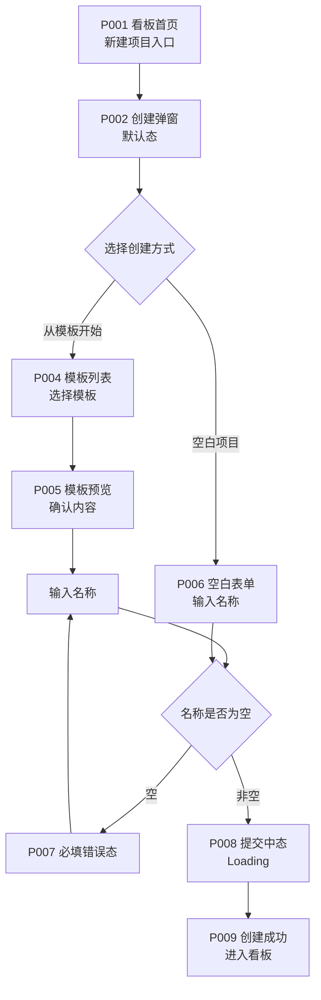
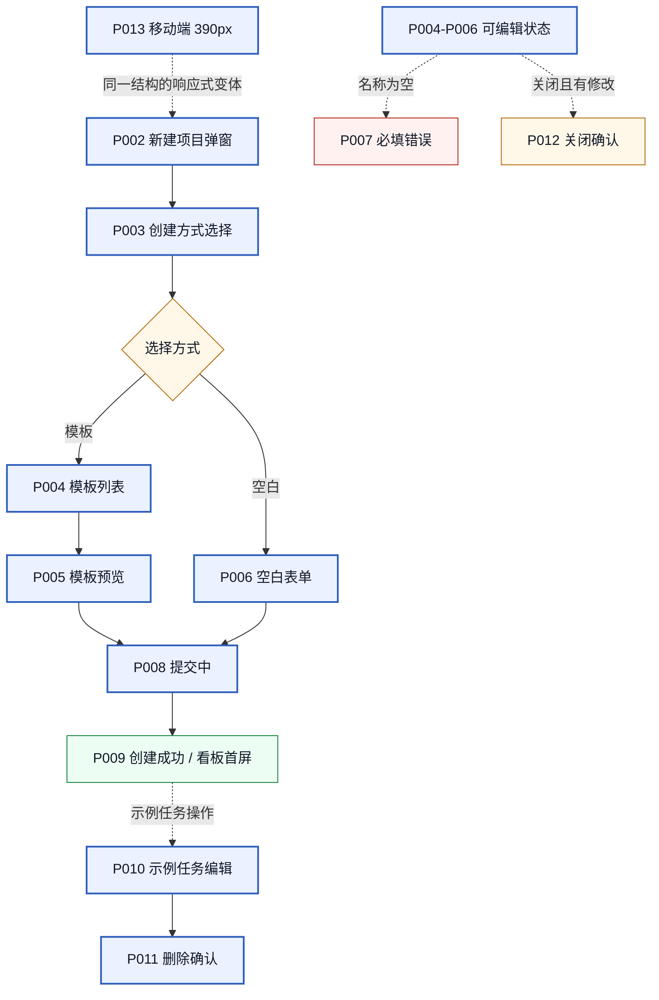
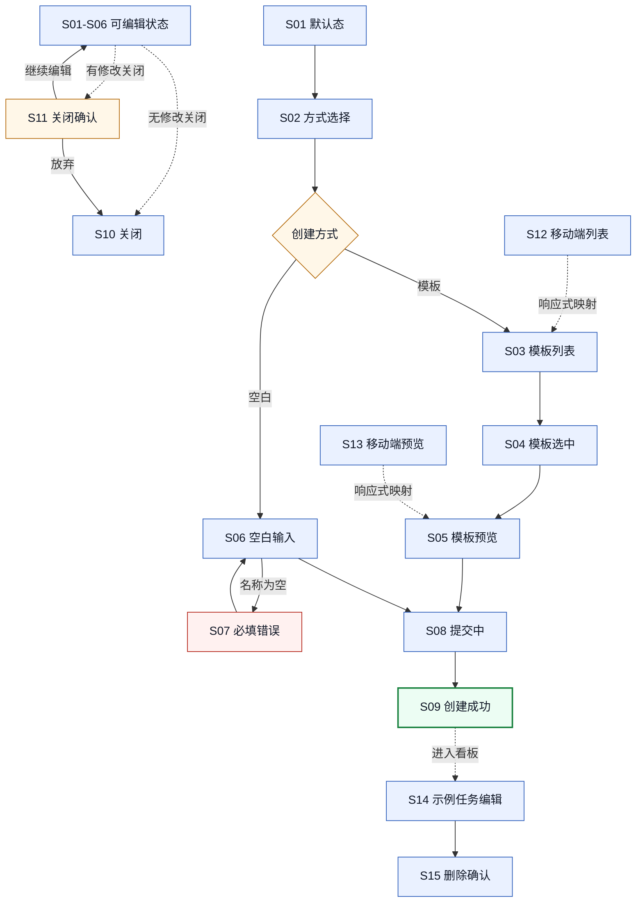
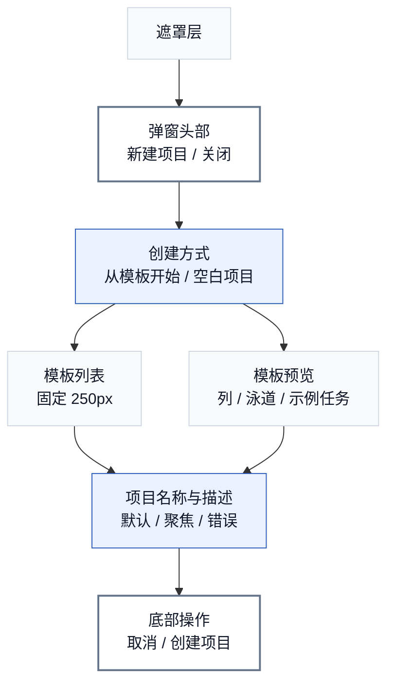

# 高保真原型页面清单与设计 Brief PD-008

> **版本性质：假设版 / 待研究验证版 / 高保真前置设计输入**

| 项目 | 内容 |
|---|---|
| 日期 | 2026-06-15 |
| 状态 | 高保真前置设计输入（非实际设计交付） |
| 聚焦范围 | 新手项目创建与任务拆解体验优化 |
| 上游依据 | PD-003~PD-007 |

> **声明**：本文档是高保真前的页面级设计输入，不是实际高保真设计交付。后续如需要实际设计图，由 Codex 调用 Product Design / Figma / 图像生成相关工作流完成。

## 1. 文档目的

1. 将 PD-003~PD-007 中的需求、用户故事、流程、状态、原则和边界转成可执行的页面级设计输入。
2. 明确后续真正做线框、高保真、Figma 或静态页面改造时，需要设计哪些页面、弹窗、状态、组件和响应式断点。
3. 用 Mermaid 绘制页面结构图、状态覆盖图、原型流图和关键页面结构示意图。

## 2. 上游输入来源

| 上游文档 | 提取内容 |
|---|---|
| PD-003 PRD 骨架 | 需求列表、功能说明、交互状态要求、验收标准 |
| PD-004 用户故事 | P0/P1/P2 故事、验收条件、边界情况 |
| PD-005 流程图与 IA | 优化前后路径、异常路径、信息架构、页面清单 |
| PD-006 交互状态规格 | S01-S15 状态规格、状态机、校验规则、按钮状态、移动端规则 |
| PD-007 设计原则与非目标 | 7 条原则、17 项非目标、取舍规则、范围边界 |

## 3. 原型范围边界

### In Scope

| 编号 | 范围 | 说明 |
|---|---|---|
| IS01 | 新建项目弹窗 | 宽版创建向导，支持空白/模板两种方式 |
| IS02 | 4 个内置模板 | 个人学习、求职准备、小团队迭代、Bug 跟踪 |
| IS03 | 模板预览 | 创建前预览列结构和示例卡 |
| IS04 | 示例卡编辑/删除 | 示例卡可修改、可删除 |
| IS05 | 空白创建路径 | 保持原有快捷性 |
| IS06 | 创建后进入看板 | 自动切换到新项目 |

### Out of Scope

| 编号 | 范围 | 说明 |
|---|---|---|
| OS01 | 看板页完整交互 | 拖拽、排序、泳道等不在本轮范围 |
| OS02 | 系统级页面 | API、部署、插件、运维等 |
| OS03 | 多视图系统 | 日历、甘特、列表等 |
| OS04 | Figma 文件 | 本文档只是设计输入，不是 Figma 文件 |

## 4. 页面/弹窗/状态总清单

| 编号 | 页面/弹窗/状态 | 优先级 | 对应状态 | 说明 |
|---|---|---|---|---|
| P001 | 看板首页/项目列表入口 | P0 | - | 新建项目按钮入口 |
| P002 | 新建项目弹窗默认态 | P0 | S01 | 弹窗打开，展示创建方式 |
| P003 | 创建方式选择区域 | P0 | S02 | 空白/模板切换 |
| P004 | 模板列表区域 | P0 | S03/S04 | 4 个模板卡片 |
| P005 | 模板预览区域 | P0 | S05 | 列结构和示例卡预览 |
| P006 | 空白创建表单 | P0 | S06 | 名称和描述输入 |
| P007 | 项目名称必填错误态 | P0 | S07 | 错误提示 |
| P008 | 提交中/创建中状态 | P0 | S08 | Loading 状态 |
| P009 | 创建成功后的看板首屏 | P0 | S09 | 弹窗关闭，进入看板 |
| P010 | 示例任务卡编辑态 | P0 | S14 | 任务详情弹窗 |
| P011 | 示例任务卡删除确认态 | P0 | S15 | 确认删除对话框 |
| P012 | 关闭/取消确认态 | P1 | S10/S11 | 未保存内容确认 |
| P013 | 移动端 390px 创建向导 | P0 | S12/S13 | 移动端适配 |
| P014 | 老用户空白创建快捷路径 | P0 | S06 | 不展示模板推荐 |

## 5. 核心页面设计 Brief

### P001：看板首页/项目列表入口

| 项目 | 内容 |
|---|---|
| 页面编号 | P001 |
| 页面名称 | 看板首页/项目列表入口 |
| 设计目标 | 提供清晰的新建项目入口，不干扰现有项目列表 |
| 对应用户故事/需求/状态编号 | US001, US006, R001 |
| 入口与退出路径 | 入口：用户在首页；退出：点击新建项目按钮 |
| 页面结构 | 顶部导航 + 项目列表 + 新建项目按钮 |
| 关键组件 | 新建项目按钮（主要操作） |
| 主操作与次操作 | 主：新建项目按钮；次：查看现有项目 |
| 文案与内容要求 | 按钮文案："新建项目" |
| 默认/空/错误/加载/成功/关闭状态 | 默认态：按钮可用 |
| 桌面端布局要求 | 按钮位于项目列表上方或右上角 |
| 移动端布局要求 | 按钮全宽或固定底部 |
| 设计原则引用 | DP01 低干扰新手桥梁 |
| 非目标/不做项 | 不涉及系统级功能 |
| 待验证点 | 无 |

### P002：新建项目弹窗默认态

| 项目 | 内容 |
|---|---|
| 页面编号 | P002 |
| 页面名称 | 新建项目弹窗默认态 |
| 设计目标 | 打开创建向导弹窗，展示创建方式选择 |
| 对应用户故事/需求/状态编号 | US001, US006, S01 |
| 入口与退出路径 | 入口：点击新建项目按钮；退出：关闭弹窗 |
| 页面结构 | 弹窗标题 + 创建方式切换 + 内容区域 + 底部按钮 |
| 关键组件 | 创建方式切换（Tab 或按钮组）、关闭按钮 |
| 主操作与次操作 | 主：选择创建方式；次：关闭弹窗 |
| 文案与内容要求 | 弹窗标题："新建项目"；方式："空白项目"、"从模板开始" |
| 默认/空/错误/加载/成功/关闭状态 | 默认态：展示创建方式 `[待验证：默认选中]` |
| 桌面端布局要求 | 弹窗居中，最大宽度 600px，背景半透明遮罩 |
| 移动端布局要求 | 弹窗占满屏幕宽度 |
| 设计原则引用 | DP01 低干扰新手桥梁, DP04 保留高级用户效率 |
| 非目标/不做项 | 不涉及系统级功能 |
| 待验证点 | 默认应该选中"从模板开始"还是"空白项目" `[待验证]` |

### P004：模板列表区域

| 项目 | 内容 |
|---|---|
| 页面编号 | P004 |
| 页面名称 | 模板列表区域 |
| 设计目标 | 展示 4 个模板卡片，帮助用户选择合适场景 |
| 对应用户故事/需求/状态编号 | US001, R002, S03/S04 |
| 入口与退出路径 | 入口：选择从模板开始；退出：选择模板或切换方式 |
| 页面结构 | 模板卡片网格（桌面端 2 列，移动端单列） |
| 关键组件 | 模板卡片（名称+描述+列预览）、预览并创建按钮 |
| 主操作与次操作 | 主：点击卡片选择模板；次：切换到空白项目 |
| 文案与内容要求 | 4 个模板名称和描述（见 PD-003 §9.2） |
| 默认/空/错误/加载/成功/关闭状态 | 默认态：卡片展示；选中态：卡片高亮+预览按钮 |
| 桌面端布局要求 | 2 列网格，卡片间距 16px |
| 移动端布局要求 | 单列，可纵向滚动 |
| 设计原则引用 | DP03 场景驱动 |
| 非目标/不做项 | 不做完整模板市场 |
| 待验证点 | 4 个模板是否覆盖核心场景 `[待验证]` |

### P005：模板预览区域

| 项目 | 内容 |
|---|---|
| 页面编号 | P005 |
| 页面名称 | 模板预览区域 |
| 设计目标 | 让用户在创建前确认模板是否合适 |
| 对应用户故事/需求/状态编号 | US002, R005, S05 |
| 入口与退出路径 | 入口：点击预览并创建；退出：创建或返回 |
| 页面结构 | 预览区（列结构+示例卡）+ 项目名称输入 + 底部按钮 |
| 关键组件 | 列结构展示、示例卡预览、名称输入框、创建按钮、返回按钮 |
| 主操作与次操作 | 主：输入名称并创建；次：返回选择 |
| 文案与内容要求 | 输入框占位符："请输入项目名称" |
| 默认/空/错误/加载/成功/关闭状态 | 默认态：展示预览；错误态：名称为空提示 |
| 桌面端布局要求 | 预览区可滚动，底部按钮固定 |
| 移动端布局要求 | 预览区全屏可滚动，按钮固定底部 |
| 设计原则引用 | DP02 在做中教 |
| 非目标/不做项 | 不涉及看板完整交互 |
| 待验证点 | 预览内容是否足够帮助判断 `[待验证]` |

### P009：创建成功后的看板首屏

| 项目 | 内容 |
|---|---|
| 页面编号 | P009 |
| 页面名称 | 创建成功后的看板首屏 |
| 设计目标 | 让用户立即看到已生成的可用看板 |
| 对应用户故事/需求/状态编号 | US003, R006, S09 |
| 入口与退出路径 | 入口：创建成功；退出：用户操作看板 |
| 页面结构 | 项目列表（新增项目）+ 看板（模板列+示例卡） |
| 关键组件 | 列、示例任务卡、项目列表高亮 |
| 主操作与次操作 | 主：查看和使用看板；次：编辑示例卡 |
| 文案与内容要求 | 无特殊文案 |
| 默认/空/错误/加载/成功/关闭状态 | 成功态：看板展示模板列和示例卡 |
| 桌面端布局要求 | 标准看板布局 |
| 移动端布局要求 | 标准看板布局 |
| 设计原则引用 | DP05 可删除可修改 |
| 非目标/不做项 | 不涉及看板拖拽等完整交互 |
| 待验证点 | 创建后轻提示是否必要 `[待验证]` |

### P013：移动端 390px 创建向导

| 项目 | 内容 |
|---|---|
| 页面编号 | P013 |
| 页面名称 | 移动端 390px 创建向导 |
| 设计目标 | 确保移动端创建向导可用 |
| 对应用户故事/需求/状态编号 | US008, S12/S13 |
| 入口与退出路径 | 入口：移动端点击新建项目；退出：创建或关闭 |
| 页面结构 | 全屏弹窗 + 垂直布局 |
| 关键组件 | 创建方式（全宽按钮）、模板卡片（单列）、预览区（可滚动） |
| 主操作与次操作 | 主：选择模板并创建；次：切换方式 |
| 文案与内容要求 | 与桌面端一致 |
| 默认/空/错误/加载/成功/关闭状态 | 与桌面端一致 |
| 桌面端布局要求 | 不适用 |
| 移动端布局要求 | 弹窗全宽、卡片单列、按钮全宽、无横向溢出 |
| 设计原则引用 | DP01 低干扰新手桥梁 |
| 非目标/不做项 | 不涉及平板断点 |
| 待验证点 | 移动端创建向导是否足够可用 `[待验证]` |

## 6. 关键状态与变体清单

### 弹窗状态变体

| 状态编号 | 状态名称 | 触发条件 | 界面表现 |
|---|---|---|---|
| S01 | 默认态 | 打开弹窗 | 展示创建方式选择 |
| S02 | 方式选择态 | 切换方式 | 高亮选中方式 |
| S03 | 模板列表默认态 | 选择模板开始 | 展示 4 个卡片 |
| S04 | 模板列表选中态 | 点击卡片 | 卡片高亮+预览按钮 |
| S05 | 模板预览态 | 点击预览 | 展示列结构和示例卡 |
| S06 | 空白输入态 | 选择空白项目 | 展示名称输入 |
| S07 | 必填错误态 | 名称为空提交 | 错误提示+红边框 |
| S08 | 提交中态 | 点击创建 | Loading 按钮 |
| S09 | 创建成功态 | 创建成功 | 弹窗关闭 |
| S10 | 关闭态 | 点击关闭 | 弹窗关闭 |
| S11 | 关闭确认态 | 有内容时关闭 | 确认对话框 |

### 示例卡操作变体

| 状态编号 | 状态名称 | 触发条件 | 界面表现 |
|---|---|---|---|
| S14 | 编辑态 | 点击示例卡 | 任务详情弹窗 |
| S15 | 删除确认态 | 点击删除 | 确认对话框 |

## 7. 响应式与移动端要求

### 断点定义

| 断点 | 宽度 | 适配规则 |
|---|---|---|
| 移动端 | < 768px | 弹窗全宽、卡片单列、按钮全宽 |
| 平板 | 768-1024px | 弹窗居中、卡片 2 列 |
| 桌面端 | > 1024px | 弹窗居中、卡片 2 列 |

### 移动端关键适配

| 组件 | 桌面端 | 移动端 |
|---|---|---|
| 创建向导弹窗 | 居中 600px | 全宽 |
| 创建方式切换 | 水平排列 | 垂直全宽 |
| 模板卡片 | 2 列网格 | 单列 |
| 模板预览 | 可滚动区域 | 全屏可滚动 |
| 确认对话框 | 居中弹窗 | 居中+按钮全宽 |
| 项目名称输入 | 标准输入框 | 全宽输入框 |

## 8. 内容与数据填充要求

### 模板内容

| 模板名称 | 场景描述 | 列结构 | 示例卡数量 |
|---|---|---|---|
| 个人学习项目 | 管理课程学习、技能提升 | 待学、学习中、已学完 | 3 张 |
| 求职准备项目 | 管理求职准备过程 | 需求调研、方案设计、原型制作、复盘迭代 | 4 张 |
| 小团队迭代 | 管理产品迭代 | 待办、进行中、待评审、已完成 | 3 张 |
| Bug 跟踪 | 管理 Bug 修复流程 | 待确认、修复中、待验证、已关闭 | 3 张 |

### 示例卡内容要求

- 标题：具体可执行的任务（如"整理作品集目录"）
- 描述：简短说明（可选）
- 负责人：预设用户（如"我"）
- 优先级：覆盖不同优先级
- 截止时间：预设日期

## 9. 可访问性与键盘操作要求

### 键盘操作

| 操作 | 快捷键 | 说明 |
|---|---|---|
| 关闭弹窗 | ESC | 任何时候可关闭 |
| 切换创建方式 | Tab | 在方式切换间导航 |
| 选择模板 | Enter/Space | 在模板卡片上确认 |
| 切换模板 | 方向键 | 在模板列表间移动 |
| 提交创建 | Enter | 在名称输入框中确认 |

### 可访问性要求

| 要求 | 说明 |
|---|---|
| 焦点管理 | 弹窗打开时焦点在第一个交互元素 |
| 屏幕阅读器 | 所有交互元素有 ARIA 标签 |
| 颜色对比 | 文字与背景对比度 ≥ 4.5:1 |
| 错误提示 | 错误信息关联到输入框 |

## 10. 后续线框/高保真/Figma 输入

### 屏幕优先级

| 优先级 | 屏幕 | 说明 |
|---|---|---|
| P0 必画 | P002 新建项目弹窗默认态 | 核心入口 |
| P0 必画 | P004 模板列表区域 | 核心选择 |
| P0 必画 | P005 模板预览区域 | 核心预览 |
| P0 必画 | P006 空白创建表单 | 老用户路径 |
| P0 必画 | P009 创建成功看板首屏 | 核心结果 |
| P0 必画 | P013 移动端创建向导 | 移动端适配 |
| P1 可补充 | P007 必填错误态 | 错误处理 |
| P1 可补充 | P010 示例卡编辑态 | 示例卡操作 |
| P1 可补充 | P011 删除确认态 | 示例卡操作 |
| P2 暂不画 | P012 关闭确认态 | 边缘状态 |

### Mermaid 原型流图

### Mermaid 页面结构图

### Mermaid 状态覆盖图

### Mermaid 新建项目弹窗桌面端结构示意图

> 该图用于说明区域层级与内容关系，不是实际低保真线框；真正的桌面端和 390px 线框由 PD-010 绘制。

## 11. 待研究验证与风险

### 待验证点

| 编号 | 待验证内容 | 验证方式 | 依赖 |
|---|---|---|---|
| V01 | 默认选中"从模板开始"是否合适 | PD-002 可用性测试 | PD-002 执行 |
| V02 | 4 个模板是否覆盖核心场景 | PD-002 访谈确认 | PD-002 执行 |
| V03 | 模板预览是否足够帮助判断 | PD-002 可用性测试 | PD-002 执行 |
| V04 | 创建后轻提示是否必要 | PD-002 可用性测试 | PD-002 执行 |
| V05 | 老用户是否被模板入口干扰 | PD-002 路径 C | PD-002 执行 |
| V06 | 移动端是否足够可用 | PD-002 移动端测试 | PD-002 执行 |
| V07 | 示例卡是否能帮助理解粒度 | PD-002 可用性测试 | PD-002 执行 |

### 风险

| 风险 | 影响 | 缓解 |
|---|---|---|
| 页面清单可能遗漏 | 高保真设计时发现缺少页面 | 设计评审时复核 |
| 移动端适配不足 | 移动端体验差 | PD-002 移动端测试 |
| 示例卡内容不当 | 用户直接删除，没有帮助 | PD-002 观察示例卡使用 |

## 12. 已导出的设计图

| 编号 | 图名 | PNG | SVG |
|---|---|---|---|
| M01 | 原型流图 | `设计图/PD-008/pd-008-prototype-flow.png` | `设计图/PD-008/pd-008-prototype-flow.svg` |
| M02 | 页面结构图 | `设计图/PD-008/pd-008-page-structure.png` | `设计图/PD-008/pd-008-page-structure.svg` |
| M03 | 状态覆盖图 | `设计图/PD-008/pd-008-state-coverage.png` | `设计图/PD-008/pd-008-state-coverage.svg` |
| M04 | 新建项目弹窗桌面端结构示意图（非低保真线框） | `设计图/PD-008/pd-008-desktop-modal-structure.png` | `设计图/PD-008/pd-008-desktop-modal-structure.svg` |

> 导出说明：2026-06-17 已由 Codex 修复页面/状态关系、纠正“线框图”误命名并按统一设计图规范重新导出。以上图仅作为后续低保真线框、高保真视觉探索、Figma 或 Product Design 工作流的输入材料使用。
