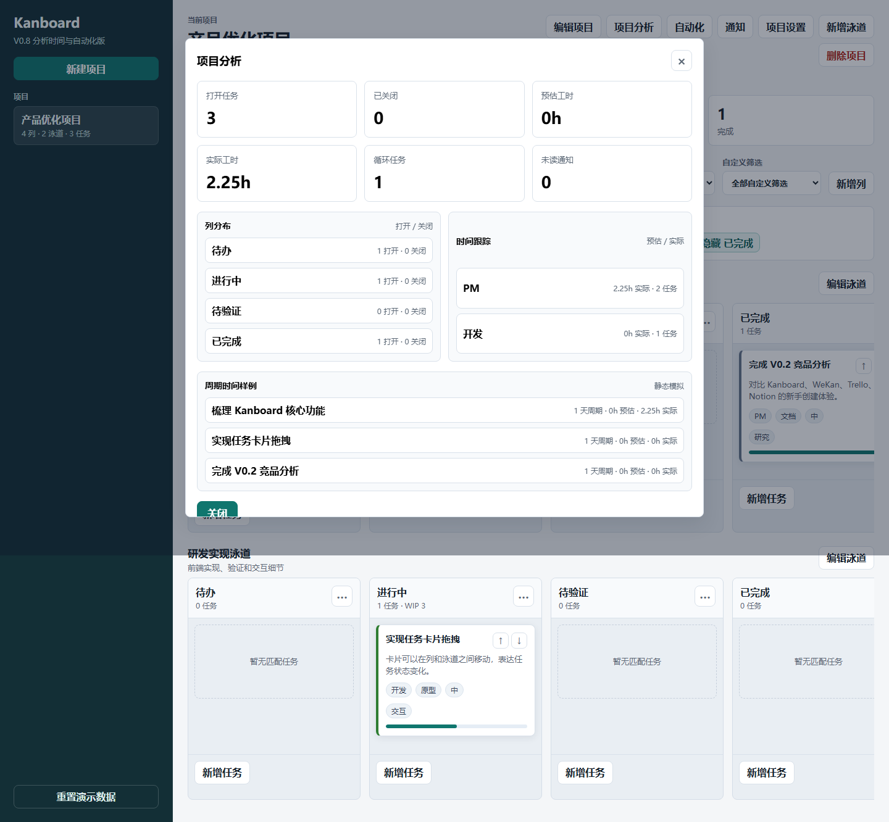

# 分析时间与自动化补齐说明 V0.8

| 项目 | 内容 |
|---|---|
| 版本 | V0.8 |
| 日期 | 2026-06-01 |
| 状态 | 已完成 |
| 主题 | 补齐 Kanboard 分析、时间跟踪、循环任务、自动化和通知中心的静态能力 |

## 1. 为什么做这一版

V0.6 补齐了视图和任务动作，V0.7 补齐了项目配置与协作。本轮继续补 Kanboard 的进阶能力：项目分析、时间跟踪、自动化和通知。

这些能力在真实系统里依赖后台任务、通知通道和数据统计。本项目仍然保持静态复现，因此本轮目标是让用户能看到配置入口、操作路径和数据反馈，而不是实现真实后台调度。

## 2. 本轮新增

- 顶部新增“项目分析”入口。
- 顶部新增“自动化”入口。
- 顶部新增“通知”入口。
- 项目分析支持：
  - 打开任务数
  - 已关闭任务数
  - 预估工时
  - 实际工时
  - 循环任务数
  - 未读通知数
  - 列分布
  - 负责人时间分布
  - 周期时间样例
- 任务详情支持：
  - 实际工时字段
  - 时间记录列表
  - 时间记录说明
  - 循环任务频率
  - 下次生成日期
- 自动化规则支持：
  - 任务移动到列
  - 任务即将截止
  - 任务被关闭
  - 任务创建
  - 发送通知、添加评论、分配负责人、添加标签等动作
  - 启用 / 停用 / 删除规则
  - 模拟执行规则
- 通知中心支持：
  - 展示自动化生成的通知
  - 未读 / 已读状态
  - 全部已读

## 3. 产品判断

- 自动化规则是静态模拟，不接真实后台任务。
- 通知中心只展示本地生成的通知，不接邮件、浏览器推送或第三方通道。
- 时间跟踪采用“实际工时 + 时间记录”的方式，既能快速填总数，也能保留过程记录。
- 循环任务只记录规则，不自动生成新卡片，避免静态页面里出现难以解释的定时行为。

## 4. 验证记录

已通过自动化验证：

- `node --check app.js` 通过。
- 任务实际工时可以保存。
- 时间记录可以保存。
- 循环任务频率和下次日期可以保存。
- 项目分析弹窗可以展示 6 个核心指标。
- 自动化规则可以新增。
- 自动化规则可以模拟执行并生成通知。
- 通知可以全部标记为已读。
- 移动端 390px 宽度下项目分析弹窗无横向溢出。

## 5. 截图

## 6. 下一步

V0.3 到 V0.8 已经覆盖了 Kanboard 用户侧主要静态能力。下一步可以进入 V0.9：用 Figma 输出高保真原型和优化前后对比，重点表达“原 Kanboard 新手创建体验”和“优化后的模板向导体验”。
