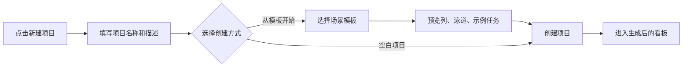
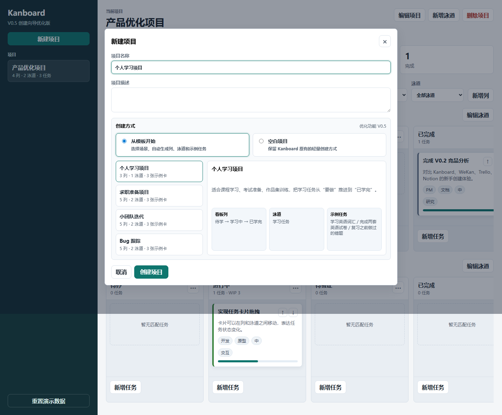

# 新手创建向导说明 V0.5

| 项目 | 内容 |
|---|---|
| 版本 | V0.5 |
| 日期 | 2026-06-01 |
| 状态 | 已完成 |
| 主题 | 在 Kanboard 复现版上加入新手项目创建向导 |

## 1. 为什么做这一版

V0.3 和 V0.4 已经完成了 Kanboard 的核心复现：项目、看板列、任务卡、泳道、卡片流转、子任务、评论和活动记录。到了 V0.5，重点从“复现原产品”切到“基于复现版做优化”。

本轮优化对应前期调研里的核心问题：新手知道自己想管理任务，但不知道如何从空白项目拆成一张可用看板。

## 2. 产品判断

这次没有把向导拆成独立页面，而是嵌入原来的“新建项目”弹窗，原因是：

- Kanboard 的优势是轻量，新功能不应该让创建路径变重。
- 老用户仍然可以选择“空白项目”，保留原有习惯。
- 新用户可以选择“从模板开始”，直接获得列、泳道和示例任务卡。
- 嵌入原入口便于做“优化前 / 优化后”对比，适合作品集表达。

## 3. 本轮功能范围

已实现：

- 新建项目弹窗升级为宽版创建向导。
- 支持“从模板开始”和“空白项目”两种创建方式。
- 支持 4 个内置模板：
  - 个人学习项目
  - 求职准备项目
  - 小团队迭代
  - Bug 跟踪
- 支持模板选择和创建前预览。
- 根据模板自动生成看板列、泳道和示例任务卡。
- 个人学习项目模板采用用户前面选定的结构：
  - 看板列：待学、学习中、已学完
  - 示例卡：学习英语词汇、完成两套英语试卷、复习之前做过的错题
- 支持空白项目创建，保留待办、进行中、已完成三列。

未做：

- 未加入账号、权限、成员邀请等系统功能。
- 未加入模板编辑器，模板暂时内置在前端数据中。
- 未加入完整 PRD 页面，后续会在 V1.0 作品集整理阶段补齐。

## 4. 交互流程



## 5. 验证记录

已通过浏览器自动化验证：

- 模板项目可以创建成功。
- 个人学习模板会生成“待学 / 学习中 / 已学完”三列。
- 个人学习模板会生成 3 张示例任务卡。
- 空白项目可以创建成功，且初始任务数为 0。
- 桌面端创建向导截图已生成。
- 移动端 390px 宽度下无横向溢出，模板区和创建方式区会收成单列。

验证命令：

```powershell
node --check app.js
```

浏览器验证使用 Playwright 打开本地 `index.html` 完成。

## 6. 截图



## 7. 下一步

进入 V0.6 Kanboard 完整复现补齐。Figma 不替代静态页面，且应在主要用户侧功能补齐后再开始，避免把一个功能不完整的复现版过早包装成高保真原型。
