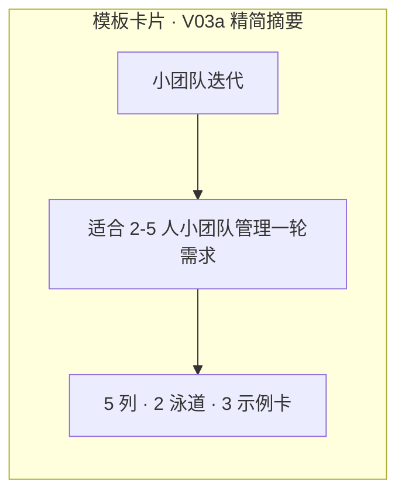
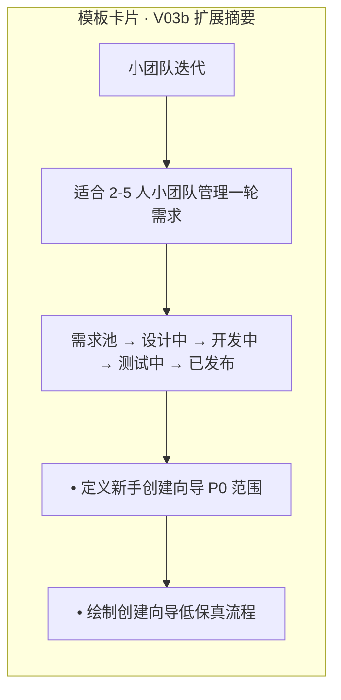
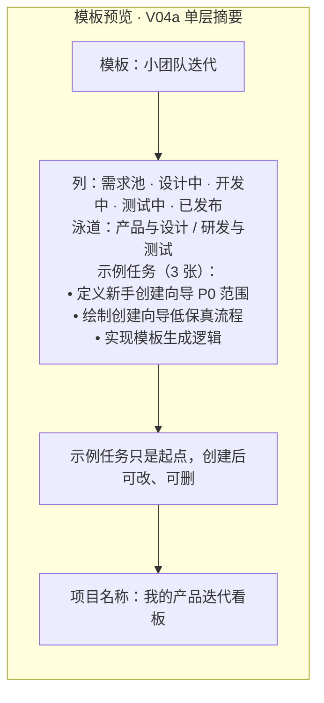
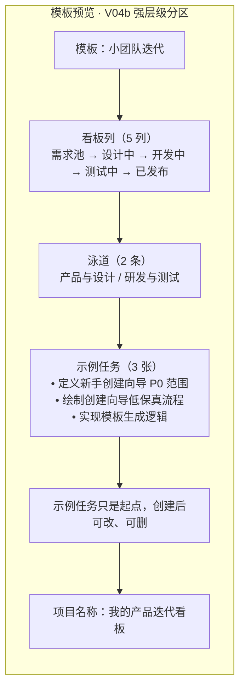
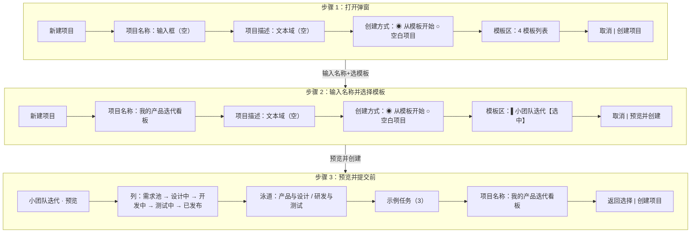
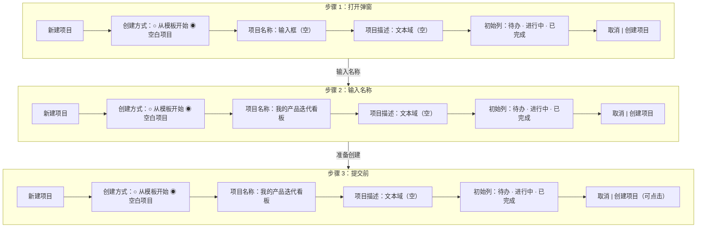
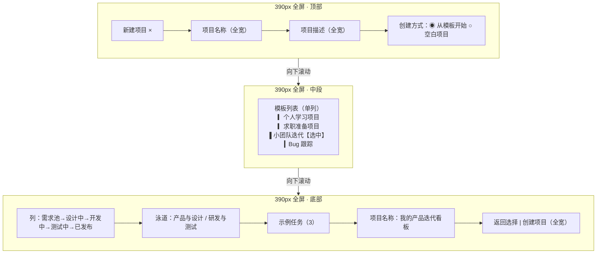
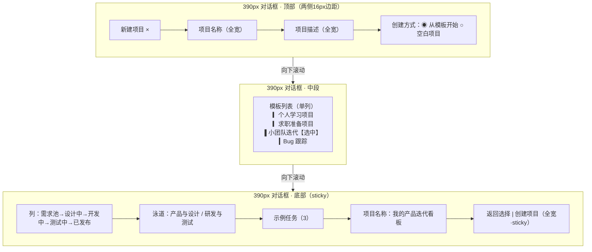
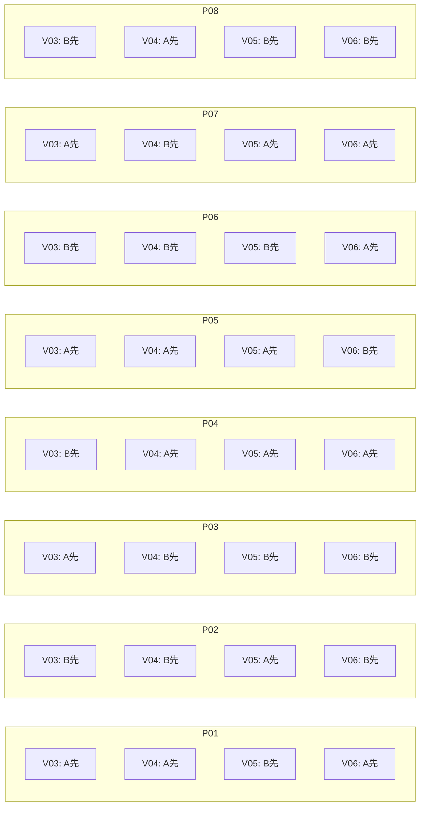
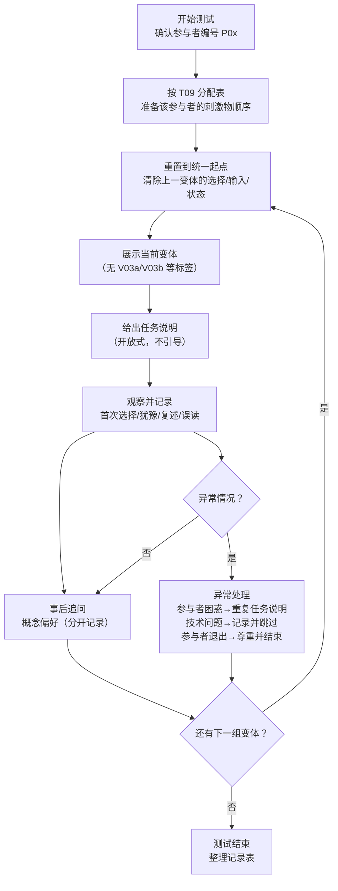

# 低保真对照测试资产 PD-010C

> **版本性质：验证资产准备 / 非真人测试结论 / PD-011 Gate 输入**

| 项目 | 内容 |
|---|---|
| 日期 | 2026-06-22 |
| 状态 | V03~V06 低保真 A/B 对照测试刺激物与反平衡执行包，未进入高保真 / Figma / 代码 |
| 聚焦范围 | V03 模板卡片密度、V04 预览层级、V05 默认创建方式+名称位置、V06 390px 容器模式 |
| Product Design 路由 | 总工作流 `product-design-workflow`；register `product`；shape 后、craft 前的 validation asset preparation |
| 上游依据 | PD-010、PD-010A、PD-010B、PD-006、PD-009、`app.js` PROJECT_TEMPLATES |

> **边界声明**：本文为对照测试准备可主持操作的低保真刺激物，不是高保真视觉稿、Figma 文件或代码实现。所有 Mermaid 源码只表达结构与状态，不用颜色暗示方案优劣。本文不包含任何真实参与者数据、完成率、耗时、偏好结论或虚构引语。所有结果字段保持空白，等待真实执行填写。5~8 人小样本仅用于方向性形成性判断，不产生统计显著性结论。

## 1. 版本性质、证据边界与使用范围

### 1.1 文档性质

本文是 PD-010A 形成性评审后的**对照测试资产准备**，为 V03~V06 四组 A/B 验证提供：
- 内容匹配的成对刺激物（统一数据、统一文案、统一任务起点）
- 反平衡分配表（P01~P08，每组 A/B 首曝各 4 次）
- 主持人操作卡（开始状态、可说/可指、跳转、返回、重置、异常处理）
- 测量与声明边界（区分行为观察、理解复述、概念偏好）

### 1.2 证据边界

| 标签 | 含义 | 可信度 |
|---|---|---|
| `[代码事实]` | 来自 `app.js` PROJECT_TEMPLATES 的可直接验证的模板数据 | 高（事实） |
| `[规格依据]` | 来自 PD-010/PD-010A 的明确规格要求 | 高（规格） |
| `[专家判断]` | 本次资产准备中的设计推断 | 中（假设，待验证） |
| `[待真人验证]` | 必须由真实参与者确认才能定稿 | —（未验证） |

### 1.3 使用范围

- **可做**：作为 moderated paper prototype 的刺激物，由主持人按操作卡向参与者展示
- **不可做**：直接作为线上可点击原型；产生点击率、自动埋点或任务耗时结论
- **不修改**：不修改 `index.html`、`styles.css`、`app.js`、生产原型或任何上游文档

## 2. 上游依据与 V03~V06 既定定义

### 2.1 上游文档链

| 上游 | 提取内容 | 对本任务的约束 |
|---|---|---|
| PD-010 §6 | 4 模板真实列/泳道/示例任务数据 | 标准数据集必须来自此处，不得自行发明 |
| PD-010 §9 | V03~V06 A/B 定义与对比维度 | 每组只比较一个结构差异 |
| PD-010A §4 | FT1~FT6 专家走查与 R01~R14 问题清单 | 对照资产需覆盖走查发现的关键验证点 |
| PD-010A §6 | V03~V06 暂定决策与验证任务 | 资产设计需支持这些验证任务 |
| PD-010A §8 | 真人形成性测试执行包模板 | 本任务准备的资产直接输入该执行包 |
| PD-010B | R06/R08/R11/R14 修复，370/370 审计 | V06b 必须表现修复后的 sticky 底部操作 |
| PD-006 S01~S15 | 交互状态规格 | V05 三步状态需与状态规格一致 |
| `app.js:699-1206` | PROJECT_TEMPLATES 4 模板完整数据 | 标准数据集的真实内容来源 |

### 2.2 V03~V06 既定定义

| 变体 | 自变量 | V0xa | V0xb |
|---|---|---|---|
| V03 | 模板卡片信息密度 | 精简摘要：名称+场景+数量 | 扩展摘要：名称+场景+列名链+前2张示例标题 |
| V04 | 预览信息层级 | 单层摘要：三组平铺文本 | 强层级分区：分区标题+缩进+弱背景区分 |
| V05 | 默认创建方式+名称位置 | 默认"从模板开始"+名称在顶部 | 默认"空白项目"+名称在创建方式内 |
| V06 | 390px 容器模式 | 全屏容器（占满 390px） | 保留 16px 边距对话框+底部操作 sticky |

## 3. 标准数据集和无关变量控制表

### 3.1 标准数据集来源

从 `app.js` PROJECT_TEMPLATES（line 699+）复制真实模板数据，建立统一测试数据集。

**主测试模板：小团队迭代**（`id: "sprint"`）

| 项 | 内容 |
|---|---|
| 模板名 | 小团队迭代 |
| 场景描述 | 适合 2-5 人小团队管理一轮需求，从需求池推进到发布验收 |
| 列结构（5 列） | 需求池 → 设计中 → 开发中 → 测试中 → 已发布 |
| 泳道（2 条） | 产品与设计 / 研发与测试 |
| 示例任务（3 张） | ① 定义新手创建向导 P0 范围（需求池·PM·高） ② 绘制创建向导低保真流程（设计中·设计·中） ③ 实现模板生成逻辑（开发中·开发·高） |

**复杂模板：个人学习项目**（`id: "learning"`，用于 V04 复杂场景对比）

| 项 | 内容 |
|---|---|
| 模板名 | 个人学习项目 |
| 场景描述 | 适合从 0 开始学习产品经理能力，把认知、调研、PRD、原型、协作和作品集训练拆成可推进任务 |
| 列结构（6 列） | 待规划 → 资料学习 → 案例拆解 → 实操产出 → 复盘完善 → 已掌握 |
| 泳道（7 条） | 产品认知 / 用户研究 / 需求分析 / 方案表达 / 协作交付 / 数据增长 / 作品集求职 |
| 示例任务（20 张） | 完整列表见 `app.js:721-940` |

**辅助模板**（卡片展示用，不作为主要 A/B 测试模板）：

| 模板名 | 列 | 泳道 | 示例卡 |
|---|---|---|---|
| 求职准备项目 | 5（待准备/进行中/已投递/面试中/已完成） | 2（材料准备/投递跟进） | 3 |
| Bug 跟踪 | 5（已报告/待确认/修复中/待验证/已关闭） | 2（前端问题/数据问题） | 3 |

### 3.2 无关变量控制表

| 控制项 | 规则 | 理由 |
|---|---|---|
| 项目名 | 统一为「我的产品迭代看板」 | 消除命名差异对选择的影响 |
| 模板名 | 四模板名称、场景描述原文不变 | 来自代码事实，不发明 |
| 列名/泳道名 | 使用模板原始列名/泳道名 | 来自代码事实 |
| 示例任务 | 使用模板原始示例任务标题与描述 | 来自代码事实 |
| 按钮文案 | 统一「取消」「创建项目」「预览并创建」「返回选择」 | 与 PD-010 线框一致 |
| 图纸尺寸 | A/B 图统一尺寸、灰阶、线宽、字体层级 | 除目标自变量外无视觉差异 |
| 信息顺序 | A/B 图的信息排列顺序一致 | 阅读顺序不影响对比 |
| 状态起点 | 每次测试从统一起点开始 | 防止上一变体泄漏 |
| 主持话术 | 中性，不使用"优化版""更详细""更清楚""现有版" | 防止引导 |

## 4. T01~T10 资产索引

| 编号 | 名称 | 用途 | 变体 |
|---|---|---|---|
| T01 | V03a 精简模板卡片 | 模板列表中单张卡片的精简信息展示 | V03a |
| T02 | V03b 扩展模板卡片 | 模板列表中单张卡片的扩展信息展示 | V03b |
| T03 | V04a 单层摘要预览 | 选中模板后的预览区，三组信息平铺 | V04a |
| T04 | V04b 强层级分区预览 | 选中模板后的预览区，分区标题+层级 | V04b |
| T05 | V05a 默认模板+名称在顶部 三步状态板 | 创建流程三步：打开→选择→提交前 | V05a |
| T06 | V05b 默认空白+名称在创建方式内 三步状态板 | 创建流程三步：打开→输入→提交前 | V05b |
| T07 | V06a 390px 全屏容器 三状态板 | 移动端顶部/中段/底部三个滚动位置 | V06a |
| T08 | V06b 390px 保留16px边距对话框+底部sticky 三状态板 | 移动端顶部/中段/底部三个滚动位置 | V06b |
| T09 | P01~P08 A/B 反平衡分配与先后顺序图 | 8 位参与者的变体分配与顺序 | 全局 |
| T10 | 主持人资产选择、跳转、重置与记录流程图 | 主持人操作流程 | 全局 |

## 5. T01~T10 Mermaid 源码及每图主持说明

### 5.1 T01 V03a 精简模板卡片

**用途**：模板列表中单张卡片的精简信息密度方案。只显示名称、场景摘要和列/泳道/示例卡数量。

**主持说明**：展示给 V03a 组参与者。主持人指向卡片，询问"你会选这个模板吗？为什么？"记录首次选择、犹豫时长和选择理由。

**可观察指标**：首次选择、是否需要进入预览、选择理由复述、犹豫时长。

### 5.2 T02 V03b 扩展模板卡片

**用途**：模板列表中单张卡片的扩展信息密度方案。在精简基础上增加列名链和前 2 张示例任务标题。

**主持说明**：展示给 V03b 组参与者。使用同一张"小团队迭代"模板，卡片内容扩展但不改变其他变量。询问同 T01 问题。

**可观察指标**：同 T01；额外记录是否在不进预览的情况下说出列结构。

### 5.3 T03 V04a 单层摘要预览

**用途**：选中模板后的预览区，列/泳道/示例任务三组信息以平铺文本方式呈现。

**主持说明**：展示给 V04a 组参与者。使用"小团队迭代"模板。主持人说"请看看这个模板会生成什么"，记录参与者能否复述列结构。

**可观察指标**：列名复述准确度、泳道复述准确度、示例任务复述准确度、明显误读。

### 5.4 T04 V04b 强层级分区预览

**用途**：选中模板后的预览区，用分区标题、缩进和弱背景区分列、泳道、示例任务三组信息。

**主持说明**：展示给 V04b 组参与者。使用同一份"小团队迭代"数据，仅改变信息层级表达。询问同 T03 问题。

**可观察指标**：同 T03；额外记录参与者是否主动指出分区标题。

### 5.5 T05 V05a 默认模板+名称在顶部 三步状态板

**用途**：创建流程三步状态（打开→选择→提交前），体现默认"从模板开始"且名称在创建方式之上。

**主持说明**：这是 moderated paper prototype。参与者看到的是无编号的静态图。主持人按以下映射切换状态：参与者指出或口述"输入名称"→ 切到步骤 2；参与者选择"从模板开始"→ 切到步骤 3；参与者说"创建"→ 切到步骤 3 提交前态。不得把主持人切图速度计入任务耗时。

**可观察指标**：是否先看名称还是创建方式、是否被名称前置卡住、默认模板是否影响选择、能否复述列结构。

**声明边界**：静态状态图；行为观察限于"参与者指向/口述"后的主持人切换；不得声称已验证真实交互流程或任务耗时。

### 5.6 T06 V05b 默认空白+名称在创建方式内 三步状态板

**用途**：创建流程三步状态（打开→输入→提交前），体现默认"空白项目"且名称在创建方式之内。

**主持说明**：同 T05 的 moderated paper protocol。参与者指向"空白项目"→ 切到步骤 2；输入名称→ 切到步骤 3。行为观察与事后概念偏好分开记录。

**可观察指标**：是否先注意到空白项目默认、是否主动切到模板、名称输入是否流畅、老用户干扰感。

**声明边界**：同 T05；若静态状态无法支持某项行为结论，必须降级为概念偏好测试并写明限制。

### 5.7 T07 V06a 390px 全屏容器 三状态板

**用途**：390px 视口下全屏容器的顶部、中段、底部三个滚动位置，展示长内容下的操作可达性。

**主持说明**：展示给 V06a 组参与者。主持人说"请在手机上用模板创建一个项目"，按参与者口头描述滚动位置切换状态。每张状态图底部操作均全宽可见。

**可观察指标**：可触达性（底部操作是否可见）、理解（能否说出列结构）、误触、主持人纸面原型内的完成情况。

**声明边界**：仅作 390px 三状态纸面原型；不得声称已验证真机 sticky、手势或浏览器兼容性；不得把桌面图缩小后冒充移动端。

### 5.8 T08 V06b 390px 保留16px边距对话框+底部sticky 三状态板

**用途**：390px 视口下保留 16px 边距的对话框，底部操作在三种滚动位置均保持可触达（sticky）。V06b 必须表现 PD-010B 后的 sticky 底部操作。

**主持说明**：展示给 V06b 组参与者。与 T07 使用同一份长内容，唯一自变量是容器模式（边距对话框 vs 全屏）。主持人操作同 T07。

**可观察指标**：同 T07；额外记录底部操作在滚动中是否始终可触达。

**声明边界**：同 T07；PD-010B 已修复 R08（底部 sticky），本资产体现修复后状态；不得声称已验证真机 sticky 实现。

### 5.9 T09 P01~P08 A/B 反平衡分配与先后顺序图

**用途**：8 位参与者的 V03~V06 A/B 变体分配与展示顺序。每组 A/B 首曝各 4 次，单人顺序交错。

**主持说明**：主持人在测试前按此表准备每位参与者的刺激物顺序。P01~P05 为最低可执行样本，P06~P08 为扩展样本。无论实际招募多少，都不得在执行前填写结果。

**反平衡验证**：

| 变体 | A 先次数 | B 先次数 | 是否平衡 |
|---|---|---|---|
| V03 | P01,P03,P05,P07 = 4 | P02,P04,P06,P08 = 4 | ✅ |
| V04 | P01,P04,P05,P07 = 4 | P02,P03,P06,P08 = 4 | ✅ |
| V05 | P02,P04,P05,P07 = 4 | P01,P03,P06,P08 = 4 | ✅ |
| V06 | P01,P04,P05,P07 = 4 | P02,P03,P06,P08 = 4 | ✅ |

**单人交错验证**：

| 参与者 | 四组首曝顺序 | 是否全A/全B |
|---|---|---|
| P01 | A,A,B,A | 否（3A1B） |
| P02 | B,B,A,B | 否（3B1A） |
| P03 | A,B,B,B | 否（3B1A） |
| P04 | B,A,A,A | 否（3A1B） |
| P05 | A,A,A,B | 否（3A1B） |
| P06 | B,B,B,A | 否（3B1A） |
| P07 | A,B,A,A | 否（3A1B） |
| P08 | B,A,B,B | 否（3B1A） |

> 说明：P01~P04 和 P05~P08 分别形成 4A/4B 平衡；单人不出现四组全A或全B；整体 A/B 首曝次数相等。

### 5.10 T10 主持人资产选择、跳转、重置与记录流程图

**用途**：指导主持人在整个测试过程中如何选择刺激物、按参与者行为跳转、重置状态和记录观察。

**主持说明**：主持人在每次测试前按此流程图准备和执行。每次变体展示前必须重置到统一起点。

**重置规则**：
1. 每次变体展示前，清除上一变体的所有选择状态、输入值和主持人解释
2. 主持人不得在变体间做比较性评论
3. 参与者若主动提及上一变体，主持人记录但不回应偏好

**异常处理**：
| 异常 | 处理 |
|---|---|
| 参与者困惑 | 重复任务说明原文，不添加解释 |
| 参与者要求看上一变体 | 记录需求，不展示（防顺序泄漏） |
| 技术问题（纸面原型损坏） | 记录并跳过该变体 |
| 参与者要求退出 | 尊重并结束，记录退出时点 |

## 6. 四组 A/B 的唯一自变量、保持不变项和可观察指标

### 6.1 V03 模板卡片信息密度

| 维度 | V03a 精简摘要 | V03b 扩展摘要 |
|---|---|---|
| **唯一自变量** | 卡片只显示数量（5 列·2 泳道·3 示例卡） | 卡片显示列名链+前 2 张示例标题 |
| 保持不变项 | 模板名、场景描述、图纸尺寸、灰阶、线宽、字体层级、信息顺序 | 同左 |
| 可观察指标 | 首次选择、选择理由、是否需要进入预览、犹豫时长 | 同左+列结构复述准确度 |
| 通过口径 | 5~8 人方向性趋势；V03a 未出现重复返回或明显误选，且多数能说明理由 | 同左 |

### 6.2 V04 预览信息层级

| 维度 | V04a 单层摘要 | V04b 强层级分区 |
|---|---|---|
| **唯一自变量** | 列/泳道/示例任务三组平铺文本 | 分区标题+缩进+弱背景区分 |
| 保持不变项 | 模板数据（小团队迭代）、展示数量（前 3 张示例任务）、项目名、按钮文案 | 同左 |
| 可观察指标 | 列名复述、泳道复述、示例任务复述、明显误读 | 同左+是否主动指出分区 |
| 通过口径 | 5~8 人方向性判断；一致的复述准确度偏好与明显误读率 | 同左 |

### 6.3 V05 默认创建方式+名称位置

| 维度 | V05a 默认模板+名称在顶部 | V05b 默认空白+名称在方式内 |
|---|---|---|
| **唯一自变量** | 默认选中"从模板开始"，名称输入在创建方式之上 | 默认选中"空白项目"，名称输入在创建方式之内 |
| 保持不变项 | 弹窗结构、模板数据、按钮文案、图纸尺寸 | 同左 |
| 可观察指标 | 首选路径、是否被名称卡住、老用户干扰感、是否主动切模板 | 同左 |
| 通过口径 | 小样本只看是否反复出现同一阻碍；老用户干扰评分 ≤2/5 为方向性参考 | 同左 |

### 6.4 V06 390px 容器模式

| 维度 | V06a 全屏容器 | V06b 保留16px边距对话框+底部sticky |
|---|---|---|
| **唯一自变量** | 容器占满 390px，无两侧边距 | 容器 100vw-32px，两侧 16px，底部操作 sticky |
| 保持不变项 | 长内容（同一份模板预览）、单列布局、按钮文案、触摸目标尺寸 | 同左 |
| 可观察指标 | 可触达性、理解、误触、纸面原型完成情况 | 同左+底部操作滚动中可见性 |
| 通过口径 | V06b（修复 R08 后）完成率 ≥ V06a，且无横向溢出 | 同左 |

## 7. P01~P08 反平衡分配表

### 7.1 完整分配表

| 参与者 | 分组 | V03 首曝 | V03 顺序 | V04 首曝 | V04 顺序 | V05 首曝 | V05 顺序 | V06 首曝 | V06 顺序 |
|---|---|---|---|---|---|---|---|---|---|
| P01 | A | a | a→b | a | a→b | b | b→a | a | a→b |
| P02 | B | b | b→a | b | b→a | a | a→b | b | b→a |
| P03 | A | a | a→b | b | b→a | b | b→a | b | b→a |
| P04 | B | b | b→a | a | a→b | a | a→b | a | a→b |
| P05 | A | a | a→b | a | a→b | a | a→b | b | b→a |
| P06 | B | b | b→a | b | b→a | b | b→a | a | a→b |
| P07 | A | a | a→b | b | b→a | a | a→b | a | a→b |
| P08 | B | b | b→a | a | a→b | b | b→a | b | b→a |

### 7.2 反平衡验证

| 检查项 | 结果 |
|---|---|
| V03 A 先次数 | P01,P03,P05,P07 = 4 ✅ |
| V03 B 先次数 | P02,P04,P06,P08 = 4 ✅ |
| V04 A 先次数 | P01,P04,P05,P07 = 4 ✅ |
| V04 B 先次数 | P02,P03,P06,P08 = 4 ✅ |
| V05 A 先次数 | P02,P04,P05,P07 = 4 ✅ |
| V05 B 先次数 | P01,P03,P06,P08 = 4 ✅ |
| V06 A 先次数 | P01,P04,P05,P07 = 4 ✅ |
| V06 B 先次数 | P02,P03,P06,P08 = 4 ✅ |
| 单人全A | 无 ✅ |
| 单人全B | 无 ✅ |

### 7.3 样本说明

- P01~P05 为最低可执行样本
- P06~P08 为扩展样本
- 无论实际招募多少人，都不得在执行前填写结果
- 分组 A（学生/学习者）/ B（个人开发者）/ C（轻量团队负责人）按 PD-002 §3 执行

## 8. 主持操作卡

### 8.1 通用操作卡

| 项 | 内容 |
|---|---|
| 开始状态 | 参与者已签署知情同意，已完成背景了解 |
| 主持话术 | "接下来我会给你看几张界面图，请你像真的在用这个工具一样告诉我你会怎么做。没有对错，你的想法对我们很重要。" |
| 中性要求 | 不使用"优化版""更详细""更清楚""现有版""推荐""现状"等引导词 |
| 记录方式 | 逐字记录参与者原话；行为观察与概念偏好分开记录 |

### 8.2 V03/V04 操作卡

| 项 | 内容 |
|---|---|
| 开始状态 | 展示 T01 或 T02（V03）/ T03 或 T04（V04）卡片或预览图 |
| 参与者可说/可指 | 指向某张卡片、说出模板名、说出列名、说"我想看看预览" |
| 主持跳转 | 参与者说"选这个"→ 展示对应预览图；参与者说"看看别的"→ 展示下一模板 |
| 返回 | 参与者说"回去看看"→ 重新展示卡片列表 |
| 重置 | 每组 A/B 展示前清除所有选择痕迹 |
| 异常处理 | 参与者困惑→重复任务说明；参与者问"哪个更好"→记录但不回答 |

### 8.3 V05 操作卡

| 项 | 内容 |
|---|---|
| 开始状态 | 展示 T05 或 T06 步骤 1（弹窗打开态） |
| 参与者可说/可指 | 指向名称输入框、指向创建方式 radio、说"我先填名称"、说"我选模板" |
| 主持跳转 | 参与者指向名称→切到步骤 2（名称已填）；参与者选择创建方式→更新步骤 1 状态；参与者说"创建"→切到步骤 3 |
| 返回 | 参与者说"我想改一下"→回到步骤 2 |
| 重置 | 每次变体展示前重置到步骤 1 默认态 |
| 异常处理 | 参与者问"名称应该填什么"→记录但不给建议；参与者尝试"点击"按钮→记录并口头确认意图 |

### 8.4 V06 操作卡

| 项 | 内容 |
|---|---|
| 开始状态 | 展示 T07 或 T08 顶部状态图 |
| 参与者可说/可指 | 说"往下滚"、指向模板列表、说"创建项目在哪"、说"我看不到按钮" |
| 主持跳转 | 参与者说"往下"→切到中段；参与者说"继续"→切到底部；参与者说"创建"→记录完成 |
| 返回 | 参与者说"回去看看"→回到顶部 |
| 重置 | 每次变体展示前重置到顶部状态 |
| 异常处理 | 参与者说"按钮找不到了"→记录并切到底部；参与者问"这是手机还是电脑"→记录但不回答 |

## 9. 测量与声明边界

### 9.1 可测量行为

| 行为类型 | 定义 | 适用变体 | 记录方式 |
|---|---|---|---|
| 首次选择 | 参与者第一个指向/说出的选项 | V03/V05 | 逐字+时间戳 |
| 犹豫时长 | 从展示到首次明确选择的秒数 | V03/V04 | 计时（不含主持人切换时间） |
| 复述准确度 | 参与者能否正确说出列名/泳道/示例任务 | V04 | 逐字+正确/错误/部分 |
| 误读 | 参与者对信息的明显错误理解 | V04 | 逐字+标注 |
| 可触达性 | 参与者能否在滚动后看到/指向底部操作 | V06 | 观察+逐字 |
| 完成判断 | 参与者是否认为"可以用这个创建了" | V03~V06 | 逐字 |

### 9.2 不可测量声明（静态资产限制）

| 声明类型 | 限制原因 | 替代方式 |
|---|---|---|
| 点击率 | 静态图无点击事件 | 记录"指向/口述"行为 |
| 任务耗时（精确） | 主持人切图时间不可分离 | 记录犹豫时长（不含切换） |
| 真机 sticky 行为 | 纸面原型无法验证 | 记录"参与者是否注意到按钮位置" |
| 浏览器兼容性 | 静态图无浏览器环境 | 不声称 |
| 手势操作 | 纸面原型无触摸 | 记录参与者口头描述 |
| 统计显著性 | 5~8 人样本量不足 | 方向性形成性判断 |

### 9.3 偏好与行为分离

| 项 | 记录位置 | 混淆风险 |
|---|---|---|
| 行为观察 | 任务执行中实时记录 | — |
| 概念偏好 | 任务执行后单独追问 | 行为≠偏好；不能用偏好替代行为结论 |
| 主观评分 | 访谈阶段 1-5 分 | 评分是偏好的一种，不是行为证据 |

## 10. 测试资产就绪矩阵和进入真人测试前的检查清单

### 10.1 资产就绪矩阵

| 资产 | 编号 | 状态 | 测试前要求 |
|---|---|---|---|
| V03a 精简模板卡片 | T01 | ✅ 已就绪 | 可记录首次选择、犹豫和理解 |
| V03b 扩展模板卡片 | T02 | ✅ 已就绪 | 同上；两版均使用相同四模板数据 |
| V04a 单层摘要预览 | T03 | ✅ 已就绪 | 可记录复述与误读；内容完全一致 |
| V04b 强层级分区预览 | T04 | ✅ 已就绪 | 同上；只改变信息层级 |
| V05a 默认模板+名称在顶 | T05 | ✅ 已就绪 | 仅作 moderated paper prototype |
| V05b 默认空白+名称在方式内 | T06 | ✅ 已就绪 | 行为观察与概念偏好分开 |
| V06a 390px 全屏容器 | T07 | ✅ 已就绪 | 仅作 390px 三状态纸面原型 |
| V06b 390px 边距对话框+sticky | T08 | ✅ 已就绪 | 体现 PD-010B 修复后状态 |
| P01~P08 反平衡分配表 | T09 | ✅ 已就绪 | 每组 A/B 首曝各 4 次 |
| 主持人操作流程图 | T10 | ✅ 已就绪 | 覆盖选择/跳转/重置/异常 |

### 10.2 进入真人测试前检查清单

| 检查项 | 状态 | 说明 |
|---|---|---|
| T01~T10 Mermaid 源码完整 | ☐ | 10 个独立代码块，编号连续 |
| T01/T02 使用同一模板数据 | ☐ | 小团队迭代，统一数据集 |
| T03/T04 使用同一模板数据 | ☐ | 小团队迭代+个人学习（复杂场景） |
| T05/T06 各含三步状态 | ☐ | 打开→选择/输入→提交前 |
| T07/T08 使用同一长内容 | ☐ | 390px 视口，顶部/中段/底部 |
| T08 底部操作体现 sticky | ☐ | PD-010B R08 修复后状态 |
| P01~P08 反平衡验证通过 | ☐ | 每组 A/B 首曝各 4 次，单人交错 |
| 主持话术中性无引导 | ☐ | 无"优化版""更详细"等词 |
| 重置规则明确 | ☐ | 每次变体前清除所有状态 |
| 测量边界声明完整 | ☐ | 区分行为/偏好/不可测 |
| PNG/SVG 导出 | ☐ | Codex 验收阶段负责 |
| 目视检查 | ☐ | Codex 验收阶段负责 |

## 11. 风险、未解决问题和 Codex Gate 复核点

### 11.1 风险

| 风险 | 影响 | 缓解 |
|---|---|---|
| 纸面原型无法模拟真实交互 | 行为观察受限于"指向/口述" | 明确声明边界，降级为概念偏好测试 |
| 主持人切换速度影响参与者感知 | 可能引入额外变量 | 记录犹豫时长时排除切换时间 |
| 参与者看到顺序影响偏好 | 顺序偏差 | T09 反平衡分配表 |
| 5~8 人样本无统计显著性 | 只能发现明显问题 | 定性为主，不定量推断总体 |
| 研究者=设计者确认偏差 | 可能倾向证明某方案正确 | 保留对立 A/B，平衡顺序规则 |

### 11.2 未解决问题

| 问题 | 来源 | 验证方式 |
|---|---|---|
| V03a 信息是否不足 | PD-010A R05 | FT2 V03 对比 |
| V04 分区是否过度设计 | PD-010A §6.2 | FT2 V04 对比 |
| V05 名称前置是否卡住新手 | PD-010A R01 | FT1/FT3 V05 对比 |
| V06 修复 R08 后是否仍需全屏 | PD-010A R08/R10 | FT4 V06 对比 |

### 11.3 Codex Gate 复核点

| 复核项 | 要求 | 当前状态 |
|---|---|---|
| T01~T10 Mermaid 代码块恰好 10 个 | 编号连续、无缺失、无重复 | 待 Codex 核验 |
| 四组 A/B 内容匹配表完整 | 每组有唯一自变量和保持不变项 | ✅ 本文 §6 |
| P01~P08 反平衡表完整 | 每组 A/B 首曝各 4 次 | ✅ 本文 §7 |
| V05/V06 连续状态与主持跳转规则 | 可用于 moderated paper prototype | ✅ 本文 §5.5-5.8, §8.3-8.4 |
| PNG/SVG 导出 | 10 张图导出到设计图目录 | 待 Codex 执行 |
| 目视检查 | 图与源码一致 | 待 Codex 执行 |
| PD-011 Gate 决策 | 当前 No-Go；资产验收+真人测试后复核 | 待真人测试执行后 |
