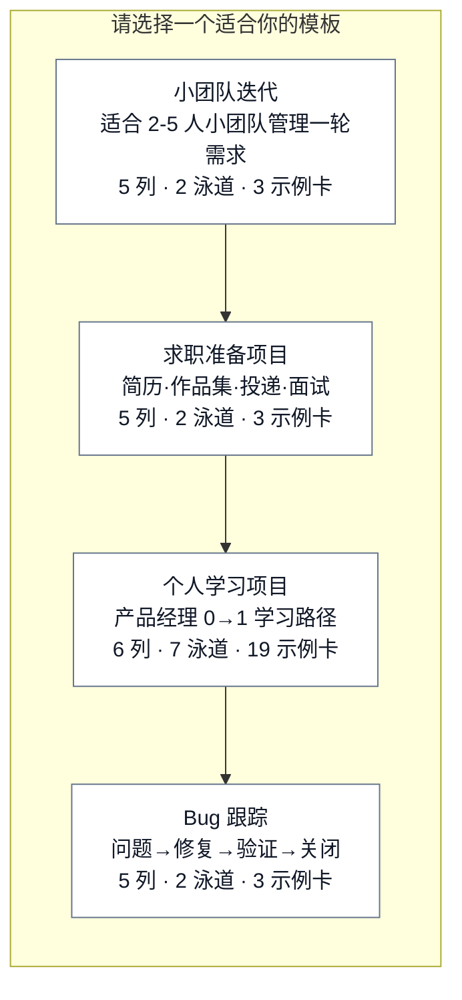
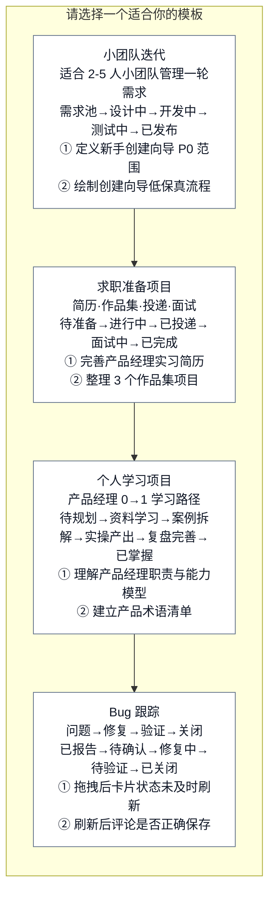
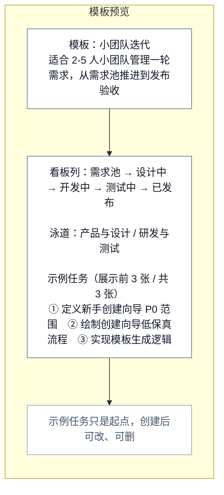
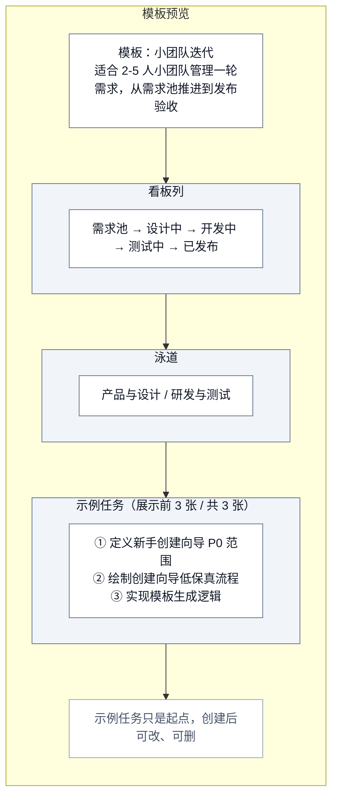
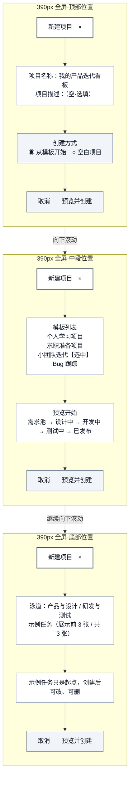
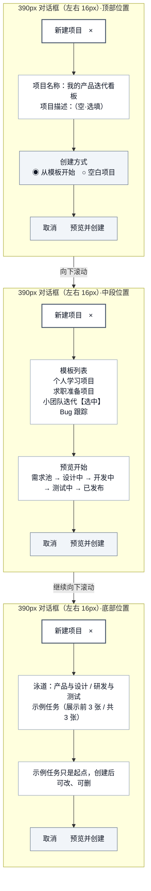
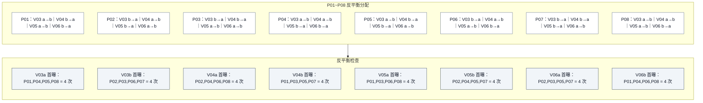
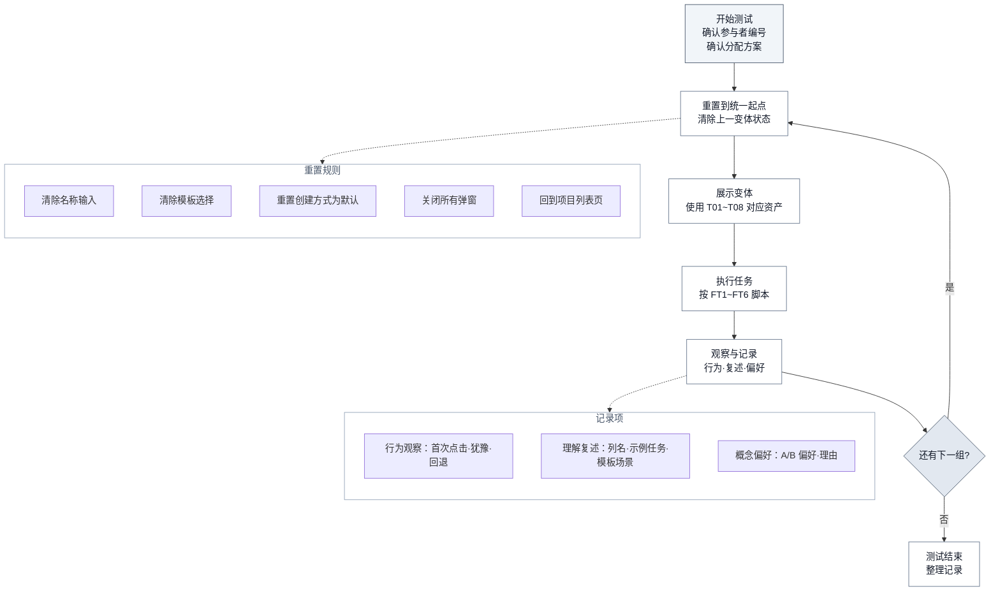

# 低保真对照测试资产与反平衡执行包 PD-010C

> **版本性质：验证资产准备 / 非真人测试结论 / PD-011 Gate 输入**

| 项目 | 内容 |
|---|---|
| 日期 | 2026-06-22 |
| 状态 | Codex 修订后通过；10 个 Mermaid 均已导出 PNG/SVG（未执行真人测试） |
| 聚焦范围 | V03/V04/V05/V06 四组 A/B 对照资产 |
| 上游依据 | PD-010 低保真线框、PD-010A 形成性评审、PD-006 交互状态规格、app.js PROJECT_TEMPLATES |
| 导出目录 | `设计图/PD-010C/`（10 PNG + 10 SVG） |

> **边界声明**：本文档只准备低保真、可主持操作的测试材料；不修改生产原型，不执行真人测试，不进入高保真或 Figma。所有 P01~P08 研究结果字段保持空白，等待真实执行填写。

## 1. 版本性质、证据边界与使用范围

### 证据边界

| 标签 | 含义 | 可信度 |
|---|---|---|
| `[代码事实]` | 来自 app.js / index.html 的可直接验证的实现 | 高 |
| `[规格依据]` | 来自 PD-010 / PD-010A 的明确规格 | 高 |
| `[测试资产]` | 本文档准备的 A/B 对照材料 | 中（待真人验证） |

### 使用范围

- 仅用于 V03/V04/V05/V06 的 A/B 对照测试
- 仅用于 moderated paper prototype 或低保真原型测试
- 不产生点击率、自动埋点或统计显著性结论
- 不得把主持人切图速度计入任务耗时

## 2. 上游依据与 V03~V06 既定定义

| 编号 | 验证假设 | A 方案 | B 方案 | 来源 |
|---|---|---|---|---|
| V03 | 模板卡片信息密度 | V03a 精简摘要：名称+场景+数量 | V03b 扩展摘要：名称+场景+列名链+前2张示例标题 | PD-010 §9.1, PD-010A §6.1 |
| V04 | 预览信息层级 | V04a 单层摘要：列/泳道/示例任务平铺 | V04b 强层级分区：分区标题+缩进+弱背景 | PD-010 §9.2, PD-010A §6.2 |
| V05 | 默认创建方式+名称位置 | V05a 默认模板+名称在顶部 | V05b 默认空白+名称在创建方式内 | PD-010 §9.3, PD-010A §6.3 |
| V06 | 移动端容器模式 | V06a 全屏容器（占满390px） | V06b 保留16px边距对话框+底部操作sticky | PD-010 §9.4, PD-010A §6.4 |

## 3. 标准数据集和无关变量控制表

### 标准数据集（来自 app.js PROJECT_TEMPLATES）

以下数据为四组 A/B 共用的统一内容，不得自行发明与现有模板冲突的列、泳道或示例任务。

#### 模板：小团队迭代（V03 四卡之一 / V04 唯一刺激物）

| 项 | 内容 |
|---|---|
| 模板名称 | 小团队迭代 |
| 场景说明 | 适合 2-5 人小团队管理一轮需求，从需求池推进到发布验收 |
| 列结构 | 需求池 → 设计中 → 开发中 → 测试中 → 已发布（5 列） |
| 泳道 | 产品与设计 / 研发与测试（2 泳道） |
| 示例任务（3 张） | ① 定义新手创建向导 P0 范围（需求池·PM·高） ② 绘制创建向导低保真流程（设计中·设计·中） ③ 实现模板生成逻辑（开发中·开发·高） |

#### 模板：求职准备项目（V03 四卡之一）

| 项 | 内容 |
|---|---|
| 模板名称 | 求职准备项目 |
| 场景说明 | 适合 PM 实习/校招，把简历、作品集、投递和面试推进放到同一张看板里 |
| 列结构 | 待准备 → 进行中 → 已投递 → 面试中 → 已完成（5 列） |
| 泳道 | 材料准备 / 投递跟进（2 泳道） |
| 示例任务（3 张） | ① 完善产品经理实习简历（待准备·材料准备·高） ② 整理 3 个作品集项目（进行中·材料准备·高） ③ 投递 5 个目标岗位（已投递·投递跟进·中） |

#### 模板：个人学习项目（V03 四卡之一）

| 项 | 内容 |
|---|---|
| 模板名称 | 个人学习项目 |
| 场景说明 | 适合从 0 开始学习产品经理能力，把认知、调研、PRD、原型、协作和作品集训练拆成可推进任务 |
| 列结构 | 待规划 → 资料学习 → 案例拆解 → 实操产出 → 复盘完善 → 已掌握（6 列） |
| 泳道 | 产品认知 / 用户研究 / 需求分析 / 方案表达 / 协作交付 / 数据增长 / 作品集求职（7 泳道） |
| 示例任务 | 共 19 张；前 2 张为“理解产品经理职责与能力模型”“建立产品术语清单” |

#### 模板：Bug 跟踪（V03 四卡之一）

| 项 | 内容 |
|---|---|
| 模板名称 | Bug 跟踪 |
| 场景说明 | 适合个人开发者或小团队跟踪问题、修复、验证和关闭 |
| 列结构 | 已报告 → 待确认 → 修复中 → 待验证 → 已关闭（5 列） |
| 泳道 | 前端问题 / 数据问题（2 泳道） |
| 示例任务（3 张） | ① 拖拽后卡片状态未及时刷新（已报告·前端问题·高） ② 刷新后评论是否正确保存（待确认·数据问题·中） ③ 小屏下模板选择区域是否可用（待验证·前端问题·中） |

### 无关变量控制表

| 控制项 | 规则 | 说明 |
|---|---|---|
| 项目名称 | 统一为"我的产品迭代看板" | 四组共用 |
| 模板名称 | V03 固定展示四个真实模板；V04/V05/V06 统一使用“小团队迭代” | 同组顺序与内容固定 |
| 场景说明 | 与标准数据集一致 | 不得修改 |
| 列名/泳道名 | 与标准数据集一致 | 不得修改 |
| 示例任务 | 与标准数据集一致 | 不得修改 |
| 按钮文案 | "预览并创建"/"创建项目"/"取消"/"返回选择" | 不得修改 |
| 状态起点 | 弹窗打开默认态（S01） | 每次测试前重置 |

## 4. T01~T10 资产索引

| 编号 | 资产名称 | 用途 | 变体组 |
|---|---|---|---|
| T01 | V03a 精简模板卡片 | 模板卡片只显示名称+场景+数量 | V03 |
| T02 | V03b 扩展模板卡片 | 模板卡片显示名称+场景+列名链+前2张示例标题 | V03 |
| T03 | V04a 单层摘要预览 | 预览区列/泳道/示例任务平铺文本 | V04 |
| T04 | V04b 强层级分区预览 | 预览区用分区标题+缩进+弱背景区分 | V04 |
| T05 | V05a 默认模板+名称在顶部 | 三步状态板：打开→选择→提交前 | V05 |
| T06 | V05b 默认空白+名称在方式内 | 三步状态板：打开→选择→提交前 | V05 |
| T07 | V06a 390px 全屏容器 | 三状态板：顶部/中段/底部 | V06 |
| T08 | V06b 390px 保留边距+底部sticky | 三状态板：顶部/中段/底部 | V06 |
| T09 | P01~P08 反平衡分配图 | 参与者分配与先后顺序 | 全局 |
| T10 | 主持人资产选择与跳转流程图 | 主持操作、重置与记录 | 全局 |

## 5. T01~T10 Mermaid 源码及主持说明

### T01：V03a 精简模板卡片

**主持说明**：
- 展示 4 张模板卡片，每张只显示名称+场景+数量
- 不显示列名链或示例任务标题
- 询问参与者：哪个模板最接近你的目标？为什么？
- 记录：首次选择、犹豫时长、是否需要进入预览

### T02：V03b 扩展模板卡片

**主持说明**：
- 展示 4 张模板卡片，每张显示名称+场景+列名链+前2张示例任务标题
- 询问参与者：哪个模板最接近你的目标？为什么？
- 记录：首次选择、犹豫时长、是否需要进入预览、信息是否足够判断

### T03：V04a 单层摘要预览

**主持说明**：
- 展示预览区，列/泳道/示例任务平铺文本
- 不使用分区标题或弱背景区分
- 询问参与者：请告诉我这个模板有哪些列？有哪些示例任务？
- 记录：列复述准确度、示例任务复述准确度、明显误读

### T04：V04b 强层级分区预览

**主持说明**：
- 展示预览区，用分区标题+弱背景区分列/泳道/示例任务
- 询问参与者：请告诉我这个模板有哪些列？有哪些示例任务？
- 记录：列复述准确度、示例任务复述准确度、明显误读

### T05：V05a 默认模板+名称在顶部

```mermaid
flowchart TB
    subgraph T05_STEP1["步骤1：弹窗打开"]
        direction TB
        T05_HEAD["头部：新建项目 ▎ 关闭 ×"]
        T05_NAME1["项目名称：（空·必填）"]
        T05_DESC1["项目描述：（空·选填）"]
        T05_MODE1["创建方式<br/>◉ 从模板开始（默认选中）　○ 空白项目"]
        T05_AREA1["模板区（左列表+右预览）"]
        T05_ACT1["底部操作：［次］取消　［主］创建项目"]
        T05_HEAD --> T05_NAME1 --> T05_DESC1 --> T05_MODE1 --> T05_AREA1 --> T05_ACT1
    end

    subgraph T05_STEP2["步骤2：选择模板"]
        direction TB
        T05_HEAD2["头部：新建项目 ▎ 关闭 ×"]
        T05_NAME2["项目名称：（空·必填）"]
        T05_DESC2["项目描述：（空·选填）"]
        T05_MODE2["创建方式<br/>◉ 从模板开始　○ 空白项目"]
        T05_LIST2["模板列表<br/>▌小团队迭代【选中】<br/>需求池→设计中→开发中→测试中→已发布"]
        T05_ACT2["底部操作：［次］取消　［主］预览并创建"]
        T05_HEAD2 --> T05_NAME2 --> T05_DESC2 --> T05_MODE2 --> T05_LIST2 --> T05_ACT2
    end

    subgraph T05_STEP3["步骤3：提交前"]
        direction TB
        T05_HEAD3["头部：新建项目 ▎ 关闭 ×"]
        T05_NAME3["项目名称：我的产品迭代看板（已填）"]
        T05_DESC3["项目描述：（空·选填）"]
        T05_MODE3["创建方式<br/>◉ 从模板开始　○ 空白项目"]
        T05_PREV3["预览：小团队迭代<br/>列：需求池→设计中→开发中→测试中→已发布<br/>示例任务：3 张"]
        T05_ACT3["底部操作：［次］返回　［主］创建项目"]
        T05_HEAD3 --> T05_NAME3 --> T05_DESC3 --> T05_MODE3 --> T05_PREV3 --> T05_ACT3
    end

    T05_STEP1 --> T05_STEP2 --> T05_STEP3

    classDef frame fill:#ffffff,stroke:#475569,color:#111827,stroke-width:2px;
    classDef control fill:#f1f5f9,stroke:#64748b,color:#111827;
    classDef content fill:#ffffff,stroke:#94a3b8,color:#111827;
    class T05_HEAD,T05_HEAD2,T05_HEAD3 frame;
    class T05_NAME1,T05_NAME2,T05_NAME3,T05_DESC1,T05_DESC2,T05_DESC3,T05_MODE1,T05_MODE2,T05_MODE3,T05_ACT1,T05_ACT2,T05_ACT3 control;
    class T05_AREA1,T05_LIST2,T05_PREV3 content;
```

**主持说明**：
- 展示三步状态板：打开→选择模板→提交前
- 默认选中"从模板开始"，名称输入在创建方式之上
- 询问参与者：你会先填名称还是先选方式？为什么？
- 记录：首选路径、是否被名称卡住、老用户干扰感

### T06：V05b 默认空白+名称在方式内

```mermaid
flowchart TB
    subgraph T06_STEP1["步骤1：弹窗打开"]
        direction TB
        T06_HEAD["头部：新建项目 ▎ 关闭 ×"]
        T06_DESC1["项目描述：（空·选填）"]
        T06_MODE1["创建方式<br/>○ 从模板开始　◉ 空白项目（默认选中）"]
        T06_NAME1["空白项目设置内<br/>项目名称：（空·必填）"]
        T06_COLS1["看板初始列：待办 · 进行中 · 已完成"]
        T06_ACT1["底部操作：［次］取消　［主］创建项目"]
        T06_HEAD --> T06_DESC1 --> T06_MODE1 --> T06_NAME1 --> T06_COLS1 --> T06_ACT1
    end

    subgraph T06_STEP2["步骤2：切换到模板"]
        direction TB
        T06_HEAD2["头部：新建项目 ▎ 关闭 ×"]
        T06_DESC2["项目描述：（空·选填）"]
        T06_MODE2["创建方式<br/>◉ 从模板开始　○ 空白项目"]
        T06_LIST2["模板列表<br/>▌小团队迭代【选中】<br/>需求池→设计中→开发中→测试中→已发布"]
        T06_NAME2["模板预览区内<br/>项目名称：（空·必填）"]
        T06_ACT2["底部操作：［次］取消　［主］预览并创建"]
        T06_HEAD2 --> T06_DESC2 --> T06_MODE2 --> T06_LIST2 --> T06_NAME2 --> T06_ACT2
    end

    subgraph T06_STEP3["步骤3：提交前"]
        direction TB
        T06_HEAD3["头部：新建项目 ▎ 关闭 ×"]
        T06_DESC3["项目描述：（空·选填）"]
        T06_MODE3["创建方式<br/>◉ 从模板开始　○ 空白项目"]
        T06_NAME3["项目名称：我的产品迭代看板（在预览区内）"]
        T06_PREV3["预览：小团队迭代<br/>列：需求池→设计中→开发中→测试中→已发布<br/>示例任务：3 张"]
        T06_ACT3["底部操作：［次］返回　［主］创建项目"]
        T06_HEAD3 --> T06_DESC3 --> T06_MODE3 --> T06_NAME3 --> T06_PREV3 --> T06_ACT3
    end

    T06_STEP1 --> T06_STEP2 --> T06_STEP3

    classDef frame fill:#ffffff,stroke:#475569,color:#111827,stroke-width:2px;
    classDef control fill:#f1f5f9,stroke:#64748b,color:#111827;
    classDef content fill:#ffffff,stroke:#94a3b8,color:#111827;
    class T06_HEAD,T06_HEAD2,T06_HEAD3 frame;
    class T06_NAME1,T06_NAME2,T06_NAME3,T06_DESC1,T06_DESC2,T06_DESC3,T06_MODE1,T06_MODE2,T06_MODE3,T06_ACT1,T06_ACT2,T06_ACT3 control;
    class T06_COLS1,T06_LIST2,T06_PREV3 content;
```

**主持说明**：
- 展示三步状态板：打开→切换到模板→提交前
- 默认选中"空白项目"，名称在创建方式之下
- 询问参与者：你会先填名称还是先选方式？为什么？
- 记录：首选路径、是否被名称卡住、老用户干扰感

### T07：V06a 390px 全屏容器

**主持说明**：
- 展示 390px 全屏容器的顶部/中段/底部三状态
- 容器占满 390px，无两侧边距
- 底部操作在顶部、中段、底部三个位置都保持可见；全屏条件使用固定底部区
- 中性任务：请继续完成创建，你会怎么操作？
- 记录：参与者是否主动触达底部操作、滚动行为、误触和对容器上下文的理解

### T08：V06b 390px 保留边距+底部sticky

**主持说明**：
- 展示 390px 边距对话框的顶部/中段/底部三状态
- 容器宽 100vw-32px，左右各 16px 边距
- 底部操作在三种滚动位置均保持可触达（sticky）
- 底部操作在顶部、中段、底部三个位置都保持可见；边距对话框条件使用 PD-010B 后的 sticky 底部区
- 中性任务：请继续完成创建，你会怎么操作？
- 记录：参与者是否主动触达底部操作、滚动行为、误触和对容器上下文的理解

### T09：P01~P08 反平衡分配与先后顺序图

**主持说明**：
- P01~P08 为 8 位参与者的分配方案
- 每位参与者在每一组都看 A/B 两个版本，箭头表示该组的展示先后
- 每组 A/B 首曝各 4 次
- 同一参与者不能四组都先看 A 或四组都先看 B
- P01~P05 为最低可执行样本，P06~P08 为扩展样本

### T10：主持人资产选择、跳转、重置与记录流程图

**主持说明**：
- 每次测试前必须重置到统一起点
- 主持话术保持中性，不使用"优化版""更详细""更清楚""现有版"等引导词
- 记录行为观察、理解复述、概念偏好，三者分开记录
- 静态资产不得产生点击率或自动埋点结论

## 6. 四组 A/B 的唯一自变量、保持不变项和可观察指标

### V03 模板卡片信息密度

| 项 | 内容 |
|---|---|
| 唯一自变量 | 模板卡片信息密度（T01 精简 vs T02 扩展） |
| 保持不变项 | 模板名称、场景说明、列名、泳道名、示例任务、按钮文案、状态起点 |
| 可观察指标 | 首次选择、犹豫时长、是否需要进入预览、选择理由 |

### V04 预览信息层级

| 项 | 内容 |
|---|---|
| 唯一自变量 | 预览信息层级（T03 单层平铺 vs T04 强层级分区） |
| 保持不变项 | 模板名称、场景说明、列名、泳道名、示例任务、按钮文案、状态起点 |
| 可观察指标 | 列复述准确度、示例任务复述准确度、明显误读、预览信息是否足够 |

### V05 默认创建方式+名称位置

| 项 | 内容 |
|---|---|
| 唯一自变量 | 默认创建方式+名称位置（T05 默认模板+名称在顶 vs T06 默认空白+名称在方式内） |
| 保持不变项 | 模板名称、场景说明、列名、泳道名、示例任务、按钮文案 |
| 可观察指标 | 首选路径、是否被名称卡住、反复切换、老用户干扰感；不记录受主持切图影响的完成时长 |

### V06 移动端容器模式

| 项 | 内容 |
|---|---|
| 唯一自变量 | 390px 容器模式（T07 全屏 vs T08 边距对话框+底部sticky） |
| 保持不变项 | 模板名称、场景说明、列名、泳道名、示例任务、按钮文案 |
| 可观察指标 | 指向/触达底部操作、滚动意图、明显内容裁切或拥挤、误触、容器上下文理解；不声称真机兼容性 |

## 7. P01~P08 反平衡分配表

| 参与者 | V03 展示顺序 | V04 展示顺序 | V05 展示顺序 | V06 展示顺序 | 首曝模式 |
|---|---|---|---|---|---|
| P01 | a→b | b→a | a→b | b→a | A→B→A→B |
| P02 | b→a | a→b | b→a | a→b | B→A→B→A |
| P03 | b→a | b→a | a→b | a→b | B→B→A→A |
| P04 | a→b | a→b | b→a | b→a | A→A→B→B |
| P05 | a→b | b→a | b→a | a→b | A→B→B→A |
| P06 | b→a | a→b | a→b | b→a | B→A→A→B |
| P07 | b→a | b→a | b→a | a→b | B→B→B→A |
| P08 | a→b | a→b | a→b | b→a | A→A→A→B |

**反平衡检查**：

| 变体 | 首曝次数 | 首曝参与者 |
|---|---|---|
| V03a | 4 | P01,P04,P05,P08 |
| V03b | 4 | P02,P03,P06,P07 |
| V04a | 4 | P02,P04,P06,P08 |
| V04b | 4 | P01,P03,P05,P07 |
| V05a | 4 | P01,P03,P06,P08 |
| V05b | 4 | P02,P04,P05,P07 |
| V06a | 4 | P02,P03,P05,P07 |
| V06b | 4 | P01,P04,P06,P08 |

## 8. 主持操作卡

### 开始状态

| 项 | 内容 |
|---|---|
| 起始页面 | 项目列表页（P001） |
| 弹窗状态 | 关闭 |
| 名称输入 | 空 |
| 模板选择 | 无（按分配方案的默认方式） |

### 参与者可说/可指的操作

| 操作 | 主持人响应 |
|---|---|
| 点击"新建项目" | 打开弹窗（按分配方案的默认方式） |
| 点击模板卡片 | 选中该模板 |
| 点击"预览并创建" | 进入预览态 |
| 点击"创建项目" | 触发创建（主持人模拟 loading/成功） |
| 点击"取消"/"关闭" | 关闭弹窗（如有内容触发 S11） |
| 说"我不知道选哪个" | 记录犹豫，不引导 |

### 主持跳转规则

| 跳转 | 主持人操作 |
|---|---|
| 从 T05/T06 步骤1→步骤2 | 参与者选择创建方式后，主持人切换到步骤2 |
| 从 T05/T06 步骤2→步骤3 | 参与者选中模板后，主持人切换到步骤3 |
| 从 T07/T08 顶部→中段 | 参与者向下滚动后，主持人切换到中段 |
| 从 T07/T08 中段→底部 | 参与者继续滚动后，主持人切换到底部 |

### 返回与重置

| 操作 | 主持人响应 |
|---|---|
| 参与者说"返回" | 回到上一步状态 |
| 测试结束 | 重置到统一起点（清除名称、关闭弹窗、回到项目列表） |

### 异常处理

| 异常 | 处理方式 |
|---|---|
| 参与者卡住超过 30 秒 | 记录卡住点，给予中性提示"你可以继续看看" |
| 参与者询问"这个怎么用" | 记录问题，给予中性回答"你觉得应该怎么用" |
| 参与者说"我觉得 A 更好" | 记录偏好，不追问原因（在事后概念偏好环节追问） |

## 9. 测量与声明边界

### 行为观察

| 指标 | 定义 | 数据类型 |
|---|---|---|
| 首次选择 | 参与者第一次点击的模板或创建方式 | 选择记录 |
| 犹豫时长 | 从展示变体到首次点击的时间 | 秒（主持人计时） |
| 回退次数 | 参与者返回上一步的次数 | 计数 |
| 卡住点 | 参与者明显停顿或询问的位置 | 文字描述 |

### 理解复述

| 指标 | 定义 | 数据类型 |
|---|---|---|
| 列复述准确度 | 参与者能正确说出的列名数量/总列数 | 准确/部分准确/不准确 |
| 示例任务复述 | 参与者能正确说出的示例任务数量 | 数量 |
| 模板场景理解 | 参与者能否说明模板适合什么场景 | 是/否 |

### 概念偏好

| 指标 | 定义 | 数据类型 |
|---|---|---|
| A/B 偏好 | 参与者更喜欢哪个变体 | A/B/无偏好 |
| 偏好理由 | 参与者说明偏好的原因 | 文字描述 |

### 声明边界

| 不得声明 | 原因 |
|---|---|
| 点击率或自动埋点结论 | 静态资产无法产生点击率 |
| 统计显著性 | 5~8 人小样本无统计显著性 |
| 完成率量化 | 主持人切图速度影响完成率 |
| 任务耗时量化 | 主持人切图速度影响耗时 |
| "显著更好"等表述 | 无统计支撑 |

## 10. 测试资产就绪矩阵

| 资产 | 状态 | 说明 |
|---|---|---|
| T01 V03a 精简模板卡片 | ✅ 就绪 | Mermaid + PNG/SVG 已导出 |
| T02 V03b 扩展模板卡片 | ✅ 就绪 | Mermaid + PNG/SVG 已导出 |
| T03 V04a 单层摘要预览 | ✅ 就绪 | Mermaid + PNG/SVG 已导出 |
| T04 V04b 强层级分区预览 | ✅ 就绪 | Mermaid + PNG/SVG 已导出 |
| T05 V05a 默认模板+名称在顶 | ✅ 就绪 | Mermaid + PNG/SVG 已导出 |
| T06 V05b 默认空白+名称在方式内 | ✅ 就绪 | Mermaid + PNG/SVG 已导出 |
| T07 V06a 390px 全屏容器 | ✅ 就绪 | Mermaid + PNG/SVG 已导出 |
| T08 V06b 390px 边距+底部sticky | ✅ 就绪 | Mermaid + PNG/SVG 已导出 |
| T09 反平衡分配图 | ✅ 就绪 | Mermaid + PNG/SVG 已导出 |
| T10 主持人流程图 | ✅ 就绪 | Mermaid + PNG/SVG 已导出 |

## 进入真人测试前检查清单

| 检查项 | 状态 | 说明 |
|---|---|---|
| T01~T10 Mermaid 源码与导出图 | ✅ | 10 个代码块，编号连续；10 PNG + 10 SVG 渲染通过 |
| 标准数据集 | ✅ | 从 app.js PROJECT_TEMPLATES 复制 |
| 无关变量控制表 | ✅ | 统一项目名、模板名、按钮文案 |
| P01~P08 反平衡分配表 | ✅ | 每组 A/B 首曝各 4 次 |
| 主持操作卡 | ✅ | 开始状态、跳转、重置、异常处理 |
| 测量与声明边界 | ✅ | 行为观察、理解复述、概念偏好分开 |
| 主持话术中性 | ✅ | 不使用引导词 |
| 重置规则 | ✅ | 每次测试前重置到统一起点 |

## 11. 风险、未解决问题和 Codex Gate 复核点

### 风险

| 风险 | 影响 | 缓解 |
|---|---|---|
| 主持人切图速度影响测试 | 不得把切图速度计入任务耗时 | 声明边界中已明确 |
| 参与者数量不足 | P01~P05 为最低可执行样本 | P06~P08 为扩展样本 |
| 静态资产无法模拟真实交互 | V05/V06 的连续状态需要主持人手动切换 | 主持操作卡中已定义跳转规则 |

### 未解决问题

| 问题 | 说明 |
|---|---|
| 真人测试执行 | 本文档只准备资产，不执行真人测试 |
| PD-011 Gate | Codex 验收后为 Conditional Go；仍需真人测试后复核完整 Go |
| 统计分析 | 5~8 人小样本只用于方向性形成性判断 |

### Codex Gate 复核点

| 复核项 | 说明 |
|---|---|
| T01~T10 Mermaid 代码块数量 | 必须恰好 10 个，编号连续 T01~T10 |
| 四组 A/B 内容匹配表 | 每组只有一个自变量 |
| P01~P08 反平衡表 | 每组 A/B 首曝各 4 次，单人顺序交错 |
| V05/V06 连续状态 | 必须有三步状态板和主持跳转规则 |
| 未修改业务代码 | 不得修改 index.html/styles.css/app.js |
| 未虚构研究数据 | P01~P08 研究结果字段为空 |
