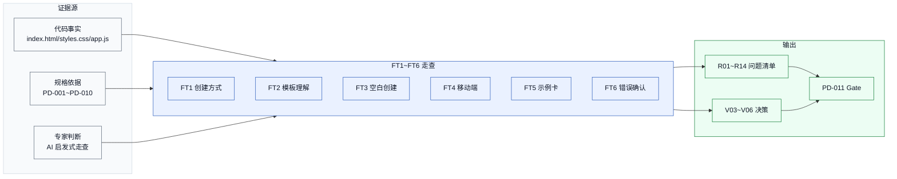
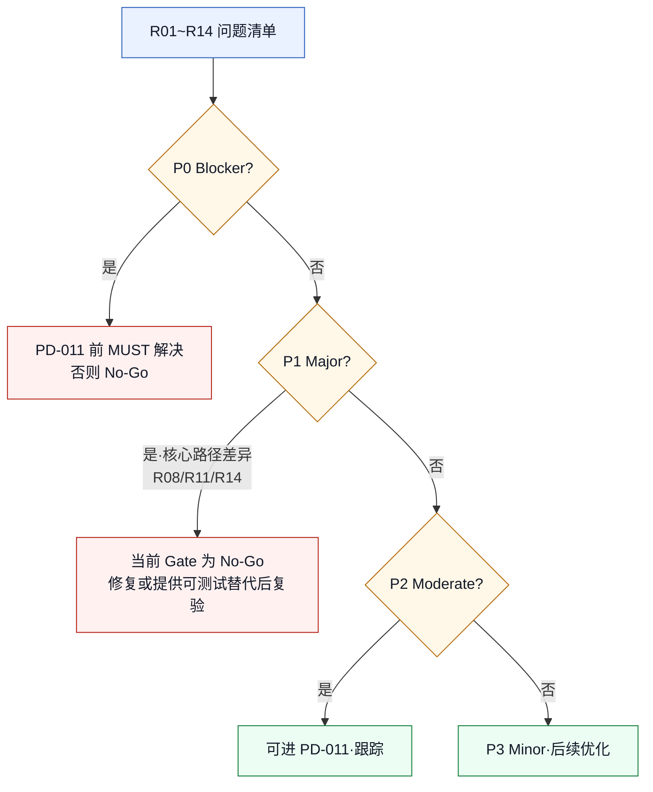
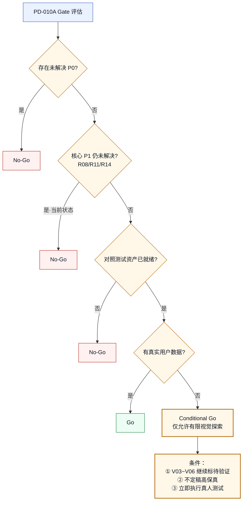

# 低保真形成性评审与结构决策 PD-010A

> **版本性质：AI 辅助专家走查 / 非真实用户研究结论 / PD-011 Gate 输入**

> **2026-06-22 范围决策覆盖**：项目不再安排招募式真人测试，原 §8 执行包仅作为历史设计资产保留，不得继续发布或执行。PD-010D-R 的公开真实案例被接受为本项目二手研究证据基线；当前 Gate 改为 `Go（二手研究口径）`。此决策允许进入 PD-011，但不允许对外声称完成真人测试或一手可用性验证。

| 项目 | 内容 |
|---|---|
| 日期 | 2026-06-22 |
| 状态 | AI 辅助启发式专家走查已完成；真人测试执行包已归档、不执行 |
| 聚焦范围 | PD-010 低保真线框 FT1~FT6 核心路径、V03~V06 结构决策、PD-011 Gate |
| Product Design 路由 | 总工作流 `product-design-workflow`；register `product`；UX research / validation（`product-design:index` 路由） |
| impeccable 阶段 | 不使用 shape/craft；本任务是 shape 后、craft 前的验证门槛 |
| 上游依据 | PD-001~PD-010、`PRODUCT.md`、`index.html`、`styles.css`、`app.js`、`设计图/PD-010/`、低保真线框文档 |

> **边界声明（最重要）**：本文的专家走查是 AI 辅助启发式分析，不是真人专家评审，更不是真实用户研究。所有"发现"都是基于代码事实、上游规格和启发式推断的假设性风险，必须由真实参与者验证后才能成为结论。本文不包含任何真实用户原话、完成率、操作时长、评分、点击路径或样本数量。所有量化字段在真人测试执行包中保持空白，等待真实执行填写。

## 1. 文档目的与决策范围

### 1.1 目的

1. 对 PD-010 的 FT1~FT6 核心路径进行逐步 AI 辅助专家走查，识别结构、状态、响应式与可访问性风险。
2. 对 V03~V06 给出有证据、可追溯的**暂定**结构决策，不把专家判断冒充用户证据。
3. 形成真人小样本测试可直接使用的招募、主持、观察、记录和决策模板。
4. 给出 PD-011 Gate 结论：`No-Go` 或 `Conditional Go`。**没有真实用户证据时不得给出无条件 `Go`。**

### 1.2 决策范围

| 决策项 | 本任务是否定稿 | 说明 |
|---|---|---|
| FT1~FT6 路径风险清单 | ✅ 暂定（专家判断） | 风险存在性与严重度待真人验证校准 |
| R01~Rxx 跨路径问题 | ✅ 暂定（专家判断） | P0/P1 是否阻断 PD-011 由 Gate 规则裁定 |
| V03~V06 结构方案 | ⚠️ 部分暂定 | 仅作 PD-011 暂定输入，全部仍需真人验证 |
| PD-011 Gate | ✅ 已复验 | PD-010B/PD-010C 完成后为 `Conditional Go`；真人证据完成前不得升级为完整 `Go` |
| 真人测试结论 | ❌ 不在本任务 | 执行包为空白模板，等待真实执行 |

### 1.3 不决策项

- 不修改 PD-001~PD-010 任何上游文档（回写建议列入 §10 矩阵，由后续任务执行）。
- 不修改业务代码、测试、设计图。
- 不启动 PD-011 高保真 / Figma。
- 不扩展到 API/部署/插件/认证/数据库等系统级能力。

## 2. 证据层级与研究局限

### 2.1 证据标签

本文所有发现必须标注以下四种证据之一，不得混用：

| 标签 | 含义 | 可信度 |
|---|---|---|
| `[代码事实]` | 来自 `index.html` / `styles.css` / `app.js` 的可直接验证的实现 | 高（事实） |
| `[规格依据]` | 来自 PD-001~PD-010 / `PRODUCT.md` 的明确规格要求 | 高（规格） |
| `[专家判断]` | 本次 AI 辅助启发式走查的推断 | 中（假设，待验证） |
| `[待真人验证]` | 必须由真实参与者确认才能定稿 | —（未验证） |

### 2.2 研究局限（必须显式声明）

| 局限 | 影响 | 缓解 |
|---|---|---|
| 无真实参与者数据 | 所有严重度、 abandonment 风险均为假设 | 真人测试执行包（§8） |
| 走查者为 AI，非真人专家 | 启发式覆盖面广但缺乏真人直觉 | 标注 `[专家判断]`，不冒充真人 |
| 静态原型无真实后端 | loading/error 恢复等状态无法真实触发 | 真人测试用人工模拟（见 §8 任务卡） |
| 研究者=设计者确认偏差风险 | 可能倾向证明线框正确 | V03~V06 保留对立 A/B，平衡顺序规则 |
| 样本量 5-8 人无统计显著性 | 只能发现明显问题 | 定性为主，不定量推断总体 |

### 2.3 可用证据清单

| 证据 | 来源 | 用于 |
|---|---|---|
| 11 张 PD-010 线框 PNG/SVG | `设计图/PD-010/` | FT1~FT6 走查依据 |
| PD-010 低保真线框文档 | `docs/03-ux-design/低保真线框与关键状态-PD-010.md` | 已知修订与边界 |
| `saveProjectFromDialog` | `app.js:4961-4984` | 名称校验/loading/成功反馈事实 |
| `#projectDialog` 结构 | `index.html:137-182` | 弹窗层级与顺序事实 |
| `.modal.wide` 宽度 | `styles.css:1372-1374` | 弹窗宽度事实 |
| 响应式断点 | `styles.css:2311, 2348` | 960px/640px 行为事实 |
| `prefers-reduced-motion` | `styles.css:2301-2309` | 动效降级事实（仅卡片） |
| PD-002 M1~M10 | `docs/01-research-discovery/用户研究计划与访谈脚本-PD-002.md` §7 | 真人测试观察指标 |
| PD-002 A/B/C 分组与招募 | PD-002 §3 | 真人测试样本边界 |
| PD-010D-R 公开用户证据 | `docs/05-validation/公开用户证据驱动模拟走查-PD-010D-R.md` | 外部校准问题方向；不计入 P01~P08，不替代真人结论 |

## 3. 评审方法与严重度口径

### 3.1 启发式维度

走查覆盖以下维度（源自 Nielsen 启发式 + 认知负担 + 可访问性，适配本产品）：

| 维度 | 关注点 |
|---|---|
| 任务可发现性 | 新手能否发现创建方式、模板入口、主操作 |
| 系统状态可见性 | loading/success/error 是否被清楚感知 |
| 真实世界匹配 | 模板、列名、示例任务是否贴合新手真实场景 |
| 用户控制与自由 | 取消、返回、未保存关闭确认是否可用 |
| 错误预防与恢复 | 必填校验、创建失败、误删示例卡恢复 |
| 一致性与标准 | 文案、控件、状态在桌面/移动端一致 |
| 认知负担 | 信息密度、层级、滚动/固定是否增加理解成本 |
| 键盘与读屏 | Tab/方向键/Enter/Space/ESC、焦点、aria |
| 390px 可用性 | 单列、触摸目标、横向溢出、底部操作可达 |

### 3.2 严重度口径

| 严重度 | 定义 | Gate 影响 |
|---|---|---|
| `P0 Blocker` | 无法完成核心创建，或存在严重可访问性阻断 | 未解决 → `No-Go` |
| `P1 Major` | 核心路径高风险，可能导致放弃或错误创建 | 未解决原则上 `No-Go`；有低风险临时方案可 `Conditional Go` |
| `P2 Moderate` | 明显增加理解或操作成本，但有恢复路径 | 可进 PD-011，但需跟踪 |
| `P3 Minor` | 文案、顺序或细节问题，不阻断任务 | 可进 PD-011，后续优化 |

### 3.3 走查流程

每个 FT 任务按：场景与起始状态 → 预期成功路径 → 逐步走查与检查点 → 发现的问题/风险（带证据标签与严重度）→ 受影响上游 → 真人测试必观察行为。

## 4. FT1~FT6 专家走查

> 说明：FT1~FT6 沿用 PD-010 §10 定义。所有"问题"均为 `[专家判断]` 风险假设，除非证据标签明确为 `[代码事实]` 或 `[规格依据]`。

### 4.1 FT1 首次选择创建方式

| 项 | 内容 |
|---|---|
| 场景与起始状态 | 新手在项目列表页，从未用过 Kanboard，有一个模糊目标（如"开始学产品经理"）。点击 topbar "新建项目"按钮进入 P002 弹窗默认态。 |
| 预期成功路径 | 看到两种创建方式 → 理解"从模板开始"含义 → 选择任一方式继续（无需提示）。 |
| 逐步走查与检查点 | ① 入口可发现：topbar "新建项目"主按钮 `[代码事实·index.html:19]` ✅。② 弹窗打开聚焦名称输入 `[规格依据·PD-010 §5.2]`。③ 创建方式 radio 默认选中"从模板开始" `[代码事实·index.html:158 checked]`。④ 用户看到两种方式说明文案（"选择场景，自动生成列、泳道和示例任务"/"保留 Kanboard 原有的轻量创建方式"）`[代码事实·index.html:160,168]`。⑤ 切换方式更新模板区显隐 `[代码事实·app.js:4849-4850]`。 |
| 发现的问题/风险 | • **R01**（P2）：名称/描述输入在创建方式**之上**，新手可能先纠结"项目名称填什么"，而尚未决定用哪种方式 `[代码事实·index.html:143-156]` + `[专家判断]`。新手在未理解模板价值前被要求命名，可能产生认知前置负担。• **R02**（P2）：默认选中"从模板开始"对新手友好，但对想快速建空项目的老用户增加一次切换操作 `[代码事实·index.html:158]` + `[规格依据·PD-006 V05]` + `[专家判断]`。该路径可立即恢复，不足以按 P1 处理。归入 V05。 |
| 严重度与证据 | R01 P2 `[专家判断]`；R02 P2 `[代码事实]+[规格依据]+[专家判断]` |
| 受影响上游 | US001、S01/S02、DP01 低干扰、DP04 保留熟练效率、V05 默认路径 |
| 真人测试必观察 | 新手第一眼看向名称还是创建方式；是否阅读方式说明文案；默认选中是否影响其选择；老用户是否觉得需"取消模板"。 |

### 4.2 FT2 选择并理解模板

| 项 | 内容 |
|---|---|
| 场景与起始状态 | FT1 后选"从模板开始"，进入 P004 模板列表，需选一个最接近目标的模板并理解列结构。 |
| 预期成功路径 | 比较 4 个模板 → 选中一个 → 进入 P005 预览 → 能说出该模板的列结构。 |
| 逐步走查与检查点 | ① 模板列表左 250px 单列 4 卡 `[规格依据·PD-010 §5.3，已按 Codex 验收修订]`。② 每卡显示名称+场景+列/泳道/示例卡数摘要 `[代码事实·app.js:4865-4867]`。③ 选中卡片高亮 + 预览同步 `[代码事实·app.js:4862 aria-pressed]`。④ 预览显示列名链、泳道、示例任务标题 `[代码事实·app.js:4879-4881]`。⑤ "预览并创建"进入完整预览态。 |
| 发现的问题/风险 | • **R03**（P2）：4 模板场景跨度大（学习/求职/团队/Bug），新手若目标不在 4 场景内（如"健身计划""读书"）可能难以匹配 `[规格依据·PD-008 IS02]` + `[专家判断]`。H4 假设仍未验证 `[规格依据·PD-002 H4]`。• **R04**（P2）："个人学习项目"摘要显示 20 张示例卡，但实际预览只展示前 4 张标题（`slice(0, 4)`），用户可能不清楚创建后会生成多少内容 `[代码事实·app.js:4866,4881]` + `[专家判断]`。这属于数量预期与渐进披露风险，不是“20 张全部塞进预览”的 P1 过载。归入 V03/V04。• **R05**（P2）：模板卡片摘要只给数量（"6 列·7 泳道·20 示例卡"），不给列名，新手需进入预览才能判断 `[代码事实·app.js:4866]` + `[专家判断]`。 |
| 严重度与证据 | R03 P2；R04 P2；R05 P2。均含 `[专家判断]`。 |
| 受影响上游 | US001/US002、S03/S04/S05、DP03 场景驱动、DP02 在做中教、V03 模板密度、V04 预览层级 |
| 真人测试必观察 | 新手比较模板的犹豫时长；是否阅读数量摘要；是否理解列结构；选中后能否复述列名；对"个人学习"复杂模板的第一反应。 |

### 4.3 FT3 从空白快速创建

| 项 | 内容 |
|---|---|
| 场景与起始状态 | 熟悉看板的老用户，只想快速建一个空项目。切换到"空白项目"进入 P006。 |
| 预期成功路径 | 切空白 → 命名 → 创建，时长合理且无提示。 |
| 逐步走查与检查点 | ① 切换空白隐藏模板区 `[代码事实·app.js:4849-4850]`。② 名称/描述输入可用 `[代码事实·index.html:143-149]`。③ 提交调用 `createBlankProject` `[代码事实·app.js:4975]`。④ 空白项目默认列：待办/进行中/已完成 `[规格依据·PD-006 §11]`。 |
| 发现的问题/风险 | • **R06**（P2）：名称输入带原生 `required`，正常点击提交会先由浏览器约束校验拦截并给出原生提示；`submit` 事件中的 `if (!name) return` 是后备保护，不等于正常路径“静默丢弃” `[代码事实·index.html:145; app.js:4961-4965]`。当前实现仍缺 PD-010 要求的行内错误文字、`aria-invalid` 与 `aria-describedby`，属于定制错误态和可访问性规格差异。• **R07**（P2）：默认选中"从模板开始"，老用户切空白是额外一步 `[代码事实·index.html:158]` + `[专家判断]`。归入 V05。 |
| 严重度与证据 | R06 P2 `[代码事实]+[规格依据]`（原生校验可恢复，定制错误态待补）；R07 P2。 |
| 受影响上游 | US006、S06/S07、DP04 保留熟练效率、V05 |
| 真人测试必观察 | 老用户切空白是否流畅；不同浏览器的原生必填提示是否可理解；是否需要更明确的行内错误文字。 |

### 4.4 FT4 390px 移动端创建

| 项 | 内容 |
|---|---|
| 场景与起始状态 | 用户在 390px 手机上，单手操作，想用模板创建一个项目。 |
| 预期成功路径 | 单手可达主操作 → 选模板 → 预览 → 命名 → 创建，无横向溢出。 |
| 逐步走查与检查点 | ① 390px 落在 `<=640px` 断点，工作区 16px padding `[代码事实·styles.css:2352]`。② `.template-area`/`.creation-mode` 在 `<=960px` 已改单列 `[代码事实·styles.css:2342-2345]`。③ 弹窗宽 `min(840px, 100vw-32px)` ≈ 358px `[代码事实·styles.css:1373]`。 |
| 发现的问题/风险 | • **R08**（P1）：390px 弹窗两侧仅 16px 边距，弹窗与屏幕几乎等宽（358px/390px），但**弹窗内 `.modal form` 有 `max-height: min(86vh,860px); overflow:auto`** `[代码事实·styles.css:1388]`，长模板预览时整个表单滚动，**底部操作按钮随之滚动**，单手难以稳定触达主操作 `[代码事实]+[专家判断]`。PD-010 W07/W08 要求"底部全宽固定"，但代码未固定。• **R09**（P2）：触摸目标未强制 ≥44px，现有控件最小 36px、图标按钮 34px `[代码事实·styles.css 表单高度]` + `[规格依据·PD-009 §9]`，390px 下误触风险 `[专家判断]`。• **R10**（P2）：是否改全屏容器（V06）尚未定，358px 弹窗在长预览下体验待验证 `[规格依据·PD-009 V06]`。 |
| 严重度与证据 | R08 P1 `[代码事实]+[专家判断]`；R09 P2；R10 P2。 |
| 受影响上游 | US008、S12/S13、DP01、V06 |
| 真人测试必观察 | 单手能否稳定触达底部"创建项目"；长预览滚动时按钮是否消失；是否发生横向溢出；触摸误触次数。 |

### 4.5 FT5 示例卡理解

| 项 | 内容 |
|---|---|
| 场景与起始状态 | 模板创建成功（P009），看板展示模板列与示例任务卡。用户需判断示例卡是否有用。 |
| 预期成功路径 | 识别示例卡 → 理解任务粒度 → 能说明可改可删。 |
| 逐步走查与检查点 | ① 创建成功 `state.activeProjectId = project.id; render();` 自动切新项目 `[代码事实·app.js:4977-4983]`。② 看板展示模板列/泳道/示例卡 `[代码事实·createProjectFromTemplate app.js:4921-4956]`。③ 示例卡点击进编辑（P010）`[规格依据·PD-006 S14]`。 |
| 发现的问题/风险 | • **R11**（P1）：示例卡**无"示例"徽标**，与用户自己创建的任务视觉无区别 `[代码事实·app.js:4938-4946 直接 clone，无 isExample 标记传递]` + `[规格依据·PD-009 §5.3 示例任务卡需"示例身份清楚"]` + `[规格依据·PD-010 §5.6 示例卡需"示例"徽标]`。新手可能困惑"这些任务哪来的，是我要做的吗"。• **R12**（P2）：创建成功后会关闭弹窗并切换到新看板，这是可见反馈；但没有 `aria-live` 公告或额外状态文案，读屏用户可能无法确认上下文变化 `[代码事实·app.js:4977-4983]` + `[规格依据·PD-010 W06/W09]`。• **R13**（P2）："个人学习项目"20 示例卡，新手可能被数量压倒，直接全删 `[专家判断]`。 |
| 严重度与证据 | R11 P1 `[代码事实]+[规格依据]`；R12 P2；R13 P2。 |
| 受影响上游 | US003/US004/US005、S09/S14/S15、DP05 可改可删、V07 示例卡粒度 |
| 真人测试必观察 | 是否识别示例卡身份；是否尝试改/删；对 20 张卡的第一反应；是否察觉创建成功。 |

### 4.6 FT6 错误与确认恢复

| 项 | 内容 |
|---|---|
| 场景与起始状态 | 用户不填名称试创建（应触发 error）；填了名称再试关闭（应触发 confirmation）。 |
| 预期成功路径 | 错误可恢复、关闭确认语义清楚。 |
| 逐步走查与检查点 | ① 名称为空提交 → 浏览器原生 `required` 校验先拦截，见 R06 `[代码事实·index.html:145]`。② 有内容关闭 → `[规格依据·PD-006 S11]` 要求确认对话框，但当前未实现。③ 删除任务 → `deleteEditingCard()` 使用 `confirm("删除这个任务？")`，S15 基础确认已实现 `[代码事实·app.js:8787-8793]`。 |
| 发现的问题/风险 | • **R06 复述**（P2）：基础 error 路径可由原生校验触发，但尚无规格要求的行内错误与 ARIA 关联。• **R14**（P1）：未保存关闭确认（S11）**代码中未见实现**，`method="dialog"` 的取消按钮与原生 ESC 会直接关闭 `[代码事实·index.html:138-141,178]`，有内容的输入会丢失 `[规格依据·PD-006 S11]`。• S15 已核验为已实现，不再列为 R 问题；后续只需评估原生 `confirm()` 文案和体验是否满足高保真要求。 |
| 严重度与证据 | R06 P2；R14 P1 `[代码事实]+[规格依据]`；S15 已实现 `[代码事实]`。 |
| 受影响上游 | US007、S07/S10/S11/S15、DP05、V08 文案语气 |
| 真人测试必观察 | 名称空提交后的反应（是否察觉无响应）；有内容关闭时是否惊讶内容丢失；确认文案是否清楚。 |

## 5. 跨路径问题清单

> 稳定编号 R01 起。严重度为 `[专家判断]` 暂定，待真人验证校准。"PD-011 前必须解决"按 Gate 规则（§11）裁定。

| 编号 | 问题 | 证据 | 影响路径 | 严重度 | 修复建议 | PD-011 前必须？ | 验证方式 |
|---|---|---|---|---|---|---|---|
| R01 | 名称/描述输入在创建方式之上，新手未决定方式前被要求命名 | `[代码事实·index.html:143-156]` + `[专家判断]` | FT1/FT3 | P2 | 真人测试确认后，视 V05 决定是否下移 | 否（V05 待验证） | FT1/FT3 观察 |
| R02 | 默认"从模板开始"可能轻微干扰老用户 | `[代码事实·index.html:158]` + `[规格依据·V05]` | FT1/FT3 | P2 | 归入 V05 真人验证 | 否（有切换路径） | FT3 路径 C 观察 |
| R03 | 4 模板场景跨度大，目标外用户无所适从 | `[规格依据·PD-008 IS02]` + `[专家判断]` | FT2 | P2 | 真人测试验证 H4；若证实不足，PD-011 前可加"自定义"提示 | 否 | FT2 + PD-002 H4 |
| R04 | 摘要显示 20 张示例卡，但预览只展示前 4 张，生成内容预期可能不清楚 | `[代码事实·app.js:4866,4881]` + `[规格依据·V03/V04]` | FT2 | P2 | 增加“预览前 4 张/共 20 张”说明，或真人验证渐进披露 | 否 | FT2 预期复述 + 信息回忆 |
| R05 | 模板卡片摘要只给数量不给列名 | `[代码事实·app.js:4866]` + `[专家判断]` | FT2 | P2 | 按 V03a/V03b 真人对比 | 否 | FT2 V03 对比 |
| R06 | 原生 `required` 可阻止空名称提交，但缺少规格要求的行内错误、`aria-invalid` 与 `aria-describedby` | `[代码事实·index.html:145; app.js:4961-4965]` + `[规格依据·PD-006 S07]` | FT3/FT6 | P2 | 保留原生校验兜底，并补齐行内错误与 ARIA 关联 | 否（可在 PD-011 状态设计中补齐） | FT6 名称空提交 |
| R07 | 默认模板对老用户是额外切换步 | 同 R02 | FT3 | P2 | 归入 V05 | 否 | FT3 |
| R08 | 390px `.modal form` 整体滚动，底部操作不固定，单手难触达 | `[代码事实·styles.css:1388-1389]` + `[规格依据·PD-010 W07/W08 底部固定]` | FT4 | **P1** | PD-011 前必须改移动端底部操作固定（sticky），或随 V06 改全屏 | **是（移动端核心路径）** | FT4 单手触达 |
| R09 | 触摸目标未强制 ≥44px（现 34-36px） | `[代码事实·styles.css]` + `[规格依据·PD-009 §9]` | FT4 | P2 | PD-011 视觉稿阶段落实 | 否（可 PD-011） | FT4 误触计数 |
| R10 | 移动端容器模式（全屏 vs 边距）未定 | `[规格依据·V06]` | FT4 | P2 | 归入 V06 真人对比 | 否 | FT4 V06 对比 |
| R11 | 示例卡无"示例"徽标，与普通任务无区分 | `[代码事实·app.js:4938-4946 无标记]` + `[规格依据·PD-009 §5.3]` | FT5 | **P1** | PD-011 前必须给示例卡加 isExample 标记 + 徽标 | **是（影响示例卡理解，V07 前提）** | FT5 示例卡识别 |
| R12 | 创建成功有“关闭弹窗并切换新看板”的视觉反馈，但缺少读屏状态公告 | `[代码事实·app.js:4977-4983]` + `[规格依据·PD-010 W06/W09]` | FT5 | P2 | 增加 `aria-live` 公告；toast 是否需要仍待验证 | 否（但有 aria 义务） | FT5 是否察觉成功 |
| R13 | 20 示例卡可能压倒新手 | `[专家判断]` | FT5 | P2 | 真人观察；若证实，PD-011 考虑渐进披露 | 否 | FT5 V07 |
| R14 | 未保存关闭确认（S11）代码未见实现，dialog 原生关闭直接生效 | `[代码事实·index.html:138-141,178]` + `[规格依据·S11]` | FT6 | **P1** | PD-011 前必须实现 S11，或在真人测试明确告知局限 | **是（数据丢失风险）** | FT6 关闭确认 |

### 5.1 严重度分布

| 严重度 | 数量 | 编号 |
|---|---|---|
| P0 Blocker | 0 | — |
| P1 Major | 3 | R08, R11, R14 |
| P2 Moderate | 11 | R01, R02, R03, R04, R05, R06, R07, R09, R10, R12, R13 |
| P3 Minor | 0 | — |

> 共 14 项未关闭问题。S15 删除确认已经代码核验，不再计入问题总数。

### 5.2 规格与实现矛盾专项（高优先级）

以下 4 项是规格与当前实现的明确差异；其中 R08/R11/R14 为 P1，R06 因存在原生必填校验降为 P2：

| 编号 | 规格 | 代码事实 | 影响 |
|---|---|---|---|
| R06 | PD-006 S07 行内错误与 ARIA 关联 | `index.html:145 required` 提供原生校验；定制错误与 ARIA 未实现 | 基础可恢复，但体验与规格不完整 |
| R08 | PD-010 W07/W08 底部固定 | `styles.css:1389 overflow:auto` 整体滚 | 移动端单手难触达 |
| R11 | PD-009 §5.3 示例徽标 | `app.js:4938-4946` 无标记 | 示例卡无法识别 |
| R14 | PD-006 S11 关闭确认 | `index.html:138-141,178` 原生关闭 | 未保存内容丢失 |

## 6. V03~V06 结构方案决策

> 每项给 A/B 定义、现状、证据、暂定选择、理由、风险、置信度（仅专家判断）、真人验证任务。**不得只给结论**；明确哪些可作 PD-011 暂定输入，哪些不能定稿。

### 6.1 V03 模板卡片信息密度

| 项 | 内容 |
|---|---|
| A/B 定义 | V03a 精简摘要：名称+场景+列/泳道/示例卡**数量**。V03b 扩展摘要：名称+场景+**列名链**+前 2 张示例任务标题。 |
| 代码与规格现状 | 现有代码 = V03a（`app.js:4866` 只显示数量）`[代码事实]`。PD-010 §9.1 保留两备选 `[规格依据]`。 |
| 专家评审证据 | R05：精简摘要需进入预览才能判断列名，增加点击成本 `[专家判断]`。但扩展摘要（V03b）会使"个人学习"6 列卡片极高，挤压预览区 `[专家判断]`。 |
| 暂定选择 | **暂定 V03a（维持现状）**，但 V03b 作为"学习/求职等复杂模板"的渐进披露候选 `[专家判断]`。 |
| 决策理由 | ① 维持现状成本最低；② 简单模板（Bug 跟踪 5 列）精简够用；③ 复杂模板的密度问题本质是 V04 预览层级，不应在卡片层解决。 |
| 风险与反例 | 若真人证明新手普遍需看列名才敢选，V03a 会增加预览往返 `[待真人验证]`。 |
| 置信度 | 中（专家判断，无用户数据） |
| 真人验证任务 | FT2 + V03 A/B 平衡对比：一半参与者看 V03a 卡片、一半看 V03b，记录犹豫时长、首次点击、能否不进预览就判断场景。通过口径：5~8 人小样本只看方向性趋势，不做统计显著性推断；若 V03a 未出现重复返回或明显误选，且多数参与者能说明选择理由，则保留精简摘要。 |
| 可否作 PD-011 输入 | **可作暂定输入**（按 V03a 进 PD-011），但 V03b 保留为设计变体，真人验证后定稿。 |

### 6.2 V04 预览层级

| 项 | 内容 |
|---|---|
| A/B 定义 | V04a 单层摘要：列/泳道/示例任务三组平铺文本。V04b 强层级分区：分区标题+缩进+弱背景区分三组。 |
| 代码与规格现状 | 现有预览使用 `.preview-grid` 和 3 个 `.preview-box`，分别标注“看板列/泳道/示例任务”，更接近 V04b 强层级分区 `[代码事实·app.js:4883-4899]`。PD-010 §9.2 保留两备选 `[规格依据]`。 |
| 专家评审证据 | 当前分区能明确区分三类信息；R04 的真实风险是“总数 20、预览 4”未说明，而不是 20 张任务全部挤入预览 `[代码事实]+[专家判断]`。 |
| 暂定选择 | **暂定 V04b（维持现有分区）**，同时补充“展示前 4 张/共 20 张”的渐进披露说明 `[专家判断]`。 |
| 决策理由 | ① 与现有实现一致；② 三类信息有稳定语义；③ 不引入未经验证的复杂度阈值和自适应规则。 |
| 风险与反例 | 简单模板可能显得分区偏重；是否改为更轻的分隔仍需真人验证 `[待真人验证]`。 |
| 置信度 | 中（结构有代码事实支撑，无用户数据） |
| 真人验证任务 | FT2 用 V04a/V04b 对比复杂与简单模板，记录列/泳道/示例任务的复述准确度。通过口径：5~8 人小样本只判断一致的方向性偏好与明显误读，不做统计显著性推断。 |
| 可否作 PD-011 输入 | **可作暂定输入**：V04b 分区结构可进入后续设计探索，但渐进披露文案和视觉重量必须等真人验证。 |

### 6.3 V05 默认创建方式 + 名称位置

| 项 | 内容 |
|---|---|
| A/B 定义 | V05a 默认"从模板开始"+名称在顶部（现有代码）。V05b 默认"空白"+名称在创建方式内（PD-006 S05/S06 描述）。 |
| 代码与规格现状 | **代码 = V05a**（`index.html:158 checked` + 名称在 143）`[代码事实]`。**PD-006 = V05b 倾向**（S05/S06 名称在预览/空白区内）`[规格依据]`。**两者矛盾**，这是本任务最重要的结构发现。 |
| 专家评审证据 | R01：名称在方式之上，新手未决定方式前被要求命名 `[专家判断]`。R02：默认模板对老用户轻微干扰 `[专家判断]`。 |
| 暂定选择 | **暂定 V05a（维持代码现状）**，即默认模板+名称在顶 `[专家判断]`。 |
| 决策理由 | ① 改动代码成本高且影响老用户；② 新手默认模板更友好（引导强）；③ 名称位置差异归研究而非冒然改代码。**但必须同步修订 PD-006 对齐代码**，消除规格-实现矛盾。 |
| 风险与反例 | 若真人证明新手被名称前置卡住，V05a 错 `[待真人验证]`。 |
| 置信度 | 中（倾向于现状，但无用户数据） |
| 真人验证任务 | FT1/FT3 路径 A/B：一半默认模板+名称在顶、一半默认空白+名称在方式内。记录首选路径、是否被名称卡住、老用户干扰感。通过口径：小样本只看是否反复出现同一阻碍；老用户干扰评分暂以 ≤2/5 为方向性参考，不作统计推断。 |
| 可否作 PD-011 输入 | **暂定 V05a 可进 PD-011**，但必须先修订 PD-006 消除矛盾（回写矩阵 §10），且真人验证后可能反转。 |

### 6.4 V06 移动端容器

| 项 | 内容 |
|---|---|
| A/B 定义 | V06a 全屏容器/抽屉（占满 390px）。V06b 保留 16px 边距对话框（现有）。 |
| 代码与规格现状 | **代码 = V06b**（`styles.css:1373 min(840px,100vw-32px)` ≈ 358px）`[代码事实]`。PD-009 V06 待验证 `[规格依据]`。 |
| 专家评审证据 | R08：V06b 下长预览整体滚动，底部操作不固定 `[代码事实]+[专家判断]`。R10：358px 弹窗在长内容下体验待验证 `[专家判断]`。 |
| 暂定选择 | **暂定 V06b（维持现状）+ 必须修复 R08（底部固定）** `[专家判断]`。 |
| 决策理由 | ① V06a 全屏改动大、失去对话框语义；② R08 的根因是底部不固定而非容器模式；③ 先修 R08 再评估是否需 V06a。 |
| 风险与反例 | 若修了 R08 仍体验差，则需 V06a `[待真人验证]`。 |
| 置信度 | 中（先修 R08 是低风险增量） |
| 真人验证任务 | FT4 + V06 A/B 平衡：一半用修复后的 V06b（底部固定）、一半用 V06a 全屏。记录完成率、单手触达、误触。通过口径：V06b（修复 R08 后）完成率 ≥ V06a，且无横向溢出。 |
| 可否作 PD-011 输入 | **暂定 V06b（修复 R08 后）可进 PD-011**，V06a 保留为设计变体。 |

### 6.5 V03~V06 决策汇总

| 编号 | 暂定选择 | 可否作 PD-011 输入 | 仍需真人验证 |
|---|---|---|---|
| V03 | V03a（维持精简） | ✅ 暂定 | V03b 复杂模板渐进披露 |
| V04 | V04b（维持分区）+ 渐进披露说明 | ✅ 暂定 | 分区视觉重量与预览说明 |
| V05 | V05a（维持代码现状）+ 修订 PD-006 | ✅ 暂定（须先消除矛盾） | 名称位置/默认方式 |
| V06 | V06b（维持现状）+ 修复 R08 | ✅ 暂定（须先修 R08） | 是否需 V06a 全屏 |

## 7. 响应式与可访问性专项评审

> 证据标签同 §2。本专项是 §5 问题清单的展开，不重复列严重度，只标注检查结果。

### 7.1 响应式

| 检查项 | 代码事实 | 结论 |
|---|---|---|
| 390px 无横向溢出 | `<=960px` 单列、`<=640px` 工作区 16px、弹窗 `100vw-32px` `[代码事实·styles.css:2311,2348,1373]` | ✅ 结构上无强制横向溢出；但"个人学习"6 列看板横向滚动是合理的（看板本质） |
| 固定头部/底部是否遮挡 | `.modal form max-height:86vh overflow:auto` 整体滚动 `[代码事实·styles.css:1388]` | ❌ R08：移动端底部操作随滚动消失，需 sticky 修复 |
| 44px 触摸目标 | 表单 36px、图标按钮 34px `[代码事实·styles.css]` | ❌ R09：未达 44px，PD-011 视觉稿落实 |

### 7.2 可访问性

| 检查项 | 代码事实 / 规格依据 | 结论 |
|---|---|---|
| 语义与视觉顺序 | DOM 顺序 = 阅读顺序（头部→名称→描述→方式→模板→操作）`[代码事实·index.html:139-180]` | ✅ 一致 |
| Tab/方向键/Enter/Space/ESC | 原生 input/radio/button，dialog 原生 ESC `[代码事实]` | ✅ 基础可达；模板卡片方向键导航待核验 |
| 可见焦点 | `:focus-visible` 存在 `[代码事实·styles.css]` | ✅ 现有基础可用 |
| 焦点返回 | 弹窗原生 dialog 焦点管理 `[代码事实]` | ⚠️ 关闭后是否回到"新建项目"触发器待核验 |
| `aria-invalid`/`aria-describedby` | 名称输入有原生 `required`，但无定制 ARIA 关联 `[代码事实]` | ⚠️ R06：原生校验可用；行内错误与 ARIA 仍需补齐 |
| loading/success/error 播报 | 无 `aria-live` `[代码事实]` | ❌ R12：动态切换新看板缺少读屏状态公告 |
| 非颜色语义 | 线框层已用文字+图标 `[规格依据·PD-010]`；代码层待核验 | ⚠️ 线框合格，实现待 PD-011 |
| confirmation 焦点约束与恢复 | S11 未实现；S15 使用原生 `confirm()` `[代码事实·app.js:8787-8793]` | ❌ R14：未保存关闭确认缺失；S15 基础确认已实现 |

### 7.3 可访问性结论

线框层（PD-010）的可访问性表达合格；代码层存在 R08/R11/R14 三项 P1 差异，R06 为有原生兜底但定制错误与 ARIA 未补齐的 P2 差异。

## 8. 真人形成性测试执行包

> **重要**：本节是空白模板，未填写任何真实结果。所有"结果"字段为空，等待真实执行。复用 PD-002 §3/§7 的招募边界与 M1~M10 指标。

### 8.1 目标样本与分组

复用 PD-002 §3 A/B/C 分组：

| 分组 | 画像 | 招募条件 | 人数 |
|---|---|---|---|
| A 学生/学习者 | 准备作品集/课程的学生 | 任务管理意愿，未用过 Kanboard | 2-3 |
| B 个人开发者 | 个人项目/开源 | 技术能力，未用过看板 | 2-3 |
| C 轻量团队负责人 | 2-5 人小团队 | 协作需求，用过 Excel/Notion | 1-2 |

**总计 5-8 人**，筛选标准与排除条件见 PD-002 §3。

### 8.2 主持流程（30-45 分钟）

| 阶段 | 时长 | 内容 |
|---|---|---|
| 开场与知情同意 | 3 分钟 | PD-002 §5 开场话术 + §9 知情同意；明确录屏用途、自愿退出 |
| 背景了解 | 5 分钟 | PD-002 §5 背景问题（工具习惯、看板经验、近期项目） |
| 可用性测试 | 15-20 分钟 | FT1~FT4 任务卡（§8.3），按平衡规则（§8.6）分配顺序 |
| 延伸任务 | 5-10 分钟 | FT5 示例卡理解 + FT6 错误/确认（可选） |
| 回顾访谈 | 10 分钟 | PD-002 §5 回顾问题 + V03~V06 偏好 |
| 结束 | 2 分钟 | 感谢、后续联系 |

### 8.3 FT1~FT6 任务卡（避免引导性措辞）

> 任务说明用开放式，不暗示"模板"或"正确答案"。

**FT1 首次创建（开场任务，全员相同）**
> 你现在想用这个工具开始一个新项目（说出你最近的真实目标）。请创建一个你觉得能用的项目。一边操作一边说出你的想法。

**FT2 模板理解（A/B 平衡，见 §8.6）**
> （若用户 FT1 选了模板）你刚才选的那个模板，它给你生成了什么？这些内容对你有用吗？
> （若用户 FT1 选了空白）现在请你换一种方式，用"从模板开始"创建一个，看看生成什么。

**FT3 空白快速创建（C 组老用户路径）**
> 假设你已经用过这个工具，现在只想快速建一个空项目。请用最顺手的方式完成。

**FT4 移动端创建（半数参与者，随机分配）**
> 请在手机上（或 390px 视口）用模板创建一个项目。

**FT5 示例卡理解（延伸）**
> （模板创建成功后）看板上这些已经有的任务卡，你觉得它们是做什么的？你会保留还是改掉？

**FT6 错误与确认（延伸）**
> 请试着不填项目名称就创建。然后，填一个名称，再试着直接关闭窗口。

### 8.4 M1~M10 观察指标映射

复用 PD-002 §7：

| 指标 | 定义 | 对应 FT |
|---|---|---|
| M1 是否完成创建 | 完成"可用看板"（PD-002 §7 判定标准） | FT1/FT3/FT4 |
| M2 创建耗时 | 开始到认为"可以用"的秒数 | FT1/FT3/FT4 |
| M3 卡住次数 | 明显停顿/犹豫/求助次数 | 全部 |
| M4 卡住点 | 具体步骤 | 全部 |
| M5 是否理解列结构 | 列是否符合看板基本结构 | FT1/FT2 |
| M6 是否理解示例卡 | 是否参考示例卡写法 | FT5 |
| M7 是否修改示例卡 | 是否改成自己的任务 | FT5 |
| M8 模板帮助度 | 1-5 分主观 | FT2 访谈 |
| M9 示例卡帮助度 | 1-5 分主观 | FT5 访谈 |
| M10 老用户是否被打扰 | 观察+访谈 | FT3 |

### 8.5 单参与者记录表（空白模板）

| 字段 | 记录 |
|---|---|
| 编号 | P_（01-08） |
| 分组 | A/B/C |
| 日期 | |
| 路径顺序 | （如 FT1→FT2-V03a→FT5→FT6） |
| M1 完成 | 是/否 |
| M2 耗时(秒) | |
| M3 卡住次数 | |
| M4 卡住点 | |
| M5 理解列 | 是/否/部分 |
| M6 理解示例 | 是/否/部分 |
| M7 修改示例 | 是/否 |
| M8 模板帮助(1-5) | |
| M9 示例帮助(1-5) | |
| M10 老用户打扰 | 是/否 |
| 关键原话 | （逐字记录，不加工） |
| V03 偏好 | a/b/无差 |
| V04 偏好 | a/b/自适应 |
| V05 偏好 | a/b |
| V06 偏好 | a/b |
| 观察笔记 | |

### 8.6 V03~V06 对比顺序平衡规则

避免固定顺序偏差（PD-002 §4 第 5 点）：

| 变体 | 平衡方案 |
|---|---|
| V03 | 一半参与者看 V03a 卡片、一半看 V03b，随机分配 |
| V04 | 简单模板（Bug）全员 V04a；复杂模板（学习）一半 V04a 一半 V04b |
| V05 | 难以在单次测试内做 A/B（涉及改代码），改为访谈偏好 + 观察 FT1 自然选择 |
| V06 | 半数参与者桌面+移动端均用 V06b（修复 R08 后），半数用 V06a 全屏（需准备 V06a 原型） |

**反平衡**：每位参与者内部，先做的不应总是同一变体。准备随机分配表，按参与者编号奇偶交替。

### 8.7 跨参与者汇总表（空白模板）

| 指标 | A 组均值 | B 组均值 | C 组均值 | 总体 | 备注 |
|---|---|---|---|---|---|
| M1 完成率 | | | | | |
| M2 平均耗时 | | | | | |
| M3 平均卡住次数 | | | | | |
| M8 模板帮助均分 | | | | | |
| M9 示例帮助均分 | | | | | |
| V03a vs V03b 偏好 | | | | | |
| V04 偏好 | | | | | |
| V05 偏好 | | | | | |
| V06 偏好 | | | | | |
| 高频卡住点 TOP3 | | | | | |

### 8.8 隐私、退出、录屏与原话使用边界

复用 PD-002 §9：

| 事项 | 处理 |
|---|---|
| 知情同意 | 测试前明确告知内容、录屏用途、保密、自愿退出 |
| 隐私 | 不收集必要外信息；录屏仅用于研究分析 |
| 退出 | 可随时退出，无需理由 |
| 原话使用 | 用户原话逐字记录，用于 PD-003~PD-010 回写；公开呈现前脱敏 |
| 数据保留 | 录屏/记录研究结束后按需保留，不用作商业用途 |

### 8.9 测试资产就绪条件

PD-010C 已补齐 V03~V06 的成对 Mermaid 源码、PNG/SVG、P01~P08 反平衡表和主持跳转规则。V05/V06 目前属于主持式纸面原型，不是线上可点击原型；可开始受控的真人形成性测试，但行为声明必须遵守下表边界：

| 变体 | 当前状态 | 测试前要求 |
|---|---|---|
| V03a / V03b | PD-010C T01/T02 已就绪 | 可记录首次选择、犹豫和理解；两版均使用相同四模板数据 |
| V04a / V04b | PD-010C T03/T04 已就绪 | 可记录复述与误读；内容完全一致，只改变信息层级 |
| V05a / V05b | PD-010C T05/T06 已就绪 | 仅作 moderated paper prototype；行为观察与概念偏好分开，不记录受主持切图影响的耗时 |
| V06a / V06b | PD-010C T07/T08 已就绪 | 仅作 390px 三状态纸面原型；不得声称验证真机 sticky、手势或浏览器兼容性 |

> 对照资产已就绪，可以执行主持式真人形成性测试；在真实参与者记录完成前，仍不能声称完成 V03~V06 A/B 验证。

## 9. Mermaid 图

### 9.1 E01 FT1~FT6 专家走查与证据流

### 9.2 E02 问题严重度到修复/验证分流

### 9.3 E03 PD-011 Gate 决策树

| 编号 | 图名 | PNG | SVG |
|---|---|---|---|
| E01 | FT1~FT6 专家走查与证据流 | `设计图/PD-010A/pd-010a-expert-walkthrough-evidence-flow.png` | `设计图/PD-010A/pd-010a-expert-walkthrough-evidence-flow.svg` |
| E02 | 问题严重度到修复/验证分流 | `设计图/PD-010A/pd-010a-severity-remediation-flow.png` | `设计图/PD-010A/pd-010a-severity-remediation-flow.svg` |
| E03 | PD-011 Gate 决策树 | `设计图/PD-010A/pd-010a-pd011-gate-decision.png` | `设计图/PD-010A/pd-010a-pd011-gate-decision.svg` |

无障碍说明：三张图均用节点文字表达决策路径，颜色仅加强语义，不作唯一信息来源。

## 10. 上游文档回写矩阵

> 本任务**不修改**任何上游文件。以下为建议的回写位置与触发条件，由后续任务执行。

| 文档 | 需回写位置 | 触发条件 | 回写内容 |
|---|---|---|---|
| PD-006 交互状态规格 | S05/S06 名称位置描述 | V05 决策后 | 对齐代码事实（名称在方式之上）或确认改代码 |
| PD-006 | S07 必填错误态 | R06 完成行内错误与 ARIA 设计后 | 区分原生兜底与定制错误态 |
| PD-006 | S11/S15 关闭/删除确认 | R14 修复后 | S11 标注实现状态；S15 已核验为原生确认 |
| PD-008 页面 Brief | P002 顺序、P013 底部固定 | R01/R08 决策后 | 对齐代码或确认修订 |
| PD-009 设计系统 | 示例卡徽标、aria-live、44px | R06/R09/R11/R12 修复后 | 标注 `[规范补齐]`→`[现有实现]` |
| PD-010 低保真线框 | V03~V06 决策、R 清单 | 真人验证后 | 标注定稿/反转 |
| PD-003 PRD 骨架 | 验收标准 | R06/R08/R11/R14 修复后 | 更新"已实现/待实现" |
| PD-004 用户故事 | US003/US006/US007/US008 | 真人验证后 | 更新验收假设 |
| PD-001 机会定义 | 待验证假设 | 真人验证后 | 更新假设状态 |

## 11. PD-011 Gate 结论

### 11.1 Gate 规则应用

| 规则 | 本任务情况 | 结果 |
|---|---|---|
| 存在未解决 P0 → No-Go | P0 = 0 | 不触发 |
| 核心路径 P1 未解决且无已实现的临时方案 → No-Go | R08/R11/R14 已由 PD-010B 修复并通过 370 项完整审计；R06 行内错误与 ARIA 也已补齐 | 不触发 |
| 对照测试资产未就绪 → No-Go | PD-010C 已补齐 T01~T10、反平衡表和主持规则，并导出 10 组 PNG/SVG | 不触发 |
| 核心 P1 已解决 + 测试资产就绪 | 核心整改与测试资产均已完成 | **通过** |
| 公开真实案例二手研究被接受为项目证据基线 | PD-010D-R 已完成，项目负责人已确认该证据范围 | **通过** |
| 招募式真人测试 | 已由 2026-06-22 范围决策取消 | **不作为 Gate 条件** |

### 11.2 Gate 结论：**Go（二手研究口径，当前）**

> 理由：PD-010B 已完成核心整改，PD-010C 已补齐对照资产，PD-010D-R 已用公开真实案例校准问题方向。项目负责人决定接受该二手研究证据范围并取消招募式真人测试，因此 PD-011 可以启动；证据类型仍须如实标注，结构低置信项通过视觉比较、设计 QA 与真实设备检查保持可逆。

### 11.3 Go 的执行条件

1. **已完成·PD-010B**：R08 移动端底部操作 sticky 固定。
2. **已完成·PD-010B**：R11 示例卡 `isExample` 标记、“示例”徽标和旧数据迁移。
3. **已完成·PD-010B**：R14 S11 未保存关闭确认。
4. **已完成·PD-010B**：R06 原生 `required` 兜底上的行内错误与 ARIA 关联。
5. **已完成·PD-010C**：准备 V03b/V04a/V05b/V06a 对照资产，完成 §8.9 就绪检查和 PNG/SVG 导出。
6. **执行中**：PD-011A 先生成恰好 3 个视觉方向，由项目负责人选择方向后进入高保真。
7. **交付前完成**：设计 QA、390px 与桌面真实设备/浏览器检查、完整静态审计；不再设置真人样本门槛。

### 11.4 明确声明

- 当前结论允许启动 PD-011，并在视觉方向选定后进入高保真。
- 专家判断和公开真实案例属于二手研究输入，不得描述成真人测试结论。
- V03~V06 的最终结构、R 清单的最终严重度，必须由真实参与者验证后才定稿。
- 前置条件完成后需要重新验收 Gate，不能自动视为通过。

## 12. 非目标与后续步骤

### 12.1 非目标

| 非目标 | 说明 |
|---|---|
| 不替代真实用户研究 | 专家走查是假设，不是结论 |
| 不修改上游文档 | 回写建议列入 §10，由后续任务执行 |
| 不修改业务代码 | R06/R08/R11/R14 的修复由后续实现任务负责 |
| 不启动 PD-011 | 本任务只给 Gate 结论 |
| 不编造用户数据 | 所有量化字段空白 |
| 不扩展系统级能力 | 不涉及 API/部署/插件等 |

### 12.2 后续步骤

1. **已完成**：PD-010A 文档验收、PD-010B 核心整改、PD-010C 对照资产与 PD-010D-R 公开证据模拟走查。
2. **有限视觉探索**：可在 Conditional Go 边界内进入 PD-011 探索稿，但保留 V03~V06 未验证标记。
3. **完整 Go 条件**：若后续执行真人形成性测试，使用 §8 执行包和 PD-010C T01~T10，不使用统计显著性表述，并将真实结论回写 PD-003~PD-010。

### 12.3 最终声明

**本任务不能替代真实用户研究。** 若进入 PD-011，专家结论只能作为暂定高保真输入，后续仍需真实参与者验证。所有 `[专家判断]` 在真人验证前不得升级为结论，所有 `[待真人验证]` 项必须由真实数据定稿。
