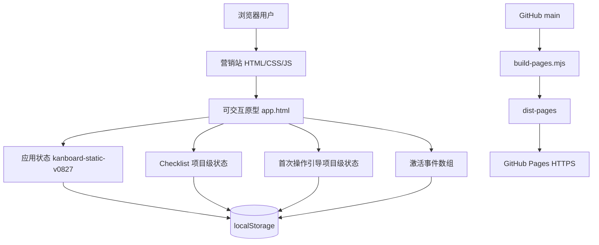

# Kanboard 新手激活与项目创建体验优化｜简历项目经历与面试准备手册

> 文档用途：用于简历项目经历改写、岗位定制、面试口述与技术追问准备  
> 项目周期：2026.05—2026.07  
> 项目角色：独立产品经理项目（AI 辅助原型开发与测试，关键结论与交付结果由本人复核）  
> 主投方向：通用产品经理；备选方向：AI 应用产品经理过渡版  
> 文档更新：2026-07-28

## 0. 使用说明

这不是一段需要全部放进简历的长文。正确用法是：

1. 简历中只选择第 3 章对应岗位的一版；主投版固定保留 4 条，空间不足时使用 3 条精简版。
2. 投递不同岗位时，调整标题、首条经历和关键词顺序，不改变事实。
3. 面试前阅读第 5—10 章，用于回答项目背景、产品方法、技术实现、取舍、数据与复盘问题。
4. 如果招聘方要求作品链接，优先提供营销首页和产品体验页；如果面试官想看方法论，再补充设计案例页。

本轮岗位调研与证据入口：

- [文档中心与证据边界](../README.md)
- [通用产品经理 JD 调研与项目匹配](通用产品经理JD调研与项目匹配-2026-07-28.md)
- [AI 产品经理 JD 调研与项目匹配](AI产品经理JD调研与项目匹配-2026-07-28.md)

项目公开入口：

- 营销首页：https://tangtongqing.github.io/kanboard-onboarding-optimization/
- 可交互产品原型：https://tangtongqing.github.io/kanboard-onboarding-optimization/app.html
- 价格计划：https://tangtongqing.github.io/kanboard-onboarding-optimization/pricing.html
- 联系页面：https://tangtongqing.github.io/kanboard-onboarding-optimization/contact.html
- 完整设计案例：https://tangtongqing.github.io/kanboard-onboarding-optimization/landing.html
- GitHub 仓库：https://github.com/tangtongqing/kanboard-onboarding-optimization
- Figma 文件：https://www.figma.com/design/Uye3u4Uva5cwVt4eQnvxvz

## 1. 项目标准介绍

### 1.1 推荐项目名称

Kanboard 新手激活与项目创建体验优化

简历中可使用的副标题：

- 独立产品经理项目（AI 辅助原型开发与测试）
- 看板工具新手激活与首次行动引导
- 从公开证据研究到静态演示上线的产品设计实践

不建议把项目命名为“Kanboard 复刻”或“静态页面项目”。前者会弱化真正的产品问题，后者会让面试官误以为项目只是前端练习。

### 1.2 一句话项目介绍

面向首次使用看板的学生、个人开发者和轻量团队成员，通过场景模板、结构预览和创建后首次操作引导，降低从模糊目标到第一张可用看板的启动与理解成本。

### 1.3 100 字项目介绍

围绕 Kanboard 新用户从模糊目标到可用看板的冷启动问题，基于公开用户证据和竞品研究完成需求规划、交互设计与可运行原型；通过场景化模板、结构预览、术语解释和首次操作引导降低启动与理解成本，并将营销页面、产品体验和设计案例公开交付为静态演示。

### 1.4 项目基本信息

| 项目项 | 内容 |
| --- | --- |
| 项目类型 | 独立产品经理项目；AI 辅助原型开发与测试，关键结果由本人复核 |
| 产品形态 | 轻量级看板项目管理工具的新手激活体验 |
| 目标用户 | 首次使用看板的学生、个人开发者、轻量团队负责人 |
| 核心问题 | 空白启动困难、术语理解成本高、创建后不知道第一步做什么 |
| 核心方案 | 4 类场景模板、创建前预览、示例卡、0/3 Checklist、10 项字段 Tooltip、4 类首次操作轻引导 |
| 个人职责 | 公开证据研究、问题定义、需求与版本规划、交互与视觉设计、前端原型、测试验收、文档和静态演示上线 |
| 主要工具 | Figma、HTML、CSS、JavaScript、localStorage、Playwright、Git、GitHub Actions、GitHub Pages、对话式 AI |
| 已验证成果 | 449 项自动化检查通过、74 张 Figma PNG 归档、26 张核心回归截图、公开 HTTPS 静态演示上线 |

### 1.5 能力标签

公开证据研究、竞品分析、问题定义、需求优先级、PRD、用户故事、信息架构、流程设计、交互状态、Figma、响应式设计、指标与事件设计、产品验收、独立项目推进、AI 辅助工作流、前端技术理解、自动化测试、静态发布。

## 2. JD 关键词与项目证据映射

### 2.1 当前岗位市场中的高频要求

截至 2026-07-28，对 OPPO、百度、华为、数势科技等企业招聘页及校招职位的复核显示：

- **通用产品经理**：核心仍是用户与市场研究、需求分析、产品规划、原型与 PRD、优先级、项目推进、测试验收、上线反馈和数据迭代。
- **产品助理/初级产品经理**：更强调结构化文档、流程与原型、进度跟进、测试和问题闭环；完整个人项目与作品集可以作为早期经验的重要证据。
- **AI 应用产品经理**：在产品基本功之外，增加 AI 场景判断、模型能力边界、Prompt、Agent Workflow、RAG、工具调用、效果评测和数据迭代要求。
- **2026—2027 校招趋势**：通用产品岗位也开始要求理解 AI 能力边界，并能用 AI 工具提升研究、原型、分析或交付效率；“会用 AI”仍不等于完成过 AI 产品。

参考岗位来源：

- [OPPO 2027 届互联网产品经理](https://careers.oppo.com/university/oppo/campus/post/1860)
- [OPPO 2027 届互联网产品经理（云与数据方向）](https://careers.oppo.com/university/oppo/campus/post/1622)
- [百度企业平台产品经理 J72463](https://talent.baidu.com/jobs/detail/SOCIAL/2e32e86f-d393-41fc-9d78-6bc0a5e34433)
- [华为 IT 产品经理/解决方案方向](https://career.huawei.com/reccampportal/portal5/social-recruitment-detail.html?dataSource=1&jobId=22643)
- [百度校招 AI 产品经理 J100665](https://talent.baidu.com/jobs/detail/GRADUATE/423c0fa3-a0f3-4def-a882-7466d3685b79)
- [百度 AI 产品经理（企业效能方向）J101407](https://talent.baidu.com/jobs/detail/SOCIAL/645aeeb5-f2a7-4df3-b13c-d90a6006aac3)
- [数势科技 AI Agent 产品经理](https://digitforce.com/jobinfo/ai-agent-product-manager)

### 2.2 通用产品经理能力映射

| JD 要求 | 本项目证据 | 主投版推荐表达 | 事实边界 |
| --- | --- | --- | --- |
| 用户与市场研究 | 官方文档、GitHub Issues、Hacker News、4 个竞品桌面研究 | 通过公开用户证据和竞品分析定义新手冷启动问题 | 未做招募式真人访谈 |
| 需求分析与 PRD | 问题定义、需求池、PRD、用户故事、验收标准 | 将问题转为可评审、可验收的产品需求 | 初版需求基于二手研究与设计假设 |
| 产品规划与优先级 | MVP 边界、In/Out、阶段路线、PD-018/PD-019 | 根据用户价值、核心路径、老用户影响和实现成本收敛首版范围 | 不表述为公司级战略 |
| 流程、原型与交互 | 故事地图、IA、S01—S15、F01—F47、桌面与 390px | 完成核心流程、异常状态及移动端差异化方案 | 不等同于正式组件库 |
| 项目推进与验收 | 任务编号、版本记录、回归报告、449 项自动化检查 | 独立建立需求—实现—验收闭环并推进静态演示上线 | 没有真实跨团队管理 |
| 数据意识 | 激活指标、12 类本地事件、项目级状态记录 | 设计指标与事件口径并验证事件可记录 | 没有真实流量和指标变化 |
| 技术理解 | 前端原型、localStorage、状态机、Playwright、GitHub Actions | 将需求转成可交互 Demo 并完成自动化验收 | 不是生产级系统 |
| AI 工具素养 | 资料归类、文档结构化、代码与测试辅助 | 使用对话式 AI 提升交付效率并复核关键结果 | AI 没有成为产品功能 |

### 2.3 AI 应用产品经理能力映射

| AI JD 要求 | 本项目证据 | 匹配状态 | 简历处理 |
| --- | --- | --- | --- |
| 用户场景与工作流分析 | 新手创建流程、故事地图、IA、复杂状态和异常路径 | 强匹配 | 强调场景拆解与 Workflow 思维，但不称为 Agent Workflow |
| 需求、原型与 Demo | PRD、Figma、可交互原型、静态公开演示 | 强匹配 | 作为 AI PM 仍需具备的产品基本功 |
| AI 能力边界判断 | PD-017 评估目标拆解助手，因静态环境、幻觉与验证不足未纳入已交付范围 | 部分匹配 | 可写技术机会评估与范围取舍，不能写 AI 功能落地 |
| AI 工具应用 | 对话式 AI 辅助资料、文档、原型代码和测试，关键结果人工复核 | 部分匹配 | 证明 AI 工作方式，不证明 AI 产品经验 |
| Prompt、Agent、RAG、工具调用 | 无真实产品内实现 | 缺口 | 不写入当前项目经历 |
| 模型效果评测 | 只有软件功能验收和自动化测试 | 缺口 | 449 项检查不能写成模型评测 |
| AI 用户与业务结果 | 无真实 AI 功能、用户和指标 | 缺口 | 不写准确率、任务成功率或提效比例 |

当前定位结论：

- **主投**：产品助理、助理产品经理、初级产品经理，偏工具产品、SaaS 和用户体验。
- **备选**：AI 应用产品经理/产品实习生过渡版，用于证明产品基本功、AI 工具素养和能力边界意识。
- **暂不主投**：模型策略、模型评测负责人、资深 Agent 产品经理、商业化或增长产品经理。

## 3. 按岗位定制的简历项目经历

以下每一版都可以直接作为简历项目经历使用。建议在一份简历中只选一版，不要把所有版本叠加。每条采用“能力标签｜具体行动｜可核验数据/证据”的结构，优先量化研究范围、方案规模、决策取舍、指标设计和公开交付；技术验证细节只保留在证据说明和面试材料中，不占用主简历篇幅。

### 3.1 通用产品经理主投版

项目名称：Kanboard 新手激活与项目创建体验优化｜独立产品经理项目（AI 辅助原型开发与测试）  
项目周期：2026.05—2026.07  
项目链接：https://tangtongqing.github.io/kanboard-onboarding-optimization/

项目介绍：面向首次使用看板的学生、个人开发者和轻量团队成员，通过场景模板、术语解释和首次操作引导，降低从模糊目标到第一张可用看板的启动与理解成本，并完成从问题定义到公开交付的独立产品闭环。

- 用户研究与问题定义｜检索官方文档、GitHub Issues、Hacker News 3 类公开来源，对比 Kanboard、WeKan、Trello、Notion 4 个产品的创建体验，识别空白启动、术语理解、首次行动 3 类问题，并将范围收敛到“创建第一张可用看板”；研究属于公开二手证据，不表述为真人访谈。
- 需求分析与产品规划｜从 12 个候选机会中，依据用户价值、核心路径、老用户影响和实现成本推进 4 个增量方向，输出需求池、P0/P1/P2、PRD、用户故事和 Given/When/Then 验收标准；保留空白创建快捷路径，停止与新手激活无关的系统级功能扩张。
- 产品方案与交互设计｜设计 4 类场景模板、模板/空白双路径、0/3 激活清单、10 项术语 Tooltip 和拖拽/编辑/删除/任务菜单 4 类轻引导；完成 S01—S15 共 15 个交互状态、F01—F47 共 47 项高保真功能覆盖及桌面/390px 原型，归档 74 张 Figma PNG。
- 项目推进与上线交付｜将研究、需求、设计、原型、验证和发布拆为阶段里程碑，以需求池、用户故事、验收标准、版本记录和复盘报告保持决策—方案—交付可追溯；定义首次可用看板激活率、3 分钟首次行动率 2 项核心指标及 12 类事件口径，公开发布营销、产品体验、价格、联系和设计案例 5 个页面。

### 3.2 AI 应用产品经理过渡版

> 使用边界：本项目没有接入 LLM、Agent 或 RAG。本版本用于匹配 AI 应用产品岗位中的产品基本功、工作流抽象、AI 工具素养和能力边界意识，不用于证明 AI 产品实绩。

项目名称：Kanboard 新手激活与项目创建体验优化｜独立产品经理项目（AI 辅助原型开发与测试）  
项目周期：2026.05—2026.07  
项目链接：https://tangtongqing.github.io/kanboard-onboarding-optimization/app.html

项目介绍：围绕新手从模糊目标到可用看板的任务流程，完成场景研究、需求与复杂状态设计、可运行 Demo 和验收体系，并使用对话式 AI 辅助资料整理、原型实现与测试交付。

- 场景研究与能力边界｜基于 3 类公开来源和 4 个竞品拆解新手创建、理解、首次操作 3 阶段流程；在 12 个候选机会中评估“目标到看板的 AI 拆解助手”，考虑静态环境、生成幻觉和验证成本后保留为研究方向，未把规则模拟或 AI 辅助过程包装成已上线 AI 功能。
- 需求与 Workflow 设计｜围绕 4 类模板、结构预览、示例内容转化和 4 类首次操作设计业务 Workflow、信息架构及 S01—S15 共 15 个状态，定义人工确认、错误处理、一次性引导、刷新恢复和组件冲突避让；该 Workflow 属于产品业务流程，不称为 Agent Workflow。
- Demo 构建与 AI 协作｜使用 Figma 和原生前端完成 F01—F47 共 47 项功能覆盖、74 张设计归档及桌面/390px 可交互 Demo，通过 localStorage 验证项目隔离、状态持久化和 12 类本地事件；使用对话式 AI 辅助资料、文档、代码审阅与测试补全，关键结果均人工复核。
- 指标设计与交付｜围绕首次可用看板激活率、3 分钟首次行动率 2 项核心指标设计 12 类事件口径，将人工确认、错误处理和能力边界纳入方案；按版本路线公开发布 5 个静态页面，同时明确当前没有模型评测或真实 AI 用户结果。

### 3.3 通用产品经理三条精简版

项目名称：Kanboard 新手激活与项目创建体验优化｜独立产品经理项目

- 用户研究与产品规划｜基于 3 类公开来源和 4 个竞品开展二手研究，识别 3 类新手问题，从 12 个候选机会中推进 4 个增量方向，输出需求池、P0/P1/P2、PRD、用户故事、验收标准及版本路线。
- 产品方案与交互设计｜设计 4 类模板、0/3 激活清单、10 项术语解释和 4 类操作引导，完成 15 个交互状态、47 项高保真功能覆盖、74 张设计归档及桌面/390px 可交互原型。
- 项目推进与上线交付｜按研究—需求—设计—原型—验证—发布推进，以需求池、验收标准、版本记录和复盘报告保持全流程可追溯；定义 2 项核心指标和 12 类事件口径，公开发布营销、产品体验、价格、联系和设计案例 5 个页面。

### 3.4 AI 应用产品经理三条精简版

项目名称：Kanboard 新手激活与项目创建体验优化｜独立产品经理项目（AI 辅助原型开发与测试）

- 场景与流程规划｜基于 3 类公开来源和 4 个竞品拆解新手创建、理解、首次操作 3 阶段流程，从 12 个候选机会中评估 AI 任务拆解方向，形成 PRD、版本路线和 15 个交互状态。
- Demo 与 AI 协作｜完成 47 项高保真功能覆盖、74 张设计归档及桌面/390px 可交互 Demo，验证项目隔离和 12 类本地事件；使用对话式 AI 辅助资料、文档、代码和测试，关键结果人工复核。
- 指标与交付｜围绕 2 项核心激活指标设计 12 类事件口径，将人工确认、错误处理和能力边界纳入方案，按版本路线公开发布 5 个静态页面；不把产品功能验收表述为模型评测或真实 AI 用户结果。

### 3.5 产品运营版

项目名称：Kanboard 新用户激活与体验运营优化｜独立产品运营项目  
项目周期：2026.05—2026.07  
项目链接：https://tangtongqing.github.io/kanboard-onboarding-optimization/

项目介绍：围绕新用户从了解产品、创建项目到完成首次真实操作的激活路径，完成用户问题分析、内容设计、引导机制、指标口径和体验承接页面建设。

- 用户路径运营｜梳理“了解产品→选择场景→体验功能→查看价格→联系咨询”5 阶段路径，重构营销首页导航与内容层级，形成营销、产品体验、价格、联系和设计案例 5 个独立承接页面。
- 内容运营｜面向学生、个人开发者和轻量团队负责人设计 4 类场景模板，为示例任务补充目标、完成标准、避坑提醒和修改建议，用场景化内容降低首次使用与任务拆解门槛。
- 数据与激活设计｜定义首次可用看板激活率和 3 分钟首次行动率 2 项核心指标，设计 12 类本地事件、0/3 激活清单、10 项术语 Tooltip 与 4 类一次性操作提示，覆盖永久关闭、冲突避让、390px 移动端和刷新恢复。
- 运营交付｜通过版本记录和体验走查跟踪需求、页面与引导机制，串联 5 个公开页面形成从产品认知、功能体验到价格咨询的承接路径；当前完成的是方案和展示交付，不表述为真实转化率或留存率提升。

### 3.6 产品助理／产品支持版

项目名称：Kanboard 项目创建与新手体验优化｜产品全流程实践  
项目周期：2026.05—2026.07  
项目链接：https://tangtongqing.github.io/kanboard-onboarding-optimization/app.html

项目介绍：围绕工具型产品的新手使用问题，独立完成需求资料整理、产品文档、流程设计、原型制作、测试验收和静态上线维护。

- 信息与文档管理｜整理官方文档、GitHub Issues、Hacker News 3 类公开来源及 4 个竞品资料，形成问题清单、需求池、PRD、用户故事、流程、状态规格和证据边界，保证需求来源、结论和待验证假设可追溯。
- 原型与产品演示｜使用 Figma 完成 F01—F47 共 47 项高保真功能覆盖、74 张设计归档及桌面/390px 设计，同步制作可操作演示，支持体验 4 类模板、卡片编辑、任务拖拽和新手引导。
- 需求验收与问题跟踪｜将用户故事转成 Given/When/Then 验收场景，建立需求—状态—问题—复测对应关系，覆盖模板/空白创建、表单异常、0/3 Checklist、10 项 Tooltip、4 类操作引导和移动端防溢出。
- 工具提效｜使用 Git、GitHub Actions 和 GitHub Pages 完成版本管理与自动发布，交付 5 个公开页面；借助对话式 AI 辅助资料归类、文档校对和测试补全，关键输出均通过代码或浏览器复核。

### 3.7 京东业务支持／运营支持版

项目名称：Kanboard 新手项目创建流程与运营支持机制优化  
项目周期：2026.05—2026.07  
项目链接：https://tangtongqing.github.io/kanboard-onboarding-optimization/

项目介绍：围绕新手项目创建与任务拆解场景，搭建从需求收集、流程梳理、方案落地、进度跟踪到验收复盘的项目机制，并通过文档、产品演示与数据口径提升支持效率。

- 流程机制建设｜梳理新用户从创建项目到完成首次任务操作的 3 阶段流程，识别空白启动、概念理解和行动中断 3 类关键问题，形成问题清单、流程图及 S01—S15 共 15 个交互状态。
- 项目推进｜从 12 个候选机会中推进 4 个增量方向，建立“需求池—P0/P1/P2—用户故事—验收标准—版本记录—回归测试”6 环节机制，保证需求、实现和验收结果可追溯。
- 业务支持｜将看板方法转化为 4 套场景模板、10 项术语解释和 4 类操作指引，同时建设营销、产品体验、价格、联系和设计案例 5 个页面，完善产品介绍与业务承接路径。
- 数据与 AI 工具｜设计 2 项核心激活指标和 12 类本地事件，形成后续漏斗分析与迭代验证口径；使用对话式 AI 辅助信息整理、文档结构化和测试补全，关键结果均经复核，不虚构跨部门协调或真实业务结果。

## 4. 简历写法与岗位选择建议

### 4.1 最匹配的岗位

| 岗位 | 匹配度 | 原因 |
| --- | --- | --- |
| 产品助理／助理产品经理 | 高 | 有较完整的研究、文档、原型、验收与上线闭环 |
| 初级产品经理，偏工具/SaaS/体验 | 高 | 能展示问题定义、需求规划、复杂交互、技术理解和独立交付 |
| AI 应用产品经理／产品实习生 | 中 | 有产品基本功、AI 工具素养和能力边界意识，但没有真实 AI 功能 |
| 产品运营，偏体验与迭代 | 中高 | 有激活路径、内容、指标设计和营销承接 |
| 产品支持／业务支持 | 中高 | 有流程机制、文档管理、项目跟进、演示和 AI 工具应用 |
| B 端产品经理 | 中 | 有复杂流程和平台理解，但缺少真实企业客户与业务环境 |
| 数据产品经理 | 中低 | 有指标和事件设计，没有 SQL、数据平台和真实数据分析证据 |
| 用户增长／商业产品经理 | 低 | 没有真实流量、实验、收入、客户或商业化结果 |
| 模型策略／模型评测／资深 Agent 产品经理 | 低 | 没有 LLM、Agent、RAG、Prompt 或模型评测落地 |

### 4.2 不能写成什么

- 不写“转化率提升 XX%”“留存提升 XX%”，因为没有真实线上流量数据。
- 不写“访谈 XX 名用户”，因为研究主要来自公开二手证据和专家走查。
- 不写“协调研发、设计、运营团队”，因为项目由个人独立完成。
- 不写“上线生产环境”，应写“公开上线静态可交互演示”。
- 不写“搭建正式数据平台”，应写“设计事件口径并在 localStorage 中模拟记录”。
- 不写“完成商家开发和谈判”，本项目没有招商和客户关系实绩。
- 不写“接入大模型能力”，AI 用于工作过程提效，没有成为产品功能。
- 不把产品业务流程写成“Agent Workflow”，不把 449 项软件功能检查写成“模型评测”。
- 不加入 RAG、向量数据库、Prompt 工程、模型调优或 AI 任务成功率等缺少直接证据的关键词。

## 5. 完整项目实现流程

### 5.1 总体流程


### 5.2 阶段一：选择问题与控制范围

起点不是“我要给 Kanboard 增加更多功能”，而是“新用户如何更快创建第一张可用看板”。

具体做法：

1. 先复现 Kanboard 的项目、列、泳道、任务卡和多视图，建立对原产品信息结构的理解。
2. 将问题范围收敛到创建前、创建时、创建后三个阶段。
3. 设置非目标：不做模板市场、真实团队协同、账号体系、支付、后端数据库和 AI 拆解服务。
4. 用“是否帮助用户创建并使用第一张可用看板”判断需求是否进入本轮。

这一步体现的能力：问题聚焦、MVP 意识、范围管理、避免方案膨胀。

### 5.3 阶段二：公开证据研究

研究来源：

- Kanboard 官方 Projects 文档，理解原始创建与复制逻辑。
- GitHub Issues，观察模板复用、权限复制、移动端滚动、触摸误操作和未保存内容丢失等具体问题。
- Hacker News 公开评论，理解个人用户对轻量、快速和低负担的偏好。
- Kanboard、WeKan、Trello、Notion 的新手创建体验对比。

证据处理原则：

- 把官方文档视为产品事实。
- 把 Issue 和公开评论视为问题信号，不推断发生比例。
- 把跨来源重复出现的模式作为方向性证据。
- 把由证据推导出的设计判断标注为假设。
- 明确说明没有招募式真人测试，避免把模拟画像当作真实样本。

核心研究结论：

1. 新手需要的不只是一个空项目，而是一套能直接理解的结构起点。
2. 模板必须可预览、可修改、可删除，不能成为不可理解的系统答案。
3. 个人与熟练用户重视效率，必须保留空白创建路径。
4. 移动端的可滚动、可触达和防误触是高风险节点。
5. 未保存保护与删除确认属于数据安全感问题，不只是文案优化。

### 5.4 阶段三：目标用户与问题定义

基于使用场景建立三类假设用户：

- 作品集或求职项目中的学生，需要知道如何把目标拆成可执行任务。
- 管理个人开发任务的开发者，希望快速记录 Bug 和迭代事项。
- 轻量团队负责人，希望快速建立统一列结构、负责人和截止日期。

问题陈述：

当新用户带着一个明确目标进入 Kanboard 时，产品只提供空白创建和较多专业概念，用户无法判断应该建立哪些列、如何拆分任务以及下一步做什么，导致创建完成不等于真正开始使用。

问题拆解：

| 阶段 | 用户问题 | 产品机会 |
| --- | --- | --- |
| 创建前 | 不知道从空白还是模板开始 | 同屏提供两种入口 |
| 创建中 | 不知道模板会生成什么 | 提供列、泳道、示例卡预览 |
| 创建后 | 看到了看板但不敢操作 | 0/3 Checklist 与一次性轻引导 |
| 配置时 | 不懂 WIP、泳道等术语 | 就地 Tooltip 白话解释 |
| 移动端 | 浮层遮挡、触控误操作 | Drawer、Bottom Sheet、44px 触控目标 |

### 5.5 阶段四：需求池与优先级

需求池最初包含 R001—R010，并按 P0/P1/P2 分层。

P0 解决首次可用：

- 空白项目／从模板开始双入口。
- 4 个内置场景模板。
- 模板列结构和示例卡预览。
- 自动生成列与 3—5 张示例卡。
- 示例卡可编辑、可删除。
- 创建后直接进入看板。
- 项目名称校验和 390px 基本可用。

P1 增强理解与复用：

- 字段微文案。
- 创建后轻提示。
- 保存为自定义模板。
- 未保存内容保护。

P2 远期能力：

- 模板管理与模板市场。
- 更复杂的多视图与平台能力。

优先级判断没有伪造 RICE 分数，而是依据用户价值、是否阻塞主路径、实现成本、证据置信度和范围风险进行分层。

### 5.6 阶段五：PRD、用户故事与验收标准

PRD 结构包括：背景、问题、目标用户、目标与指标、范围、非范围、用户场景、功能需求、交互状态、数据事件、验收标准、风险和待验证问题。

用户故事示例：

```text
作为第一次使用看板的新用户，
我想在创建项目前预览模板会生成的列和任务，
以便确认它是否适合我的目标，避免创建后再返工。
```

验收示例：

```text
Given 用户已选择一个场景模板，
When 用户进入模板预览，
Then 页面展示列结构、泳道和示例任务，并允许返回重新选择。
```

这套写法把抽象需求转换成可设计、可实现、可测试的行为条件。

### 5.7 阶段六：流程、信息架构与状态机

创建流程覆盖：

1. 打开新建项目弹窗。
2. 选择空白项目或场景模板。
3. 输入名称并选择模板。
4. 预览结构。
5. 提交创建。
6. 处理加载、错误或成功。
7. 进入看板并触发适合该用户的引导。

除主路径外，还设计了名称为空、切换创建方式、返回模板列表、取消创建、未保存关闭、长预览滚动、创建失败和移动端空间不足等边界流程。

创建向导状态机包含默认、选择方式、模板列表、模板选中、模板预览、空白表单、必填错误、提交中、创建成功、取消、未保存确认、移动端列表、移动端预览、示例卡编辑和删除确认等状态。

### 5.8 阶段七：低保真与高保真设计

低保真阶段验证信息层级、操作顺序、固定操作区、滚动归属和焦点顺序。高保真阶段再补充视觉层级、组件状态、响应式布局和交付说明。

设计交付包括：

- D02 新建项目核心流程。
- F01—F47 全功能页面与状态覆盖。
- PD-018 新手激活体验 12 个关键 Frame。
- PD-019 首次核心操作引导 12 个关键 Frame。
- 共 74 张最终 Figma PNG 归档。
- 桌面以 1440px 为主要画布，移动端以 390px 为主要验证宽度。

主要设计原则：

- 在做中教，不设置独立教程课程。
- 渐进披露，先给主任务所需信息。
- 帮助可关闭、可折叠、完成后永久退出。
- 保留空白创建，避免打扰熟练用户。
- 错误、加载、确认、成功和移动端状态与主路径同等重要。
- 不只依靠颜色表达状态，保留焦点、文本和触控可达性。

### 5.9 阶段八：前端原型实现

项目使用原生 HTML、CSS、JavaScript 实现，不依赖前端框架和后端服务。这样可以直接在浏览器运行、方便作品集分享，并把主要精力放在产品状态与交互验证上。

核心能力：

- 项目、列、泳道、任务卡和多视图数据模型。
- 空白创建和 4 类模板创建。
- 任务编辑、删除、拖拽、筛选和项目设置。
- 新手 Checklist、Tooltip、首次操作引导。
- 桌面与移动端差异化交互。
- localStorage 状态持久化和本地事件记录。
- 营销首页、价格计划、联系页面和设计案例。

### 5.10 阶段九：测试与验收

验收从 PRD 中的 Given/When/Then 条件反向生成测试路径，重点覆盖：

- 模板创建、空白创建、名称校验、加载和成功反馈。
- 示例卡编辑、删除和拖拽。
- Checklist 从 0/3 到 3/3、关闭、刷新恢复和项目隔离。
- Tooltip 桌面 Hover、键盘 Focus、移动端 Tap 与边缘翻转。
- 首次拖拽、编辑、菜单和删除确认。
- Dialog、Drawer、Tooltip 与 Checklist 同时出现时的互斥。
- 390px 无横向页面溢出、关键按钮高度不低于 44px。
- 埋点字段、时间戳、项目 ID 和日志裁剪。

最终结果：449 项自动化检查通过；PD-018 与 PD-019 分别归档 14 张和 12 张核心回归截图。

### 5.11 阶段十：营销承接与公开上线

上线阶段把面向用户的营销叙事和面向面试官的设计过程分开：

- 根地址展示产品价值、场景、核心能力和体验入口。
- `app.html` 提供可操作原型。
- `pricing.html` 表达方案分层，但没有真实支付。
- `contact.html` 表达咨询承接，但没有真实 CRM 入库。
- `landing.html` 展示完整项目设计过程和证据。

使用构建脚本生成 `dist-pages`，通过 GitHub Actions 在 `main` 分支更新时自动构建和部署到 GitHub Pages。构建会把本地原型 `index.html` 映射为线上 `app.html`，把 `product.html` 映射为站点根首页，避免营销页与产品页路径冲突。

## 6. 产品理论与方法说明

### 6.1 问题优先，而非功能优先

项目的核心不是“增加模板、Tooltip 和动画”，而是减少用户从目标到首次有效行动之间的阻力。每个功能都必须能对应一个明确问题：

| 功能 | 对应问题 |
| --- | --- |
| 双入口 | 新手需要帮助，熟练用户需要效率 |
| 场景模板 | 用户不会从目标推导看板结构 |
| 创建前预览 | 用户不知道系统即将生成什么 |
| 示例卡 | 用户不知道任务应该拆到什么粒度 |
| Checklist | 创建完成后缺少连续行动 |
| Tooltip | 专业术语增加理解成本 |
| 一次性轻引导 | 用户不敢第一次拖、改、删 |
| 删除确认 | 高风险操作后果不透明 |

### 6.2 在做中教

方案没有增加独立新手课程，而是把教学嵌入真实任务：修改示例卡、拖动任务、新建真实卡。理论上对应情境学习、边做边学和降低认知切换成本。

面试表达：

“新手的目标不是学会看板理论，而是把自己的事情管起来。所以我没有先让用户看教程，而是让他在真实编辑、拖拽和创建中理解看板。”

### 6.3 渐进披露

创建阶段只展示完成选择所需的信息；专业字段在用户需要时通过 Tooltip 解释；更多操作在用户打开菜单时再提示。这样可以避免首屏堆满说明文字。

### 6.4 新手帮助与熟练用户效率的双路径

模板路径承担引导，空白路径保留效率；Checklist 只在模板项目触发；轻引导完成、关闭或已操作后不再显示。这是项目最重要的产品取舍之一。

### 6.5 错误预防与高风险保护

名称为空使用行内错误；有未保存内容时需要确认离开；首次删除提供明确后果、取消和确认；WIP 限制导致拖拽失败时不误判任务完成。对应错误预防、状态可见和操作可撤回原则。

### 6.6 North Star 与 OMTM

设计口径：

- North Star：首次可用看板激活率。
- OMTM：创建后 3 分钟内完成至少 1 个真实动作的用户比例。

为什么不只看“项目创建成功率”：创建只是表面完成，用户真正获得价值的信号是开始修改、流转或创建自己的任务。

当前项目只完成指标定义与本地事件验证，没有真实分母、真实用户和线上转化数据。

### 6.7 用户故事地图与 P0/P1/P2

用户故事地图把用户行为顺序与版本范围放在同一张图中。P0 保证第一次可用，P1 增强理解和复用，P2 延后平台化能力。它帮助项目抵抗“为了完整而继续加功能”的倾向。

### 6.8 状态机思维

界面不是静态页面集合，而是由触发条件、当前状态、允许操作和下一状态组成。Checklist 和首次操作引导都使用显式状态，便于处理刷新、重复展示、互斥和项目隔离。

### 6.9 可访问性与响应式

项目以 WCAG 2.1 AA 作为设计基线，关注 4.5:1 正文对比度、键盘焦点、错误文本、读屏状态、44px 移动触控目标和 `prefers-reduced-motion`。移动端不是桌面压缩版，而是使用 Drawer、Inline Strip 和 Bottom Sheet 替换桌面浮层。

### 6.10 产品经理文档体系：BRD、MRD、PRD 分别解决什么问题

BRD、MRD、PRD 没有全行业统一格式，不同公司也可能合并文档。真正重要的不是文件名，而是依次回答三个问题：

```text
BRD：为什么值得做，对业务有什么价值？
MRD：市场和用户需要什么，机会在哪里？
PRD：这一版本具体做什么，怎样才算完成？
```

三类文档的关系：


| 文档 | 核心读者 | 核心问题 | 常见内容 | 本项目对应材料 |
| --- | --- | --- | --- | --- |
| BRD | 业务负责人、管理层、项目决策者 | 为什么做、值不值得投入 | 背景、业务问题、目标、收益、资源、风险、决策请求 | 启动说明、项目目标、范围与非目标 |
| MRD | 产品、市场、运营、业务 | 为谁做、市场需要什么、和竞品有什么差异 | 市场环境、用户细分、场景、竞品、需求机会、市场风险 | [正式 MRD](../01-research-discovery/MRD-Kanboard新手项目创建与任务拆解优化.md) |
| PRD | 产品、设计、研发、测试、运营 | 这一版本具体做什么、如何验收 | 目标、范围、流程、功能、状态、数据、验收、发布 | [正式 PRD](../02-requirements/PRD-Kanboard新手项目创建与任务拆解优化.md) |

本项目已将竞品分析、用户假设、需求池和公开证据边界合并为正式 MRD，并将主需求、用户故事、激活增量和轻引导增量合并为正式 PRD。BRD 仍未作为独立文件产出，业务立项信息保留在启动与治理文档中。

### 6.11 BRD 怎么做：从业务问题到立项判断

BRD 是 Business Requirements Document，即业务需求文档。它不应直接堆功能，而应说明为什么要投入资源解决这个问题。

一份可用 BRD 通常按以下顺序制作：

1. 业务背景：当前业务处于什么阶段，为什么现在要解决。
2. 业务问题：现状造成了什么用户或经营损失。
3. 目标与价值：希望改善什么业务结果和用户结果。
4. 利益相关方：谁提出需求、谁使用、谁交付、谁决策。
5. 方案方向：只写方向与边界，不提前锁死具体交互。
6. 资源与约束：人员、时间、预算、系统、合规和依赖。
7. 收益与成本：能带来什么收益，投入和机会成本是什么。
8. 风险与假设：哪些结论已验证，哪些仍是判断。
9. 决策请求：希望评审者批准立项、调研还是进入方案阶段。

BRD 中的业务目标最好同时包含：

- 用户目标：用户更快获得核心价值。
- 业务目标：激活、留存、收入、成本或效率得到改善。
- 项目目标：在给定资源和周期内交付什么结果。
- 护栏指标：不能为了主指标损害什么。

本项目的 BRD 映射：

| BRD 项 | 本项目实践 |
| --- | --- |
| 业务背景 | Kanboard 功能完整但新手创建入口偏空白，产品能力与首次使用之间存在断层 |
| 业务问题 | 用户创建项目后仍可能不会搭结构、不理解术语、不敢完成第一次操作 |
| 用户价值 | 降低从目标到第一张可用看板的认知和操作成本 |
| 产品价值 | 提升新用户激活可能性，同时保持工具的轻量定位 |
| 项目目标 | 完成从研究、需求、设计、原型、测试到公开上线的闭环 |
| 方案方向 | 模板与空白双路径、结构预览、示例卡、激活清单和轻引导 |
| 约束 | 独立项目、无真实后端、无账号体系、无真实商业流量 |
| 护栏 | 熟练用户创建效率不能因新手引导下降 |
| 风险 | 二手研究不能替代真人测试；静态事件不能证明真实转化 |

如果把本项目压缩成一页 BRD，可这样表达：

```text
业务问题：
Kanboard 的功能价值需要用户先理解看板结构，但新用户创建后面对空白项目，
导致“创建成功”与“真正开始使用”之间存在激活断层。

目标：
帮助新用户建立第一张可用看板并完成第一次真实操作，
同时不增加熟练用户的创建步骤。

拟验证指标：
首次可用看板激活率；
创建后 3 分钟首次真实行动率；
熟练用户空白创建耗时作为护栏指标。

范围：
模板、预览、示例卡、Checklist、字段帮助和首次操作提示。

非范围：
真实团队协作、账号、支付、模板市场和 AI 服务。
```

面试追问“为什么项目没有正式 BRD”时，可回答：

“这是独立作品集项目，没有公司内部的立项、预算和经营审批流程，因此当时没有单独建立 BRD 文件。但我在启动说明和机会定义中完成了业务问题、目标、价值、范围、约束和风险分析。进入真实公司项目后，我会把资源投入、业务收益、利益相关方和决策请求补成正式 BRD。”

### 6.12 MRD 怎么做：从市场信息到产品机会

MRD 是 Market Requirements Document，即市场需求文档。它连接业务机会和产品需求，重点不是描述整个行业，而是回答目标市场中的哪些用户问题值得优先解决。

MRD 的标准制作流程：

1. 明确研究问题：要判断市场规模、用户问题、竞品差异还是进入时机。
2. 划分市场和用户：优先按任务、场景和问题分组，而不是只看年龄与职业。
3. 收集证据：行业报告、公开数据、用户访谈、客服反馈、搜索趋势、竞品体验和社区讨论。
4. 分析用户任务：用户想完成什么、当前如何解决、为什么不满意。
5. 分析竞争：直接竞品、替代方案、自建流程及“不处理”都要考虑。
6. 提炼需求机会：把证据从“用户抱怨”转成“待解决任务”。
7. 判断差异与定位：产品在哪些维度做得更好，哪些维度主动不竞争。
8. 形成市场需求优先级：按问题强度、频率、覆盖范围、支付或采用意愿、证据置信度排序。
9. 给出进入建议：进入、暂缓、继续调研或只做小范围验证。

常见 MRD 结构：

```text
1. 市场背景与趋势
2. 目标市场和细分用户
3. 核心场景与用户任务
4. 当前解决方案
5. 竞品与替代方案
6. 未满足需求
7. 产品机会与差异化
8. 市场风险与假设
9. 市场需求优先级
10. 对 PRD 的输入
```

本项目的 MRD 映射：

| MRD 项 | 本项目实践 |
| --- | --- |
| 市场范围 | 轻量看板工具的新手创建与激活体验，不研究整个项目管理软件市场 |
| 用户细分 | 学生与求职者、个人开发者、轻量团队负责人 |
| 公开证据 | 官方文档、GitHub Issues、Hacker News 公开讨论 |
| 竞品 | Kanboard、WeKan、Trello、Notion |
| 替代方案 | 空白看板、复制旧项目、手工搭列、使用文档或表格管理 |
| 未满足需求 | 不会搭结构、不理解模板将生成什么、不敢改示例、不懂术语 |
| 机会方向 | 保持轻量前提下提供一次“从目标到可用看板”的桥梁 |
| 风险 | 公开评论是自选择样本，无法推断市场问题发生率 |
| MRD 输出 | 10 条需求池、4 个核心场景、P0/P1/P2 机会分层 |

本项目为什么没有计算 TAM、SAM、SOM：

- TAM 是理论总市场，SAM 是当前能力可服务市场，SOM 是可实际获得市场。
- 这套规模模型适合新产品立项、融资或市场进入判断。
- 本项目优化的是现有开源工具中的具体体验，不涉及真实商业进入和营收预测。
- 缺少可信用户量、付费率和渠道数据时，硬算市场规模会制造伪精确。

如果面试岗位特别看重市场分析，可以说下一步会补：

1. 看板和轻量项目管理工具的用户规模与付费结构。
2. 个人用户与小团队的场景占比。
3. 竞品模板使用、激活和付费功能差异。
4. 新手激活对试用转付费的潜在影响。
5. 通过真实数据估算可服务人群，而不是用行业总盘子代替。

### 6.13 PRD 怎么做：把问题转换成可交付需求

PRD 是 Product Requirements Document，即产品需求文档。PRD 不是页面说明书，也不是把原型截图贴在一起。它应该让设计、研发、测试和运营对目标、范围、行为、数据与验收形成同一理解。

一份完整 PRD 可采用八个部分：

1. Summary：用 2—3 句话说明本需求是什么。
2. Contacts：负责人、评审者和协作角色。
3. Background：背景、问题、为什么现在做。
4. Objective：用户目标、业务目标、成功指标和护栏指标。
5. Market Segments：为哪些问题和场景中的用户设计。
6. Value Propositions：用户获得什么、避免什么损失、相对现状好在哪里。
7. Solution：流程、功能、状态、数据、技术约束和假设。
8. Release：首版范围、后续版本、依赖、验收和发布计划。

项目中的 PRD 制作流程：


本项目原有的主 PRD、用户故事、激活增量和轻引导增量已合并为一份[正式 PRD](../02-requirements/PRD-Kanboard新手项目创建与任务拆解优化.md)，后续需求变更只更新这一份单一事实源。

本项目 PRD 的关键思路：

#### 先写问题，不先写功能

错误写法：

```text
需要增加模板中心和新手教程。
```

本项目写法：

```text
新用户知道要管理什么，却不知道如何把目标转换为列、泳道和任务；
项目创建成功后，也缺少能帮助其完成首次真实操作的连续路径。
```

问题写清楚后，模板只是多个可能方案中的一个，而不是预设答案。

#### 目标必须可观察

目标不是“优化体验”，而是：

- 用户能够选择合适的创建方式。
- 用户能够在创建前理解即将生成的结构。
- 用户能够创建第一张可用看板。
- 用户能够完成修改、拖拽或新增中的至少一个真实动作。
- 熟练用户仍能快速创建空白项目。

#### 范围与非范围同时写

本项目把模板、预览、示例卡和首次行动列入范围，同时明确不做模板市场、账号、云同步、支付和 AI 服务。非范围能减少评审中的需求蔓延，也能帮助研发正确估算。

#### 功能需求写行为和规则

以 Checklist 为例，PRD 不只写“显示新手任务”，还定义：

- 何时展示：模板项目首次进入时。
- 对谁展示：没有关闭或完成的项目。
- 展示什么：编辑、向右拖拽、新建真实卡三项。
- 如何判定：真实保存、成功落入右侧列、标题不含占位词。
- 如何持久化：按项目 ID 保存。
- 如何退出：完成、永久关闭或重置。
- 异常怎么办：示例卡被删光后启用 fallback。
- 移动端怎么办：气泡入口和 Bottom Drawer。

#### 状态不能只画主流程

本项目 PRD 同时覆盖默认、选中、加载、成功、错误、空状态、未保存、删除确认、移动端和互斥状态。研发成本往往出现在这些分支，而不是理想主路径。

#### 验收必须能测试

模糊写法：

```text
移动端体验良好。
```

可验收写法：

```text
Given 浏览器宽度为 390px，
When 用户打开创建向导并滚动至底部，
Then 内容可完整访问，页面不产生横向溢出，主操作按钮可点击。
```

#### 指标必须与事件对应

如果指标是首次行动率，就必须定义什么动作算首次行动、事件何时触发、包含哪些参数、如何去重、分母是什么。项目用本地事件验证了触发逻辑，但没有伪装成真实线上分析。

### 6.14 BRD、MRD、PRD 的常见错误

| 错误 | 为什么有问题 | 正确处理 |
| --- | --- | --- |
| BRD 直接列页面和按钮 | 还没有证明业务价值就锁定方案 | 先写业务目标、收益、风险和决策请求 |
| MRD 只罗列行业规模 | 市场大不等于用户问题值得解决 | 回到目标场景、现有方案和未满足需求 |
| PRD 只有原型截图 | 研发无法知道规则、状态和边界 | 补流程、数据、异常、权限和验收 |
| 三份文档重复粘贴 | 阅读成本高且版本容易冲突 | 上游结论引用，下游只展开新增决策 |
| 把假设写成事实 | 后续无法判断为什么做错 | 标注证据来源、置信度和验证计划 |
| 需求没有非范围 | 评审中不断扩张 | 明确首版不解决什么以及原因 |
| 指标只有“提升” | 无法计算和验收 | 写公式、事件、窗口、分母和目标方向 |
| PRD 写死视觉细节 | 限制设计空间 | 先写行为约束，视觉细节放设计规格 |

### 6.15 从需求到方案：产品经理的五层思考

产品经理需要区分以下五层，避免用户说要一个按钮就直接排期：

```text
现象：用户创建后没有继续操作。
问题：用户不知道下一步，也担心修改示例会破坏项目。
需求：需要理解操作方法和后果，并获得安全感。
方案：Checklist、一次性提示、删除确认。
功能：Popover、Dialog、状态记录和事件。
```

本项目的实践思路：

1. 从公开反馈中记录现象，不直接照搬用户建议。
2. 对现象追问发生阶段、目标、障碍和后果。
3. 将障碍归为结构理解、术语理解和操作焦虑。
4. 为每类问题提出多个方案，再根据干扰、成本和范围选择。
5. 最后才把方案写成具体组件与状态。

### 6.16 JTBD、用户画像和使用场景

JTBD，即 Jobs To Be Done，关注用户在某个情境下想推动什么进展。它比只描述年龄、职业更接近产品决策。

本项目可归纳的核心 Job：

```text
当我已经有一个学习、求职、开发或团队目标，
但不知道如何建立看板结构时，
我希望快速得到一套可理解、可修改的任务起点，
这样我能马上开始管理真实工作，而不是先学习项目管理理论。
```

三类用户画像的意义不是给用户贴标签，而是覆盖不同约束：

| 用户 | 核心 Job | 特殊约束 |
| --- | --- | --- |
| 学生／求职者 | 把模糊目标拆成可执行任务 | 项目管理经验少，需要示例 |
| 个人开发者 | 快速记录开发任务和 Bug | 重视速度，不喜欢强制教程 |
| 轻量团队负责人 | 快速统一团队流程 | 关注列结构、负责人和截止时间 |

面试时要说明这些画像来自桌面研究和场景假设，并非真实访谈后形成的统计画像。

### 6.17 竞品分析怎么做

竞品分析不是截图对比，也不是列出谁的功能多。标准步骤是：

1. 明确分析问题，例如“谁更好地帮助新手开始第一张看板”。
2. 选择直接竞品、间接竞品和替代方案。
3. 使用同一任务走查每个产品，避免随意浏览。
4. 对比入口、步骤、信息、反馈、错误、移动端和退出机制。
5. 区分可复制做法、产品定位差异和不适用做法。
6. 提炼机会，不直接抄功能。

本项目选择：

- Kanboard：研究对象，轻量、直接，但新手起点较空。
- WeKan：相近开源看板，协作能力更重。
- Trello：模板化和新手上手较成熟。
- Notion：把方法和内容包装进模板，场景表达强。

本项目没有把 Kanboard 做成 Trello 或 Notion，而是提炼共同原则：“把方法包装进可修改的模板”，再保留 Kanboard 的轻量和空白创建效率。

### 6.18 用户研究怎么做

用户研究分为定性和定量，两者回答的问题不同：

| 方法 | 适合回答 | 常见产出 |
| --- | --- | --- |
| 用户访谈 | 为什么这样想、当前如何解决 | 动机、场景、语言和假设 |
| 可用性测试 | 用户能否完成任务、卡在哪里 | 行为问题、严重度和改进点 |
| 问卷 | 某类态度或行为有多常见 | 样本分布和自报数据 |
| 行为数据 | 用户实际上做了什么 | 漏斗、留存、路径和分群 |
| 客服／社区反馈 | 有哪些高强度问题 | 问题池和真实案例 |
| 桌面研究 | 市场、竞品和已有证据是什么 | 方向性结论和待验证假设 |

本项目使用的是桌面研究、公开案例研究、竞品走查和自动化验证，没有执行招募式真人访谈或可用性测试。

如果补做研究，建议流程：

1. 招募 5—8 名没有看板经验、但有真实项目目标的用户。
2. 不先介绍功能，让用户用空白路径完成一张看板。
3. 再让用户用模板路径完成同类任务，采用交叉顺序降低学习效应。
4. 观察是否理解模板、是否修改示例、是否完成首次行动。
5. 记录完成率、耗时、求助次数、错误和主观信心。
6. 访谈结束后按问题严重度和出现人数整理，不用少量样本推断市场比例。
7. 把结果回写问题定义、优先级、PRD 和设计。

### 6.19 需求优先级理论与本项目实践

常见优先级方法：

#### P0／P1／P2

- P0：不做就无法完成核心任务或无法发布。
- P1：明显增强价值，但可以在首版之后交付。
- P2：长期增强项，当前不阻塞核心价值。

本项目实际采用该方法，优点是简单、适合独立项目；缺点是容易受主观判断影响，因此需要写清每一级的判断依据。

#### MoSCoW

- Must have：必须有。
- Should have：应该有。
- Could have：可以有。
- Won't have now：本轮明确不做。

本项目可映射为：

- Must：双入口、模板、预览、创建和基本异常。
- Should：Checklist、Tooltip、未保存保护。
- Could：保存为自定义模板。
- Won't：模板市场、后端协作、支付、AI 服务。

#### RICE

公式：

```text
RICE = Reach × Impact × Confidence ÷ Effort
```

- Reach：一定周期内影响多少用户。
- Impact：对目标指标影响多大。
- Confidence：证据有多可靠。
- Effort：需要多少人时或人周。

本项目没有正式使用 RICE，因为没有真实用户量和团队工时数据。面试时不能为了显得数据化而补造分数。如果进入真实迭代，可以用访问用户数估 Reach，用激活率影响估 Impact，用研究质量估 Confidence，用设计、开发和测试人周估 Effort。

#### Kano

- 基础型：缺失会强烈不满，例如创建成功、数据不丢失。
- 期望型：做得越好越满意，例如创建效率、模板适配。
- 兴奋型：超出预期，例如智能拆解或高质量示例。

Kano 适合判断满意度属性，不直接替代版本排期。本项目可以用它解释为什么名称校验和删除保护优先级高于炫酷动画。

### 6.20 MVP、版本规划和 Roadmap

MVP 不是“功能最少”，而是“用最小完整方案验证核心价值”。本项目的最小价值闭环是：

```text
选择适合的起点
→ 看懂将生成的结构
→ 创建一张可用看板
→ 完成第一次真实操作
```

Roadmap 不只是功能时间表，应表达目标、假设和阶段结果：

| 阶段 | 目标 | 本项目交付 |
| --- | --- | --- |
| Discovery | 确认问题方向 | 公开证据、竞品、问题定义 |
| Definition | 收敛首版范围 | 需求池、P0/P1/P2、PRD |
| Design | 证明流程和状态可表达 | 低保真、Figma、响应式规格 |
| Delivery | 证明方案可运行 | 原生前端原型、状态持久化 |
| Validation | 证明路径可达 | 449 项检查、26 张核心截图 |
| Launch | 让外部人员可访问 | GitHub Pages 与营销承接 |
| Next | 验证真实效果 | 真人测试、线上事件、实验 |

### 6.21 指标体系、漏斗和埋点

指标设计至少包含四层：

1. 北极星指标：长期表达用户获得的核心价值。
2. 阶段核心指标：当前迭代最重要的行为结果。
3. 支撑指标：解释核心指标为什么变化。
4. 护栏指标：防止优化一端损害另一端。

本项目指标树：

```text
首次可用看板激活率
├── 创建开始率
├── 模板选择率
├── 模板预览完成率
├── 项目创建完成率
├── 示例卡修改率
├── 首次拖拽率
├── 首张真实卡创建率
└── Checklist 3/3 完成率

护栏
├── 空白项目创建耗时
├── 引导永久关闭率
├── 重复提示率
└── 创建错误率
```

事件设计需要说明：

- Event：发生了什么，例如 `example_card_edit_save`。
- Trigger：什么条件下触发，避免仅点击就误算成功。
- Properties：项目 ID、卡片 ID、模板、来源列、目标列等上下文。
- User／Device：由谁、在哪个设备发生；本项目无真实用户 ID。
- Timestamp：何时发生。
- Deduplication：重复触发如何去重。
- Funnel denominator：指标分母来自哪个事件。
- Privacy：是否包含个人数据以及保留多久。

本项目的技术实践是把事件写入 `kanboard:activation-events`，验证事件顺序、payload 和时间戳；生产环境需要服务端采集、用户标识、数据治理和隐私授权。

### 6.22 A/B 测试与实验设计

A/B 测试适合在方案可运行、流量足够且核心指标可采集后使用。不是所有产品决策都需要直接 A/B；样本太小或风险太高时，应先用访谈和可用性测试。

本项目可设计的实验：

```text
假设：
默认突出模板路径能提高首次真实行动率，
同时不会显著增加熟练用户创建耗时。

A 组：
默认突出空白项目。

B 组：
默认突出场景模板，但空白入口同屏可见。

主指标：
创建后 3 分钟首次真实行动率。

支撑指标：
模板预览率、创建完成率、Checklist 完成率。

护栏指标：
空白创建耗时、退出率、错误率。
```

实验前需要确定随机单位、曝光事件、样本量、运行周期、显著性标准和异常流量处理。本项目尚未执行 A/B 测试，只完成了实验假设设计。

### 6.23 项目管理、协作和需求变更

产品经理推进项目时通常需要管理：

- Scope：做什么、不做什么。
- Schedule：里程碑、依赖和交付顺序。
- Owner：谁负责决策、设计、开发、测试和发布。
- Quality：完成定义和验收标准。
- Risk：用户、技术、合规、资源和进度风险。
- Change：需求变化如何评估和回写。
- Communication：评审、同步、风险升级和复盘机制。

本项目的推进机制：

1. 用 PD 编号和版本号管理研究、需求、设计、实现和验证产物。
2. 上游文档作为下游输入，需求变化需要同步到设计、代码和测试。
3. 每个增量先写 PRD 与验收，再进入 Figma、开发和回归。
4. 使用版本记录和最终交付索引维护完成状态。
5. 把限制与风险写入生命周期基线，防止对外口径失真。
6. 使用 Git 提交保存版本，GitHub Actions 管理公开发布。

真实团队中还应补充：

- RACI：Responsible、Accountable、Consulted、Informed。
- 需求评审、技术评审、测试评审和上线评审。
- 研发估时、依赖管理、阻塞升级和变更冻结。
- 灰度、监控、回滚和事故处理。

本项目为独立完成，只能证明对协作机制和交付接口的理解，不能表述为已经领导真实跨职能团队。

### 6.24 UAT、上线与复盘

UAT 是 User Acceptance Testing，即用户验收测试。它关注产品是否满足业务和用户场景，不等于研发自测。

本项目的验收层次：

| 层次 | 关注点 | 项目实践 |
| --- | --- | --- |
| 需求验收 | 是否满足用户故事和范围 | Given/When/Then 验收标准 |
| 功能验收 | 功能和状态是否可达 | Playwright 自动化检查 |
| 设计验收 | 布局、状态和响应式是否一致 | 浏览器 QA 与截图对照 |
| 数据验收 | 事件是否在正确时机记录 | localStorage 事件序列断言 |
| 发布验收 | 构建、路径和线上入口是否正常 | GitHub Pages 构建与浏览器检查 |
| 用户验收 | 真实用户是否理解和获得价值 | 当前缺失，属于下一步 |

上线前清单应包括：

- P0 缺陷是否清零。
- 埋点、监控和告警是否准备。
- 数据迁移和兼容是否验证。
- 权限、隐私和安全是否评审。
- 灰度范围和回滚条件是否明确。
- 客服、运营、销售和用户说明是否准备。

复盘不是总结“做完了什么”，而要回答：

1. 原目标是否实现，证据是什么。
2. 哪些判断正确，哪些是假设错误。
3. 进度或质量偏差来自哪里。
4. 哪些流程应该保留、停止或改进。
5. 下一轮最值得验证的风险是什么。

本项目的核心复盘是：功能和状态闭环已经完成，但研究证据和商业数据仍不足；下一步最有价值的工作不是继续堆功能，而是真人可用性测试和真实激活数据。

### 6.25 产品经理需要掌握的基础技术知识

产品经理不一定写生产代码，但需要理解技术边界，才能正确拆需求、评估成本和与研发沟通。

#### 前端

需要理解：

- HTML 负责结构，CSS 负责表现，JavaScript 负责行为和状态。
- DOM 是浏览器中的页面对象结构。
- 响应式设计根据视口和设备能力调整布局与交互。
- 浏览器存储包括 Cookie、localStorage、sessionStorage 和 IndexedDB。
- 前端校验提升反馈速度，但不能替代服务端校验。

项目实践：使用原生 HTML/CSS/JavaScript 实现产品；使用 localStorage 持久化；为 390px 设计专用交互；用 DOM 状态做自动化断言。

#### 后端与 API

需要理解：

- 后端负责业务规则、权限、数据持久化和跨设备一致性。
- API 定义前后端如何请求和返回数据。
- 常见 REST API 使用 GET、POST、PUT/PATCH、DELETE。
- 请求需要考虑认证、权限、参数校验、幂等、错误码、超时和重试。
- Webhook 用于事件发生后主动通知其他系统。

项目实践：原型没有真实后端；平台能力中只做了 API、Webhook 和权限的信息架构演示。面试时应说明真实生产版本需要服务端重新实现关键校验和状态。

#### 数据库

需要理解：

- 关系型数据库适合结构化业务数据和事务。
- 表、字段、主键、外键、索引和约束影响数据质量与查询性能。
- 产品对象需要明确一对一、一对多和多对多关系。
- 删除要区分软删除与物理删除。
- 数据迁移需要兼容旧版本并可回滚。

项目实践：设计了 Project、Column、Swimlane、Task、Template 等对象关系，但实际保存在浏览器 JSON 中，没有数据库事务和并发能力。

#### 认证与权限

需要理解：

- Authentication 解决“你是谁”。
- Authorization 解决“你能做什么”。
- 常见权限模型包括 RBAC 和 ABAC。
- 前端隐藏按钮不等于真正权限控制，服务端必须再次校验。

项目实践：展示了成员、用户组和项目权限配置，但没有真实登录、Token 和服务端鉴权。

#### 状态与并发

需要理解：

- 页面状态、服务端状态和缓存状态可能不一致。
- 重复点击需要防重复提交和幂等。
- 多人同时修改可能产生覆盖和冲突。
- Loading、成功、失败、空状态和重试都是产品状态。

项目实践：实现提交中禁用、错误反馈、刷新恢复和本地状态机；没有处理多人并发和跨设备一致性。

#### 测试

需要理解：

- 单元测试验证函数或模块。
- 集成测试验证多个模块协作。
- 端到端测试验证真实用户路径。
- 回归测试确认新改动没有破坏旧功能。
- UAT 验证是否满足业务使用要求。

项目实践：使用 Playwright 驱动浏览器执行端到端和集成路径，完成 449 项检查；没有真实生产负载、安全渗透和多浏览器设备矩阵。

#### CI/CD

需要理解：

- CI 在代码更新时自动检查、测试和构建。
- CD 自动生成可发布产物并部署。
- 发布需要版本、环境、配置、灰度、监控和回滚。

项目实践：`main` 更新后由 GitHub Actions 构建 `dist-pages` 并部署 GitHub Pages；没有生产灰度、后端迁移和流量回滚。

#### 安全与隐私

需要理解：

- 不采集非必要个人数据。
- 敏感数据不能明文存储在前端。
- 输入需要防止 XSS、注入和恶意文件。
- 事件采集需要告知目的、范围、保存周期和退出方式。
- 权限、日志和数据删除应可审计。

项目实践：体验数据仅保存在访问者当前浏览器，不上传服务器；这降低了演示隐私风险，也意味着无法做真实跨用户分析。

### 6.26 从理论到项目的完整对应表

| 产品经理知识 | 理论目标 | 本项目实践 | 当前缺口 |
| --- | --- | --- | --- |
| BRD | 证明业务价值和立项必要性 | 启动说明、机会定义、目标与范围 | 无预算、ROI 和正式审批 |
| MRD | 证明市场与用户机会 | 4 竞品、3 类用户、公开证据和需求池 | 无市场规模和真人一手研究 |
| PRD | 定义做什么和如何验收 | 主 PRD、2 个增量 PRD、用户故事 | 成功指标没有真实基线 |
| JTBD | 描述情境中的用户进展 | 从目标到第一张可用看板 | 未经访谈验证 |
| 用户画像 | 表达不同场景和约束 | 学生、开发者、轻量团队负责人 | 属于假设画像 |
| 竞品分析 | 从差异中提炼机会 | Kanboard、WeKan、Trello、Notion | 无长期竞品数据追踪 |
| 优先级 | 管理范围和资源 | P0/P1/P2、范围与非范围 | 无真实 RICE 数据 |
| MVP | 最小完整价值闭环 | 选择、预览、创建、首次行动 | 未用真实用户验证价值 |
| 用户故事 | 把需求转成行为和价值 | 角色、目标、价值、边界 | 无真实团队评审 |
| 状态机 | 管理复杂交互状态 | Checklist 与轻引导状态 | 只在单浏览器运行 |
| 指标 | 衡量用户价值和迭代结果 | North Star、OMTM、支撑和护栏 | 无真实线上分母 |
| 埋点 | 把行为转成可分析数据 | 本地事件、payload、时间戳 | 无服务端采集和用户 ID |
| A/B 测试 | 判断方案因果效果 | 已定义可实验假设 | 尚未执行 |
| UAT | 判断是否满足业务使用 | 自动化与浏览器验收 | 无真实业务用户验收 |
| Roadmap | 连接目标、阶段和交付 | PD 编号、版本演进、下一步 | 无团队资源排期 |
| 项目管理 | 控制范围、进度、质量和风险 | 版本记录、验收、交付索引 | 无真实跨部门协同 |
| GTM | 把产品带到目标用户 | 营销、体验、价格、联系页面 | 无渠道、销售和商业投放 |
| 技术理解 | 连接需求与工程边界 | 前端、状态、测试、CI/CD | 无生产后端与数据库 |

### 6.27 面试时如何讲“我会做 PRD”

不建议只回答“我会写背景、需求和原型”。推荐按以下逻辑：

“我做 PRD 时先确认需求证据和要解决的问题，再定义目标用户、场景、成功指标和护栏指标。之后建立需求池，按核心路径和版本价值确定 P0/P1/P2，同时写清范围与非范围。方案阶段我会补主流程、异常状态、数据对象、权限和事件口径，并把每项需求转成 Given/When/Then 验收标准。设计、开发和测试过程中，PRD 作为单一事实来源，需求变化要同步到原型、代码、测试和版本记录。

在 Kanboard 项目中，我先用公开证据和竞品分析定位空白启动问题，再把方案收敛为模板、预览、示例卡和首次行动。随后把分散的主需求、激活需求和轻引导需求合并为一份正式 PRD，并把 Checklist 的展示条件、完成判定、持久化、冲突避让、移动端和异常 fallback 都写成可测试规则，最终转化为 449 项自动化检查。”

### 6.28 学习这些理论时的判断原则

- 文档名称不等于能力，关键是是否回答了正确问题。
- 方法论是决策工具，不是为了在面试中堆术语。
- 没有数据时可以设计口径，不能编造结果。
- 没有正式使用过 RICE、Kano 或 A/B 时，应说明理解和适用条件，不说已经实践。
- 用户反馈是证据输入，不是直接需求。
- 原型是沟通和验证工具，不是 PRD 的替代品。
- 上线是验证开始，不是产品工作结束。
- 技术理解要能说明边界和成本，不需要假装成工程专家。
- 独立项目可以展示全流程能力，但不能虚构团队领导和业务收入。

## 7. 技术实现细节

### 7.1 技术架构



### 7.2 主要文件

| 文件 | 作用 |
| --- | --- |
| `index.html` | 本地可交互产品原型结构、Dialog、Drawer 与各视图 |
| `styles.css` | 产品视觉系统、响应式布局、动效和移动端组件 |
| `app.js` | 数据模型、渲染、交互、状态机、持久化和本地事件 |
| `product.html` | 营销首页源文件 |
| `product.css` / `product.js` | 营销页视觉和交互 |
| `pricing.html` | 价格计划页 |
| `contact.html` | 联系承接页 |
| `landing.html` | 面试作品集案例页 |
| `scripts/build-pages.mjs` | 生成 GitHub Pages 发布包并重写路径 |
| `.github/workflows/deploy-pages.yml` | 自动构建与发布 |
| `tests/static-feature-audit-v08.js` | Playwright 自动化交互与静态断言 |

当前主要源文件规模约为：`app.js` 10,371 行、`styles.css` 4,511 行、`index.html` 2,628 行、自动化测试 1,785 行。代码规模不是简历成果指标，只用于回答技术复杂度追问。

### 7.3 数据持久化

应用主状态使用：

```text
kanboard-static-v0827
```

`loadState()` 读取并解析 JSON；解析失败时删除损坏缓存并回退到演示数据。`persist()` 在状态变化后序列化写回 localStorage。

Checklist 使用项目级 Key：

```text
kanboard:onboarding-checklist:{projectId}
```

核心结构：

```json
{
  "shown": true,
  "dismissed": false,
  "collapsed": false,
  "completed": {
    "editExampleCard": false,
    "dragCardRight": false,
    "createRealCard": false
  },
  "updatedAt": "ISO-8601 timestamp"
}
```

首次操作引导使用：

```text
kanboard:first-action-guidance:{projectId}
```

字段包括 `dragCard`、`editCard`、`deleteCard`、`taskMenu`，允许状态为 `not_seen`、`shown`、`dismissed`、`completed`、`suppressed`。

事件日志使用：

```text
kanboard:activation-events
```

每条事件包含 `eventName`、业务 payload 和 ISO 时间戳。数组达到 100 条时保留最近 90 条，再追加当前事件，防止本地日志无限增长。

### 7.4 创建向导实现

创建向导根据 `projectMode` 在模板与空白模式间切换。模板数据包含模板 ID、列、泳道、示例卡和字段内容；提交时生成新的项目 ID，把模板结构实例化为项目对象，持久化后切换活跃项目。

关键工程考虑：

- 名称必填错误不依赖浏览器默认气泡，使用可控行内错误。
- 有内容时关闭弹窗保留快照并触发确认，避免误丢失。
- 提交中禁用按钮并展示 Loading，防止重复提交。
- 创建成功后自动切换项目，并根据模板来源初始化 Checklist。

### 7.5 Checklist 判定逻辑

三个任务的判定条件：

1. 编辑示例卡：保存 `isExample` 卡片的有效标题修改。
2. 向右拖动：目标列索引大于来源列索引，且拖放真实成功。
3. 创建真实卡：在首列创建标题不含“示例／示范／占位”的卡片。

容错设计：如果示例卡已全部删除，第一项自动改为编辑任意新卡，避免任务无法完成。状态按项目隔离，刷新后恢复，关闭后不重复打扰。

### 7.6 Tooltip 定位算法

Tooltip 绑定 10 个术语：泳道、WIP 限制、负责人、优先级、截止日期、分类、标签、预估工时、实际工时、阻塞风险。

桌面端通过 Hover 和 Focus 触发，使用 `getBoundingClientRect()` 获取锚点位置：

1. 默认显示在图标上方。
2. 顶部空间不足时翻转到下方。
3. 右侧超出视口时向左偏移，保留 12px 安全边距。
4. 移动端关闭 Hover，改为 Tap；同一时刻只保留一个 Tooltip。

### 7.7 首次操作轻引导

- 拖拽：桌面卡片 Hover/Focus 约 0.8 秒后显示 Popover，开始拖拽后置为完成。
- 编辑：桌面使用编辑提示点和 Popover，移动端使用 Inline Strip；打开编辑弹窗后完成。
- 删除：首次删除使用自定义 Dialog，移动端转 Bottom Sheet；取消保留卡片，确认后真实删除。
- 菜单：首次展开更多菜单时提示复制、克隆和移动等能力，菜单本身仍可点击。

互斥逻辑由 `isGuidanceSuppressed()` 判断：Checklist 展开、移动 Drawer 打开、其他 Dialog 打开或 Tooltip 显示时，不展示轻引导，并记录 `field` 与 `reason`。

### 7.8 响应式实现

390px 视口下的关键策略：

- 顶部操作区允许横向滚动，但页面本身不横向溢出。
- 侧栏高度受控，首屏仍能看到项目标题。
- Checklist 收为进度气泡，点击后打开 Bottom Drawer。
- 桌面 Popover 改为 Inline Strip。
- 首次删除 Dialog 改为 Bottom Sheet。
- 关键按钮高度不低于 44px。

### 7.9 自动化测试

测试使用 Playwright 驱动真实 Chromium 页面交互，不只检查静态字符串。断言同时覆盖 DOM 状态、localStorage、事件 payload、位置尺寸和响应式表现。

典型测试：

- 创建模板项目后出现 0/3 Checklist；空白项目不出现。
- 编辑、拖拽、新建后进度依次为 1/3、2/3、3/3。
- Dialog 打开时 Popover 被 suppressed，并记录具体原因。
- 首次删除取消后卡片保留，确认后删除；二次删除不重复教学。
- 390px 无页面横向溢出，移动端不渲染桌面 Popover。
- 事件超过阈值后按规则裁剪。

最终结果：

```text
449 checks passed
```

这个结果证明原型中的功能和状态路径可达，不证明真实用户体验、商业转化或留存已经提升。

### 7.10 自动部署

`build-pages.mjs` 执行以下步骤：

1. 清理并重建 `dist-pages`。
2. 复制产品脚本、样式、视频和选定设计图。
3. 把 `product.html` 写成线上根目录 `index.html`。
4. 把本地产品入口 `index.html` 写成线上 `app.html`。
5. 重写营销页面中指向产品入口的路径。
6. 生成 `.nojekyll` 与自定义 404 页面。

GitHub Actions 在 `main` 更新后自动检出代码、构建发布包、上传 Pages Artifact 并部署。已验证生成 26 个发布文件，线上使用标准 GitHub Pages HTTPS 地址。

## 8. 关键决策与取舍

### 8.1 为什么同时保留模板和空白项目

模板降低新手决策成本，但熟练用户可能只想快速建空项目。双路径能让产品兼顾学习成本与操作效率，比强制所有人走向导更合理。

### 8.2 为什么创建前要预览

模板名称无法表达列、泳道、任务和复制范围。预览把系统行为变得可见，用户可以在创建前判断是否合适，降低创建后返工和不信任。

### 8.3 为什么 Checklist 只有三项

三项分别覆盖理解已有内容、体验任务流转、创建自己的内容，形成从示例到真实工作的最短闭环。继续增加任务会把激活变成课程。

### 8.4 为什么不用强制教学遮罩

强制步骤会阻塞熟练用户，也容易与 Dialog、Tooltip 和移动端空间冲突。一次性局部提示更符合低打扰工具型产品。

### 8.5 为什么使用 localStorage

项目目标是验证产品流程与状态，不是建设完整 SaaS。localStorage 能以低成本验证持久化、项目隔离、刷新恢复和事件序列，同时方便公开静态部署。

代价是：没有账号、后端、跨设备同步、真实权限和统一数据分析。

### 8.6 为什么没有把完整 Kanboard 复现作为最终叙事

完整复现帮助理解原系统，但不能直接证明产品判断。最终叙事重新收敛到“新手如何创建第一张可用看板并完成第一次真实操作”，让问题、方案和验证保持一致。

### 8.7 为什么营销页与设计案例页分开

用户想先知道产品能解决什么问题，面试官还会关心研究、取舍和验证。用两个入口分别服务两种阅读任务，避免把设计过程错误地当成用户营销内容。

## 9. 数据指标与证据边界

### 9.1 已完成并可核验

| 指标 | 结果 | 能证明什么 |
| --- | --- | --- |
| 自动化检查 | 449 项通过 | 核心功能、状态和响应式路径可达 |
| Figma PNG | 74 张 | 高保真页面与关键状态已归档 |
| 高保真覆盖 | F01—F47 | 主要产品能力有页面级设计证据 |
| 激活回归截图 | 14 张 | Checklist、Tooltip 与项目隔离可复核 |
| 首次操作回归截图 | 12 张 | 拖拽、编辑、删除、菜单与移动端可复核 |
| 场景模板 | 4 类 | 学习、求职、小团队迭代、Bug 跟踪 |
| 术语帮助 | 10 项 | 高频看板概念有白话解释 |
| 发布文件 | 26 个 | 静态站点构建产物完整 |
| 公开站点 | 5 个主要页面 | 产品、体验、价格、联系、案例均可访问 |

### 9.2 已设计但未取得真实结果

| 指标 | 计划口径 | 当前状态 |
| --- | --- | --- |
| 首次可用看板激活率 | 完成创建并产生真实行动的用户／开始创建用户 | 待真实线上埋点 |
| 3 分钟首次行动率 | 创建后 3 分钟内拖拽、修改或新建卡片的用户比例 | 待真实用户数据 |
| 模板使用率 | 选择模板创建用户／全部创建用户 | 仅有事件定义 |
| Checklist 完成率 | 完成 3/3 用户／展示 Checklist 用户 | 仅能在单浏览器演示 |
| 字段帮助使用率 | 打开 Tooltip 用户／看到帮助入口用户 | 仅有本地事件 |
| 留存率 | 次日或周期内回访用户比例 | 无账号和服务端，无法测量 |
| 营销转化率 | 体验或联系行为／营销访问 | 无真实分析平台与 CRM |

### 9.3 如果进入真实产品，下一步如何测量

1. 接入统一用户 ID、服务端事件和匿名隐私策略。
2. 建立创建开始→模式选择→模板预览→创建成功→首次真实行动→次日回访漏斗。
3. 先做 5—8 名新手出声思考测试，验证问题和文案。
4. 再对模板默认策略或 Checklist 做小流量 A/B 测试。
5. 同时监测熟练用户创建耗时和引导关闭率，防止优化新手却损害老用户。

### 9.4 AI 产品能力证据边界

| 项目 | 当前事实 | 简历可用口径 |
| --- | --- | --- |
| AI 工具应用 | 使用对话式 AI 辅助公开资料归类、文档结构化、原型代码审阅与测试补全，关键结果由本人复核 | AI 辅助工作流、AI 工具提效、人工复核 |
| AI 场景判断 | 在 PD-017 评估过“目标到看板的 AI 任务拆解助手”，因静态环境、幻觉和验证成本仅保留为研究方向 | AI 机会评估、能力边界与范围取舍 |
| 产品内 AI 功能 | 未接入 LLM、Agent、RAG、向量数据库或真实模型 API | 不写“完成 AI 产品落地” |
| Prompt/Agent Workflow | 没有产品内 Prompt 策略、工具调用或 Agent 执行流程 | 不写 Prompt 工程、Agent Workflow |
| 模型效果评测 | 没有评测集、模型对比、准确性、时延、成本或安全评估 | 449 项检查只写软件功能验收 |
| AI 用户结果 | 没有真实 AI 用户、任务成功率或提效数据 | 不写 AI 效果、效率提升或用户增长 |

AI 岗位面试中的推荐解释：

> 当前项目能够证明产品基本功、复杂流程与状态设计、快速 Demo、验收体系和 AI 辅助交付能力，但它不是一个已接入大模型的 AI 产品。AI 任务拆解助手仍属于经评估后暂未实现的机会项；如果进入下一阶段，会先补 Prompt/Workflow、失败降级和模型评测，再进行真人验证。

## 10. 面试官高频问题与回答要点

### Q1：为什么选择 Kanboard，而不是从零做一个产品？

回答要点：Kanboard 是真实开源产品，有现成用户、文档、Issue 和成熟功能边界，适合练习在既有产品中发现问题，而不是凭空造需求。选择新手创建是因为它同时涉及用户研究、流程、交互、激活和数据指标，能形成完整闭环。

### Q2：你怎么证明“新手不会用”是真问题？

回答要点：证据来自官方创建逻辑、GitHub Issues 和 HN 公开评论，以及与 Trello、Notion、WeKan 的对比；这些证据支持问题方向，但不能证明发生比例。我把它作为可验证假设，没有包装成真人研究结论。下一步会用 5—8 名新手完成空白与模板任务来验证。

### Q3：为什么没有做真实用户访谈？

回答要点：项目当时选择公开证据研究和可运行原型闭环，把研究限制明确写入文档。它是当前最大的证据缺口，也是下一阶段优先项。诚实说明限制比虚构样本更重要。

### Q4：你如何确定 P0？

回答要点：P0 必须直接解决“创建第一张可用看板”，包括双入口、模板、预览、结构生成、示例卡编辑删除、名称校验和移动端基本可用。模板市场、真实协同和平台能力不阻塞首次价值，因此放到 P1/P2 或非范围。

### Q5：这个项目最大的产品取舍是什么？

回答要点：新手引导与熟练用户效率之间的平衡。解决方式是模板和空白双路径、Checklist 只对模板项目出现、轻引导一次性且可关闭、完成后不再挂载。

### Q6：为什么选择 Checklist，而不是教程？

回答要点：教程让用户先学再做，Checklist 让用户在真实操作中学。三项任务覆盖修改、流转和创建，刚好形成首次价值闭环，又不会变成强制课程。

### Q7：你定义的核心指标是什么？

回答要点：North Star 是首次可用看板激活率，阶段 OMTM 是创建后 3 分钟内完成至少一个真实动作的比例。因为创建成功不代表用户获得价值，修改、拖拽或新建才是开始使用的更强信号。

### Q8：为什么你没有在简历里写转化率提升？

回答要点：当前是公开静态原型，没有真实用户分母和长期追踪。可以量化的是 449 项测试、74 张设计归档、26 张核心截图和公开上线；转化与留存只能作为待验证指标。

### Q9：localStorage 在项目里解决了什么问题？

回答要点：保存应用状态、Checklist 进度、首次引导状态和激活事件，使刷新后可以恢复，并按项目 ID 隔离。它适合原型验证，但不能替代账号、后端数据库和跨设备同步。

### Q10：为什么要设计两个状态机？

回答要点：Checklist 管三项激活任务，首次操作引导管拖拽、编辑、删除和菜单，每类引导的生命周期不同。分开存储能降低耦合，再通过 suppressed 规则解决组件冲突。

### Q11：如何避免多个引导同时出现？

回答要点：统一检查 Checklist、Drawer、Dialog 和 Tooltip 是否激活；如果激活就销毁轻引导并记录 suppressed 原因。滚动和缩放也会关闭 Popover，避免错位。

### Q12：移动端做了哪些不同处理？

回答要点：不是简单缩放桌面组件。Checklist 改为气泡与 Drawer，Popover 改为 Inline Strip，删除 Dialog 改为 Bottom Sheet，按钮不低于 44px，并检查 390px 下页面无横向溢出。

### Q13：449 项检查具体检查什么？

回答要点：包括模板与空白创建、表单错误、任务增删改拖、Checklist 进度、Tooltip 定位、轻引导互斥、删除分支、localStorage 事件字段以及 390px 布局。它证明交互路径可运行，不证明用户效果。

### Q14：作为产品经理，为什么自己写前端？

回答要点：目的是把需求、状态和验收真正跑通，并提升与研发沟通时对数据结构、边界和成本的理解。技术实现服务于产品验证，不把自己包装成生产级前端工程师。

### Q15：项目推进过程中遇到的最大问题是什么？

回答要点：早期为了理解 Kanboard 扩展了很多系统能力，项目逐渐偏向“完整复现”。后来重新以首次可用看板为目标，区分背景复现与核心优化，把作品集叙事收敛回新手激活。这体现了范围复盘和主动止损。

### Q16：如果只能再做一件事，你会做什么？

回答要点：招募 5—8 名没有看板经验的用户做出声思考测试，比较空白创建与模板创建，记录完成率、耗时、首次行动、困惑点和引导关闭原因，再据此调整默认路径和文案。

### Q17：项目如何体现产品运营能力？

回答要点：我把体验拆成了解、选择、创建、激活、价格判断和联系咨询路径，设计场景内容、激活任务、指标与事件口径，并建设营销承接页面。限制是没有真实活动和商业流量，所以更适合“偏产品迭代与用户体验”的运营岗位。

### Q18：项目如何体现业务支持能力？

回答要点：建立了需求池、优先级、验收标准、版本记录和回归机制；把复杂产品能力整理成模板、说明、演示与可访问站点；同时使用 AI、Git 和自动化测试提升资料整理、进度跟踪和交付效率。

### Q19：你如何使用 AI？

回答要点：AI 用于公开资料归类、文档结构化、文案校对、代码审阅和测试补全，但关键结论会回到原始来源，代码会通过语法检查、浏览器交互和自动化测试复核。AI 是提效工具，不是事实来源，也没有被包装成产品内的 AI 功能；项目没有 LLM、Agent、RAG 或模型评测落地。

### Q20：如果进入生产环境，技术上还缺什么？

回答要点：账号与鉴权、服务端数据库、API、事件采集平台、隐私同意、错误监控、真实权限、跨设备同步、并发与安全测试、灰度发布和回滚机制。当前原型只验证前端体验和状态逻辑。

### Q21：你如何与研发沟通这套方案？

回答要点：用 PRD 说明价值和范围，用用户故事表达角色与目标，用状态机和数据对象说明逻辑，用 Given/When/Then 明确验收，用事件表定义数据口径。虽然本项目独立完成，但这些交付物按真实协作接口组织。

### Q22：你个人承担了什么，团队承担了什么？

回答要点：这是独立项目，研究、需求、设计、实现、测试、文档和上线均由个人推进，并使用 AI 工具辅助。没有真实研发、设计或运营团队，因此不会虚构跨部门领导经历；可以展示的是对协作交付物和上下游接口的理解。

### Q23：价格页是不是代表产品已经商业化？

回答要点：不是。价格页用于验证成熟营销站的信息结构和方案表达，没有支付、订单或真实客户。它体现商业化思考，不代表产生收入。

### Q24：你会如何把这个项目迁移到京东业务支持场景？

回答要点：先把业务支持对象、流程节点和关键 SLA 梳理清楚，建立问题池、责任人、阶段进度和验收口径；再用数据看板跟踪响应时长、完成率和异常原因；最后用 AI 辅助资料归类、日报整理和风险摘要，但关键业务判断由人工确认。

### Q25：这个项目为什么可以用于投递 AI 产品经理？

回答要点：它不能证明已经完成 AI 产品落地，但能证明 AI 产品经理同样需要的产品基本功，包括场景研究、Workflow 拆解、复杂状态、Demo、指标与验收，以及使用 AI 工具提高交付效率和识别能力边界。投递时会明确它是过渡项目，而不是把传统功能包装成 AI 功能。

### Q26：当前距离真正的 AI 产品项目还缺什么？

回答要点：至少缺少真实模型接入、Prompt/Workflow、RAG 或工具调用、失败降级、评测集、模型对比、成本与时延分析，以及 AI 功能的真人验证。下一步如果实现任务拆解助手，会先建立 30 条以上可复现任务和评测标准，再比较模型或 Prompt 方案，而不是先写“提效 XX%”。

## 11. 面试口述版本

### 11.1 30 秒版本

“我做了一个 Kanboard 新手激活与项目创建体验优化项目。它解决的是新用户面对空白看板不知道怎么搭结构、创建后也不知道第一步做什么的问题。我从公开用户证据和竞品研究开始，完成了 PRD、流程、状态机、Figma 和可交互原型，核心方案包括 4 类场景模板、0/3 激活清单、术语解释和首次操作提示。最终完成 449 项自动化检查并公开上线。这个项目让我完整练习了从问题定义到交付验证的产品流程。”

### 11.2 产品经理 2 分钟版本

“这个项目的背景是，Kanboard 本身功能完整，但新用户创建项目时只得到一张空白看板，不知道应该建什么列、任务拆到什么程度，也容易被 WIP、泳道等术语劝退。

我先研究了 Kanboard 官方文档、GitHub Issues 和 Hacker News 的公开反馈，同时对比 Trello、Notion 和 WeKan。研究让我确认两个方向：新手需要结构化起点，但熟练用户仍然重视快速空白创建。因此我没有做强制教程，而是保留双路径，把 P0 收敛到场景模板、创建前预览、示例卡和创建后首次行动。

方案上，我设计了 4 类模板、一个 0/3 激活清单、10 项术语 Tooltip，以及拖拽、编辑、删除和任务菜单的首次轻引导。为了避免打扰，所有引导都可关闭、按项目记录，并在 Dialog、Drawer 或 Tooltip 打开时自动避让。移动端则用 Drawer、Inline Strip 和 Bottom Sheet 替代桌面浮层。

我完成了 PRD、用户故事、信息架构、状态机、74 张 Figma PNG 和原生前端原型，并用 Playwright 做了 449 项检查。最后通过 GitHub Actions 把营销页和产品体验公开上线。

项目最大的限制是没有真人测试和真实转化数据，所以我只把自动化结果当成功能证据。下一步会先做小样本出声思考测试，再接服务端埋点验证首次行动率。”

### 11.3 AI 应用产品经理过渡版口述

“这个项目本身不是一个已经接入大模型的 AI 产品，它主要证明我的产品基本功和 AI 辅助交付方式。

在产品侧，我从公开用户证据和竞品研究出发，把新手从模糊目标到第一张可用看板的流程拆成创建、理解和首次操作三个阶段，完成需求、PRD、信息架构、复杂状态、Demo 和验收体系。我也评估过目标到看板的 AI 任务拆解助手，但考虑静态环境、生成幻觉和缺少评测基础，没有把它包装成已完成能力。

在工作方式上，我使用对话式 AI 辅助资料归类、文档结构化、代码审阅和测试补全，关键结论回到原始证据，代码和交互通过浏览器与 449 项自动化检查复核。这能证明我理解 AI 工具、人机协作和能力边界；但 Prompt、Agent、RAG 和模型评测仍是下一步需要用真实 AI 项目补齐的部分。”

### 11.4 产品运营版口述

“我主要从新用户激活和内容承接角度做了这个项目。先把用户路径拆成了解产品、选择场景、创建项目、完成首次动作、查看价格和联系咨询，再针对中断点设计内容与机制。比如 4 类模板不是空壳，每张示例卡都有目标、完成标准、避坑提醒和修改建议；创建后通过 0/3 清单引导用户修改、拖拽和新建。

数据上我定义了首次可用看板激活率和 3 分钟首次行动率，并设计 12 类本地事件验证触发逻辑。最后把营销、体验、价格和联系页面串成完整承接路径。当前没有真实流量，因此我不会说转化提升，但这套项目能展示我对用户路径、内容、激活机制和数据口径的理解。”

### 11.5 业务支持版口述

“这个项目里我重点建立了一套可追踪的执行机制。我把公开反馈整理成问题池，再拆成 P0/P1/P2，输出用户故事和验收标准，并用版本记录、测试报告和截图跟踪各阶段结果。为了让方案不仅停留在文档，我还做成了可操作产品和公开站点，面试官可以直接体验。

技术上我用本地事件记录和 449 项自动化检查保证流程可验证，也使用对话式 AI 辅助资料整理、文档校对和测试补全。虽然这不是实际京东业务项目，但它能证明我具备流程梳理、项目跟进、文档管理、数据意识和工具提效能力。”

## 12. 面试前速记卡

### 12.1 五个必须记住的数字

- 4 类场景模板。
- 10 项术语 Tooltip。
- F01—F47 高保真覆盖。
- 74 张 Figma PNG。
- 449 项自动化检查。

补充数字：390px 移动端、14+12 张核心回归截图、5 个公开主要页面、26 个发布文件。

### 12.2 五个关键决策

- 模板和空白项目双路径。
- 创建前先预览结构。
- 用真实操作代替教程。
- 引导一次性、可退出、按项目隔离。
- 营销页与设计案例页分别服务用户和面试官。

### 12.3 三个限制

- 没有招募式真人测试。
- 没有真实物理设备覆盖，移动端主要是 Chromium 390px。
- 没有后端、真实账号和商业转化数据。

### 12.4 三个下一步

- 5—8 人出声思考可用性测试。
- 接入服务端事件与真实激活漏斗。
- 用小流量实验验证模板默认策略和 Checklist 价值。

## 13. 投递前检查清单

- 项目标题是否与岗位方向一致。
- 是否使用 4 条主投版或 3 条精简版，没有同时堆叠多个岗位版本。
- 第一条是否覆盖该 JD 最核心的关键词。
- 4 条主投经历中是否至少有 3 条包含可核验数字，并明确区分交付数据与真实业务结果。
- 是否提供营销页或产品体验链接。
- 是否删除与岗位无关的底层平台复现细节。
- 是否能在 2 分钟内讲清背景、行动、结果和限制。
- 是否能解释 449 项测试证明什么、不证明什么。
- 是否能坦诚说明项目是独立完成，没有虚构跨部门协作。
- 是否准备好根据具体 JD 再做一轮关键词排序。

## 14. 最终推荐

默认投递产品助理、助理产品经理或初级产品经理时，使用第 3.1 版；空间不足时使用第 3.3 版。投递 AI 应用产品经理或产品实习生时，使用第 3.2 过渡版；空间不足时使用第 3.4 版，并保留“项目未接入真实模型”的证据边界。投递偏运营岗位时使用第 3.5 版；投递产品支持或业务支持时使用第 3.6/3.7 版。

当前优先级为：**通用产品经理主投 > AI 应用产品经理过渡投递 > 产品运营/支持备选**。简历只负责让招聘方快速看到匹配度，完整的方法、理论、技术和限制留给面试。最稳妥的组合是一段 100 字以内的项目介绍、4 条经历和 2 个在线链接。
