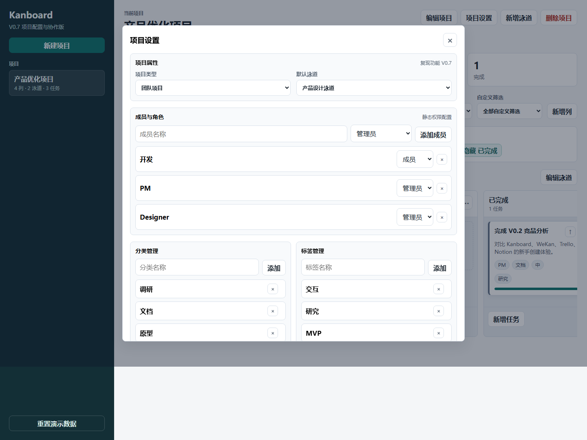

# 项目配置与协作补齐说明 V0.7

| 项目 | 内容 |
|---|---|
| 版本 | V0.7 |
| 日期 | 2026-06-01 |
| 状态 | 已完成 |
| 主题 | 补齐 Kanboard 项目配置与协作相关的用户侧静态能力 |

## 1. 为什么做这一版

V0.6 已经补齐了看板 / 列表 / 概览、任务动作和高级搜索。继续复现 Kanboard 时，下一块关键能力是“项目配置”：用户不仅要操作任务，还要管理项目成员、角色、分类、标签、筛选和泳道规则。

本轮仍然是静态复现，不做真实登录和鉴权，但要把 Kanboard 这类工具的配置结构表达出来。

## 2. 本轮新增

- 顶部新增“项目设置”入口。
- 支持项目类型：团队项目 / 个人项目。
- 支持默认泳道设置。
- 支持成员与角色管理：管理员、成员、访客。
- 成员会进入任务负责人筛选和任务负责人输入建议。
- 支持分类管理，分类会进入任务分类筛选和输入建议。
- 支持标签管理。
- 支持自定义筛选管理，筛选语法会真正作用于看板过滤。
- 支持泳道排序。
- 支持泳道禁用 / 启用。
- 禁用泳道后，看板和列表视图不再展示该泳道下的任务。

## 3. 产品判断

- 权限在静态阶段只做“配置展示”，不做真实拦截，因为真实权限需要账号体系和后端鉴权。
- 自定义筛选沿用 V0.6 的轻量高级搜索语法，避免新做一套筛选规则。
- 泳道禁用会影响视图展示，但不会删除任务，避免误伤数据。
- 默认泳道不能被禁用，保证新增任务始终有可落点。

## 4. 验证记录

已通过浏览器自动化验证：

- 项目设置可以打开和保存。
- 新增成员、分类、标签、自定义筛选可以写入 localStorage。
- 新增成员会进入负责人筛选。
- 新增分类会进入分类筛选。
- 自定义筛选可以过滤看板卡片。
- 禁用泳道后，看板只展示启用泳道。
- 移动端 390px 宽度下无横向溢出。

## 5. 截图

## 6. 下一步

进入 V0.8：补齐分析、时间跟踪和自动化相关能力，包括项目分析页、任务时间跟踪、循环任务、自动化规则和通知中心的静态模拟。
